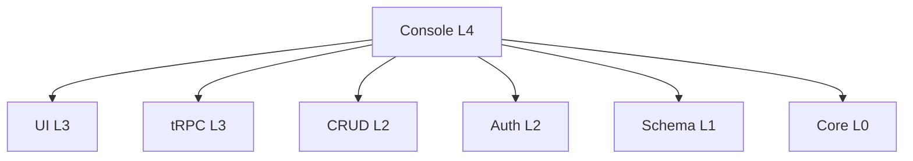

# LinchKit Console 模块 API 文档

**版本**: v2.0.2  
**状态**: 🔄 开发中 (企业级管理平台核心)  
**定位**: L4 层企业级管理控制台 - 作为功能库被其他应用集成  
**验证时间**: 2025-07-05

## 📋 模块概述

### 核心定位
Console 模块是 LinchKit 框架的 **企业级管理控制台**，作为 L4 层应用级模块，专门设计为功能库形式供其他应用集成使用。

**主要特点**：
- 🏢 **企业级管理平台**：完整的多租户管理、用户管理、权限控制
- 📦 **功能库设计**：作为 npm 包被 apps/starter 等应用集成
- 🔗 **深度集成 LinchKit 生态**：依赖并展示所有 LinchKit 包的功能
- 🌐 **完整国际化支持**：内置中英文双语支持
- 🎨 **现代化 UI**：基于 @linch-kit/ui + Tailwind CSS v4

### 与其他包的关系


## 🏗️ 架构设计

### 1. 包结构与导出

```typescript
// package.json exports 配置
{
  "exports": {
    ".": "./dist/index.js",           // 主要导出
    "./client": "./dist/client.js",   // 客户端专用
    "./entities": "./dist/entities/index.js", // 实体定义
    "./services": "./dist/services/index.js", // 服务层
    "./components": "./dist/components/index.js", // 组件
    "./hooks": "./dist/hooks/index.js", // React Hooks
    "./routes": "./dist/routes/index.js" // 路由配置
  }
}
```

### 2. 核心模块

#### 📊 实体系统 (entities/)
完整的企业级数据模型定义：

**租户管理实体**：
```typescript
// TenantEntity - 多租户架构核心
export const TenantEntity = defineEntity('Tenant', {
  // 基础信息
  name: defineField.string().required().max(100),
  domain: defineField.string().unique().optional(),
  slug: defineField.string().required().unique().max(50),
  status: defineField.enum(['active', 'suspended', 'deleted', 'pending']),
  
  // 计费与配额
  plan: defineField.enum(['free', 'starter', 'professional', 'enterprise']),
  maxUsers: defineField.int().default(10),
  maxStorage: defineField.bigint().default(1073741824n), // 1GB
  
  // 扩展字段
  settings: defineField.json<TenantSettings>(),
  metadata: defineField.json<TenantMetadata>(),
  
  // 关系
  users: defineField.relation('User').oneToMany(),
  quotas: defineField.relation('TenantQuotas').oneToOne()
})

// TenantQuotasEntity - 资源配额管理
export const TenantQuotasEntity = defineEntity('TenantQuotas', {
  maxUsers: defineField.int().default(10),
  currentUsers: defineField.int().default(0),
  maxStorage: defineField.bigint().default(1073741824n),
  currentStorage: defineField.bigint().default(0n),
  maxApiCalls: defineField.int().default(10000),
  maxPlugins: defineField.int().default(5),
  maxSchemas: defineField.int().default(10)
})
```

**插件管理实体**：
```typescript
// PluginEntity - 插件市场核心
export const PluginEntity = defineEntity('Plugin', {
  name: defineField.string().required(),
  version: defineField.string().required(),
  author: defineField.string().required(),
  category: defineField.string().required(),
  status: defineField.enum(['draft', 'published', 'deprecated', 'removed']),
  manifest: defineField.json<PluginManifest>()
})
```

**监控与审计实体**：
```typescript
// SystemMetricEntity - 系统监控
export const SystemMetricEntity = defineEntity('SystemMetric', {
  metricType: defineField.enum(['cpu', 'memory', 'disk', 'network']),
  value: defineField.float().required(),
  timestamp: defineField.datetime().default('now')
})

// AuditLogEntity - 审计日志
export const AuditLogEntity = defineEntity('AuditLog', {
  action: defineField.string().required(),
  resource: defineField.string().required(),
  userId: defineField.string().required(),
  tenantId: defineField.string().optional(),
  details: defineField.json<AuditDetails>()
})
```

#### 🔧 服务层 (services/)
基于依赖注入的业务逻辑服务：

**租户管理服务**：
```typescript
export class TenantService {
  // 创建租户（自动创建配额记录）
  async create(input: TenantCreateParams): Promise<Tenant>
  
  // 查询租户列表（支持分页、搜索、过滤）
  async list(params: TenantQueryParams): Promise<PaginatedResult<Tenant>>
  
  // 更新租户信息（同步配额）
  async update(tenantId: string, input: TenantUpdateParams): Promise<Tenant>
  
  // 软删除租户
  async delete(tenantId: string): Promise<Tenant>
  
  // 配额检查
  async isSlugAvailable(slug: string): Promise<boolean>
  async isDomainAvailable(domain: string): Promise<boolean>
}
```

#### 🎨 组件系统 (components/)
企业级 UI 组件集合：

**布局组件**：
```typescript
// ModernSidebar - 现代化侧边栏
export function ModernSidebar(props: SidebarProps)

// SimpleSidebar - 简洁侧边栏  
export function SimpleSidebar(props: SidebarProps)

// ConsoleLayout - 统一布局容器
export function ConsoleLayout(props: LayoutProps)
```

**数据展示组件**：
```typescript
// StatCard - 统计卡片
export function StatCard(props: StatCardProps)

// StatGrid - 统计网格
export function StatGrid(props: StatGridProps)

// DataTable - 数据表格
export function DataTable(props: DataTableProps)
```

#### 🎯 页面组件 (pages/)
完整的管理页面：

**Dashboard 仪表板**：
```typescript
export function Dashboard() {
  // 系统概览
  // 关键指标统计
  // 快速操作入口
  // 最近活动
  // 系统资源监控
}
```

**租户管理页面**：
```typescript
// 租户列表
export function TenantList()

// 创建租户
export function TenantCreate()

// 租户详情
export function TenantDetail()
```

#### 🪝 React Hooks (hooks/)
状态管理与 API 集成：

```typescript
// Dashboard 数据
export function useDashboard()
export function useSystemStats()
export function useSystemHealth()

// 租户管理
export function useTenants(filters?: TenantFilters)
export function useCreateTenant()
export function useUpdateTenant()

// 权限管理
export function usePermissions()
export function useConsolePermission(permission: string)
```

#### 🌐 国际化 (i18n/)
完整的多语言支持：

```typescript
// 支持的语言
const supportedLocales = ['zh-CN', 'en']

// 翻译函数
export function useConsoleTranslation(): TranslationFunction

// 消息定义（节选）
const messages = {
  'dashboard.title': '仪表板',
  'tenant.title': '租户管理',
  'user.title': '用户管理',
  'plugin.title': '插件管理'
  // ... 375+ 条翻译消息
}
```

#### 🔒 权限控制 (providers/)
企业级权限管理：

```typescript
export function ConsoleProvider(props: ConsoleProviderProps) {
  // React Query 集成
  // 权限上下文
  // 主题配置
  // 租户上下文
}

// 权限 Hooks
export function useConsolePermission(permission: string): boolean
export function useConsolePermissions(permissions: string[]): boolean

// 权限组件
export function PermissionGuard(props: PermissionGuardProps)
export function FeatureGuard(props: FeatureGuardProps)
```

## 🔗 集成使用

### 1. apps/starter 中的集成状态

**当前状态**：
- ✅ 已在 package.json 中依赖 @linch-kit/console
- ⏳ **暂未完全集成**：仍使用 starter 内置组件
- 📋 **计划集成**：等待 Console 模块完善后进行完整集成

**集成计划**：
```typescript
// apps/starter/app/dashboard/admin/page.tsx (未来)
import { Dashboard } from '@linch-kit/console'
import { ConsoleProvider } from '@linch-kit/console'

export default function AdminPage() {
  return (
    <ConsoleProvider config={consoleConfig}>
      <Dashboard />
    </ConsoleProvider>
  )
}
```

### 2. 路由系统集成

```typescript
// 路由工厂
export function createConsoleRoutes(config?: ConsoleConfig): ConsoleRouteConfig

// 路由器
export class ConsoleRouter {
  match(path: string): ConsoleRoute | null
  checkPermissions(route: ConsoleRoute, userPermissions: string[]): boolean
  getBreadcrumbs(path: string): NavigationItem[]
}
```

### 3. tRPC 集成

```typescript
// 路由器工厂（避免循环依赖）
export function createConsoleRouter(trpc: TRPCRouterBuilder) {
  return router({
    tenant: router({
      list: protectedProcedure.query(/* 租户列表 */),
      create: protectedProcedure.mutation(/* 创建租户 */),
      update: protectedProcedure.mutation(/* 更新租户 */),
      delete: protectedProcedure.mutation(/* 删除租户 */)
    })
  })
}
```

## 🏢 企业级特性

### 1. 多租户架构
- ✅ **完整的租户生命周期管理**
- ✅ **资源配额控制**（用户数、存储、API 调用）
- ✅ **计费计划支持**（Free/Starter/Professional/Enterprise）
- ✅ **软删除与数据隔离**

### 2. 权限与安全
- ✅ **基于 CASL 的权限系统**
- ✅ **角色：SUPER_ADMIN、TENANT_ADMIN、USER**
- ✅ **组件级权限控制**（PermissionGuard、FeatureGuard）
- ✅ **审计日志记录**

### 3. 监控与运维
- ✅ **系统健康检查**
- ✅ **性能指标监控**（CPU、内存、磁盘）
- ✅ **告警管理**
- ✅ **实时数据订阅**（WebSocket 支持）

### 4. 插件生态
- ✅ **插件市场**
- ✅ **版本管理**
- ✅ **插件配置**
- ✅ **安装/卸载流程**

## 📊 依赖关系分析

### 直接依赖（dependencies）
```json
{
  "@linch-kit/auth": "workspace:*",      // 认证权限
  "@linch-kit/core": "workspace:*",      // 核心功能
  "@linch-kit/crud": "workspace:*",      // CRUD 操作
  "@linch-kit/schema": "workspace:*",    // Schema 定义
  "@linch-kit/trpc": "workspace:*",      // API 层
  "@linch-kit/ui": "workspace:*",        // UI 组件
  "@hookform/resolvers": "^5.1.1",      // 表单验证
  "react-hook-form": "^7.59.0",         // 表单管理
  "zod": "^3.25.67"                     // Schema 验证
}
```

### 对等依赖（peerDependencies）
```json
{
  "@prisma/client": "^6.0.0",           // 数据库客户端
  "@tanstack/react-query": "^5.66.1",   // 状态管理
  "@trpc/client": "^11.0.0",            // tRPC 客户端
  "react": "^18.3.1",                   // React 框架
  "next": "^15.0.0"                     // Next.js 框架
}
```

## 🚀 开发状态

### ✅ 已完成功能
1. **实体定义系统**：完整的企业级数据模型
2. **服务层架构**：支持依赖注入的业务逻辑
3. **基础组件库**：布局、展示、表单组件
4. **Dashboard 页面**：完整的仪表板实现
5. **国际化系统**：中英文双语支持
6. **权限控制**：细粒度权限管理
7. **Provider 架构**：React Context 集成

### ⏳ 进行中功能
1. **tRPC 集成**：当前使用 stub 实现，避免循环依赖
2. **完整页面组件**：用户管理、插件管理等页面
3. **路由系统完善**：动态路由匹配和面包屑
4. **数据表格组件**：通用数据展示组件

### 📋 规划中功能
1. **Schema 管理器**：可视化 Schema 编辑
2. **系统监控面板**：实时监控图表
3. **插件开发工具**：插件 SDK 和调试工具
4. **高级权限管理**：条件权限和动态权限

## 🔍 技术实现亮点

### 1. Schema 驱动架构
```typescript
// 从 Schema 定义自动生成 API、UI、验证
export const TenantEntity = defineEntity('Tenant', { /* 定义 */ })

// 自动生成的类型
export type Tenant = z.infer<typeof TenantEntity.zodSchema>
export type TenantInput = z.infer<typeof TenantEntity.createSchema>
```

### 2. 依赖注入设计
```typescript
// 服务工厂，支持运行时依赖注入
export function createConsoleServices(config: ConsoleServiceConfig) {
  return {
    tenant: new TenantService(config.db),
    plugin: new PluginService(config.db),
    user: new UserService(config.db)
  }
}
```

### 3. 组件级权限控制
```typescript
// 声明式权限控制
<PermissionGuard permission="tenant:create">
  <CreateTenantButton />
</PermissionGuard>

<FeatureGuard feature="plugins">
  <PluginManagement />
</FeatureGuard>
```

### 4. 类型安全的国际化
```typescript
// 类型安全的翻译函数
const t = useConsoleTranslation()
t('dashboard.title') // 自动类型提示和检查
```

## 📈 性能与优化

### 1. 代码分割
- ✅ **页面级懒加载**：React.lazy() 按需加载
- ✅ **组件级导出**：精确的 Tree Shaking
- ✅ **类型定义分离**：.d.ts 文件优化

### 2. 状态管理优化
- ✅ **React Query 集成**：智能缓存和后台同步
- ✅ **状态分片**：避免不必要的重渲染
- ✅ **错误边界**：优雅的错误处理

### 3. 构建优化
```json
{
  "scripts": {
    "build": "tsup",              // 快速 TypeScript 构建
    "build:watch": "tsup --watch", // 开发模式监听
    "type-check": "tsc --noEmit"   // 类型检查
  }
}
```

## 🎯 使用指南

### 1. 基础集成
```typescript
import { ConsoleProvider, Dashboard } from '@linch-kit/console'

function App() {
  return (
    <ConsoleProvider 
      tenantId="tenant123"
      permissions={['console:access', 'tenant:read']}
    >
      <Dashboard />
    </ConsoleProvider>
  )
}
```

### 2. 自定义配置
```typescript
const consoleConfig = {
  basePath: '/admin',
  features: ['dashboard', 'tenants', 'users', 'plugins'],
  theme: { primary: '#3b82f6' },
  permissions: {
    access: ['console:access'],
    admin: ['console:admin']
  }
}
```

### 3. 服务集成
```typescript
import { createConsoleServices } from '@linch-kit/console/services'
import { db } from './lib/db'

const services = createConsoleServices({ db })
const tenants = await services.tenant.list({ page: 1, pageSize: 10 })
```

Console 模块作为 LinchKit 框架的企业级管理平台核心，展现了完整的 L4 层应用架构设计，为多租户企业应用提供了完备的管理功能基础。