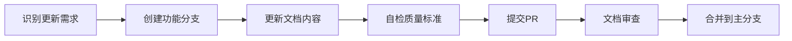

# LinchKit 知识库治理规范 (Knowledge Base Governance)

**版本**: 1.0  
**状态**: 生效中  
**目标**: 建立清晰的知识库维护和贡献规则，确保 `ai-context` 信息架构的长期健康发展，防止信息混乱和知识流失。

---

## 1. 所有权与职责 (Ownership & Responsibilities)

### 1.1 知识库管理员 (Knowledge Base Administrators)
- **角色定义**: 项目维护者和核心贡献者
- **核心职责**:
  - 审查和批准知识库的结构性变更
  - 确保文档质量和一致性
  - 定期审计和清理过时内容
  - 维护知识库索引和导航结构

### 1.2 贡献者职责 (Contributor Responsibilities)
- **代码贡献者**: 同步更新相关文档
- **文档贡献者**: 遵循既定格式和规范
- **AI 助手**: 在每次任务后提出文档更新建议

### 1.3 职责矩阵 (RACI Matrix)

| 任务 | 负责人(R) | 批准人(A) | 咨询人(C) | 知情人(I) |
|-----|----------|----------|----------|----------|
| 创建新文档 | 贡献者 | 管理员 | 团队成员 | 所有人 |
| 更新现有文档 | 贡献者 | 文档所有者 | 相关开发者 | 团队 |
| 架构重构 | 管理员 | 项目负责人 | 核心团队 | 所有人 |
| 定期审计 | 管理员 | 项目负责人 | - | 团队 |

---

## 2. 贡献指南 (Contribution Guidelines)

### 2.1 文档创建原则
1. **必要性检查**: 创建前确认不存在重复内容
2. **位置选择**: 严格按照目录结构放置文档
3. **命名规范**: 使用清晰、描述性的文件名（全大写或小写+下划线）
4. **内容要求**: 包含元数据（版本、状态、目标）

### 2.2 AI 协作指引
**内容来源标识规范**：
- **人类原创内容**: 默认不标记
- **AI 辅助生成**: 在文档元数据中注明 `AI-Assisted: true`
- **AI 完全生成**: 在文档末尾添加生成声明，如:
  ```markdown
  ---
  🤖 Generated with [Claude Code](https://claude.ai/code)
  Co-Authored-By: Claude <noreply@anthropic.com>
  ```
- **混合内容**: 在具体章节标注 `[AI-Generated]` 或 `[AI-Enhanced]`

### 2.3 文档更新流程


### 2.4 文档结构规范
每个文档必须包含：
- **标题**: 中英文对照
- **元数据**: 版本、状态、最后更新时间、AI辅助标识
- **目标声明**: 文档的目的和受众
- **内容主体**: 结构化、层次清晰
- **相关链接**: 关联文档的引用

### 2.5 AI 友好性要求
- 使用结构化 Markdown
- 保持格式一致性
- 提供清晰的代码示例
- 避免歧义表达
- 包含必要的上下文信息

---

## 3. 审查流程 (Review Process)

### 3.1 文档审查检查清单
- [ ] **准确性**: 信息是否准确无误？
- [ ] **完整性**: 是否涵盖所有必要内容？
- [ ] **一致性**: 是否与现有文档保持一致？
- [ ] **可读性**: 是否易于理解？
- [ ] **可维护性**: 是否易于后续更新？
- [ ] **AI友好性**: 是否便于AI理解和处理？

### 3.2 审查级别
1. **轻量级审查** (Minor Updates)
   - 修正错别字、格式调整
   - 单个审查者即可批准

2. **标准审查** (Standard Updates)
   - 内容更新、新增章节
   - 需要领域专家审查

3. **深度审查** (Major Changes)
   - 架构变更、新文档创建
   - 需要多个审查者和管理员批准

### 3.3 审查时效
- 轻量级: 24小时内
- 标准: 48小时内
- 深度: 72小时内

---

## 4. 质量标准 (Quality Standards)

### 4.1 内容质量标准
- **准确性**: 技术信息必须经过验证
- **时效性**: 保持与代码同步更新
- **完整性**: 涵盖所有关键信息
- **简洁性**: 避免冗余和重复
- **可追溯性**: AI生成内容需标明来源

### 4.2 格式质量标准
- **Markdown 规范**: 遵循 CommonMark 标准
- **代码块**: 指定语言类型
- **链接**: 使用相对路径，定期检查有效性
- **图表**: 优先使用 Mermaid 等文本化图表

### 4.3 可访问性标准
- **语言**: 技术术语需要解释
- **结构**: 使用清晰的标题层级
- **示例**: 提供实际使用案例
- **索引**: 重要内容可被快速定位

---

## 5. 维护机制 (Maintenance Mechanism)

### 5.1 定期审计
- **频率**: 每季度一次
- **范围**: 
  - 检查死链接
  - 识别过时内容
  - 合并重复信息
  - 更新索引文件
  - 验证AI生成内容的准确性

### 5.2 版本控制
- **版本号规则**: 
  - 主版本: 重大结构变更
  - 次版本: 内容显著更新
  - 修订版: 小修正
- **变更日志**: 记录所有重要更新

### 5.3 归档策略
- **归档时机**: 
  - 内容已过时但有历史价值
  - 被新文档完全替代
- **归档位置**: `04_archive/legacy_documents/`
- **归档标记**: 添加 DEPRECATED 标签

---

## 6. 知识库结构 (Knowledge Base Structure)

### 6.1 目录职责定义

| 目录 | 用途 | 内容类型 |
|------|------|----------|
| `00_framework/` | 治理框架 | 协作规范、治理规则 |
| `01_strategy_and_architecture/` | 战略与架构 | 技术决策、架构设计 |
| `02_knowledge_base/` | 知识库 | API文档、参考资料 |
| `03_planning/` | 规划文档 | 路线图、计划、提案 |
| `04_archive/` | 归档 | 历史文档、废弃内容 |

### 6.2 文档迁移规则
1. **新建优于修改**: 重大变更时创建新版本
2. **链接不断**: 保持向后兼容的链接
3. **通知机制**: 重要变更需通知相关方

---

## 7. 工具与自动化 (Tools & Automation)

### 7.1 AI 驱动的自动化任务
- **草稿生成**: 使用 AI 生成文档初稿和模板
- **内容摘要**: 自动为长文档生成执行摘要
- **格式检查**: AI 辅助检查文档格式规范性
- **知识发现**: AI 帮助识别文档间的关联和重复
- **翻译同步**: AI 辅助保持多语言文档同步
- **变更建议**: AI 主动识别需要更新的过时内容

### 7.2 文档生成工具
- **API 文档**: TypeDoc / TSDoc
- **架构图**: Mermaid / PlantUML
- **依赖图**: madge / dependency-cruiser

### 7.3 质量检查工具
- **链接检查**: markdown-link-check
- **拼写检查**: cspell
- **格式检查**: markdownlint

### 7.4 自动化流程
- **pre-commit hooks**: 格式和链接检查
- **CI/CD 集成**: 文档构建和部署
- **定期任务**: 自动化审计报告
- **AI 审查**: 使用 AI 预审文档质量

---

## 8. 入职与培训 (Onboarding & Training)

### 8.1 新成员入职流程
1. **阅读核心文档**:
   - `00_framework/AI_COLLABORATION_FRAMEWORK.md`
   - `00_framework/KNOWLEDGE_BASE_GOVERNANCE.md` (本文档)
   - `01_strategy_and_architecture/vision_and_scope.md`

2. **实践任务**:
   - 完成一个小型文档更新任务
   - 参与一次文档审查

3. **工具熟悉**:
   - 学习使用文档检查工具
   - 了解 AI 协作流程

### 8.2 培训资源
- **视频教程**: 文档编写最佳实践
- **模板库**: 各类文档模板和示例
- **FAQ**: 常见问题解答
- **导师制度**: 资深成员一对一指导

### 8.3 持续学习
- **定期分享**: 文档编写经验分享会
- **案例学习**: 优秀文档案例分析
- **工具培训**: 新工具和技术培训

---

## 9. 应急响应 (Emergency Response)

### 9.1 紧急更新流程
适用于安全漏洞、重大错误等紧急情况：
1. 直接在主分支创建修复
2. 事后补充审查流程
3. 更新应急日志

### 9.2 知识恢复
- **备份策略**: Git 历史 + 定期快照
- **恢复流程**: 从备份分支恢复
- **验证步骤**: 确保恢复完整性

---

## 10. 持续改进 (Continuous Improvement)

### 10.1 反馈机制
- **用户反馈**: Issue 跟踪
- **使用分析**: 文档访问统计
- **满意度调查**: 定期收集意见
- **AI 反馈**: 收集 AI 助手的改进建议

### 10.2 改进流程
1. 收集反馈和数据
2. 识别改进机会
3. 制定改进计划
4. 实施和验证
5. 更新治理规范

### 10.3 创新鼓励
- 鼓励新的文档形式（视频、交互式）
- 探索 AI 辅助文档生成
- 实验新的组织结构
- 尝试知识图谱等新技术

---

## 11. 合规性声明 (Compliance Statement)

所有参与 LinchKit 项目的贡献者都应遵守本治理规范。违反规范可能导致：
1. 贡献被拒绝
2. 需要重新提交
3. 失去直接提交权限

本规范本身也遵循相同的贡献和审查流程，欢迎提出改进建议。

---

**最后更新**: 2025-01-05  
**下次审查**: 2025-04-01  
**AI-Assisted**: true