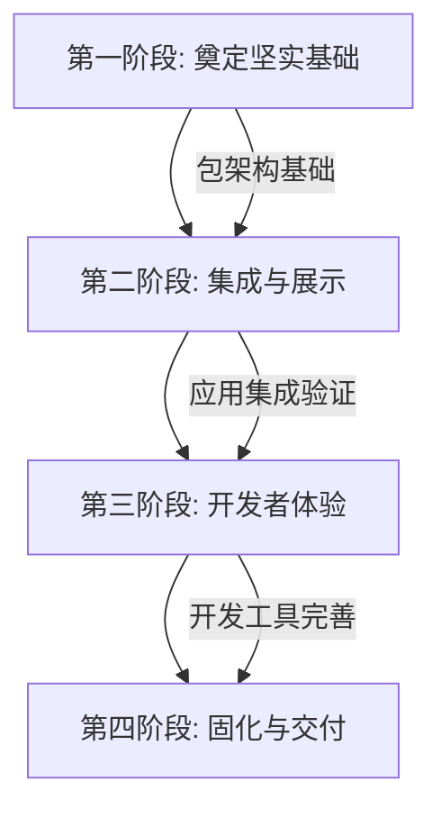
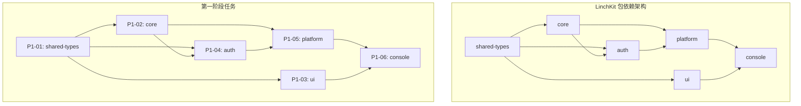
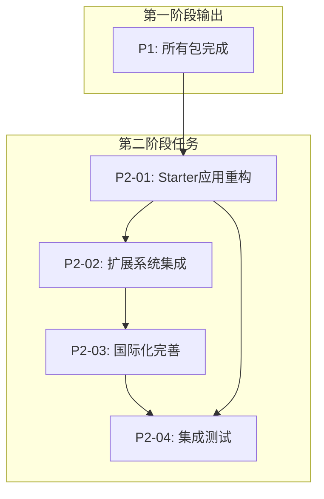
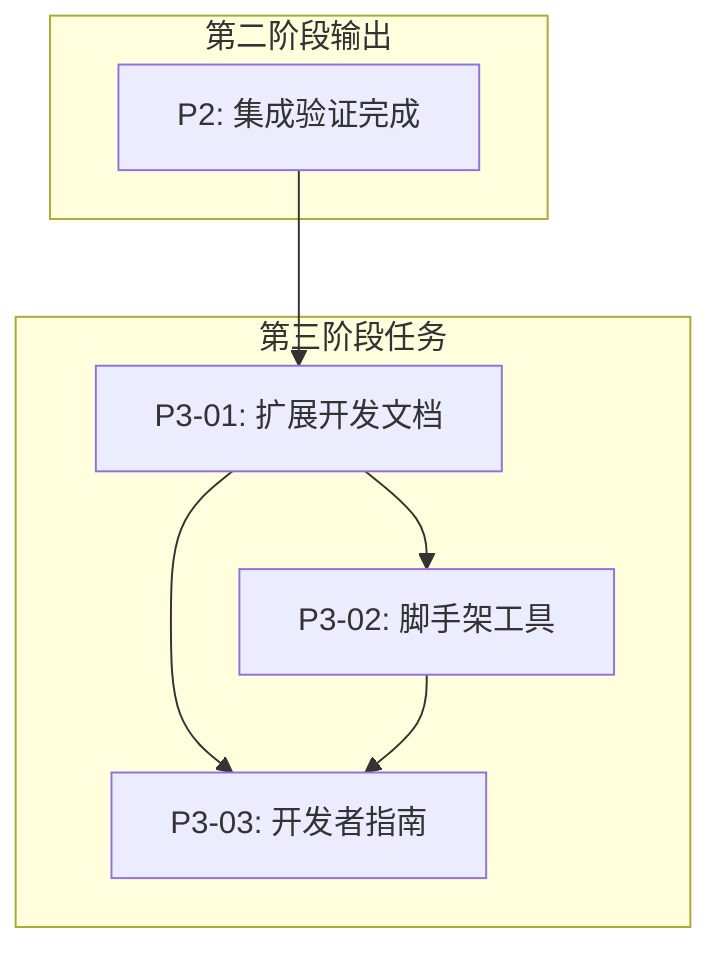
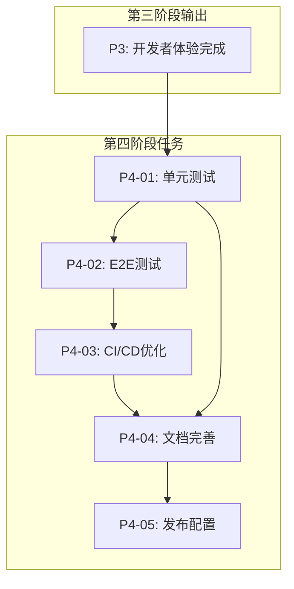
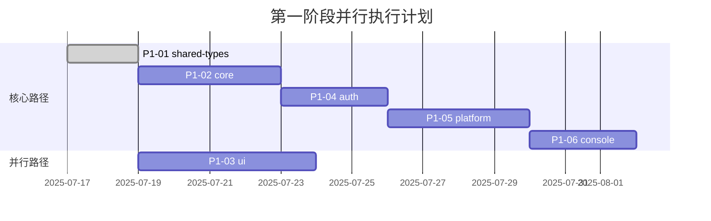
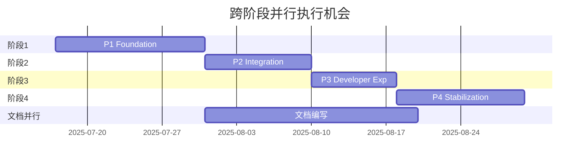

# LinchKit 任务依赖关系图与执行顺序 (v1.0)

**关联主计划**: `./05_Master_Plan_for_Framework_Stabilization.md`
**AI 执行指南**: `./implementation_plans/00_AI_Execution_Guide.md`
**状态**: 活跃
**更新**: 2025-07-17

## 依赖关系总览

### 阶段级别依赖



**关键路径**: P1 → P2 → P3 → P4 (总计 8-12 周)

---

## 第一阶段任务依赖 (P1)

### 包级别依赖架构



### 详细任务依赖

#### P1-01: shared-types (无前置依赖)
- **前置任务**: 无
- **后续任务**: P1-02, P1-03, P1-04
- **并行任务**: 无 (必须优先完成)
- **关键路径**: ✅ 是
- **预计耗时**: 1-2 天

#### P1-02: core (依赖 shared-types)
- **前置任务**: P1-01
- **后续任务**: P1-04, P1-05
- **并行任务**: P1-03 (可部分并行)
- **关键路径**: ✅ 是
- **预计耗时**: 3-5 天

#### P1-03: ui (依赖 shared-types)
- **前置任务**: P1-01
- **后续任务**: P1-06
- **并行任务**: P1-02 (可部分并行)
- **关键路径**: ❌ 否
- **预计耗时**: 4-6 天

#### P1-04: auth (依赖 shared-types, core)
- **前置任务**: P1-01, P1-02
- **后续任务**: P1-05
- **并行任务**: P1-03 (可完全并行)
- **关键路径**: ✅ 是
- **预计耗时**: 2-3 天

#### P1-05: platform (依赖 core, auth)
- **前置任务**: P1-02, P1-04
- **后续任务**: P1-06
- **并行任务**: P1-03 (可完全并行)
- **关键路径**: ✅ 是
- **预计耗时**: 3-4 天

#### P1-06: console (依赖 ui, platform)
- **前置任务**: P1-03, P1-05
- **后续任务**: P2-01
- **并行任务**: 无
- **关键路径**: ✅ 是
- **预计耗时**: 2-3 天

---

## 第二阶段任务依赖 (P2)

### 集成与展示任务流



### 详细任务依赖

#### P2-01: Starter应用重构 (依赖 P1 完成)
- **前置任务**: P1-06 (console 包完成)
- **后续任务**: P2-02, P2-04
- **并行任务**: 无
- **关键路径**: ✅ 是
- **预计耗时**: 3-5 天

#### P2-02: 扩展系统集成 (依赖 Starter 重构)
- **前置任务**: P2-01
- **后续任务**: P2-03
- **并行任务**: 无
- **关键路径**: ✅ 是
- **预计耗时**: 2-3 天

#### P2-03: 国际化完善 (依赖扩展系统)
- **前置任务**: P2-02
- **后续任务**: P2-04
- **并行任务**: 无
- **关键路径**: ✅ 是
- **预计耗时**: 1-2 天

#### P2-04: 集成测试 (依赖所有前置任务)
- **前置任务**: P2-01, P2-03
- **后续任务**: P3-01
- **并行任务**: 无
- **关键路径**: ✅ 是
- **预计耗时**: 2-3 天

---

## 第三阶段任务依赖 (P3)

### 开发者体验任务流



### 详细任务依赖

#### P3-01: 扩展开发文档 (依赖 P2 完成)
- **前置任务**: P2-04 (集成测试完成)
- **后续任务**: P3-02, P3-03
- **并行任务**: 无
- **关键路径**: ✅ 是
- **预计耗时**: 2-3 天

#### P3-02: 脚手架工具 (依赖文档完成)
- **前置任务**: P3-01
- **后续任务**: P3-03
- **并行任务**: 无
- **关键路径**: ✅ 是
- **预计耗时**: 3-4 天

#### P3-03: 开发者指南 (依赖所有前置任务)
- **前置任务**: P3-01, P3-02
- **后续任务**: P4-01
- **并行任务**: 无
- **关键路径**: ✅ 是
- **预计耗时**: 1-2 天

---

## 第四阶段任务依赖 (P4)

### 固化与交付任务流



### 详细任务依赖

#### P4-01: 单元测试 (依赖 P3 完成)
- **前置任务**: P3-03 (开发者指南完成)
- **后续任务**: P4-02, P4-04
- **并行任务**: 无
- **关键路径**: ✅ 是
- **预计耗时**: 3-5 天

#### P4-02: E2E测试 (依赖单元测试)
- **前置任务**: P4-01
- **后续任务**: P4-03
- **并行任务**: 无
- **关键路径**: ✅ 是
- **预计耗时**: 2-3 天

#### P4-03: CI/CD优化 (依赖 E2E 测试)
- **前置任务**: P4-02
- **后续任务**: P4-04
- **并行任务**: 无
- **关键路径**: ✅ 是
- **预计耗时**: 2-3 天

#### P4-04: 文档完善 (依赖 CI/CD 和单元测试)
- **前置任务**: P4-01, P4-03
- **后续任务**: P4-05
- **并行任务**: 无
- **关键路径**: ✅ 是
- **预计耗时**: 2-3 天

#### P4-05: 发布配置 (依赖文档完善)
- **前置任务**: P4-04
- **后续任务**: 无 (项目完成)
- **并行任务**: 无
- **关键路径**: ✅ 是
- **预计耗时**: 1-2 天

---

## 并行执行机会

### 第一阶段并行优化



**并行策略**:
- P1-03 (ui) 可以在 P1-02 (core) 完成后立即开始
- P1-03 (ui) 与 P1-04 (auth) 和 P1-05 (platform) 可以完全并行
- 总节省时间: 2-3 天

### 跨阶段并行机会



**跨阶段并行策略**:
- 文档编写可以在第一阶段完成后立即开始
- 文档工作可以与后续阶段并行进行
- 总节省时间: 5-7 天

---

## 关键路径分析

### 关键路径识别

**主关键路径**: P1-01 → P1-02 → P1-04 → P1-05 → P1-06 → P2-01 → P2-02 → P2-03 → P2-04 → P3-01 → P3-02 → P3-03 → P4-01 → P4-02 → P4-03 → P4-04 → P4-05

**路径总长度**: 45-65 天 (6.5-9.5 周)

### 关键路径优化

#### 1. 资源优化
- **关键任务优先**: 确保关键路径任务获得最佳资源
- **并行执行**: 最大化非关键任务的并行执行
- **预置准备**: 关键任务开始前完成所有准备工作

#### 2. 风险缓解
- **关键任务备份**: 关键任务失败时的应急方案
- **缓冲时间**: 关键任务预留 20% 的缓冲时间
- **早期验证**: 关键任务尽早验证可行性

#### 3. 质量保障
- **持续集成**: 关键任务完成后立即集成测试
- **增量验证**: 每个关键任务完成后验证整体功能
- **反馈循环**: 快速反馈机制确保问题早发现

---

## 执行顺序建议

### 理想执行顺序

#### 周次 1-2: 基础类型和核心服务
1. **Day 1-2**: P1-01 shared-types
2. **Day 3-6**: P1-02 core (并行开始 P1-03 ui)
3. **Day 7-10**: P1-04 auth (P1-03 ui 继续)

#### 周次 3-4: 平台和界面完善
1. **Day 11-14**: P1-05 platform (P1-03 ui 完成)
2. **Day 15-17**: P1-06 console
3. **Day 18-20**: P2-01 Starter应用重构

#### 周次 5-6: 集成和国际化
1. **Day 21-23**: P2-02 扩展系统集成
2. **Day 24-25**: P2-03 国际化完善
3. **Day 26-28**: P2-04 集成测试

#### 周次 7-8: 开发者体验
1. **Day 29-31**: P3-01 扩展开发文档
2. **Day 32-35**: P3-02 脚手架工具
3. **Day 36-37**: P3-03 开发者指南

#### 周次 9-10: 固化与交付
1. **Day 38-42**: P4-01 单元测试
2. **Day 43-45**: P4-02 E2E测试
3. **Day 46-48**: P4-03 CI/CD优化
4. **Day 49-51**: P4-04 文档完善
5. **Day 52-53**: P4-05 发布配置

### 应急执行顺序

#### 紧急情况下的最小可行路径
1. **P1-01, P1-02**: 核心类型和服务 (必须)
2. **P1-04, P1-05**: 认证和平台 (必须)
3. **P2-01**: 基础应用重构 (必须)
4. **P4-01, P4-05**: 基础测试和发布 (必须)

**最小路径耗时**: 20-25 天

---

## 依赖管理工具

### 1. 依赖检查脚本

```bash
# 检查包依赖循环
bun run deps:check-cycles

# 验证任务依赖
bun run tasks:validate-deps

# 生成依赖图
bun run tasks:generate-graph
```

### 2. 进度跟踪

```bash
# 当前阶段进度
bun run progress:current

# 整体项目进度
bun run progress:overall

# 关键路径状态
bun run progress:critical-path
```

### 3. 依赖更新通知

```bash
# 任务完成自动通知
bun run notify:task-complete [task-id]

# 阻塞任务提醒
bun run notify:blocked-tasks

# 可开始任务提醒
bun run notify:ready-tasks
```

---

## 风险点与应对

### 1. 关键路径风险

#### P1-02 (core) 延期风险
- **影响**: 阻塞 P1-04 (auth) 和 P1-05 (platform)
- **应对**: 
  - 提前 1 天开始
  - 准备简化版本用于解除阻塞
  - 安排额外资源支持

#### P1-05 (platform) 复杂度风险
- **影响**: 阻塞 P1-06 (console) 和整个第二阶段
- **应对**:
  - 分阶段实现，优先核心功能
  - 准备降级方案
  - 提前与第二阶段任务协调

### 2. 依赖变更风险

#### 包接口变更影响
- **影响**: 下游包需要同步更新
- **应对**:
  - 接口变更前充分评估影响
  - 提供向后兼容性
  - 建立变更通知机制

#### 外部依赖更新
- **影响**: 可能引入兼容性问题
- **应对**:
  - 锁定关键依赖版本
  - 建立依赖更新测试流程
  - 准备回滚机制

---

**更新记录**:
- v1.0 (2025-07-17): 初始版本，建立完整任务依赖关系图