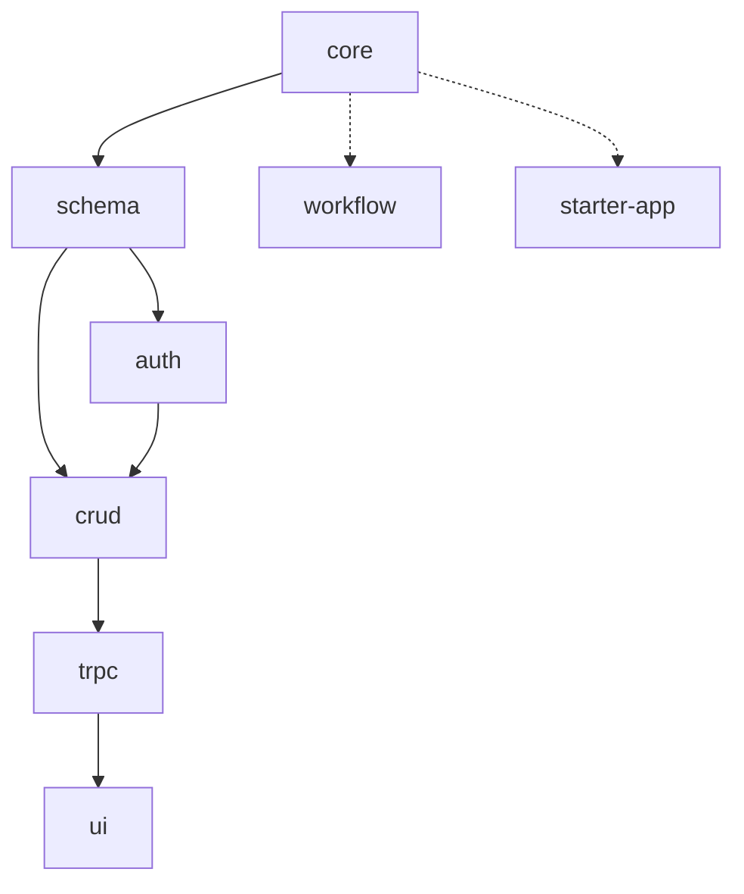

# LinchKit 架构文档导航

**文档版本**: v1.0.0  
**创建日期**: 2025-06-23  
**维护责任**: 架构团队  
**用途**: 架构文档快速检索入口  

---

## 📋 文档结构总览

### 🌐 全局架构文档 (当前目录)

#### 系统级架构文档
| 文档 | 架构级别 | 描述 | 用途 |
|------|----------|------|------|
| [system-architecture.md](./system-architecture.md) | 系统级 | 整体架构设计 | 分层架构、技术栈和扩展性设计 |
| [dependency-graph.md](./dependency-graph.md) | 系统级 | 依赖关系图 | 包间依赖关系和构建顺序 |

#### 包级架构文档
| 文档 | 架构级别 | 描述 | 用途 |
|------|----------|------|------|
| [packages-overview.md](./packages-overview.md) | 包级 | 包架构总览 | 包结构和功能分布 |

#### 开发级架构文档
| 文档 | 架构级别 | 描述 | 用途 |
|------|----------|------|------|
| [development-constraints.md](./development-constraints.md) | 开发级 | 开发强制要求 | 不可违背的技术约束 |
| [development-priorities.md](./development-priorities.md) | 开发级 | 开发优先级指南 | 重写项目的开发优先级 |
| [MAINTENANCE.md](./MAINTENANCE.md) | 开发级 | 维护指南 | 架构文档维护说明 |

### 📦 包级详细文档 (packages/ 目录)
| 包名 | 文档路径 | 优先级 | 状态 |
|------|----------|--------|------|
| **核心包** | | | |
| @linch-kit/core | [packages/core.md](./packages/core.md) | P0 | 设计完成 |
| @linch-kit/schema | [packages/schema.md](./packages/schema.md) | P0 | 设计完成 |
| **业务包** | | | |
| @linch-kit/auth | [packages/auth.md](./packages/auth.md) | P1 | 设计完成 |
| @linch-kit/crud | [packages/crud.md](./packages/crud.md) | P1 | 设计完成 |
| @linch-kit/trpc | [packages/trpc.md](./packages/trpc.md) | P1 | 设计完成 |
| @linch-kit/ui | [packages/ui.md](./packages/ui.md) | P1 | 设计完成 |
| **插件包** | | | |
| @linch-kit/ai | [packages/ai-integration.md](./packages/ai-integration.md) | P2 | 设计完成 |
| @linch-kit/workflow | [packages/workflow.md](./packages/workflow.md) | P2 | 设计完成 |
| **应用** | | | |
| apps/starter | [packages/starter-app.md](./packages/starter-app.md) | P2 | 设计完成 |

### 🔌 架构决策
| 模块 | 决策结果 | 位置 | 文档路径 |
|------|----------|------|----------|
| 插件系统 | ✅ 保持在 core | @linch-kit/core | [packages/core.md](./packages/core.md) |
| AI 集成系统 | ✅ 独立为插件 | @linch-kit/ai | [packages/ai-integration.md](./packages/ai-integration.md) |

---

## 🎯 快速检索指南

### 按开发阶段检索
- **第一阶段 (P0)**: [core.md](./packages/core.md), [schema.md](./packages/schema.md)
- **第二阶段 (P1)**: [auth.md](./packages/auth.md), [crud.md](./packages/crud.md)
- **第三阶段 (P1)**: [trpc.md](./packages/trpc.md), [ui.md](./packages/ui.md)
- **第四阶段 (P2)**: [workflow.md](./packages/workflow.md), [starter-app.md](./packages/starter-app.md)

### 按功能类型检索
- **基础设施**: [core.md](./packages/core.md)
- **数据层**: [schema.md](./packages/schema.md)
- **业务逻辑**: [auth.md](./packages/auth.md), [crud.md](./packages/crud.md)
- **API层**: [trpc.md](./packages/trpc.md)
- **表现层**: [ui.md](./packages/ui.md)
- **插件**: [ai-integration.md](./packages/ai-integration.md), [workflow.md](./packages/workflow.md)
- **应用**: [starter-app.md](./packages/starter-app.md)

### 按依赖关系检索

---

## 📝 文档规范

### 包级文档必须包含
1. **包概述**: 功能定位、职责边界、技术特色
2. **架构设计**: 内部模块结构、核心类设计、接口定义
3. **技术实现**: 关键技术点、性能约束、最佳实践
4. **依赖关系**: 上游依赖、下游影响、插件支持
5. **开发指南**: 开发步骤、测试要求、验收标准
6. **API 设计**: 公共接口、类型定义、使用示例

### 文档更新规则
- **架构变更**: 必须同步更新相关文档
- **版本控制**: 重大变更需要更新版本号
- **交叉引用**: 保持文档间链接的正确性
- **示例代码**: 确保代码示例的可执行性

---

## 🔄 架构决策记录

### 待决策问题
1. **插件系统独立性**
   - 选项A: 保持在 @linch-kit/core 内
   - 选项B: 独立为 @linch-kit/plugins 包
   - 决策依据: 复杂度、维护成本、使用频率

2. **AI 集成系统独立性**
   - 选项A: 保持在 @linch-kit/core 内
   - 选项B: 独立为 @linch-kit/ai 包
   - 决策依据: 功能复杂度、第三方依赖、可选性

### 已确定决策
- ✅ 废弃 @linch-kit/types 包，合并到 core
- ✅ auth 包不依赖 crud 包，避免循环依赖
- ✅ workflow 作为插件实现，不作为核心包
- ✅ AI 集成独立为 @linch-kit/ai 插件包
- ✅ 插件系统保持在 @linch-kit/core 内

---

## 🚀 使用建议

### 对于 AI Agent
1. **快速开始**: 使用 [QUICK_START_PROMPT.md](../QUICK_START_PROMPT.md) 一句话指令
2. **开发指导**: 阅读 [AI_DEVELOPMENT_PROMPT.md](../AI_DEVELOPMENT_PROMPT.md)
3. **技术约束**: 严格遵循 [development-constraints.md](./development-constraints.md)
4. **文档维护**: 参考 [MAINTENANCE.md](./MAINTENANCE.md)

### 对于开发者
1. **快速上手**: 从 [starter-app.md](./packages/starter-app.md) 开始
2. **架构理解**: 阅读 [system-architecture.md](./system-architecture.md)
3. **包概览**: 查看 [packages-overview.md](./packages-overview.md)
4. **最佳实践**: 查看各包的详细文档

---

**重要提醒**: 本导航文档是架构文档的入口，所有架构相关的查询都应该从这里开始。文档间的链接关系反映了系统的依赖关系和开发顺序。
