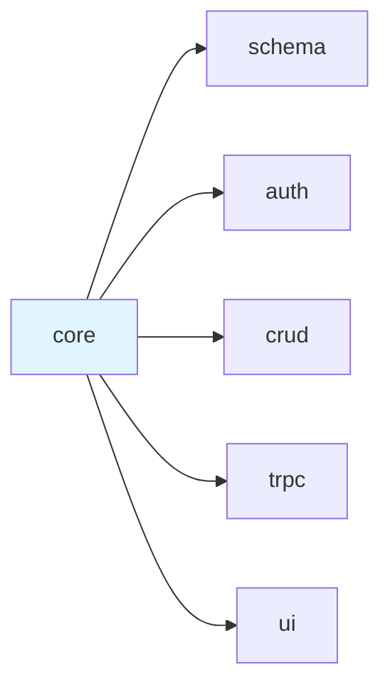
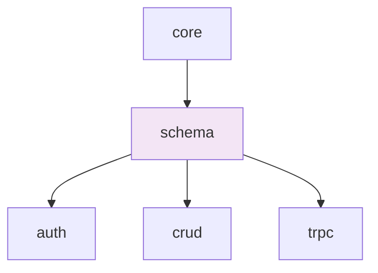
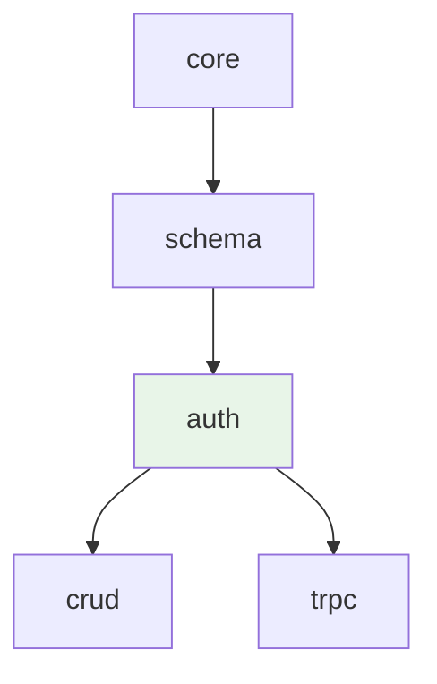
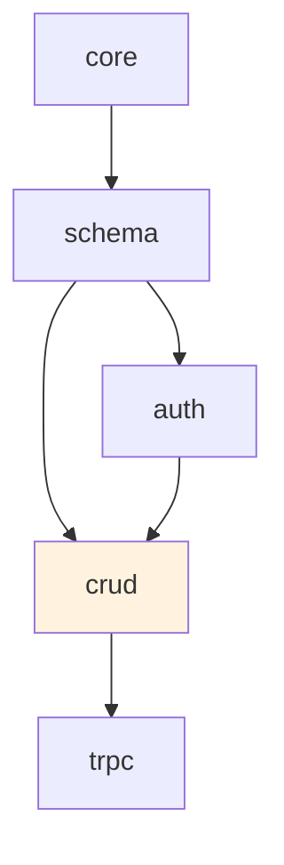
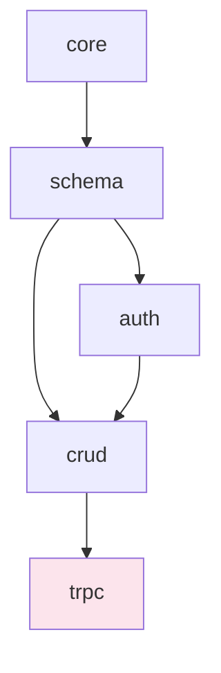
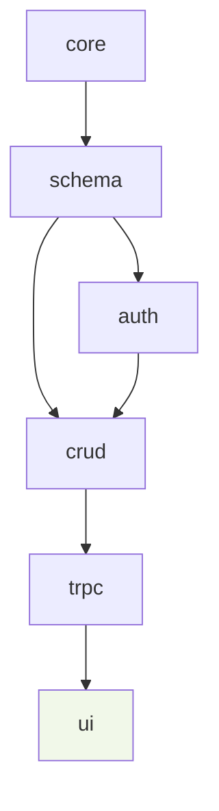
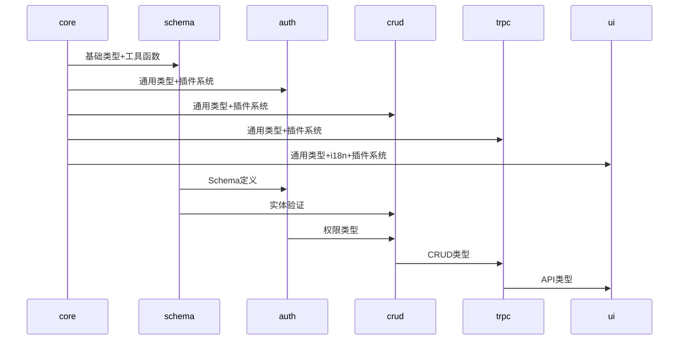
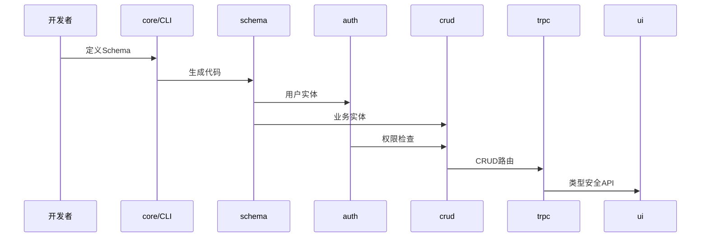

# LinchKit 依赖关系图

**文档版本**: v1.0.0  
**创建日期**: 2025-06-23  
**维护责任**: 架构团队  
**更新频率**: 依赖关系变更时更新  

---

## 📊 包依赖层次结构

### 主依赖链
```mermaid
graph TD
    A[core<br/>插件系统+通用类型+CLI+配置] --> B[schema<br/>数据模式系统]
    B --> C[auth<br/>认证权限]
    B --> D[crud<br/>CRUD操作]
    C --> D
    D --> E[trpc<br/>API层]
    E --> F[ui<br/>UI组件库]

    classDef level0 fill:#e1f5fe
    classDef level1 fill:#f3e5f5
    classDef level2 fill:#e8f5e8
    classDef level3 fill:#fff3e0
    classDef level4 fill:#fce4ec
    classDef level5 fill:#f1f8e9

    class A level0
    class B level1
    class C level2
    class D level3
    class E level4
    class F level5

    note right of C : 不依赖crud<br/>提供权限接口
    note right of D : 依赖auth<br/>实现权限集成
```

### 构建顺序层级
| 层级 | 包名 | 依赖数量 | 构建时间 | 并行构建 |
|------|------|----------|----------|----------|
| Level 0 | core | 0 | ~45s | ✅ |
| Level 1 | schema | 1 | ~45s | ✅ |
| Level 2 | auth | 2 | ~60s | ✅ |
| Level 3 | crud | 3 | ~60s | ✅ |
| Level 4 | trpc | 4 | ~40s | ✅ |
| Level 5 | ui | 1* | ~50s | ✅ |

*ui 包直接依赖 core，通过 core 获得所有通用类型和插件支持

---

## 🔗 详细依赖关系

### 1. @linch-kit/core
**依赖**: 无
**被依赖**: 所有其他包



**提供的核心功能**:
- 插件系统 (无依赖，顶层基础设施)
- 通用类型定义 (BaseEntity, ApiResponse, 工具类型)
- CLI 系统和配置管理
- 工具函数库和国际化系统
- 全局类型声明和环境变量类型
- AI 集成基础架构 (插件钩子和扩展点)

### 2. @linch-kit/schema
**依赖**: core
**被依赖**: auth, crud, trpc



**提供的核心功能**:
- defineField, defineEntity
- Schema 验证和类型推导
- 代码生成器 (Prisma, 验证器, Mock)
- CLI 命令集成
- 插件埋点支持

### 3. @linch-kit/auth
**依赖**: core, schema
**被依赖**: crud, trpc



**提供的核心功能**:
- 认证系统和提供商
- 权限检查和管理
- 用户和会话管理
- 多租户支持
- 插件埋点支持

### 4. @linch-kit/crud
**依赖**: auth, schema, core
**被依赖**: trpc



**提供的核心功能**:
- CRUDManager 和操作
- 权限集成
- 查询构建器
- 状态管理
- 插件埋点支持

### 5. @linch-kit/trpc
**依赖**: crud, auth, schema, core
**被依赖**: ui (间接)



**提供的核心功能**:
- tRPC 路由和中间件
- 类型安全 API
- React 客户端集成
- 认证上下文管理
- 插件埋点支持

### 6. @linch-kit/ui
**依赖**: trpc, crud, auth, schema, core
**被依赖**: 无



**提供的核心功能**:
- React 组件库 (shadcn/ui 基础)
- CRUD 界面组件 (DataTable, FormBuilder)
- 认证界面组件 (LoginForm, AuthGuard)
- tRPC 客户端集成组件
- Schema 驱动的自动化 UI 生成
- 主题系统和响应式设计
- 国际化 UI 支持

---

## 🔄 数据流向分析

### 类型流向


### 功能流向


---

## ⚠️ 循环依赖检查

### 当前状态: ✅ 无循环依赖

**检查结果**:
- ✅ 所有包依赖关系形成有向无环图 (DAG)
- ✅ 构建顺序明确，支持并行构建
- ✅ 类型推导链路清晰

### 潜在风险点
1. **ui 包与 trpc 包**
   - 风险: ui 可能需要直接使用 trpc 类型
   - 解决方案: 通过 core 包传递通用类型

2. **auth 包与 crud 包**
   - 风险: 双向依赖的可能性
   - 解决方案: auth 不依赖 crud，crud 依赖 auth 获取权限接口

3. **schema 包的中心化风险**
   - 风险: 过度依赖可能导致构建瓶颈
   - 解决方案: 保持 schema 包的轻量化

---

## 🚀 构建优化策略

### 并行构建配置

```mermaid
gantt
    title 包构建时间线
    dateFormat X
    axisFormat %s
    
    section Level 0
    core :0, 45

    section Level 1
    schema :45, 90

    section Level 2
    auth :90, 150
    crud :90, 150

    section Level 3
    trpc :150, 190

    section Level 4
    ui :190, 240
```


### 缓存策略
- **Level 0-1**: 缓存时间 24小时 (变更频率低)
- **Level 2**: 缓存时间 12小时 (核心包，中等变更)
- **Level 3-4**: 缓存时间 6小时 (业务逻辑，变更较频繁)
- **Level 5**: 缓存时间 2小时 (UI组件，变更最频繁)

### 增量构建
- **类型变更**: 触发所有下游包重建
- **实现变更**: 仅触发直接依赖包重建
- **文档变更**: 不触发任何重建

---

## 📈 依赖健康度指标

### 包耦合度分析
| 包名 | 入度 | 出度 | 耦合度 | 健康状态 |
|------|------|------|--------|----------|
| core | 5 | 0 | 低 | ✅ 健康 |
| schema | 4 | 1 | 低 | ✅ 健康 |
| auth | 2 | 2 | 中 | ✅ 健康 |
| crud | 1 | 3 | 中 | ✅ 健康 |
| trpc | 1 | 4 | 高 | ⚠️ 关注 |
| ui | 0 | 1 | 低 | ✅ 健康 |

### 依赖稳定性
- **稳定包** (core): 变更频率低，影响范围大，顶层基础设施
- **核心包** (schema): 变更需谨慎，影响多个下游包
- **业务包** (auth, crud, trpc): 功能迭代，保持接口稳定
- **表现包** (ui): 变更频繁，影响范围小

---

## 🔧 依赖管理最佳实践

### 添加新依赖
1. **评估必要性**: 确认无法通过现有包解决
2. **检查循环**: 确保不会引入循环依赖
3. **影响分析**: 评估对构建时间的影响
4. **文档更新**: 更新依赖关系图

### 重构依赖
1. **向下兼容**: 保持现有接口不变
2. **渐进迁移**: 分阶段重构依赖关系
3. **测试验证**: 确保所有功能正常
4. **性能监控**: 监控构建性能变化

### 依赖升级
1. **版本兼容**: 检查语义化版本兼容性
2. **测试覆盖**: 运行完整测试套件
3. **影响评估**: 评估对下游包的影响
4. **回滚准备**: 准备快速回滚方案

---

**重要提醒**: 本依赖关系图是 LinchKit 架构的核心约束。任何依赖关系的变更都必须经过架构团队评审，确保不会破坏现有的构建和类型安全保障。
