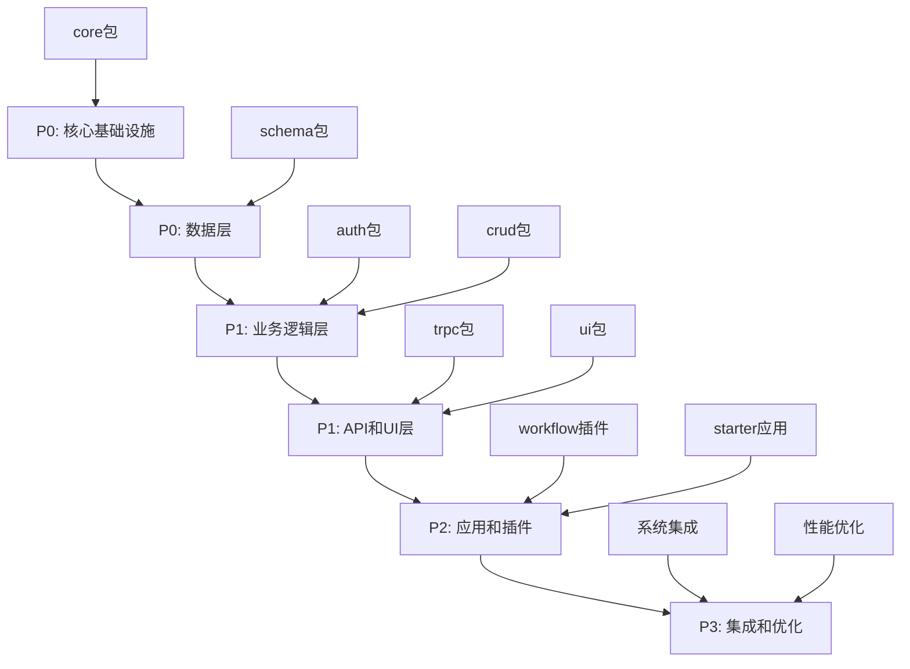

# LinchKit 开发优先级指南

**文档版本**: v1.0.0  
**创建日期**: 2025-06-23  
**维护责任**: 架构团队  
**用途**: 重写项目的开发优先级指导  

---

## 🎯 总体开发策略

### 核心原则
- **AI-First 设计**: 所有开发都优先考虑 AI 理解和处理能力
- **Schema 驱动**: 以数据模式为核心，驱动整个系统开发
- **渐进式构建**: 从核心基础设施开始，逐层向上构建
- **类型安全优先**: 确保端到端的类型安全
- **参考现有代码**: 将现有实现作为架构设计参考

### 开发阶段划分

---

## 📋 第一阶段：核心基础设施 (P0 - 最高优先级)

### 1.1 @linch-kit/core 包
**优先级**: P0 - 最高优先级
**依赖**: 无 (顶层基础设施)

#### 核心功能 (必须实现)
- **插件系统** ⭐ 新增核心功能
  - PluginSystem 核心类 (无依赖设计)
  - PluginRegistry 插件注册表
  - 插件类型分类：
    - Plugin Class: 完整功能插件
    - Functional Module: 功能模块插件
  - 插件生命周期管理
  - 插件埋点支持 (所有子包可埋点)

- **通用类型定义** (原 @linch-kit/types 内容)
  - BaseEntity 接口 (id, createdAt, updatedAt, deletedAt)
  - BaseModel 抽象类 (软删除方法)
  - ApiResponse<T> 标准响应格式
  - PaginationParams/Result 分页类型
  - 工具类型 (DeepPartial, RequiredFields, OptionalFields)
  - 全局类型声明和环境变量类型

- **CLI 系统**
  - LinchCLI 核心类
  - CommandRegistry 命令注册器
  - PluginLoader 插件加载器
  - 帮助系统和错误处理

- **配置管理**
  - ConfigManager 配置管理器
  - 多层次配置加载 (文件、环境变量、CLI参数)
  - 配置验证和模板生成

- **国际化系统**
  - createPackageI18n 包级国际化
  - 多语言消息管理
  - 翻译函数生成

- **工具函数库**
  - 文件系统操作 (fs)
  - 日志系统 (logger)
  - 字符串处理 (string)
  - 验证工具 (validation)

#### 技术要求
- 零依赖设计 (顶层基础设施)
- ES 模块兼容
- 插件化架构
- 完整的错误处理
- 测试覆盖率 > 90%

---

## 📋 第二阶段：数据层 (P0 - 最高优先级)

### 2.1 @linch-kit/schema 包
**优先级**: P0 - 最高优先级
**依赖**: core

#### 核心功能 (必须实现)
- **Schema 定义系统**
  - defineField() 统一字段定义
  - defineEntity() 实体定义
  - 装饰器支持 (primary, unique, timestamps, softDelete)

- **类型安全**
  - 基于 Zod 的类型推导
  - TypeScript 类型生成
  - 运行时验证

- **代码生成器**
  - Prisma Schema 生成
  - 验证器生成 (create/update/response/query)
  - Mock 数据生成

- **CLI 集成**
  - schema:list 命令
  - schema:generate:prisma 命令
  - schema:generate:validators 命令

- **插件埋点支持**
  - Schema 定义阶段插件钩子
  - 代码生成阶段插件钩子
  - 验证阶段插件钩子

#### 技术要求
- 避免复杂类型推导 (DTS构建<10s)
- 支持 JSON 字段映射
- 国际化支持
- 测试覆盖率 > 85%

#### 性能约束
- DTS 构建时间 < 10秒
- 避免使用 z.any() 类型
- 限制泛型嵌套深度 < 3层

---

## 📋 第三阶段：业务逻辑层 (P1 - 高优先级)

### 3.1 @linch-kit/auth 包
**优先级**: P1 - 高优先级
**依赖**: core, schema

#### 核心功能 (必须实现)
- **认证系统**
  - 多种认证提供商 (Credentials, OAuth)
  - JWT 会话管理
  - 多租户支持

- **权限系统**
  - ModularPermissionChecker 权限检查器
  - PermissionRegistry 权限注册表
  - RBAC/ABAC 支持

- **用户管理**
  - 用户 Schema 定义
  - 角色和权限分配
  - 会话管理

- **插件埋点支持**
  - 认证流程插件钩子
  - 权限检查插件钩子
  - 用户管理插件钩子

#### 技术要求
- 避免复杂类型推导
- 模块化权限设计
- 完整的安全机制
- 测试覆盖率 > 85%

### 3.2 @linch-kit/crud 包
**优先级**: P1 - 高优先级
**依赖**: auth, schema, core

#### 核心功能 (必须实现)
- **CRUD 管理器**
  - CRUDManager 核心类
  - 链式 API 设计
  - 事件系统集成

- **CRUD 操作**
  - 基础 CRUD (Create, Read, Update, Delete)
  - 批量操作支持
  - 事务支持

- **权限集成**
  - 操作级权限检查
  - 字段级权限过滤
  - 行级权限控制

- **查询构建器**
  - 类型安全查询构建
  - 分页和排序
  - 关联查询

- **插件埋点支持**
  - CRUD 操作前后插件钩子
  - 查询构建插件钩子
  - 数据处理插件钩子

#### 技术要求
- 与 auth 包深度集成
- Schema 适配器设计
- React 状态管理支持
- 测试覆盖率 > 85%

---

## 📋 第四阶段：API和UI层 (P1 - 高优先级)

### 4.1 @linch-kit/trpc 包
**优先级**: P1 - 高优先级
**依赖**: crud, auth, schema, core

#### 核心功能 (必须实现)
- **服务端集成**
  - tRPC 路由生成器
  - 上下文管理
  - Next.js App Router 兼容

- **客户端集成**
  - React Query 集成
  - React Hooks 支持
  - 类型安全客户端

- **中间件系统**
  - 认证中间件
  - 权限检查中间件
  - 验证中间件

- **插件埋点支持**
  - 路由生成插件钩子
  - 中间件插件钩子
  - 请求处理插件钩子

#### 技术要求
- 端到端类型安全
- 自动 CRUD 路由生成
- 错误处理机制
- 测试覆盖率 > 80%

### 4.2 @linch-kit/ui 包
**优先级**: P1 - 高优先级
**依赖**: core

#### 核心功能 (必须实现)
- **基础 UI 组件**
  - shadcn/ui 组件集成
  - 主题系统 (深色/浅色)
  - 响应式设计

- **CRUD 组件**
  - DataTable 数据表格
  - FormBuilder 表单构建器
  - Schema 驱动组件

- **认证组件**
  - LoginForm, RegisterForm
  - AuthGuard 认证守卫
  - UserProfile 用户资料

- **布局组件**
  - DashboardLayout 仪表板布局
  - 导航和侧边栏组件

- **插件埋点支持**
  - 组件渲染插件钩子
  - 主题切换插件钩子
  - 表单处理插件钩子

#### 技术要求
- 使用 shadcn/ui CLI 添加组件
- 完整的国际化支持
- TypeScript 类型安全
- 测试覆盖率 > 80%

---

## 📋 第五阶段：应用和插件 (P2 - 中优先级)

### 5.1 @linch-kit/workflow 插件
**优先级**: P2 - 中优先级
**依赖**: core, schema, auth, crud, trpc, ui

#### 第一阶段 (P1 - 高优先级)
- **核心状态机引擎**
  - WorkflowEngine 核心类
  - 状态定义和流转逻辑
  - 事件总线集成

- **基础数据模型**
  - WorkflowDefinition Schema
  - WorkflowInstance Schema
  - 数据库模型定义

- **插件系统集成**
  - 插件注册和生命周期
  - 插件钩子实现

#### 第二阶段 (P2 - 中优先级)
- **tRPC API 接口**
- **权限集成**
- **基础 UI 组件**

#### 技术要求
- 避免循环依赖
- 插件化设计
- 测试覆盖率 > 80%

### 5.2 apps/starter 应用
**优先级**: P2 - 中优先级
**依赖**: 所有核心包 + workflow 插件

#### 第一阶段 (P0 - 最高优先级)
- **项目初始化和配置**
- **基础页面结构**
- **认证系统集成**
- **数据库配置和实体定义**

#### 第二阶段 (P1 - 高优先级)
- **用户管理功能**
- **内容管理功能**
- **CRUD 操作演示**
- **权限控制演示**

#### 第三阶段 (P2 - 中优先级)
- **工作流集成**
- **AI 功能演示**
- **性能优化**
- **测试覆盖**

#### 第四阶段 (P3 - 低优先级)
- **部署配置**
- **监控集成**
- **文档完善**
- **示例数据**

#### 技术要求
- 展示所有 LinchKit 功能
- 生产级代码质量
- 完整的部署配置
- 测试覆盖率 > 80%

## 📋 第六阶段：集成和优化 (P3 - 低优先级)

### 6.1 系统集成测试
**优先级**: P3 - 低优先级

#### 核心任务
- **端到端测试**
  - 完整用户流程测试
  - 包间集成测试
  - 性能基准测试

- **文档完善**
  - API 文档生成
  - 使用示例
  - 最佳实践指南

### 6.2 性能优化
**优先级**: P3 - 低优先级

#### 核心任务
- **构建优化**
  - DTS 构建性能监控
  - 增量构建优化
  - 缓存策略

- **运行时优化**
  - 组件懒加载
  - 查询优化
  - 内存使用优化

### 6.3 生产就绪
**优先级**: P3 - 低优先级

#### 核心任务
- **部署优化**
  - Docker 容器化
  - CI/CD 流水线
  - 环境配置

- **监控和日志**
  - 性能监控
  - 错误追踪
  - 日志聚合

---

## ⚠️ 关键技术约束

### 类型系统约束
- **DTS 构建时间** < 30秒 (每个包)
- **避免复杂类型推导** (嵌套深度 < 3层)
- **禁止使用 z.any()** (使用 z.unknown())

### 架构约束
- **严格遵循依赖层次** (core → schema → auth → crud → trpc → ui)
- **禁止循环依赖**
- **ES 模块兼容性**
- **插件系统无依赖** (core 包作为顶层基础设施)

### 开发约束
- **TypeScript 严格模式**
- **完整的 JSDoc 注释**
- **国际化支持 (en, zh-CN)**
- **测试覆盖率要求**:
  - core 包: > 90% (基础设施)
  - schema/auth/crud 包: > 85% (核心业务)
  - trpc/ui 包: > 80% (应用层)
- **同步测试开发**: 每个模块的测试必须与功能开发同步进行

---

## 🚀 成功标准

### 第一阶段成功标准
- [ ] core 包构建成功 (< 45s)
- [ ] 插件系统正常工作
- [ ] AI 集成系统可用
- [ ] CLI 系统正常工作
- [ ] 配置管理功能完整
- [ ] 国际化系统可用

### 第二阶段成功标准
- [ ] Schema 定义系统完整
- [ ] 代码生成器正常工作
- [ ] Prisma 集成成功
- [ ] 类型推导正确
- [ ] 插件埋点支持

### 第三阶段成功标准
- [ ] 认证系统功能完整
- [ ] 权限控制正常工作
- [ ] CRUD 操作类型安全
- [ ] 数据库集成成功
- [ ] auth 不依赖 crud (避免循环依赖)

### 第四阶段成功标准
- [ ] tRPC API 端到端类型安全
- [ ] UI 组件库功能完整
- [ ] 主题系统正常工作
- [ ] 响应式设计完整
- [ ] 插件埋点支持

### 第五阶段成功标准
- [ ] 工作流插件功能完整
- [ ] 状态机引擎正常工作
- [ ] AI 工作流生成可用
- [ ] Starter 应用功能完整
- [ ] 所有 LinchKit 功能演示

### 第六阶段成功标准
- [ ] 端到端测试通过
- [ ] 文档系统完善
- [ ] 性能指标达标
- [ ] 生产环境就绪
- [ ] 部署配置完整

---

**重要提醒**: 本开发优先级指南是重写 LinchKit 项目的核心指导文档。严格按照优先级顺序开发，确保每个阶段的成功标准都达成后再进入下一阶段。
