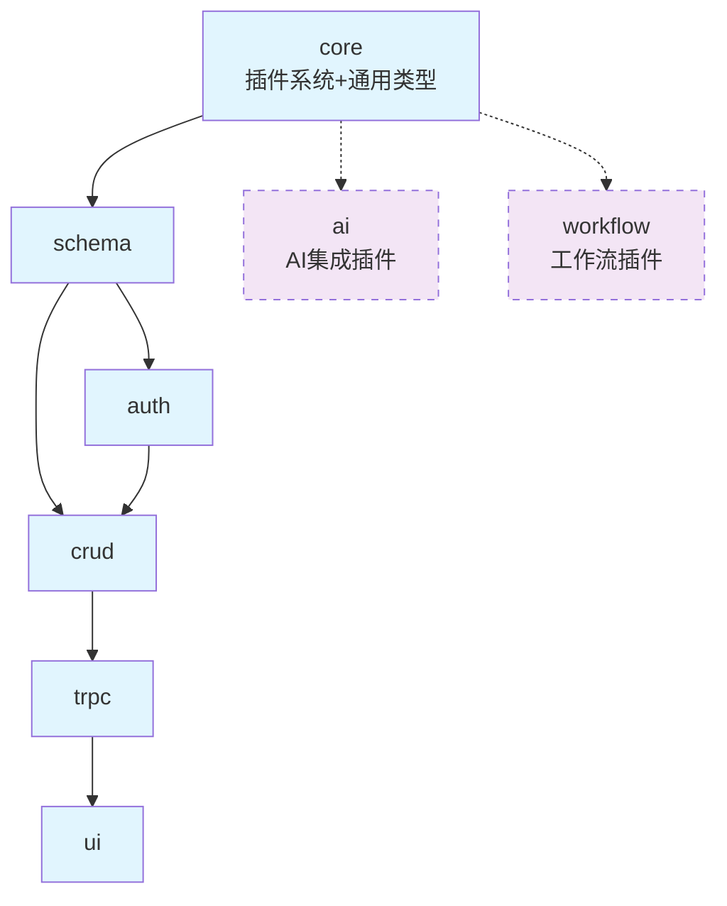
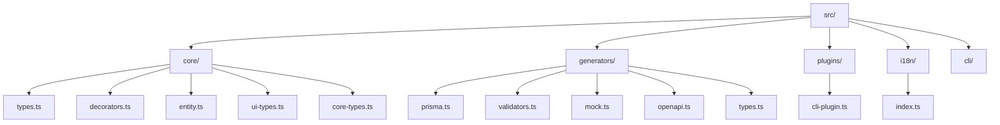
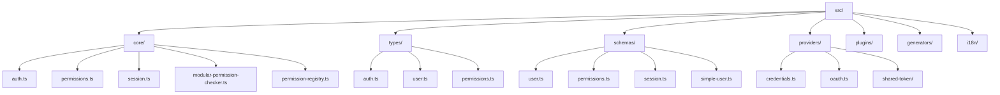
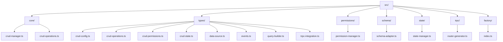
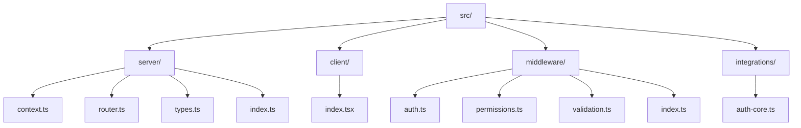
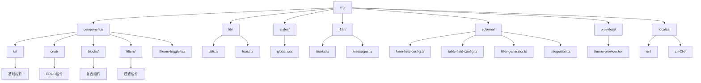
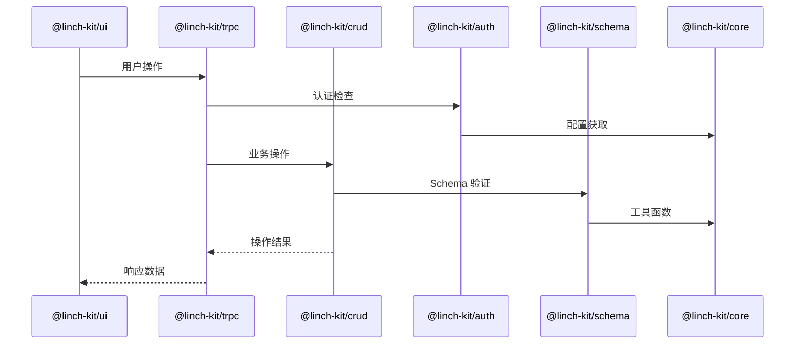

# LinchKit 子包架构总览

**文档版本**: v1.0.0  
**创建日期**: 2025-06-23  
**维护责任**: 架构团队  
**更新频率**: 包结构变更时更新  

---

## 📦 包层次结构

### 依赖关系图


### 包架构设计状态
| 包名 | 架构设计 | 参考版本 | 开发优先级 | 复杂度 | 状态 |
|------|----------|----------|------------|--------|------|
| ~~types~~ | ❌ 已废弃 | - | - | - | 已废弃 |
| **核心包** | | | | | |
| core | 🎯 设计完成 | - | P0 - 最高 | 高 | 待开发 |
| schema | 🎯 设计完成 | v0.2.1 | P0 - 最高 | 高 | 待开发 |
| **业务包** | | | | | |
| auth | 🎯 设计完成 | - | P1 - 高 | 高 | 待开发 |
| crud | 🎯 设计完成 | - | P1 - 高 | 中 | 待开发 |
| trpc | 🎯 设计完成 | - | P1 - 高 | 中 | 待开发 |
| ui | 🎯 设计完成 | - | P1 - 高 | 高 | 待开发 |
| **插件包** | | | | | |
| ai | 🎯 设计完成 | - | P2 - 中 | 高 | 待开发 |
| workflow | 🎯 设计完成 | - | P2 - 中 | 高 | 待开发 |

---

## 🏗️ 包内部架构

### 1. @linch-kit/core

**职责**: 插件系统、AI集成、通用类型、CLI系统、配置管理、基础工具、国际化
**依赖**: 无 (顶层基础设施)
**成熟度**: 重新设计

```mermaid
graph TD
    A[src/] --> B[plugins/]
    A --> C[ai/]
    A --> D[types/]
    A --> E[cli/]
    A --> F[config/]
    A --> G[utils/]
    A --> H[i18n/]

    B --> I[plugin-system.ts]
    B --> J[plugin-registry.ts]
    B --> K[plugin-loader.ts]
    B --> L[plugin-types.ts]
    B --> M[functional-modules.ts]

    C --> N[ai-provider.ts]
    C --> O[ai-registry.ts]
    C --> P[backends/]
    C --> Q[types.ts]

    D --> R[common.ts]
    D --> S[globals.ts]
    D --> T[index.ts]

    E --> U[commands/]
    E --> V[core/]
    E --> W[index.ts]

    F --> X[loader.ts]
    F --> Y[templates.ts]
    F --> Z[types.ts]

    G --> AA[fs.ts]
    G --> BB[logger.ts]
    G --> CC[network.ts]
    G --> DD[process.ts]
    G --> EE[string.ts]
    G --> FF[validation.ts]

    H --> GG[package-i18n.ts]
    H --> HH[types.ts]
```



**核心模块**:
- `plugins/`: 插件系统核心，支持插件类和功能模块类
- `ai/`: AI集成系统，抽象化多后端支持
- `types/`: 通用类型定义 (原 @linch-kit/types 内容)
- `cli/`: CLI 系统核心，命令注册、插件加载
- `config/`: 配置管理系统，多层次配置加载
- `utils/`: 工具函数库，文件系统、网络、进程等
- `i18n/`: 国际化系统，包级 i18n 支持

### 2. @linch-kit/schema

**职责**: 数据模式定义和代码生成
**依赖**: core
**成熟度**: 稳定 (已发布)



**核心模块**:
- `core/`: Schema 核心类型、装饰器、实体定义
- `generators/`: 代码生成器，Prisma、验证器、Mock 数据
- `plugins/`: CLI 插件集成
- `i18n/`: 国际化支持

### 3. @linch-kit/auth

**职责**: 认证和权限管理
**依赖**: core, schema
**成熟度**: 稳定



**核心模块**:
- `core/`: 认证核心逻辑、权限系统、会话管理
- `types/`: 认证相关类型定义
- `schemas/`: 用户、权限、会话的 Schema 定义
- `providers/`: 认证提供商实现

### 4. @linch-kit/crud

**职责**: CRUD 操作核心逻辑
**依赖**: auth, schema, core
**成熟度**: 稳定



**核心模块**:
- `core/`: CRUD 管理器、操作核心
- `types/`: CRUD 相关类型定义
- `permissions/`: 权限管理集成
- `schema/`: Schema 适配器
- `trpc/`: tRPC 路由生成器

### 5. @linch-kit/trpc

**职责**: tRPC 集成和类型安全 API
**依赖**: crud, auth, schema, core
**成熟度**: 稳定



**核心模块**:
- `server/`: 服务端路由、上下文、类型定义
- `client/`: 客户端 React 集成
- `middleware/`: 认证、权限、验证中间件
- `integrations/`: 与其他包的集成

### 6. @linch-kit/ui

**职责**: 完整 UI 组件库
**依赖**: core → schema → auth → crud → trpc → ui
**成熟度**: 稳定



**核心模块**:
- `components/ui/`: shadcn/ui 基础组件
- `components/crud/`: CRUD 相关组件
- `components/blocks/`: 复合业务组件
- `schema/`: Schema 集成和表单生成
- `i18n/`: 国际化支持

---

## 🔄 包间通信机制

### 数据流向


### 插件系统架构
```mermaid
graph LR
    A[CLI 插件系统] --> B[命令注册]
    A --> C[配置合并]
    A --> D[插件发现]
    
    E[运行时插件系统] --> F[模块注册]
    E --> G[服务注入]
    E --> H[事件总线]
    
    B --> I[@linch-kit/schema]
    B --> J[@linch-kit/auth]
    
    style E fill:#f9f,stroke:#333,stroke-width:2px,stroke-dasharray: 5 5
```

---

## 📊 功能架构统计

### 功能分布概览
| 功能分类 | 核心功能 | 高级功能 | 扩展功能 | 开发优先级 |
|----------|----------|----------|----------|------------|
| 核心基础设施 (core) | 12 | 4 | 6 | P0 - 最高 |
| 数据管理 (schema) | 5 | 3 | 2 | P0 - 最高 |
| 认证权限 (auth) | 6 | 4 | 2 | P1 - 高 |
| 数据操作 (crud) | 4 | 3 | 2 | P1 - 高 |
| API层 (trpc) | 4 | 3 | 2 | P1 - 高 |
| UI组件 (ui) | 8 | 6 | 4 | P1 - 高 |
| **总计** | **39** | **23** | **18** | **80 个功能** |

### 技术特色亮点
- **AI-First 设计**: 所有组件都便于 AI 理解和处理
- **Schema 驱动架构**: Zod 作为单一数据源，自动代码生成
- **插件化系统**: CLI 插件系统，模块化架构，可扩展设计
- **企业级特性**: 完整的认证权限系统，多租户支持，国际化支持

---

**重要提醒**: 本文档描述了 LinchKit 的完整包架构设计和内部结构，基于现有代码库分析。重写项目时必须严格遵循这里定义的架构原则和模块组织方式，同时参考现有实现的设计思路。
