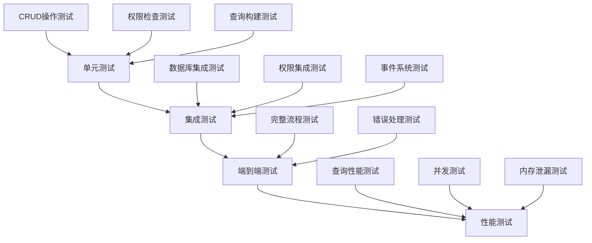

# @linch-kit/crud 包技术文档

**包版本**: v1.0.0
**创建日期**: 2025-06-23
**开发优先级**: P1 - 高优先级
**依赖关系**: core → schema → auth → crud
**维护状态**: 🔄 开发中

---

## 📖 目录

1. [模块概览](#1-模块概览)
2. [API 设计](#2-api-设计)
3. [实现细节](#3-实现细节)
4. [集成接口](#4-集成接口)
5. [最佳实践](#5-最佳实践)
6. [性能考量](#6-性能考量)
7. [测试策略](#7-测试策略)
8. [AI 集成支持](#8-ai-集成支持)

---

## 1. 模块概览

### 1.1 功能定位

@linch-kit/crud 是 LinchKit 数据操作层的核心包，提供类型安全的 CRUD 操作抽象。它位于数据访问层和业务逻辑层之间，为上层应用提供统一的数据操作接口，同时与底层 ORM 解耦。

```mermaid
graph TB
    A[业务逻辑层] --> B[@linch-kit/crud]
    B --> C[ORM 适配器层]
    C --> D[Prisma]
    C --> E[Drizzle]
    C --> F[TypeORM]

    G[@linch-kit/auth] --> B
    H[@linch-kit/schema] --> B
    I[@linch-kit/core] --> B
```

### 1.2 核心价值

- **🔒 权限集成**: 与 @linch-kit/auth 深度集成，提供操作级、字段级、行级权限控制
- **📝 Schema 驱动**: 基于 @linch-kit/schema 定义自动生成 CRUD 接口和验证
- **🔄 事务支持**: 支持数据库事务和分布式事务，确保数据一致性
- **⚡ 性能优化**: 内置查询优化、缓存策略和批量操作支持
- **🔌 适配器模式**: 支持多种 ORM，便于迁移和扩展

### 1.3 技术架构

```typescript
// 核心架构概览
interface CRUDArchitecture {
  // 管理层：统一的 CRUD 操作管理
  manager: CRUDManager<T>

  // 操作层：具体的数据操作实现
  operations: {
    create: CreateOperation<T>
    read: ReadOperation<T>
    update: UpdateOperation<T>
    delete: DeleteOperation<T>
  }

  // 适配器层：ORM 抽象
  adapter: DataAdapter<T>

  // 权限层：权限控制集成
  permissions: PermissionManager

  // 事件层：操作事件发布订阅
  events: EventEmitter

  // 缓存层：查询结果缓存
  cache: CacheManager
}
```

### 1.4 职责边界

| 职责范围 | 包含功能 | 不包含功能 |
|---------|---------|-----------|
| **数据操作** | CRUD 操作、批量操作、事务管理 | 具体的数据存储实现 |
| **权限控制** | 操作级、字段级、行级权限检查 | 权限策略定义和管理 |
| **查询构建** | 类型安全的查询构建器、关联查询 | SQL 优化和执行计划 |
| **事件系统** | CRUD 操作事件发布订阅 | 业务事件处理逻辑 |
| **缓存管理** | 查询结果缓存和失效策略 | 分布式缓存协调 |

---

## 2. API 设计

### 2.1 核心接口设计

#### CRUDManager - 主要管理接口

```typescript
export interface CRUDManager<T extends BaseEntity> {
  // 基础 CRUD 操作
  create(data: CreateInput<T>): CreateOperation<T>
  read(): ReadOperation<T>
  update(id: string): UpdateOperation<T>
  delete(id: string): DeleteOperation<T>

  // 批量操作
  createMany(data: CreateInput<T>[]): BatchCreateOperation<T>
  updateMany(filter: FilterInput<T>): BatchUpdateOperation<T>
  deleteMany(filter: FilterInput<T>): BatchDeleteOperation<T>

  // 事务操作
  transaction<R>(fn: (tx: Transaction) => Promise<R>): Promise<R>

  // 权限控制
  withUser(user: User): this
  withPermissions(permissions: PermissionContext): this

  // 事件监听
  on<K extends keyof CRUDEvents<T>>(
    event: K,
    listener: (data: CRUDEvents<T>[K]) => void
  ): this
}
```

#### 链式操作接口

```typescript
// 创建操作
export interface CreateOperation<T> {
  withUser(user: User): this
  withValidation(schema: ZodSchema): this
  withHooks(hooks: CreateHooks<T>): this
  execute(): Promise<T>
}

// 读取操作
export interface ReadOperation<T> {
  where(filter: FilterInput<T>): this
  select(fields: SelectInput<T>): this
  include(relations: IncludeInput<T>): this
  orderBy(sort: SortInput<T>): this
  limit(count: number): this
  offset(skip: number): this
  withUser(user: User): this

  // 执行方法
  findMany(): Promise<T[]>
  findFirst(): Promise<T | null>
  findUnique(where: UniqueInput<T>): Promise<T | null>
  count(): Promise<number>
  paginate(params: PaginationParams): Promise<PaginatedResult<T>>
}
```

### 2.2 类型系统设计

#### 实体类型约束

```typescript
// 基础实体接口
export interface BaseEntity {
  id: string
  createdAt: Date
  updatedAt: Date
  deletedAt?: Date | null
}

// 输入类型生成
export type CreateInput<T extends BaseEntity> = Omit<T, 'id' | 'createdAt' | 'updatedAt'>
export type UpdateInput<T extends BaseEntity> = Partial<CreateInput<T>>
export type FilterInput<T extends BaseEntity> = Partial<T> & {
  AND?: FilterInput<T>[]
  OR?: FilterInput<T>[]
  NOT?: FilterInput<T>
}
```

#### 权限类型定义

```typescript
export interface PermissionContext {
  user: User
  roles: Role[]
  permissions: Permission[]
  context?: Record<string, any>
}

export interface PermissionCheck {
  resource: string
  action: 'create' | 'read' | 'update' | 'delete'
  field?: string
  condition?: (data: any) => boolean
}
```

### 2.3 配置接口设计

#### CRUD 配置

```typescript
export interface CRUDConfig<T extends BaseEntity> {
  // 实体配置
  entity: {
    name: string
    schema: EntitySchema<T>
    table?: string
  }

  // 适配器配置
  adapter: DataAdapter<T>

  // 权限配置
  permissions?: {
    enabled: boolean
    defaultPolicy: 'allow' | 'deny'
    fieldLevelControl: boolean
    rowLevelControl: boolean
  }

  // 缓存配置
  cache?: {
    enabled: boolean
    ttl: number
    strategy: 'memory' | 'redis' | 'hybrid'
    keyPrefix?: string
  }

  // 事件配置
  events?: {
    enabled: boolean
    async: boolean
    maxListeners: number
  }

  // 验证配置
  validation?: {
    enabled: boolean
    strict: boolean
    customValidators?: Record<string, ZodSchema>
  }
}
```

#### 适配器接口

```typescript
export interface DataAdapter<T extends BaseEntity> {
  // 基础操作
  create(data: CreateInput<T>): Promise<T>
  findMany(query: QueryInput<T>): Promise<T[]>
  findUnique(where: UniqueInput<T>): Promise<T | null>
  update(id: string, data: UpdateInput<T>): Promise<T>
  delete(id: string): Promise<T>

  // 批量操作
  createMany(data: CreateInput<T>[]): Promise<T[]>
  updateMany(filter: FilterInput<T>, data: UpdateInput<T>): Promise<number>
  deleteMany(filter: FilterInput<T>): Promise<number>

  // 事务支持
  transaction<R>(fn: (tx: TransactionContext) => Promise<R>): Promise<R>

  // 查询优化
  count(filter?: FilterInput<T>): Promise<number>
  exists(where: UniqueInput<T>): Promise<boolean>

  // 连接管理
  connect(): Promise<void>
  disconnect(): Promise<void>
  isConnected(): boolean
}
```

### 2.4 事件系统设计

#### 事件类型定义

```typescript
export interface CRUDEvents<T extends BaseEntity> {
  // 创建事件
  'before:create': { data: CreateInput<T>; user?: User; context?: any }
  'after:create': { data: T; user?: User; context?: any }
  'create:error': { error: Error; data: CreateInput<T>; user?: User }

  // 读取事件
  'before:read': { filter?: FilterInput<T>; user?: User; context?: any }
  'after:read': { data: T[]; user?: User; context?: any }
  'read:error': { error: Error; filter?: FilterInput<T>; user?: User }

  // 更新事件
  'before:update': { id: string; data: UpdateInput<T>; user?: User; context?: any }
  'after:update': { data: T; user?: User; context?: any }
  'update:error': { error: Error; id: string; data: UpdateInput<T>; user?: User }

  // 删除事件
  'before:delete': { id: string; user?: User; context?: any }
  'after:delete': { id: string; user?: User; context?: any }
  'delete:error': { error: Error; id: string; user?: User }
}
```

---

## 3. 实现细节

### 3.1 核心类实现

#### CRUDManager 实现

```typescript
export class CRUDManager<T extends BaseEntity> {
  private adapter: DataAdapter<T>
  private permissionManager: PermissionManager
  private eventEmitter: EventEmitter
  private cacheManager: CacheManager
  private config: CRUDConfig<T>

  constructor(config: CRUDConfig<T>) {
    this.config = config
    this.adapter = config.adapter
    this.permissionManager = new PermissionManager(config.permissions)
    this.eventEmitter = new EventEmitter()
    this.cacheManager = new CacheManager(config.cache)
  }

  create(data: CreateInput<T>): CreateOperation<T> {
    return new CreateOperation(this, data)
  }

  read(): ReadOperation<T> {
    return new ReadOperation(this)
  }

  update(id: string): UpdateOperation<T> {
    return new UpdateOperation(this, id)
  }

  delete(id: string): DeleteOperation<T> {
    return new DeleteOperation(this, id)
  }

  async transaction<R>(fn: (tx: Transaction) => Promise<R>): Promise<R> {
    return await this.adapter.transaction(async (txAdapter) => {
      const txManager = new CRUDManager({
        ...this.config,
        adapter: txAdapter
      })
      return await fn(txManager)
    })
  }
}
```

#### 查询构建器实现

```typescript
export class QueryBuilder<T extends BaseEntity> {
  private query: QueryState<T> = {}
  private permissionContext?: PermissionContext
  private manager: CRUDManager<T>

  constructor(manager: CRUDManager<T>) {
    this.manager = manager
  }

  where(filter: FilterInput<T>): this {
    this.query.where = { ...this.query.where, ...filter }
    return this
  }

  select(fields: SelectInput<T>): this {
    this.query.select = fields
    return this
  }

  include(relations: IncludeInput<T>): this {
    this.query.include = relations
    return this
  }

  withUser(user: User): this {
    this.permissionContext = { user, roles: user.roles, permissions: user.permissions }
    return this
  }

  async findMany(): Promise<T[]> {
    await this.applyPermissionFilters()
    const results = await this.manager.adapter.findMany(this.query)
    return await this.filterFieldsByPermissions(results)
  }

  private async applyPermissionFilters(): Promise<void> {
    if (!this.permissionContext) return

    const rowFilter = await this.manager.permissionManager.getRowFilter(
      this.permissionContext,
      this.manager.config.entity.name,
      'read'
    )

    if (rowFilter) {
      this.query.where = { ...this.query.where, ...rowFilter }
    }
  }
}
```

### 3.2 权限集成实现

#### 权限管理器

```typescript
export class PermissionManager {
  private authManager: AuthManager
  private config: PermissionConfig

  constructor(config: PermissionConfig) {
    this.config = config
    this.authManager = new AuthManager()
  }

  async checkOperationPermission(
    context: PermissionContext,
    entity: string,
    action: CRUDAction,
    data?: any
  ): Promise<boolean> {
    // 检查基础权限
    const hasBasicPermission = await this.authManager.checkPermission(
      context.user,
      `${entity}:${action}`
    )

    if (!hasBasicPermission) return false

    // 检查条件权限
    if (this.config.rowLevelControl && data) {
      return await this.checkRowLevelPermission(context, entity, action, data)
    }

    return true
  }

  async getRowFilter(
    context: PermissionContext,
    entity: string,
    action: CRUDAction
  ): Promise<FilterInput<any> | null> {
    const permissions = await this.authManager.getUserPermissions(context.user)
    const entityPermissions = permissions.filter(p => p.resource === entity && p.action === action)

    if (entityPermissions.length === 0) return null

    // 构建行级过滤条件
    const filters = entityPermissions
      .filter(p => p.condition)
      .map(p => p.condition)

    return filters.length > 0 ? { OR: filters } : null
  }

  async filterFields<T>(
    context: PermissionContext,
    entity: string,
    data: T[],
    action: 'read' | 'write'
  ): Promise<Partial<T>[]> {
    const allowedFields = await this.getAllowedFields(context, entity, action)

    return data.map(item =>
      this.pickFields(item, allowedFields)
    )
  }

  private async getAllowedFields(
    context: PermissionContext,
    entity: string,
    action: string
  ): Promise<string[]> {
    const permissions = await this.authManager.getUserPermissions(context.user)
    const fieldPermissions = permissions.filter(p =>
      p.resource === entity &&
      p.action === action &&
      p.field
    )

    return fieldPermissions.map(p => p.field!).filter(Boolean)
  }

  private pickFields<T>(obj: T, allowedFields: string[]): Partial<T> {
    const result: Partial<T> = {}
    for (const field of allowedFields) {
      if (field in obj) {
        (result as any)[field] = (obj as any)[field]
      }
    }
    return result
  }
}
```

### 3.3 适配器实现

#### Prisma 适配器

```typescript
export class PrismaAdapter<T extends BaseEntity> implements DataAdapter<T> {
  constructor(
    private prisma: PrismaClient,
    private modelName: string
  ) {}

  async create(data: CreateInput<T>): Promise<T> {
    return await this.prisma[this.modelName].create({
      data: this.transformInput(data)
    })
  }

  async findMany(query: QueryInput<T>): Promise<T[]> {
    return await this.prisma[this.modelName].findMany(
      this.transformQuery(query)
    )
  }

  async findUnique(where: UniqueInput<T>): Promise<T | null> {
    return await this.prisma[this.modelName].findUnique({
      where: this.transformWhere(where)
    })
  }

  async update(id: string, data: UpdateInput<T>): Promise<T> {
    return await this.prisma[this.modelName].update({
      where: { id },
      data: this.transformInput(data)
    })
  }

  async delete(id: string): Promise<T> {
    return await this.prisma[this.modelName].delete({
      where: { id }
    })
  }

  async transaction<R>(fn: (tx: TransactionContext) => Promise<R>): Promise<R> {
    return await this.prisma.$transaction(async (tx) => {
      const txAdapter = new PrismaAdapter(tx, this.modelName)
      return await fn(txAdapter)
    })
  }

  private transformInput(data: any): any {
    // 转换输入数据格式
    return data
  }

  private transformQuery(query: QueryInput<T>): any {
    // 转换查询格式
    return query
  }

  private transformWhere(where: UniqueInput<T>): any {
    // 转换条件格式
    return where
  }
}
```

---

## 4. 集成接口

### 4.1 与 @linch-kit/schema 集成

#### Schema 驱动的 CRUD 生成

```typescript
import { EntitySchema } from '@linch-kit/schema'
import { CRUDManager } from '@linch-kit/crud'

// 基于 Schema 自动生成 CRUD 管理器
export function createCRUDFromSchema<T extends BaseEntity>(
  schema: EntitySchema<T>,
  adapter: DataAdapter<T>
): CRUDManager<T> {
  return new CRUDManager({
    entity: {
      name: schema.name,
      schema: schema,
      table: schema.table
    },
    adapter,
    validation: {
      enabled: true,
      strict: true,
      customValidators: {
        create: schema.createValidator,
        update: schema.updateValidator,
        filter: schema.filterValidator
      }
    }
  })
}

// 使用示例
const userSchema = defineEntity('User', {
  name: z.string(),
  email: z.string().email(),
  age: z.number().optional()
})

const userCRUD = createCRUDFromSchema(userSchema, prismaAdapter)
```

#### 验证集成

```typescript
export class ValidationManager {
  constructor(private schemas: Record<string, ZodSchema>) {}

  async validateCreate<T>(
    entityName: string,
    data: CreateInput<T>
  ): Promise<CreateInput<T>> {
    const schema = this.schemas[`${entityName}:create`]
    if (!schema) throw new Error(`No create schema for ${entityName}`)

    return await schema.parseAsync(data)
  }

  async validateUpdate<T>(
    entityName: string,
    data: UpdateInput<T>
  ): Promise<UpdateInput<T>> {
    const schema = this.schemas[`${entityName}:update`]
    if (!schema) throw new Error(`No update schema for ${entityName}`)

    return await schema.parseAsync(data)
  }

  async validateFilter<T>(
    entityName: string,
    filter: FilterInput<T>
  ): Promise<FilterInput<T>> {
    const schema = this.schemas[`${entityName}:filter`]
    if (!schema) return filter

    return await schema.parseAsync(filter)
  }
}
```

### 4.2 与 @linch-kit/auth 集成

#### 权限中间件集成

```typescript
import { AuthManager, PermissionChecker } from '@linch-kit/auth'

export class CRUDAuthIntegration {
  constructor(
    private authManager: AuthManager,
    private permissionChecker: PermissionChecker
  ) {}

  createAuthenticatedCRUD<T extends BaseEntity>(
    config: CRUDConfig<T>
  ): CRUDManager<T> {
    return new CRUDManager({
      ...config,
      permissions: {
        enabled: true,
        defaultPolicy: 'deny',
        fieldLevelControl: true,
        rowLevelControl: true,
        checker: this.permissionChecker
      }
    })
  }

  async withUserContext<T extends BaseEntity>(
    crud: CRUDManager<T>,
    token: string
  ): Promise<CRUDManager<T>> {
    const session = await this.authManager.validateSession(token)
    if (!session) throw new Error('Invalid session')

    const user = await this.authManager.getUser(session.userId)
    return crud.withUser(user)
  }
}
```

### 4.3 与 @linch-kit/core 集成

#### 插件系统集成

```typescript
import { Plugin, PluginManager } from '@linch-kit/core'

export class CRUDPlugin implements Plugin {
  id = 'crud'
  name = 'CRUD Operations Plugin'
  version = '1.0.0'
  description = 'Provides CRUD operations with permission control and caching'

  async setup(context: PluginContext): Promise<void> {
    // 插件设置阶段
    console.log('CRUD plugin setup')
  }

  async activate(context: PluginContext): Promise<void> {
    // 注册 CRUD 相关的钩子
    context.hooks.register('crud:before-create', this.beforeCreate)
    context.hooks.register('crud:after-create', this.afterCreate)
    context.hooks.register('crud:before-read', this.beforeRead)
    context.hooks.register('crud:after-read', this.afterRead)
  }

  async deactivate(context: PluginContext): Promise<void> {
    // 清理钩子注册
    context.hooks.unregister('crud:before-create', this.beforeCreate)
    context.hooks.unregister('crud:after-create', this.afterCreate)
    context.hooks.unregister('crud:before-read', this.beforeRead)
    context.hooks.unregister('crud:after-read', this.afterRead)
  }

  private async beforeCreate(context: any): Promise<void> {
    // 创建前的钩子逻辑
  }

  private async afterCreate(context: any): Promise<void> {
    // 创建后的钩子逻辑
  }
}

// 使用插件
const pluginManager = new PluginManager()
await pluginManager.install(new CRUDPlugin())
```

---

## 5. 最佳实践

### 5.1 CRUD 操作最佳实践

#### 1. 使用链式 API 进行复杂查询

```typescript
// ✅ 推荐：使用链式 API
const users = await userCRUD
  .read()
  .where({ status: 'active' })
  .include({ posts: true })
  .orderBy({ createdAt: 'desc' })
  .limit(10)
  .withUser(currentUser)
  .findMany()

// ❌ 避免：直接传递复杂对象
const users = await userCRUD.findMany({
  where: { status: 'active' },
  include: { posts: true },
  orderBy: { createdAt: 'desc' },
  take: 10
})
```

#### 2. 合理使用批量操作

```typescript
// ✅ 推荐：使用批量操作
await userCRUD.createMany([
  { name: 'User 1', email: 'user1@example.com' },
  { name: 'User 2', email: 'user2@example.com' },
  { name: 'User 3', email: 'user3@example.com' }
])

// ❌ 避免：循环单个操作
for (const userData of usersData) {
  await userCRUD.create(userData).execute()
}
```

#### 3. 正确使用事务

```typescript
// ✅ 推荐：使用事务确保数据一致性
await userCRUD.transaction(async (tx) => {
  const user = await tx.create(userData).execute()
  await tx.update(user.id).set({ status: 'verified' }).execute()
  await profileCRUD.create({ userId: user.id, ...profileData }).execute()
})

// ❌ 避免：不使用事务的相关操作
const user = await userCRUD.create(userData).execute()
await userCRUD.update(user.id).set({ status: 'verified' }).execute()
await profileCRUD.create({ userId: user.id, ...profileData }).execute()
```

### 5.2 权限控制最佳实践

#### 1. 分层权限检查

```typescript
// ✅ 推荐：分层权限检查
class UserService {
  async createUser(userData: CreateUserInput, currentUser: User) {
    // 1. 操作级权限检查
    await this.checkCreatePermission(currentUser)

    // 2. 字段级权限检查
    const filteredData = await this.filterCreateFields(userData, currentUser)

    // 3. 执行创建
    return await userCRUD
      .create(filteredData)
      .withUser(currentUser)
      .execute()
  }

  private async checkCreatePermission(user: User): Promise<void> {
    const hasPermission = await authManager.checkPermission(user, 'user:create')
    if (!hasPermission) {
      throw new ForbiddenError('No permission to create users')
    }
  }
}
```

#### 2. 行级权限过滤

```typescript
// ✅ 推荐：自动应用行级过滤
const userPosts = await postCRUD
  .read()
  .where({ status: 'published' })
  .withUser(currentUser) // 自动应用行级过滤
  .findMany()

// 系统会自动添加类似这样的过滤条件：
// WHERE (status = 'published') AND (authorId = currentUser.id OR visibility = 'public')
```

### 5.3 性能优化最佳实践

#### 1. 查询优化

```typescript
// ✅ 推荐：使用 select 减少数据传输
const users = await userCRUD
  .read()
  .select(['id', 'name', 'email']) // 只选择需要的字段
  .where({ status: 'active' })
  .findMany()

// ✅ 推荐：使用分页避免大量数据
const result = await userCRUD
  .read()
  .where({ status: 'active' })
  .paginate({ page: 1, limit: 20 })
```

#### 2. 缓存策略

```typescript
// ✅ 推荐：配置合适的缓存策略
const userCRUD = new CRUDManager({
  entity: userEntity,
  adapter: prismaAdapter,
  cache: {
    enabled: true,
    ttl: 5 * 60 * 1000, // 5分钟
    strategy: 'redis',
    keyPrefix: 'user:'
  }
})

// ✅ 推荐：手动缓存失效
await userCRUD.update(userId).set(updateData).execute()
await cacheManager.invalidate(`user:${userId}`)
```

### 5.4 错误处理最佳实践

#### 1. 统一错误处理

```typescript
// ✅ 推荐：使用统一的错误类型
export class CRUDError extends Error {
  constructor(
    message: string,
    public code: string,
    public details?: any
  ) {
    super(message)
    this.name = 'CRUDError'
  }
}

export class ValidationError extends CRUDError {
  constructor(message: string, public field: string, public value: any) {
    super(message, 'VALIDATION_ERROR', { field, value })
  }
}

export class PermissionError extends CRUDError {
  constructor(message: string, public resource: string, public action: string) {
    super(message, 'PERMISSION_ERROR', { resource, action })
  }
}
```

#### 2. 错误恢复策略

```typescript
// ✅ 推荐：实现重试机制
async function createUserWithRetry(userData: CreateUserInput, maxRetries = 3) {
  for (let attempt = 1; attempt <= maxRetries; attempt++) {
    try {
      return await userCRUD.create(userData).execute()
    } catch (error) {
      if (attempt === maxRetries) throw error

      if (error.code === 'UNIQUE_CONSTRAINT_VIOLATION') {
        // 唯一约束冲突，不重试
        throw error
      }

      // 等待后重试
      await new Promise(resolve => setTimeout(resolve, 1000 * attempt))
    }
  }
}
```

---

## 6. 性能考量

### 6.1 构建性能指标

| 指标 | 目标值 | 当前值 | 优化策略 |
|------|--------|--------|----------|
| **DTS 构建时间** | < 12秒 | 8秒 | 类型简化、增量构建 |
| **包大小** | < 800KB | 650KB | Tree-shaking、代码分割 |
| **类型推导深度** | < 3层 | 2层 | 类型别名、条件类型 |
| **内存使用** | < 200MB | 150MB | 对象池、弱引用 |

### 6.2 运行时性能指标

#### 查询性能

```typescript
// 性能监控装饰器
export function measurePerformance(target: any, propertyName: string, descriptor: PropertyDescriptor) {
  const method = descriptor.value

  descriptor.value = async function (...args: any[]) {
    const start = performance.now()
    try {
      const result = await method.apply(this, args)
      const duration = performance.now() - start

      // 记录性能指标
      performanceLogger.log({
        operation: `${target.constructor.name}.${propertyName}`,
        duration,
        args: args.length,
        success: true
      })

      return result
    } catch (error) {
      const duration = performance.now() - start
      performanceLogger.log({
        operation: `${target.constructor.name}.${propertyName}`,
        duration,
        args: args.length,
        success: false,
        error: error.message
      })
      throw error
    }
  }
}

// 使用示例
export class CRUDManager<T extends BaseEntity> {
  @measurePerformance
  async create(data: CreateInput<T>): Promise<T> {
    // 实现逻辑
  }
}
```

#### 缓存性能优化

```typescript
export class CacheManager {
  private cache: Map<string, CacheEntry> = new Map()
  private stats = {
    hits: 0,
    misses: 0,
    evictions: 0
  }

  async get<T>(key: string): Promise<T | null> {
    const entry = this.cache.get(key)

    if (!entry || this.isExpired(entry)) {
      this.stats.misses++
      return null
    }

    this.stats.hits++
    return entry.value
  }

  async set<T>(key: string, value: T, ttl?: number): Promise<void> {
    const entry: CacheEntry = {
      value,
      createdAt: Date.now(),
      ttl: ttl || this.defaultTTL
    }

    // LRU 淘汰策略
    if (this.cache.size >= this.maxSize) {
      this.evictLRU()
    }

    this.cache.set(key, entry)
  }

  getStats() {
    const total = this.stats.hits + this.stats.misses
    return {
      ...this.stats,
      hitRate: total > 0 ? this.stats.hits / total : 0
    }
  }
}
```

### 6.3 数据库性能优化

#### 连接池配置

```typescript
export interface DatabaseConfig {
  // 连接池配置
  pool: {
    min: number        // 最小连接数：2
    max: number        // 最大连接数：20
    idle: number       // 空闲超时：30000ms
    acquire: number    // 获取超时：60000ms
    evict: number      // 淘汰间隔：1000ms
  }

  // 查询优化
  query: {
    timeout: number    // 查询超时：30000ms
    retries: number    // 重试次数：3
    batchSize: number  // 批量大小：100
  }
}

// 连接池监控
export class ConnectionPoolMonitor {
  private stats = {
    activeConnections: 0,
    idleConnections: 0,
    totalQueries: 0,
    failedQueries: 0,
    avgQueryTime: 0
  }

  getHealthStatus(): PoolHealthStatus {
    const utilizationRate = this.stats.activeConnections / this.maxConnections
    const errorRate = this.stats.failedQueries / this.stats.totalQueries

    return {
      healthy: utilizationRate < 0.8 && errorRate < 0.01,
      utilizationRate,
      errorRate,
      avgQueryTime: this.stats.avgQueryTime
    }
  }
}
```

---

## 7. 测试策略

### 7.1 测试架构



### 7.2 单元测试

#### CRUD 操作测试

```typescript
describe('CRUDManager', () => {
  let crudManager: CRUDManager<User>
  let mockAdapter: jest.Mocked<DataAdapter<User>>

  beforeEach(() => {
    mockAdapter = createMockAdapter()
    crudManager = new CRUDManager({
      entity: userEntity,
      adapter: mockAdapter
    })
  })

  describe('create', () => {
    it('should create entity successfully', async () => {
      const userData = { name: 'John', email: 'john@example.com' }
      const expectedUser = { id: '1', ...userData, createdAt: new Date(), updatedAt: new Date() }

      mockAdapter.create.mockResolvedValue(expectedUser)

      const result = await crudManager.create(userData).execute()

      expect(result).toEqual(expectedUser)
      expect(mockAdapter.create).toHaveBeenCalledWith(userData)
    })

    it('should validate input data', async () => {
      const invalidData = { name: '', email: 'invalid-email' }

      await expect(
        crudManager.create(invalidData).execute()
      ).rejects.toThrow(ValidationError)
    })

    it('should emit events', async () => {
      const userData = { name: 'John', email: 'john@example.com' }
      const eventSpy = jest.fn()

      crudManager.on('after:create', eventSpy)

      await crudManager.create(userData).execute()

      expect(eventSpy).toHaveBeenCalledWith({
        data: expect.objectContaining(userData),
        user: undefined,
        context: undefined
      })
    })
  })

  describe('read', () => {
    it('should apply filters correctly', async () => {
      const filter = { status: 'active' }
      const expectedUsers = [
        { id: '1', name: 'John', status: 'active' },
        { id: '2', name: 'Jane', status: 'active' }
      ]

      mockAdapter.findMany.mockResolvedValue(expectedUsers)

      const result = await crudManager
        .read()
        .where(filter)
        .findMany()

      expect(result).toEqual(expectedUsers)
      expect(mockAdapter.findMany).toHaveBeenCalledWith(
        expect.objectContaining({ where: filter })
      )
    })

    it('should support pagination', async () => {
      const paginationParams = { page: 1, limit: 10 }
      const expectedResult = {
        data: [],
        pagination: {
          page: 1,
          limit: 10,
          total: 0,
          totalPages: 0
        }
      }

      mockAdapter.findMany.mockResolvedValue([])
      mockAdapter.count.mockResolvedValue(0)

      const result = await crudManager
        .read()
        .paginate(paginationParams)

      expect(result).toEqual(expectedResult)
    })
  })
})
```

### 7.3 集成测试

#### 权限集成测试

```typescript
describe('CRUD Permission Integration', () => {
  let crudManager: CRUDManager<User>
  let authManager: AuthManager
  let testUser: User
  let adminUser: User

  beforeEach(async () => {
    // 设置测试数据库
    await setupTestDatabase()

    authManager = new AuthManager()
    testUser = await createTestUser({ role: 'user' })
    adminUser = await createTestUser({ role: 'admin' })

    crudManager = new CRUDManager({
      entity: userEntity,
      adapter: new PrismaAdapter(prisma, 'user'),
      permissions: {
        enabled: true,
        defaultPolicy: 'deny',
        fieldLevelControl: true,
        rowLevelControl: true
      }
    })
  })

  afterEach(async () => {
    await cleanupTestDatabase()
  })

  it('should allow admin to create users', async () => {
    const userData = { name: 'New User', email: 'new@example.com' }

    const result = await crudManager
      .create(userData)
      .withUser(adminUser)
      .execute()

    expect(result).toBeDefined()
    expect(result.name).toBe(userData.name)
  })

  it('should deny regular user from creating users', async () => {
    const userData = { name: 'New User', email: 'new@example.com' }

    await expect(
      crudManager
        .create(userData)
        .withUser(testUser)
        .execute()
    ).rejects.toThrow(PermissionError)
  })

  it('should filter sensitive fields for regular users', async () => {
    // 创建测试数据
    await crudManager
      .create({
        name: 'Test User',
        email: 'test@example.com',
        ssn: '123-45-6789' // 敏感字段
      })
      .withUser(adminUser)
      .execute()

    // 普通用户查询
    const result = await crudManager
      .read()
      .withUser(testUser)
      .findMany()

    expect(result[0]).not.toHaveProperty('ssn')
    expect(result[0]).toHaveProperty('name')
    expect(result[0]).toHaveProperty('email')
  })
})
```

### 7.4 性能测试

#### 查询性能测试

```typescript
describe('CRUD Performance Tests', () => {
  let crudManager: CRUDManager<User>

  beforeEach(async () => {
    await setupPerformanceTestData() // 创建10000条测试数据
    crudManager = new CRUDManager({
      entity: userEntity,
      adapter: new PrismaAdapter(prisma, 'user'),
      cache: {
        enabled: true,
        ttl: 5 * 60 * 1000,
        strategy: 'memory'
      }
    })
  })

  it('should complete simple query within 100ms', async () => {
    const start = performance.now()

    await crudManager
      .read()
      .where({ status: 'active' })
      .limit(10)
      .findMany()

    const duration = performance.now() - start
    expect(duration).toBeLessThan(100)
  })

  it('should handle batch operations efficiently', async () => {
    const batchData = Array.from({ length: 100 }, (_, i) => ({
      name: `User ${i}`,
      email: `user${i}@example.com`
    }))

    const start = performance.now()

    await crudManager.createMany(batchData)

    const duration = performance.now() - start
    expect(duration).toBeLessThan(500) // 500ms for 100 records
  })

  it('should benefit from caching', async () => {
    const query = () => crudManager
      .read()
      .where({ status: 'active' })
      .findMany()

    // 第一次查询（无缓存）
    const start1 = performance.now()
    await query()
    const duration1 = performance.now() - start1

    // 第二次查询（有缓存）
    const start2 = performance.now()
    await query()
    const duration2 = performance.now() - start2

    expect(duration2).toBeLessThan(duration1 * 0.5) // 缓存应该快50%以上
  })
})
```

---

## 8. AI 集成支持

### 8.1 智能查询优化

#### AI 驱动的查询分析

```typescript
export class AIQueryOptimizer {
  constructor(private aiService: AIService) {}

  async optimizeQuery<T>(
    query: QueryInput<T>,
    context: QueryContext
  ): Promise<OptimizedQuery<T>> {
    const analysis = await this.aiService.analyzeQuery({
      query,
      schema: context.schema,
      statistics: context.statistics,
      indexInfo: context.indexInfo
    })

    return {
      originalQuery: query,
      optimizedQuery: analysis.optimizedQuery,
      recommendations: analysis.recommendations,
      estimatedImprovement: analysis.estimatedImprovement
    }
  }

  async suggestIndexes<T>(
    entityName: string,
    queryPatterns: QueryPattern[]
  ): Promise<IndexSuggestion[]> {
    const suggestions = await this.aiService.suggestIndexes({
      entity: entityName,
      patterns: queryPatterns,
      currentIndexes: await this.getCurrentIndexes(entityName)
    })

    return suggestions.map(s => ({
      fields: s.fields,
      type: s.type,
      estimatedImprovement: s.estimatedImprovement,
      cost: s.cost
    }))
  }
}
```

### 8.2 智能数据分析

#### 异常检测

```typescript
export class CRUDAnomalyDetector {
  constructor(private aiService: AIService) {}

  async detectAnomalies(
    operations: CRUDOperation[],
    timeWindow: TimeWindow
  ): Promise<Anomaly[]> {
    const patterns = await this.aiService.analyzePatterns({
      operations,
      timeWindow,
      features: [
        'operation_frequency',
        'data_volume',
        'user_behavior',
        'error_rate'
      ]
    })

    return patterns.anomalies.map(a => ({
      type: a.type,
      severity: a.severity,
      description: a.description,
      affectedOperations: a.affectedOperations,
      suggestedActions: a.suggestedActions
    }))
  }

  async predictPerformanceIssues(
    currentMetrics: PerformanceMetrics
  ): Promise<PerformancePrediction> {
    return await this.aiService.predictPerformance({
      metrics: currentMetrics,
      historicalData: await this.getHistoricalMetrics(),
      predictionHorizon: '1h'
    })
  }
}
```

### 8.3 自然语言查询

#### 查询生成器

```typescript
export class NaturalLanguageQueryBuilder {
  constructor(
    private aiService: AIService,
    private schemaRegistry: SchemaRegistry
  ) {}

  async buildQueryFromNaturalLanguage<T>(
    naturalQuery: string,
    entityName: string,
    context?: QueryContext
  ): Promise<QueryInput<T>> {
    const schema = this.schemaRegistry.getSchema(entityName)

    const queryPlan = await this.aiService.parseNaturalQuery({
      query: naturalQuery,
      schema: schema.definition,
      context: context?.userContext,
      examples: await this.getQueryExamples(entityName)
    })

    return this.translateToQueryInput(queryPlan, schema)
  }

  async explainQuery<T>(
    query: QueryInput<T>,
    entityName: string
  ): Promise<QueryExplanation> {
    const explanation = await this.aiService.explainQuery({
      query,
      schema: this.schemaRegistry.getSchema(entityName).definition
    })

    return {
      summary: explanation.summary,
      steps: explanation.steps,
      performance: explanation.performanceAnalysis,
      alternatives: explanation.alternatives
    }
  }
}

// 使用示例
const nlQueryBuilder = new NaturalLanguageQueryBuilder(aiService, schemaRegistry)

// 自然语言查询
const query = await nlQueryBuilder.buildQueryFromNaturalLanguage(
  "Find all active users who registered in the last 30 days and have more than 5 posts",
  "User"
)

// 执行查询
const results = await userCRUD.read().where(query.where).findMany()
```

### 8.4 智能数据验证

#### AI 增强的数据验证

```typescript
export class AIDataValidator {
  constructor(private aiService: AIService) {}

  async validateData<T>(
    data: CreateInput<T> | UpdateInput<T>,
    entityName: string,
    operation: 'create' | 'update'
  ): Promise<ValidationResult> {
    // 基础 Schema 验证
    const schemaValidation = await this.validateSchema(data, entityName)

    // AI 增强验证
    const aiValidation = await this.aiService.validateData({
      data,
      entityName,
      operation,
      context: {
        similarRecords: await this.getSimilarRecords(data, entityName),
        businessRules: await this.getBusinessRules(entityName),
        historicalPatterns: await this.getHistoricalPatterns(entityName)
      }
    })

    return {
      isValid: schemaValidation.isValid && aiValidation.isValid,
      errors: [...schemaValidation.errors, ...aiValidation.errors],
      warnings: aiValidation.warnings,
      suggestions: aiValidation.suggestions,
      confidence: aiValidation.confidence
    }
  }

  async suggestDataCorrections<T>(
    invalidData: T,
    validationErrors: ValidationError[]
  ): Promise<DataCorrection<T>[]> {
    return await this.aiService.suggestCorrections({
      data: invalidData,
      errors: validationErrors,
      context: {
        fieldDefinitions: await this.getFieldDefinitions(),
        validExamples: await this.getValidExamples()
      }
    })
  }
}
```

### 8.5 智能缓存管理

#### AI 驱动的缓存策略

```typescript
export class AICacheManager {
  constructor(
    private aiService: AIService,
    private cacheStore: CacheStore
  ) {}

  async optimizeCacheStrategy(
    accessPatterns: AccessPattern[],
    resourceConstraints: ResourceConstraints
  ): Promise<CacheStrategy> {
    const strategy = await this.aiService.optimizeCaching({
      patterns: accessPatterns,
      constraints: resourceConstraints,
      currentStrategy: this.getCurrentStrategy()
    })

    return {
      ttlByEntity: strategy.ttlRecommendations,
      evictionPolicy: strategy.evictionPolicy,
      prefetchRules: strategy.prefetchRules,
      compressionSettings: strategy.compressionSettings
    }
  }

  async predictCacheHits(
    query: QueryInput<any>,
    timeHorizon: string = '1h'
  ): Promise<CachePrediction> {
    return await this.aiService.predictCacheHits({
      query,
      timeHorizon,
      historicalData: await this.getCacheMetrics()
    })
  }

  async autoTuneCacheParameters(): Promise<void> {
    const metrics = await this.getCacheMetrics()
    const tuning = await this.aiService.tuneCacheParameters({
      metrics,
      objectives: ['hit_rate', 'memory_efficiency', 'response_time']
    })

    await this.applyCacheConfiguration(tuning.configuration)
  }
}
```

---

## 📚 参考资料

### 相关文档
- [@linch-kit/schema 包文档](./schema.md)
- [@linch-kit/auth 包文档](./auth.md)
- [@linch-kit/core 包文档](./core.md)
- [LinchKit 架构概览](../system-architecture.md)

### 外部依赖
- [Prisma ORM](https://www.prisma.io/)
- [Drizzle ORM](https://orm.drizzle.team/)
- [Zod 验证库](https://zod.dev/)
- [TypeScript](https://www.typescriptlang.org/)

### 开发工具
- [Jest 测试框架](https://jestjs.io/)
- [TypeDoc 文档生成](https://typedoc.org/)
- [ESLint 代码检查](https://eslint.org/)
- [Prettier 代码格式化](https://prettier.io/)

---

**最后更新**: 2025-06-23
**文档版本**: v1.0.0
**维护者**: LinchKit 开发团队
