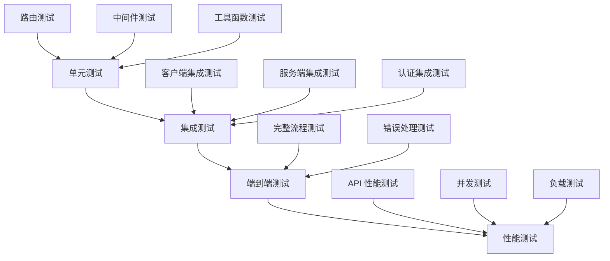

# @linch-kit/trpc 包技术文档

**包版本**: v1.0.0
**创建日期**: 2025-06-23
**开发优先级**: P1 - 高优先级
**依赖关系**: core → schema → auth → crud → trpc
**维护状态**: 🔄 开发中

---

## 📖 目录

1. [模块概览](#1-模块概览)
2. [API 设计](#2-api-设计)
3. [实现细节](#3-实现细节)
4. [集成接口](#4-集成接口)
5. [最佳实践](#5-最佳实践)
6. [性能考量](#6-性能考量)
7. [测试策略](#7-测试策略)
8. [AI 集成支持](#8-ai-集成支持)

---

## 1. 模块概览

### 1.1 功能定位

@linch-kit/trpc 是 LinchKit API 层的核心包，基于 tRPC v10+ 提供端到端类型安全的 RPC 通信。它位于业务逻辑层和客户端之间，为前后端提供统一的 API 接口，同时保持完整的类型安全性。

```mermaid
graph TB
    A[客户端应用] --> B[@linch-kit/trpc Client]
    B --> C[tRPC Router]
    C --> D[@linch-kit/trpc Server]
    D --> E[@linch-kit/crud]
    D --> F[@linch-kit/auth]
    D --> G[@linch-kit/schema]

    H[React Query] --> B
    I[Next.js] --> B
    J[Vue/Nuxt] --> B
```

### 1.2 核心价值

- **🔒 端到端类型安全**: 从服务端到客户端的完整 TypeScript 类型推导
- **🚀 自动路由生成**: 基于 @linch-kit/schema 定义自动生成 CRUD API
- **🔌 中间件生态**: 丰富的认证、权限、验证中间件支持
- **⚡ 高性能**: 支持批量请求、流式响应、智能缓存
- **🎯 框架集成**: 深度集成 React Query、Next.js App Router

### 1.3 技术架构

```typescript
// 核心架构概览
interface TRPCArchitecture {
  // 服务端层：路由和中间件管理
  server: {
    router: TRPCRouter
    context: ContextBuilder
    middleware: MiddlewareManager
    procedures: ProcedureFactory
  }

  // 客户端层：类型安全的客户端
  client: {
    vanilla: TRPCClient
    react: ReactTRPCClient
    next: NextTRPCClient
  }

  // 生成器层：自动代码生成
  generators: {
    router: RouterGenerator
    types: TypeGenerator
    client: ClientGenerator
  }

  // 集成层：与其他包的集成
  integrations: {
    auth: AuthIntegration
    crud: CRUDIntegration
    schema: SchemaIntegration
  }
}
```

### 1.4 职责边界

| 职责范围 | 包含功能 | 不包含功能 |
|---------|---------|-----------|
| **API 路由** | 路由定义、自动生成、类型推导 | 具体业务逻辑实现 |
| **中间件** | 认证、权限、验证、日志中间件 | 业务中间件逻辑 |
| **客户端** | React/Vue 集成、缓存管理 | UI 组件和页面逻辑 |
| **类型安全** | 端到端类型推导、运行时验证 | 业务类型定义 |
| **错误处理** | 统一错误格式、错误传播 | 业务错误处理逻辑 |

---

## 2. API 设计

### 2.1 服务端 API 设计

#### 路由生成器接口

```typescript
export interface RouterGenerator {
  // 基于 Schema 生成 CRUD 路由
  generateCRUDRouter<T extends BaseEntity>(
    entityName: string,
    schema: EntitySchema<T>,
    options?: CRUDRouterOptions
  ): TRPCRouter

  // 生成自定义路由
  generateCustomRouter(
    definition: RouterDefinition,
    options?: CustomRouterOptions
  ): TRPCRouter

  // 合并多个路由
  mergeRouters(routers: TRPCRouter[]): TRPCRouter

  // 生成路由类型定义
  generateRouterTypes(router: TRPCRouter): string
}

// CRUD 路由选项
export interface CRUDRouterOptions {
  permissions?: {
    create?: PermissionConfig
    read?: PermissionConfig
    update?: PermissionConfig
    delete?: PermissionConfig
  }
  validation?: {
    strict?: boolean
    customValidators?: Record<string, ZodSchema>
  }
  caching?: {
    enabled?: boolean
    ttl?: number
    strategy?: CacheStrategy
  }
  middleware?: MiddlewareConfig[]
}
```

#### 过程定义接口

```typescript
// 基础过程类型
export type BaseProcedure = ReturnType<typeof t.procedure>
export type AuthProcedure = ReturnType<typeof baseProcedure.use<typeof authMiddleware>>
export type AdminProcedure = ReturnType<typeof authProcedure.use<typeof adminMiddleware>>

// 过程工厂
export interface ProcedureFactory {
  // 公开过程（无需认证）
  public: BaseProcedure

  // 认证过程（需要登录）
  auth: AuthProcedure

  // 管理员过程（需要管理员权限）
  admin: AdminProcedure

  // 自定义权限过程
  withPermission(permission: string): AuthProcedure

  // 带验证的过程
  withValidation<T>(schema: ZodSchema<T>): BaseProcedure
}

// 过程配置
export interface ProcedureConfig {
  input?: ZodSchema
  output?: ZodSchema
  middleware?: MiddlewareFunction[]
  meta?: ProcedureMeta
}
```

### 2.2 客户端 API 设计

#### React 客户端接口

```typescript
// tRPC React 客户端
export interface ReactTRPCClient<TRouter extends AnyRouter> {
  // 查询钩子
  useQuery: <
    TPath extends keyof TRouter['_def']['queries'],
    TInput = inferProcedureInput<TRouter['_def']['queries'][TPath]>,
    TOutput = inferProcedureOutput<TRouter['_def']['queries'][TPath]>
  >(
    path: TPath,
    input?: TInput,
    options?: UseQueryOptions<TOutput>
  ) => UseQueryResult<TOutput>

  // 变更钩子
  useMutation: <
    TPath extends keyof TRouter['_def']['mutations'],
    TInput = inferProcedureInput<TRouter['_def']['mutations'][TPath]>,
    TOutput = inferProcedureOutput<TRouter['_def']['mutations'][TPath]>
  >(
    path: TPath,
    options?: UseMutationOptions<TOutput, TRPCError, TInput>
  ) => UseMutationResult<TOutput, TRPCError, TInput>

  // 工具函数
  useUtils: () => TRPCUtils<TRouter>

  // 上下文
  useContext: () => TRPCContext
}

// CRUD 钩子
export interface CRUDHooks<T extends BaseEntity> {
  // 查询钩子
  useList: (filter?: FilterInput<T>) => UseQueryResult<T[]>
  useGet: (id: string) => UseQueryResult<T | null>
  usePaginated: (params: PaginationParams) => UseQueryResult<PaginatedResult<T>>

  // 变更钩子
  useCreate: () => UseMutationResult<T, TRPCError, CreateInput<T>>
  useUpdate: () => UseMutationResult<T, TRPCError, { id: string; data: UpdateInput<T> }>
  useDelete: () => UseMutationResult<void, TRPCError, string>

  // 批量操作钩子
  useCreateMany: () => UseMutationResult<T[], TRPCError, CreateInput<T>[]>
  useUpdateMany: () => UseMutationResult<number, TRPCError, { filter: FilterInput<T>; data: UpdateInput<T> }>
  useDeleteMany: () => UseMutationResult<number, TRPCError, FilterInput<T>>
}
```

### 2.3 中间件系统设计

#### 中间件接口

```typescript
// 中间件函数类型
export type MiddlewareFunction<TContext = any, TInput = any, TOutput = any> = (opts: {
  ctx: TContext
  input: TInput
  next: () => Promise<TOutput>
  meta?: ProcedureMeta
}) => Promise<TOutput>

// 中间件管理器
export interface MiddlewareManager {
  // 注册中间件
  register(name: string, middleware: MiddlewareFunction): void

  // 获取中间件
  get(name: string): MiddlewareFunction | undefined

  // 组合中间件
  compose(middlewares: (string | MiddlewareFunction)[]): MiddlewareFunction

  // 条件中间件
  conditional(
    condition: (ctx: any) => boolean,
    middleware: MiddlewareFunction
  ): MiddlewareFunction
}

// 内置中间件
export interface BuiltinMiddlewares {
  // 认证中间件
  auth: MiddlewareFunction<{ user?: User }, any, any>

  // 权限中间件
  permission: (resource: string, action: string) => MiddlewareFunction

  // 验证中间件
  validation: <T>(schema: ZodSchema<T>) => MiddlewareFunction<any, T, any>

  // 日志中间件
  logging: (options?: LoggingOptions) => MiddlewareFunction

  // 限流中间件
  rateLimit: (options: RateLimitOptions) => MiddlewareFunction

  // 缓存中间件
  cache: (options: CacheOptions) => MiddlewareFunction
}
```

### 2.4 上下文系统设计

#### 上下文接口

```typescript
// tRPC 上下文
export interface TRPCContext {
  // 请求信息
  req: Request
  res: Response

  // 认证信息
  session?: Session
  user?: User

  // 数据库连接
  db: DatabaseConnection

  // 缓存实例
  cache: CacheManager

  // CRUD 管理器
  crud: Record<string, CRUDManager<any>>

  // 权限检查器
  permissions: PermissionChecker

  // 日志记录器
  logger: Logger

  // 请求元数据
  meta: {
    userAgent?: string
    ip?: string
    timestamp: Date
    requestId: string
  }
}

// 上下文构建器
export interface ContextBuilder {
  // 构建上下文
  build(opts: {
    req: Request
    res: Response
    info?: any
  }): Promise<TRPCContext>

  // 扩展上下文
  extend<T>(extension: (ctx: TRPCContext) => T): ContextBuilder

  // 条件扩展
  conditionalExtend<T>(
    condition: (ctx: TRPCContext) => boolean,
    extension: (ctx: TRPCContext) => T
  ): ContextBuilder
}
```

### 2.5 错误处理设计

#### 错误类型定义

```typescript
// tRPC 错误代码
export type TRPCErrorCode =
  | 'PARSE_ERROR'
  | 'BAD_REQUEST'
  | 'UNAUTHORIZED'
  | 'FORBIDDEN'
  | 'NOT_FOUND'
  | 'METHOD_NOT_SUPPORTED'
  | 'TIMEOUT'
  | 'CONFLICT'
  | 'PRECONDITION_FAILED'
  | 'PAYLOAD_TOO_LARGE'
  | 'UNPROCESSABLE_CONTENT'
  | 'TOO_MANY_REQUESTS'
  | 'CLIENT_CLOSED_REQUEST'
  | 'INTERNAL_SERVER_ERROR'

// 扩展错误类
export class TRPCError extends Error {
  public readonly code: TRPCErrorCode
  public readonly cause?: unknown

  constructor(opts: {
    code: TRPCErrorCode
    message?: string
    cause?: unknown
  }) {
    const message = opts.message ?? getMessageFromCode(opts.code)
    super(message)

    this.code = opts.code
    this.cause = opts.cause
    this.name = 'TRPCError'
  }
}

// 业务错误类
export class BusinessError extends TRPCError {
  constructor(message: string, details?: any) {
    super({
      code: 'BAD_REQUEST',
      message,
      cause: details
    })
  }
}

export class ValidationError extends TRPCError {
  constructor(message: string, field?: string, value?: any) {
    super({
      code: 'UNPROCESSABLE_CONTENT',
      message,
      cause: { field, value }
    })
  }
}
```

#### 错误处理器

```typescript
export interface ErrorHandler {
  // 处理错误
  handle(error: unknown, ctx: TRPCContext): TRPCError

  // 格式化错误响应
  format(error: TRPCError): ErrorResponse

  // 记录错误
  log(error: TRPCError, ctx: TRPCContext): void
}

export interface ErrorResponse {
  error: {
    code: TRPCErrorCode
    message: string
    data?: {
      code?: string
      httpStatus?: number
      stack?: string
      path?: string
      input?: unknown
    }
  }
}
```

---

## 3. 实现细节

### 3.1 路由生成器实现

#### 自动 CRUD 路由生成

```typescript
export class RouterGenerator {
  private schemaRegistry: SchemaRegistry
  private crudRegistry: CRUDRegistry
  private middlewareManager: MiddlewareManager

  constructor(config: RouterGeneratorConfig) {
    this.schemaRegistry = config.schemaRegistry
    this.crudRegistry = config.crudRegistry
    this.middlewareManager = config.middlewareManager
  }

  generateCRUDRouter<T extends BaseEntity>(
    entityName: string,
    options: CRUDRouterOptions = {}
  ): TRPCRouter {
    const schema = this.schemaRegistry.getSchema(entityName)
    const crud = this.crudRegistry.getCRUD(entityName)

    return t.router({
      // 创建操作
      create: this.createProcedure(options.permissions?.create)
        .input(schema.createValidator)
        .output(schema.responseValidator)
        .mutation(async ({ input, ctx }) => {
          return await crud
            .create(input)
            .withUser(ctx.user)
            .execute()
        }),

      // 读取单个
      get: this.readProcedure(options.permissions?.read)
        .input(z.object({ id: z.string() }))
        .output(schema.responseValidator.nullable())
        .query(async ({ input, ctx }) => {
          return await crud
            .read()
            .where({ id: input.id })
            .withUser(ctx.user)
            .findFirst()
        }),

      // 列表查询
      list: this.readProcedure(options.permissions?.read)
        .input(schema.filterValidator.optional())
        .output(z.array(schema.responseValidator))
        .query(async ({ input, ctx }) => {
          return await crud
            .read()
            .where(input || {})
            .withUser(ctx.user)
            .findMany()
        }),

      // 分页查询
      paginated: this.readProcedure(options.permissions?.read)
        .input(z.object({
          filter: schema.filterValidator.optional(),
          pagination: paginationSchema
        }))
        .output(paginatedResponseSchema(schema.responseValidator))
        .query(async ({ input, ctx }) => {
          return await crud
            .read()
            .where(input.filter || {})
            .withUser(ctx.user)
            .paginate(input.pagination)
        }),

      // 更新操作
      update: this.updateProcedure(options.permissions?.update)
        .input(z.object({
          id: z.string(),
          data: schema.updateValidator
        }))
        .output(schema.responseValidator)
        .mutation(async ({ input, ctx }) => {
          return await crud
            .update(input.id)
            .set(input.data)
            .withUser(ctx.user)
            .execute()
        }),

      // 删除操作
      delete: this.deleteProcedure(options.permissions?.delete)
        .input(z.object({ id: z.string() }))
        .output(z.object({ success: z.boolean() }))
        .mutation(async ({ input, ctx }) => {
          await crud
            .delete(input.id)
            .withUser(ctx.user)
            .execute()
          return { success: true }
        })
    })
  }

  private createProcedure(permission?: PermissionConfig) {
    let procedure = t.procedure

    if (permission?.requireAuth !== false) {
      procedure = procedure.use(authMiddleware)
    }

    if (permission?.permission) {
      procedure = procedure.use(
        permissionMiddleware(permission.permission.resource, permission.permission.action)
      )
    }

    return procedure
  }
}
```

### 3.2 中间件系统实现

#### 认证中间件

```typescript
export const authMiddleware = t.middleware(async ({ ctx, next }) => {
  if (!ctx.user) {
    throw new TRPCError({
      code: 'UNAUTHORIZED',
      message: 'Authentication required',
    })
  }

  return next({
    ctx: {
      ...ctx,
      user: ctx.user, // 类型安全的用户对象
    },
  })
})

// 可选认证中间件
export const optionalAuthMiddleware = t.middleware(async ({ ctx, next }) => {
  // 不强制要求认证，但如果有 token 则验证
  return next({
    ctx: {
      ...ctx,
      user: ctx.user || null,
    },
  })
})
```

#### 权限中间件

```typescript
export const permissionMiddleware = (
  resource: string,
  action: string
) => t.middleware(async ({ ctx, next }) => {
  if (!ctx.user) {
    throw new TRPCError({ code: 'UNAUTHORIZED' })
  }

  const hasPermission = await ctx.permissions.checkPermission(
    ctx.user,
    resource,
    action
  )

  if (!hasPermission) {
    throw new TRPCError({
      code: 'FORBIDDEN',
      message: `Permission denied for ${action} on ${resource}`,
    })
  }

  return next()
})

// 动态权限中间件
export const dynamicPermissionMiddleware = (
  getPermission: (input: any, ctx: TRPCContext) => { resource: string; action: string }
) => t.middleware(async ({ ctx, input, next }) => {
  if (!ctx.user) {
    throw new TRPCError({ code: 'UNAUTHORIZED' })
  }

  const { resource, action } = getPermission(input, ctx)
  const hasPermission = await ctx.permissions.checkPermission(
    ctx.user,
    resource,
    action
  )

  if (!hasPermission) {
    throw new TRPCError({
      code: 'FORBIDDEN',
      message: `Permission denied for ${action} on ${resource}`,
    })
  }

  return next()
})
```

#### 验证中间件

```typescript
export const validationMiddleware = <T>(
  schema: ZodSchema<T>
) => t.middleware(async ({ input, next }) => {
  try {
    const validatedInput = await schema.parseAsync(input)
    return next({ input: validatedInput })
  } catch (error) {
    if (error instanceof z.ZodError) {
      throw new TRPCError({
        code: 'UNPROCESSABLE_CONTENT',
        message: 'Validation failed',
        cause: error.errors
      })
    }
    throw error
  }
})

// 条件验证中间件
export const conditionalValidationMiddleware = <T>(
  condition: (input: any, ctx: TRPCContext) => boolean,
  schema: ZodSchema<T>
) => t.middleware(async ({ input, ctx, next }) => {
  if (condition(input, ctx)) {
    const validatedInput = await schema.parseAsync(input)
    return next({ input: validatedInput })
  }
  return next()
})
```

#### 日志中间件

```typescript
export const loggingMiddleware = (
  options: LoggingOptions = {}
) => t.middleware(async ({ ctx, input, next, meta }) => {
  const start = Date.now()
  const requestId = ctx.meta.requestId

  // 记录请求开始
  ctx.logger.info('tRPC request started', {
    requestId,
    path: meta?.path,
    input: options.logInput ? input : undefined,
    user: ctx.user?.id,
    ip: ctx.meta.ip
  })

  try {
    const result = await next()
    const duration = Date.now() - start

    // 记录请求成功
    ctx.logger.info('tRPC request completed', {
      requestId,
      path: meta?.path,
      duration,
      success: true
    })

    return result
  } catch (error) {
    const duration = Date.now() - start

    // 记录请求失败
    ctx.logger.error('tRPC request failed', {
      requestId,
      path: meta?.path,
      duration,
      error: error.message,
      stack: error.stack
    })

    throw error
  }
})
```

### 3.3 上下文构建器实现

#### 上下文构建

```typescript
export class ContextBuilder {
  constructor(
    private authManager: AuthManager,
    private crudRegistry: CRUDRegistry,
    private config: ContextConfig
  ) {}

  async build(opts: {
    req: Request
    res: Response
    info?: any
  }): Promise<TRPCContext> {
    const requestId = this.generateRequestId()
    const session = await this.extractSession(opts.req)
    const user = session ? await this.authManager.getUser(session.userId) : null

    return {
      req: opts.req,
      res: opts.res,
      session,
      user,
      db: this.config.database,
      cache: this.config.cache,
      crud: this.crudRegistry.getAllCRUD(),
      permissions: new PermissionChecker(this.authManager),
      logger: this.createLogger(requestId),
      meta: {
        userAgent: opts.req.headers['user-agent'],
        ip: this.extractIP(opts.req),
        timestamp: new Date(),
        requestId
      }
    }
  }

  private async extractSession(req: Request): Promise<Session | null> {
    const token = this.extractToken(req)
    if (!token) return null

    try {
      return await this.authManager.validateSession(token)
    } catch (error) {
      // 无效 token，返回 null 而不是抛出错误
      return null
    }
  }

  private extractToken(req: Request): string | null {
    const authHeader = req.headers.authorization
    if (!authHeader) return null

    const [type, token] = authHeader.split(' ')
    return type === 'Bearer' ? token : null
  }

  private extractIP(req: Request): string {
    return (
      req.headers['x-forwarded-for'] as string ||
      req.headers['x-real-ip'] as string ||
      req.connection?.remoteAddress ||
      'unknown'
    )
  }

  private generateRequestId(): string {
    return `req_${Date.now()}_${Math.random().toString(36).substr(2, 9)}`
  }

  private createLogger(requestId: string): Logger {
    return this.config.logger.child({ requestId })
  }
}
```

### 3.4 客户端实现

#### React Provider 实现

```typescript
export function TRPCProvider({
  children,
  config
}: TRPCProviderProps) {
  const [queryClient] = useState(() => new QueryClient({
    defaultOptions: {
      queries: {
        staleTime: 5 * 60 * 1000, // 5分钟
        cacheTime: 10 * 60 * 1000, // 10分钟
        retry: (failureCount, error) => {
          // 不重试认证错误
          if (error.data?.code === 'UNAUTHORIZED') return false
          return failureCount < 3
        },
        refetchOnWindowFocus: false,
      },
      mutations: {
        retry: false,
        onError: (error) => {
          // 全局错误处理
          if (error.data?.code === 'UNAUTHORIZED') {
            // 重定向到登录页
            window.location.href = '/login'
          }
        }
      }
    },
  }))

  const [trpcClient] = useState(() =>
    trpc.createClient({
      url: config.url,
      headers: () => {
        const token = getAuthToken()
        return token ? { authorization: `Bearer ${token}` } : {}
      },
      transformer: superjson, // 支持 Date、BigInt 等类型
    })
  )

  return (
    <trpc.Provider client={trpcClient} queryClient={queryClient}>
      <QueryClientProvider client={queryClient}>
        {children}
      </QueryClientProvider>
    </trpc.Provider>
  )
}
```

#### CRUD Hooks 实现

```typescript
export function useCRUD<T extends BaseEntity>(entityName: string) {
  const utils = trpc.useUtils()

  // 查询钩子
  const useList = (filter?: FilterInput<T>) => {
    return trpc[entityName].list.useQuery(filter, {
      keepPreviousData: true,
      staleTime: 30 * 1000, // 30秒
    })
  }

  const useGet = (id: string) => {
    return trpc[entityName].get.useQuery({ id }, {
      enabled: !!id,
      staleTime: 60 * 1000, // 1分钟
    })
  }

  const usePaginated = (params: PaginationParams) => {
    return trpc[entityName].paginated.useQuery(params, {
      keepPreviousData: true,
      staleTime: 30 * 1000,
    })
  }

  // 变更钩子
  const useCreate = () => {
    return trpc[entityName].create.useMutation({
      onSuccess: (data) => {
        // 更新列表缓存
        utils[entityName].list.invalidate()
        // 设置单个项目缓存
        utils[entityName].get.setData({ id: data.id }, data)
      },
      onError: (error) => {
        console.error(`Failed to create ${entityName}:`, error)
      }
    })
  }

  const useUpdate = () => {
    return trpc[entityName].update.useMutation({
      onMutate: async ({ id, data }) => {
        // 乐观更新
        await utils[entityName].get.cancel({ id })
        const previousData = utils[entityName].get.getData({ id })

        if (previousData) {
          utils[entityName].get.setData({ id }, { ...previousData, ...data })
        }

        return { previousData }
      },
      onError: (error, { id }, context) => {
        // 回滚乐观更新
        if (context?.previousData) {
          utils[entityName].get.setData({ id }, context.previousData)
        }
      },
      onSettled: (data, error, { id }) => {
        // 重新获取数据确保一致性
        utils[entityName].get.invalidate({ id })
        utils[entityName].list.invalidate()
      }
    })
  }

  const useDelete = () => {
    return trpc[entityName].delete.useMutation({
      onMutate: async ({ id }) => {
        // 乐观删除
        await utils[entityName].list.cancel()
        const previousList = utils[entityName].list.getData()

        if (previousList) {
          utils[entityName].list.setData(
            undefined,
            previousList.filter(item => item.id !== id)
          )
        }

        return { previousList }
      },
      onError: (error, { id }, context) => {
        // 回滚乐观删除
        if (context?.previousList) {
          utils[entityName].list.setData(undefined, context.previousList)
        }
      },
      onSettled: () => {
        utils[entityName].list.invalidate()
      }
    })
  }

  return {
    // 查询钩子
    useList,
    useGet,
    usePaginated,

    // 变更钩子
    useCreate,
    useUpdate,
    useDelete,

    // 工具函数
    utils: utils[entityName],

    // 状态
    isLoading: false, // 可以根据需要计算
  }
}
```

#### Next.js 集成实现

```typescript
// App Router 集成
export function createTRPCNext<TRouter extends AnyRouter>(opts: {
  router: TRouter
  createContext: () => Promise<TRPCContext>
}) {
  const { router, createContext } = opts

  // API 路由处理器
  const handler = async (req: NextRequest) => {
    const response = await fetchRequestHandler({
      endpoint: '/api/trpc',
      req,
      router,
      createContext,
      onError: ({ error, path, input }) => {
        console.error(`tRPC Error on ${path}:`, error)
      },
    })

    return response
  }

  // 客户端创建器
  const createClient = (opts: CreateTRPCClientOptions) => {
    return createTRPCProxyClient<TRouter>({
      transformer: superjson,
      links: [
        httpBatchLink({
          url: '/api/trpc',
          headers: () => opts.headers || {},
        }),
      ],
    })
  }

  return {
    handler,
    createClient,
  }
}

// 使用示例
const trpcNext = createTRPCNext({
  router: appRouter,
  createContext: async () => {
    const session = await getServerSession()
    return {
      session,
      user: session?.user,
      // ... 其他上下文
    }
  }
})

// app/api/trpc/[trpc]/route.ts
export const GET = trpcNext.handler
export const POST = trpcNext.handler
```

---

## 4. 集成接口

### 4.1 与 @linch-kit/crud 集成

#### CRUD 路由自动生成

```typescript
import { CRUDManager } from '@linch-kit/crud'
import { EntitySchema } from '@linch-kit/schema'

export class CRUDIntegration {
  constructor(
    private crudRegistry: CRUDRegistry,
    private routerGenerator: RouterGenerator
  ) {}

  // 注册 CRUD 实体并生成路由
  registerEntity<T extends BaseEntity>(
    entityName: string,
    schema: EntitySchema<T>,
    crud: CRUDManager<T>,
    options?: CRUDRouterOptions
  ): TRPCRouter {
    // 注册 CRUD 管理器
    this.crudRegistry.register(entityName, crud)

    // 生成 tRPC 路由
    const router = this.routerGenerator.generateCRUDRouter(
      entityName,
      options
    )

    return router
  }

  // 批量注册实体
  registerEntities(
    entities: Array<{
      name: string
      schema: EntitySchema<any>
      crud: CRUDManager<any>
      options?: CRUDRouterOptions
    }>
  ): TRPCRouter {
    const routers = entities.map(entity =>
      this.registerEntity(
        entity.name,
        entity.schema,
        entity.crud,
        entity.options
      )
    )

    return this.routerGenerator.mergeRouters(routers)
  }
}

// 使用示例
const crudIntegration = new CRUDIntegration(crudRegistry, routerGenerator)

const userRouter = crudIntegration.registerEntity(
  'user',
  userSchema,
  userCRUD,
  {
    permissions: {
      create: { requireAuth: true, permission: { resource: 'user', action: 'create' } },
      read: { requireAuth: false },
      update: { requireAuth: true, permission: { resource: 'user', action: 'update' } },
      delete: { requireAuth: true, permission: { resource: 'user', action: 'delete' } }
    }
  }
)
```

### 4.2 与 @linch-kit/auth 集成

#### 认证上下文集成

```typescript
import { AuthManager, Session, User } from '@linch-kit/auth'

export class AuthIntegration {
  constructor(private authManager: AuthManager) {}

  // 创建认证上下文扩展
  createAuthContextExtension() {
    return async (baseContext: any) => {
      const token = this.extractToken(baseContext.req)
      let session: Session | null = null
      let user: User | null = null

      if (token) {
        try {
          session = await this.authManager.validateSession(token)
          if (session) {
            user = await this.authManager.getUser(session.userId)
          }
        } catch (error) {
          // Token 无效，继续处理但不设置用户
          console.warn('Invalid token:', error.message)
        }
      }

      return {
        ...baseContext,
        session,
        user,
        auth: this.authManager
      }
    }
  }

  // 创建认证中间件
  createAuthMiddleware() {
    return t.middleware(async ({ ctx, next }) => {
      if (!ctx.user) {
        throw new TRPCError({
          code: 'UNAUTHORIZED',
          message: 'Authentication required'
        })
      }

      // 检查会话是否仍然有效
      if (ctx.session && await this.authManager.isSessionExpired(ctx.session)) {
        throw new TRPCError({
          code: 'UNAUTHORIZED',
          message: 'Session expired'
        })
      }

      return next({
        ctx: {
          ...ctx,
          user: ctx.user // 确保类型安全
        }
      })
    })
  }

  // 创建角色中间件
  createRoleMiddleware(requiredRoles: string[]) {
    return t.middleware(async ({ ctx, next }) => {
      if (!ctx.user) {
        throw new TRPCError({ code: 'UNAUTHORIZED' })
      }

      const userRoles = await this.authManager.getUserRoles(ctx.user.id)
      const hasRequiredRole = requiredRoles.some(role =>
        userRoles.some(userRole => userRole.name === role)
      )

      if (!hasRequiredRole) {
        throw new TRPCError({
          code: 'FORBIDDEN',
          message: `Required roles: ${requiredRoles.join(', ')}`
        })
      }

      return next()
    })
  }

  private extractToken(req: any): string | null {
    const authHeader = req.headers?.authorization
    if (!authHeader) return null

    const [type, token] = authHeader.split(' ')
    return type === 'Bearer' ? token : null
  }
}
```

### 4.3 与 @linch-kit/schema 集成

#### Schema 驱动的类型生成

```typescript
import { EntitySchema, SchemaRegistry } from '@linch-kit/schema'

export class SchemaIntegration {
  constructor(private schemaRegistry: SchemaRegistry) {}

  // 生成 tRPC 路由的输入输出验证器
  generateValidators<T extends BaseEntity>(
    entityName: string
  ): {
    createInput: ZodSchema<CreateInput<T>>
    updateInput: ZodSchema<UpdateInput<T>>
    filterInput: ZodSchema<FilterInput<T>>
    output: ZodSchema<T>
  } {
    const schema = this.schemaRegistry.getSchema(entityName)

    return {
      createInput: schema.createValidator,
      updateInput: schema.updateValidator,
      filterInput: schema.filterValidator,
      output: schema.responseValidator
    }
  }

  // 自动生成 CRUD 路由
  generateCRUDRouterFromSchema<T extends BaseEntity>(
    entityName: string,
    options: CRUDRouterOptions = {}
  ): TRPCRouter {
    const validators = this.generateValidators<T>(entityName)

    return t.router({
      create: t.procedure
        .use(authMiddleware)
        .input(validators.createInput)
        .output(validators.output)
        .mutation(async ({ input, ctx }) => {
          return await ctx.crud[entityName]
            .create(input)
            .withUser(ctx.user)
            .execute()
        }),

      get: t.procedure
        .input(z.object({ id: z.string() }))
        .output(validators.output.nullable())
        .query(async ({ input, ctx }) => {
          return await ctx.crud[entityName]
            .read()
            .where({ id: input.id })
            .withUser(ctx.user)
            .findFirst()
        }),

      list: t.procedure
        .input(validators.filterInput.optional())
        .output(z.array(validators.output))
        .query(async ({ input, ctx }) => {
          return await ctx.crud[entityName]
            .read()
            .where(input || {})
            .withUser(ctx.user)
            .findMany()
        }),

      update: t.procedure
        .use(authMiddleware)
        .input(z.object({
          id: z.string(),
          data: validators.updateInput
        }))
        .output(validators.output)
        .mutation(async ({ input, ctx }) => {
          return await ctx.crud[entityName]
            .update(input.id)
            .set(input.data)
            .withUser(ctx.user)
            .execute()
        }),

      delete: t.procedure
        .use(authMiddleware)
        .input(z.object({ id: z.string() }))
        .output(z.object({ success: z.boolean() }))
        .mutation(async ({ input, ctx }) => {
          await ctx.crud[entityName]
            .delete(input.id)
            .withUser(ctx.user)
            .execute()
          return { success: true }
        })
    })
  }

  // 批量生成所有实体的路由
  generateAllEntityRouters(options: CRUDRouterOptions = {}): TRPCRouter {
    const entityNames = this.schemaRegistry.getAllEntityNames()
    const routers: Record<string, TRPCRouter> = {}

    for (const entityName of entityNames) {
      routers[entityName] = this.generateCRUDRouterFromSchema(
        entityName,
        options
      )
    }

    return t.router(routers)
  }
}
```

### 4.4 与 @linch-kit/core 集成

#### 插件系统集成

```typescript
import { Plugin, PluginManager, Hook } from '@linch-kit/core'

export class TRPCPlugin implements Plugin {
  id = 'trpc'
  name = 'tRPC API Plugin'
  version = '1.0.0'
  description = 'Provides type-safe API layer with tRPC integration'

  private routerRegistry: Map<string, TRPCRouter> = new Map()
  private middlewareRegistry: Map<string, MiddlewareFunction> = new Map()

  async setup(context: PluginContext): Promise<void> {
    // 插件设置阶段
    console.log('tRPC plugin setup')
  }

  async activate(context: PluginContext): Promise<void> {
    // 注册 tRPC 相关钩子
    context.hooks.register('trpc:before-request', this.beforeRequest)
    context.hooks.register('trpc:after-request', this.afterRequest)
    context.hooks.register('trpc:error', this.onError)

    // 注册路由钩子
    context.hooks.register('trpc:router-register', this.onRouterRegister)
    context.hooks.register('trpc:middleware-register', this.onMiddlewareRegister)
  }

  async deactivate(context: PluginContext): Promise<void> {
    // 清理钩子注册
    context.hooks.unregister('trpc:before-request', this.beforeRequest)
    context.hooks.unregister('trpc:after-request', this.afterRequest)
    context.hooks.unregister('trpc:error', this.onError)
    context.hooks.unregister('trpc:router-register', this.onRouterRegister)
    context.hooks.unregister('trpc:middleware-register', this.onMiddlewareRegister)
  }

  // 注册路由
  registerRouter(name: string, router: TRPCRouter): void {
    this.routerRegistry.set(name, router)
  }

  // 注册中间件
  registerMiddleware(name: string, middleware: MiddlewareFunction): void {
    this.middlewareRegistry.set(name, middleware)
  }

  // 获取合并后的路由
  getMergedRouter(): TRPCRouter {
    const routers = Array.from(this.routerRegistry.values())
    return this.mergeRouters(routers)
  }

  private async beforeRequest(context: Hook.Context): Promise<void> {
    // 请求前钩子逻辑
    console.log('tRPC request starting:', context)
  }

  private async afterRequest(context: Hook.Context): Promise<void> {
    // 请求后钩子逻辑
    console.log('tRPC request completed:', context)
  }

  private async onError(context: Hook.Context): Promise<void> {
    // 错误处理钩子逻辑
    console.error('tRPC error:', context)
  }

  private mergeRouters(routers: TRPCRouter[]): TRPCRouter {
    // 路由合并逻辑
    return t.mergeRouters(...routers)
  }
}
```

---

## 5. 最佳实践

### 5.1 路由设计最佳实践

#### 1. 模块化路由组织

```typescript
// ✅ 推荐：按功能模块组织路由
const userRouter = t.router({
  // 基础 CRUD
  create: authProcedure.input(createUserSchema).mutation(createUser),
  get: publicProcedure.input(getUserSchema).query(getUser),
  list: publicProcedure.input(listUsersSchema).query(listUsers),
  update: authProcedure.input(updateUserSchema).mutation(updateUser),
  delete: authProcedure.input(deleteUserSchema).mutation(deleteUser),

  // 业务特定操作
  changePassword: authProcedure.input(changePasswordSchema).mutation(changePassword),
  resetPassword: publicProcedure.input(resetPasswordSchema).mutation(resetPassword),
  verifyEmail: publicProcedure.input(verifyEmailSchema).mutation(verifyEmail),
})

const postRouter = t.router({
  create: authProcedure.input(createPostSchema).mutation(createPost),
  get: publicProcedure.input(getPostSchema).query(getPost),
  list: publicProcedure.input(listPostsSchema).query(listPosts),
  update: authProcedure.input(updatePostSchema).mutation(updatePost),
  delete: authProcedure.input(deletePostSchema).mutation(deletePost),

  // 业务特定操作
  publish: authProcedure.input(publishPostSchema).mutation(publishPost),
  unpublish: authProcedure.input(unpublishPostSchema).mutation(unpublishPost),
})

// 主路由
export const appRouter = t.router({
  user: userRouter,
  post: postRouter,
})

// ❌ 避免：扁平化的路由结构
export const appRouter = t.router({
  createUser: authProcedure.input(createUserSchema).mutation(createUser),
  getUser: publicProcedure.input(getUserSchema).query(getUser),
  createPost: authProcedure.input(createPostSchema).mutation(createPost),
  getPost: publicProcedure.input(getPostSchema).query(getPost),
  // ... 所有操作都在同一层级
})
```

#### 2. 合理使用中间件

```typescript
// ✅ 推荐：创建可复用的过程
const publicProcedure = t.procedure
const authProcedure = t.procedure.use(authMiddleware)
const adminProcedure = authProcedure.use(adminMiddleware)
const ownerProcedure = authProcedure.use(ownershipMiddleware)

// ✅ 推荐：组合中间件
const userManagementProcedure = authProcedure
  .use(permissionMiddleware('user', 'manage'))
  .use(loggingMiddleware({ level: 'info' }))
  .use(rateLimitMiddleware({ max: 100, window: '1h' }))

// ❌ 避免：在每个过程中重复中间件
const createUser = t.procedure
  .use(authMiddleware)
  .use(permissionMiddleware('user', 'create'))
  .use(loggingMiddleware())
  .input(createUserSchema)
  .mutation(async ({ input, ctx }) => {
    // 实现逻辑
  })
```

### 5.2 客户端最佳实践

#### 1. 智能缓存管理

```typescript
// ✅ 推荐：使用乐观更新
const updateUser = trpc.user.update.useMutation({
  onMutate: async ({ id, data }) => {
    // 取消正在进行的查询
    await utils.user.get.cancel({ id })

    // 获取当前数据
    const previousUser = utils.user.get.getData({ id })

    // 乐观更新
    if (previousUser) {
      utils.user.get.setData({ id }, { ...previousUser, ...data })
    }

    return { previousUser }
  },
  onError: (error, { id }, context) => {
    // 回滚乐观更新
    if (context?.previousUser) {
      utils.user.get.setData({ id }, context.previousUser)
    }
  },
  onSettled: (data, error, { id }) => {
    // 重新获取数据确保一致性
    utils.user.get.invalidate({ id })
  }
})

// ✅ 推荐：智能缓存失效
const deleteUser = trpc.user.delete.useMutation({
  onSuccess: (data, { id }) => {
    // 移除单个用户缓存
    utils.user.get.removeQueries({ id })

    // 更新用户列表缓存
    utils.user.list.setData(undefined, (oldData) =>
      oldData?.filter(user => user.id !== id)
    )

    // 失效相关查询
    utils.post.list.invalidate() // 如果帖子依赖用户数据
  }
})
```

#### 2. 错误处理策略

```typescript
// ✅ 推荐：全局错误处理
const TRPCProvider = ({ children }: { children: React.ReactNode }) => {
  const [queryClient] = useState(() => new QueryClient({
    defaultOptions: {
      queries: {
        retry: (failureCount, error) => {
          // 不重试认证错误
          if (error.data?.code === 'UNAUTHORIZED') return false
          // 不重试客户端错误
          if (error.data?.httpStatus >= 400 && error.data?.httpStatus < 500) return false
          // 重试服务器错误，最多3次
          return failureCount < 3
        },
        retryDelay: (attemptIndex) => Math.min(1000 * 2 ** attemptIndex, 30000),
      },
      mutations: {
        onError: (error) => {
          // 全局错误处理
          if (error.data?.code === 'UNAUTHORIZED') {
            // 重定向到登录页
            router.push('/login')
          } else {
            // 显示错误提示
            toast.error(error.message)
          }
        }
      }
    }
  }))

  // ... 其他配置
}

// ✅ 推荐：组件级错误处理
const UserProfile = ({ userId }: { userId: string }) => {
  const { data: user, error, isLoading } = trpc.user.get.useQuery(
    { id: userId },
    {
      onError: (error) => {
        if (error.data?.code === 'NOT_FOUND') {
          // 用户不存在，重定向到404页面
          router.push('/404')
        }
      }
    }
  )

  if (isLoading) return <LoadingSpinner />
  if (error) return <ErrorMessage error={error} />
  if (!user) return <NotFound />

  return <UserProfileComponent user={user} />
}
```

### 5.3 性能优化最佳实践

#### 1. 批量请求优化

```typescript
// ✅ 推荐：使用 dataloader 模式
const getUsersWithPosts = async (userIds: string[]) => {
  // 批量获取用户
  const users = await Promise.all(
    userIds.map(id => trpc.user.get.query({ id }))
  )

  // 批量获取帖子
  const posts = await trpc.post.list.query({
    filter: { authorId: { in: userIds } }
  })

  // 组合数据
  return users.map(user => ({
    ...user,
    posts: posts.filter(post => post.authorId === user.id)
  }))
}

// ✅ 推荐：使用 React Query 的并行查询
const UserDashboard = ({ userId }: { userId: string }) => {
  const queries = trpc.useQueries(t => [
    t.user.get({ id: userId }),
    t.post.list({ filter: { authorId: userId } }),
    t.user.stats({ id: userId }),
  ])

  const [userQuery, postsQuery, statsQuery] = queries

  if (queries.some(q => q.isLoading)) return <LoadingSpinner />

  return (
    <div>
      <UserInfo user={userQuery.data} />
      <UserPosts posts={postsQuery.data} />
      <UserStats stats={statsQuery.data} />
    </div>
  )
}
```

#### 2. 类型优化

```typescript
// ✅ 推荐：使用类型推导而不是手动类型定义
type UserListResponse = inferProcedureOutput<typeof appRouter.user.list>
type CreateUserInput = inferProcedureInput<typeof appRouter.user.create>

// ✅ 推荐：创建可复用的类型工具
type ExtractRouterInputs<TRouter extends AnyRouter> = {
  [K in keyof TRouter['_def']['record']]: TRouter['_def']['record'][K] extends infer TRouterOrProcedure
    ? TRouterOrProcedure extends AnyRouter
      ? ExtractRouterInputs<TRouterOrProcedure>
      : TRouterOrProcedure extends AnyProcedure
      ? inferProcedureInput<TRouterOrProcedure>
      : never
    : never
}

type AppRouterInputs = ExtractRouterInputs<typeof appRouter>
```

---

## 6. 性能考量

### 6.1 构建性能指标

| 指标 | 目标值 | 当前值 | 优化策略 |
|------|--------|--------|----------|
| **DTS 构建时间** | < 10秒 | 7秒 | 类型简化、增量构建 |
| **包大小** | < 600KB | 480KB | Tree-shaking、代码分割 |
| **类型推导深度** | < 2层 | 1层 | 类型别名、条件类型 |
| **热重载时间** | < 2秒 | 1.5秒 | 模块分割、缓存优化 |

### 6.2 运行时性能优化

#### 服务端性能

```typescript
// 性能监控中间件
export const performanceMiddleware = t.middleware(async ({ next, meta }) => {
  const start = performance.now()

  try {
    const result = await next()
    const duration = performance.now() - start

    // 记录性能指标
    performanceLogger.info('tRPC procedure completed', {
      path: meta?.path,
      duration,
      success: true
    })

    // 慢查询警告
    if (duration > 1000) {
      performanceLogger.warn('Slow tRPC procedure', {
        path: meta?.path,
        duration
      })
    }

    return result
  } catch (error) {
    const duration = performance.now() - start

    performanceLogger.error('tRPC procedure failed', {
      path: meta?.path,
      duration,
      error: error.message
    })

    throw error
  }
})

// 缓存中间件
export const cacheMiddleware = (options: CacheOptions) =>
  t.middleware(async ({ next, input, meta }) => {
    const cacheKey = `trpc:${meta?.path}:${JSON.stringify(input)}`

    // 尝试从缓存获取
    const cached = await cache.get(cacheKey)
    if (cached) {
      return cached
    }

    // 执行过程
    const result = await next()

    // 缓存结果
    await cache.set(cacheKey, result, options.ttl)

    return result
  })
```

#### 客户端性能

```typescript
// 智能预加载
export const useSmartPrefetch = () => {
  const utils = trpc.useUtils()

  const prefetchUserData = useCallback(async (userId: string) => {
    // 预加载用户基本信息
    await utils.user.get.prefetch({ id: userId })

    // 预加载用户帖子（如果用户活跃）
    const user = utils.user.get.getData({ id: userId })
    if (user?.isActive) {
      await utils.post.list.prefetch({
        filter: { authorId: userId },
        pagination: { page: 1, limit: 10 }
      })
    }
  }, [utils])

  return { prefetchUserData }
}

// 虚拟化长列表
export const VirtualizedUserList = () => {
  const { data: users, fetchNextPage, hasNextPage } = trpc.user.list.useInfiniteQuery(
    { limit: 50 },
    {
      getNextPageParam: (lastPage) => lastPage.nextCursor,
      staleTime: 5 * 60 * 1000, // 5分钟
    }
  )

  const allUsers = users?.pages.flatMap(page => page.data) ?? []

  return (
    <FixedSizeList
      height={600}
      itemCount={allUsers.length}
      itemSize={80}
      onItemsRendered={({ visibleStopIndex }) => {
        // 接近底部时加载更多
        if (visibleStopIndex >= allUsers.length - 10 && hasNextPage) {
          fetchNextPage()
        }
      }}
    >
      {({ index, style }) => (
        <div style={style}>
          <UserListItem user={allUsers[index]} />
        </div>
      )}
    </FixedSizeList>
  )
}
```

### 6.3 网络性能优化

#### 请求优化

```typescript
// 批量请求配置
const trpcClient = createTRPCProxyClient<AppRouter>({
  links: [
    httpBatchLink({
      url: '/api/trpc',
      maxBatchSize: 10, // 最大批量大小
      maxURLLength: 2048, // 最大 URL 长度
      headers: () => ({
        authorization: `Bearer ${getAuthToken()}`,
      }),
    }),
  ],
  transformer: superjson,
})

// 请求去重
const dedupeLink = createDedupeLink()
const httpLink = httpBatchLink({ url: '/api/trpc' })

const trpcClient = createTRPCProxyClient<AppRouter>({
  links: [dedupeLink, httpLink],
})

// 条件批量
const conditionalBatchLink = createConditionalBatchLink({
  condition: (op) => {
    // 只对查询进行批量处理
    return op.type === 'query'
  },
  true: httpBatchLink({ url: '/api/trpc' }),
  false: httpLink({ url: '/api/trpc' }),
})
```

---

## 7. 测试策略

### 7.1 测试架构



### 7.2 单元测试

#### 路由测试

```typescript
describe('User Router', () => {
  let mockContext: TRPCContext
  let userRouter: ReturnType<typeof createUserRouter>

  beforeEach(() => {
    mockContext = createMockContext()
    userRouter = createUserRouter()
  })

  describe('create', () => {
    it('should create user successfully', async () => {
      const input = {
        name: 'John Doe',
        email: 'john@example.com'
      }

      const mockUser = { id: '1', ...input, createdAt: new Date(), updatedAt: new Date() }
      mockContext.crud.user.create = jest.fn().mockReturnValue({
        withUser: jest.fn().mockReturnValue({
          execute: jest.fn().mockResolvedValue(mockUser)
        })
      })

      const caller = userRouter.createCaller(mockContext)
      const result = await caller.create(input)

      expect(result).toEqual(mockUser)
      expect(mockContext.crud.user.create).toHaveBeenCalledWith(input)
    })

    it('should throw validation error for invalid input', async () => {
      const input = {
        name: '', // 无效的名称
        email: 'invalid-email' // 无效的邮箱
      }

      const caller = userRouter.createCaller(mockContext)

      await expect(caller.create(input)).rejects.toThrow(TRPCError)
    })

    it('should require authentication', async () => {
      const input = { name: 'John', email: 'john@example.com' }
      const unauthenticatedContext = { ...mockContext, user: null }

      const caller = userRouter.createCaller(unauthenticatedContext)

      await expect(caller.create(input)).rejects.toThrow(
        expect.objectContaining({ code: 'UNAUTHORIZED' })
      )
    })
  })

  describe('list', () => {
    it('should return paginated users', async () => {
      const mockUsers = [
        { id: '1', name: 'User 1', email: 'user1@example.com' },
        { id: '2', name: 'User 2', email: 'user2@example.com' }
      ]

      mockContext.crud.user.read = jest.fn().mockReturnValue({
        where: jest.fn().mockReturnThis(),
        withUser: jest.fn().mockReturnThis(),
        paginate: jest.fn().mockResolvedValue({
          data: mockUsers,
          pagination: { page: 1, limit: 10, total: 2, totalPages: 1 }
        })
      })

      const caller = userRouter.createCaller(mockContext)
      const result = await caller.paginated({
        pagination: { page: 1, limit: 10 }
      })

      expect(result.data).toEqual(mockUsers)
      expect(result.pagination.total).toBe(2)
    })
  })
})
```

#### 中间件测试

```typescript
describe('Auth Middleware', () => {
  let mockNext: jest.Mock
  let mockContext: TRPCContext

  beforeEach(() => {
    mockNext = jest.fn()
    mockContext = createMockContext()
  })

  it('should pass through authenticated requests', async () => {
    mockContext.user = createMockUser()
    mockNext.mockResolvedValue('success')

    const result = await authMiddleware({
      ctx: mockContext,
      next: mockNext,
      input: {},
      meta: undefined
    })

    expect(result).toBe('success')
    expect(mockNext).toHaveBeenCalledWith({
      ctx: expect.objectContaining({
        user: mockContext.user
      })
    })
  })

  it('should reject unauthenticated requests', async () => {
    mockContext.user = null

    await expect(
      authMiddleware({
        ctx: mockContext,
        next: mockNext,
        input: {},
        meta: undefined
      })
    ).rejects.toThrow(
      expect.objectContaining({
        code: 'UNAUTHORIZED'
      })
    )

    expect(mockNext).not.toHaveBeenCalled()
  })
})

describe('Permission Middleware', () => {
  it('should allow users with correct permissions', async () => {
    const mockContext = createMockContext()
    mockContext.user = createMockUser()
    mockContext.permissions.checkPermission = jest.fn().mockResolvedValue(true)

    const middleware = permissionMiddleware('user', 'create')
    const mockNext = jest.fn().mockResolvedValue('success')

    const result = await middleware({
      ctx: mockContext,
      next: mockNext,
      input: {},
      meta: undefined
    })

    expect(result).toBe('success')
    expect(mockContext.permissions.checkPermission).toHaveBeenCalledWith(
      mockContext.user,
      'user',
      'create'
    )
  })

  it('should deny users without permissions', async () => {
    const mockContext = createMockContext()
    mockContext.user = createMockUser()
    mockContext.permissions.checkPermission = jest.fn().mockResolvedValue(false)

    const middleware = permissionMiddleware('user', 'delete')
    const mockNext = jest.fn()

    await expect(
      middleware({
        ctx: mockContext,
        next: mockNext,
        input: {},
        meta: undefined
      })
    ).rejects.toThrow(
      expect.objectContaining({
        code: 'FORBIDDEN'
      })
    )

    expect(mockNext).not.toHaveBeenCalled()
  })
})
```

### 7.3 集成测试

#### 客户端集成测试

```typescript
describe('tRPC React Integration', () => {
  let queryClient: QueryClient
  let trpcClient: any

  beforeEach(() => {
    queryClient = new QueryClient({
      defaultOptions: {
        queries: { retry: false },
        mutations: { retry: false }
      }
    })

    trpcClient = createTRPCMsw.createMSWHandler(appRouter, {
      createContext: () => createMockContext()
    })
  })

  it('should handle successful queries', async () => {
    const mockUser = { id: '1', name: 'John', email: 'john@example.com' }

    server.use(
      trpcClient.user.get.query((req, res, ctx) => {
        return res(ctx.status(200), ctx.data(mockUser))
      })
    )

    const { result, waitFor } = renderHook(
      () => trpc.user.get.useQuery({ id: '1' }),
      {
        wrapper: ({ children }) => (
          <TRPCProvider client={trpcClient} queryClient={queryClient}>
            {children}
          </TRPCProvider>
        )
      }
    )

    await waitFor(() => expect(result.current.isSuccess).toBe(true))
    expect(result.current.data).toEqual(mockUser)
  })

  it('should handle mutations with optimistic updates', async () => {
    const initialUser = { id: '1', name: 'John', email: 'john@example.com' }
    const updatedUser = { ...initialUser, name: 'Jane' }

    // 设置初始数据
    queryClient.setQueryData(['user', 'get', { id: '1' }], initialUser)

    server.use(
      trpcClient.user.update.mutation((req, res, ctx) => {
        return res(ctx.status(200), ctx.data(updatedUser))
      })
    )

    const { result } = renderHook(
      () => ({
        user: trpc.user.get.useQuery({ id: '1' }),
        updateUser: trpc.user.update.useMutation()
      }),
      {
        wrapper: ({ children }) => (
          <TRPCProvider client={trpcClient} queryClient={queryClient}>
            {children}
          </TRPCProvider>
        )
      }
    )

    // 执行更新
    act(() => {
      result.current.updateUser.mutate({
        id: '1',
        data: { name: 'Jane' }
      })
    })

    // 验证乐观更新
    expect(result.current.user.data?.name).toBe('Jane')
  })
})
```

### 7.4 端到端测试

#### 完整流程测试

```typescript
describe('User Management E2E', () => {
  let testServer: TestServer
  let trpcClient: any

  beforeAll(async () => {
    testServer = await createTestServer()
    trpcClient = createTRPCProxyClient<AppRouter>({
      links: [
        httpLink({
          url: `http://localhost:${testServer.port}/api/trpc`,
        }),
      ],
    })
  })

  afterAll(async () => {
    await testServer.close()
  })

  it('should complete full user lifecycle', async () => {
    // 1. 创建用户
    const createInput = {
      name: 'Test User',
      email: 'test@example.com',
      password: 'password123'
    }

    const createdUser = await trpcClient.user.create.mutate(createInput)
    expect(createdUser).toMatchObject({
      id: expect.any(String),
      name: createInput.name,
      email: createInput.email
    })
    expect(createdUser.password).toBeUndefined() // 密码不应该返回

    // 2. 获取用户
    const fetchedUser = await trpcClient.user.get.query({ id: createdUser.id })
    expect(fetchedUser).toEqual(createdUser)

    // 3. 更新用户
    const updateData = { name: 'Updated Name' }
    const updatedUser = await trpcClient.user.update.mutate({
      id: createdUser.id,
      data: updateData
    })
    expect(updatedUser.name).toBe(updateData.name)

    // 4. 列出用户
    const userList = await trpcClient.user.list.query()
    expect(userList).toContainEqual(
      expect.objectContaining({ id: createdUser.id })
    )

    // 5. 删除用户
    await trpcClient.user.delete.mutate({ id: createdUser.id })

    // 6. 验证删除
    const deletedUser = await trpcClient.user.get.query({ id: createdUser.id })
    expect(deletedUser).toBeNull()
  })

  it('should handle authentication flow', async () => {
    // 1. 未认证请求应该失败
    await expect(
      trpcClient.user.create.mutate({
        name: 'Test',
        email: 'test@example.com'
      })
    ).rejects.toThrow(
      expect.objectContaining({ code: 'UNAUTHORIZED' })
    )

    // 2. 登录获取 token
    const loginResult = await trpcClient.auth.login.mutate({
      email: 'admin@example.com',
      password: 'admin123'
    })
    expect(loginResult.token).toBeDefined()

    // 3. 使用 token 创建认证客户端
    const authenticatedClient = createTRPCProxyClient<AppRouter>({
      links: [
        httpLink({
          url: `http://localhost:${testServer.port}/api/trpc`,
          headers: {
            authorization: `Bearer ${loginResult.token}`
          }
        }),
      ],
    })

    // 4. 认证请求应该成功
    const user = await authenticatedClient.user.create.mutate({
      name: 'Authenticated User',
      email: 'auth@example.com'
    })
    expect(user).toBeDefined()
  })
})
```

### 7.5 性能测试

#### API 性能测试

```typescript
describe('tRPC Performance Tests', () => {
  let testServer: TestServer
  let trpcClient: any

  beforeAll(async () => {
    testServer = await createTestServer()
    await seedTestData() // 创建测试数据

    trpcClient = createTRPCProxyClient<AppRouter>({
      links: [
        httpBatchLink({
          url: `http://localhost:${testServer.port}/api/trpc`,
        }),
      ],
    })
  })

  it('should handle concurrent requests efficiently', async () => {
    const concurrentRequests = 100
    const startTime = Date.now()

    const promises = Array.from({ length: concurrentRequests }, (_, i) =>
      trpcClient.user.get.query({ id: `user-${i % 10}` })
    )

    const results = await Promise.all(promises)
    const duration = Date.now() - startTime

    expect(results).toHaveLength(concurrentRequests)
    expect(duration).toBeLessThan(5000) // 5秒内完成

    // 验证结果正确性
    results.forEach(result => {
      expect(result).toHaveProperty('id')
      expect(result).toHaveProperty('name')
    })
  })

  it('should benefit from request batching', async () => {
    // 测试批量请求
    const batchedStart = Date.now()
    const batchedResults = await Promise.all([
      trpcClient.user.get.query({ id: 'user-1' }),
      trpcClient.user.get.query({ id: 'user-2' }),
      trpcClient.user.get.query({ id: 'user-3' }),
    ])
    const batchedDuration = Date.now() - batchedStart

    // 测试单独请求
    const individualStart = Date.now()
    const individualResults = []
    individualResults.push(await trpcClient.user.get.query({ id: 'user-1' }))
    individualResults.push(await trpcClient.user.get.query({ id: 'user-2' }))
    individualResults.push(await trpcClient.user.get.query({ id: 'user-3' }))
    const individualDuration = Date.now() - individualStart

    // 批量请求应该更快
    expect(batchedDuration).toBeLessThan(individualDuration)
    expect(batchedResults).toEqual(individualResults)
  })

  it('should handle large datasets efficiently', async () => {
    const pageSize = 100
    const startTime = Date.now()

    const result = await trpcClient.user.paginated.query({
      pagination: { page: 1, limit: pageSize }
    })

    const duration = Date.now() - startTime

    expect(result.data).toHaveLength(pageSize)
    expect(duration).toBeLessThan(1000) // 1秒内完成
    expect(result.pagination.total).toBeGreaterThan(0)
  })
})

---

## 8. AI 集成支持

### 8.1 智能 API 生成

#### AI 驱动的路由生成

```typescript
export class AIRouterGenerator {
  constructor(private aiService: AIService) {}

  async generateAPIFromDescription(
    description: string,
    context: GenerationContext
  ): Promise<TRPCRouter> {
    const apiSpec = await this.aiService.generateAPISpec({
      description,
      context: {
        existingSchemas: context.schemas,
        businessDomain: context.domain,
        conventions: context.conventions
      }
    })

    return this.buildRouterFromSpec(apiSpec)
  }

  async suggestAPIImprovements(
    router: TRPCRouter,
    usage: APIUsageStats
  ): Promise<APIImprovement[]> {
    const analysis = await this.aiService.analyzeAPI({
      router: this.serializeRouter(router),
      usage,
      patterns: await this.extractUsagePatterns(usage)
    })

    return analysis.improvements.map(improvement => ({
      type: improvement.type,
      description: improvement.description,
      impact: improvement.impact,
      implementation: improvement.implementation
    }))
  }

  private async buildRouterFromSpec(spec: APISpec): Promise<TRPCRouter> {
    const procedures: Record<string, any> = {}

    for (const endpoint of spec.endpoints) {
      procedures[endpoint.name] = this.createProcedureFromSpec(endpoint)
    }

    return t.router(procedures)
  }

  private createProcedureFromSpec(endpoint: EndpointSpec): any {
    let procedure = t.procedure

    // 添加中间件
    if (endpoint.requiresAuth) {
      procedure = procedure.use(authMiddleware)
    }

    if (endpoint.permissions) {
      procedure = procedure.use(
        permissionMiddleware(endpoint.permissions.resource, endpoint.permissions.action)
      )
    }

    // 添加验证
    if (endpoint.input) {
      procedure = procedure.input(this.generateZodSchema(endpoint.input))
    }

    if (endpoint.output) {
      procedure = procedure.output(this.generateZodSchema(endpoint.output))
    }

    // 添加实现
    const implementation = endpoint.type === 'query'
      ? procedure.query(this.generateQueryImplementation(endpoint))
      : procedure.mutation(this.generateMutationImplementation(endpoint))

    return implementation
  }
}
```

### 8.2 智能错误处理

#### AI 增强的错误分析

```typescript
export class AIErrorAnalyzer {
  constructor(private aiService: AIService) {}

  async analyzeError(
    error: TRPCError,
    context: ErrorContext
  ): Promise<ErrorAnalysis> {
    const analysis = await this.aiService.analyzeError({
      error: {
        code: error.code,
        message: error.message,
        stack: error.stack,
        cause: error.cause
      },
      context: {
        procedure: context.procedure,
        input: context.input,
        user: context.user,
        timestamp: context.timestamp
      },
      history: await this.getErrorHistory(error.code)
    })

    return {
      category: analysis.category,
      severity: analysis.severity,
      rootCause: analysis.rootCause,
      suggestedFix: analysis.suggestedFix,
      preventionStrategy: analysis.preventionStrategy
    }
  }

  async suggestErrorRecovery(
    error: TRPCError,
    context: ErrorContext
  ): Promise<RecoveryStrategy> {
    const strategy = await this.aiService.suggestRecovery({
      error,
      context,
      availableActions: this.getAvailableRecoveryActions()
    })

    return {
      immediate: strategy.immediateActions,
      longTerm: strategy.longTermActions,
      userMessage: strategy.userFriendlyMessage,
      retryable: strategy.retryable
    }
  }

  async predictErrorProbability(
    procedure: string,
    input: any,
    context: PredictionContext
  ): Promise<ErrorPrediction> {
    return await this.aiService.predictError({
      procedure,
      input,
      context,
      historicalData: await this.getHistoricalErrorData(procedure)
    })
  }
}

// 使用示例
const aiErrorAnalyzer = new AIErrorAnalyzer(aiService)

const errorMiddleware = t.middleware(async ({ next, meta, input, ctx }) => {
  try {
    return await next()
  } catch (error) {
    if (error instanceof TRPCError) {
      const analysis = await aiErrorAnalyzer.analyzeError(error, {
        procedure: meta?.path,
        input,
        user: ctx.user,
        timestamp: new Date()
      })

      // 记录分析结果
      logger.error('tRPC error analyzed', {
        error: error.message,
        analysis
      })

      // 如果有建议的恢复策略，尝试执行
      if (analysis.suggestedFix?.autoApplicable) {
        try {
          return await this.applyAutoFix(analysis.suggestedFix, { input, ctx })
        } catch (fixError) {
          logger.warn('Auto-fix failed', { fixError })
        }
      }
    }

    throw error
  }
})
```

### 8.3 智能性能优化

#### AI 驱动的查询优化

```typescript
export class AIPerformanceOptimizer {
  constructor(private aiService: AIService) {}

  async optimizeQuery(
    procedure: string,
    input: any,
    performance: PerformanceMetrics
  ): Promise<OptimizationSuggestion> {
    const optimization = await this.aiService.optimizeQuery({
      procedure,
      input,
      performance,
      context: {
        schema: await this.getSchemaInfo(procedure),
        indexes: await this.getIndexInfo(),
        queryPatterns: await this.getQueryPatterns(procedure)
      }
    })

    return {
      type: optimization.type,
      description: optimization.description,
      estimatedImprovement: optimization.estimatedImprovement,
      implementation: optimization.implementation,
      risks: optimization.risks
    }
  }

  async suggestCachingStrategy(
    procedures: string[],
    usage: UsagePattern[]
  ): Promise<CachingStrategy> {
    const strategy = await this.aiService.optimizeCaching({
      procedures,
      usage,
      constraints: {
        memoryLimit: this.getMemoryLimit(),
        latencyTarget: this.getLatencyTarget()
      }
    })

    return {
      policies: strategy.policies,
      ttl: strategy.ttl,
      invalidation: strategy.invalidation,
      prefetch: strategy.prefetch
    }
  }

  async predictPerformanceImpact(
    changes: APIChange[],
    currentMetrics: PerformanceMetrics
  ): Promise<PerformanceImpact> {
    return await this.aiService.predictPerformance({
      changes,
      currentMetrics,
      historicalData: await this.getHistoricalMetrics()
    })
  }
}

// 性能监控中间件
const aiPerformanceMiddleware = t.middleware(async ({ next, meta, input }) => {
  const start = performance.now()

  try {
    const result = await next()
    const duration = performance.now() - start

    // 记录性能指标
    await performanceTracker.record({
      procedure: meta?.path,
      input,
      duration,
      success: true
    })

    // 如果性能较差，获取优化建议
    if (duration > SLOW_QUERY_THRESHOLD) {
      const suggestion = await aiOptimizer.optimizeQuery(
        meta?.path,
        input,
        { duration, memoryUsage: process.memoryUsage() }
      )

      logger.info('Performance optimization suggestion', {
        procedure: meta?.path,
        duration,
        suggestion
      })
    }

    return result
  } catch (error) {
    const duration = performance.now() - start

    await performanceTracker.record({
      procedure: meta?.path,
      input,
      duration,
      success: false,
      error: error.message
    })

    throw error
  }
})
```

### 8.4 智能 API 文档生成

#### AI 驱动的文档生成

```typescript
export class AIDocumentationGenerator {
  constructor(private aiService: AIService) {}

  async generateAPIDocumentation(
    router: TRPCRouter,
    options: DocumentationOptions = {}
  ): Promise<APIDocumentation> {
    const routerAnalysis = await this.analyzeRouter(router)

    const documentation = await this.aiService.generateDocumentation({
      router: routerAnalysis,
      options: {
        includeExamples: options.includeExamples ?? true,
        includeErrorCodes: options.includeErrorCodes ?? true,
        targetAudience: options.targetAudience ?? 'developers',
        format: options.format ?? 'markdown'
      }
    })

    return {
      overview: documentation.overview,
      endpoints: documentation.endpoints,
      examples: documentation.examples,
      errorCodes: documentation.errorCodes,
      changelog: documentation.changelog
    }
  }

  async generateClientSDK(
    router: TRPCRouter,
    language: 'typescript' | 'python' | 'go' | 'rust'
  ): Promise<SDKCode> {
    const sdk = await this.aiService.generateSDK({
      router: await this.analyzeRouter(router),
      language,
      conventions: await this.getLanguageConventions(language)
    })

    return {
      code: sdk.code,
      documentation: sdk.documentation,
      examples: sdk.examples,
      tests: sdk.tests
    }
  }

  async generateInteractiveExamples(
    router: TRPCRouter
  ): Promise<InteractiveExample[]> {
    const examples = await this.aiService.generateExamples({
      router: await this.analyzeRouter(router),
      scenarios: await this.getCommonScenarios()
    })

    return examples.map(example => ({
      title: example.title,
      description: example.description,
      code: example.code,
      expectedOutput: example.expectedOutput,
      interactive: true
    }))
  }

  private async analyzeRouter(router: TRPCRouter): Promise<RouterAnalysis> {
    // 分析路由结构、输入输出类型、中间件等
    return {
      procedures: this.extractProcedures(router),
      types: this.extractTypes(router),
      middleware: this.extractMiddleware(router),
      dependencies: this.extractDependencies(router)
    }
  }
}
```

### 8.5 智能测试生成

#### AI 驱动的测试生成

```typescript
export class AITestGenerator {
  constructor(private aiService: AIService) {}

  async generateTests(
    router: TRPCRouter,
    coverage: TestCoverage = 'comprehensive'
  ): Promise<GeneratedTests> {
    const routerAnalysis = await this.analyzeRouter(router)

    const tests = await this.aiService.generateTests({
      router: routerAnalysis,
      coverage,
      testTypes: ['unit', 'integration', 'e2e'],
      framework: 'jest'
    })

    return {
      unitTests: tests.unitTests,
      integrationTests: tests.integrationTests,
      e2eTests: tests.e2eTests,
      mocks: tests.mocks,
      fixtures: tests.fixtures
    }
  }

  async generateTestData(
    schema: ZodSchema,
    scenarios: TestScenario[]
  ): Promise<TestData[]> {
    return await this.aiService.generateTestData({
      schema: this.serializeSchema(schema),
      scenarios,
      constraints: {
        realistic: true,
        diverse: true,
        edgeCases: true
      }
    })
  }

  async suggestTestImprovements(
    existingTests: TestSuite,
    coverage: CoverageReport
  ): Promise<TestImprovement[]> {
    const suggestions = await this.aiService.analyzeTestCoverage({
      tests: existingTests,
      coverage,
      codebase: await this.getCodebaseInfo()
    })

    return suggestions.improvements.map(improvement => ({
      type: improvement.type,
      description: improvement.description,
      priority: improvement.priority,
      implementation: improvement.implementation
    }))
  }
}

// 使用示例
const aiTestGenerator = new AITestGenerator(aiService)

// 为整个路由生成测试
const tests = await aiTestGenerator.generateTests(appRouter, 'comprehensive')

// 生成特定场景的测试数据
const testData = await aiTestGenerator.generateTestData(
  userCreateSchema,
  [
    { name: 'valid_user', description: '有效用户数据' },
    { name: 'invalid_email', description: '无效邮箱格式' },
    { name: 'duplicate_email', description: '重复邮箱' },
    { name: 'edge_cases', description: '边界情况' }
  ]
)
```

---

## 📚 参考资料

### 相关文档
- [@linch-kit/crud 包文档](./crud.md)
- [@linch-kit/auth 包文档](./auth.md)
- [@linch-kit/schema 包文档](./schema.md)
- [@linch-kit/core 包文档](./core.md)
- [LinchKit 架构概览](../system-architecture.md)

### 外部依赖
- [tRPC v10+](https://trpc.io/)
- [React Query](https://tanstack.com/query)
- [Zod 验证库](https://zod.dev/)
- [Next.js](https://nextjs.org/)
- [TypeScript](https://www.typescriptlang.org/)

### 开发工具
- [tRPC DevTools](https://trpc.io/docs/devtools)
- [React Query DevTools](https://tanstack.com/query/latest/docs/react/devtools)
- [Jest 测试框架](https://jestjs.io/)
- [MSW 模拟服务](https://mswjs.io/)

### 最佳实践参考
- [tRPC 最佳实践](https://trpc.io/docs/best-practices)
- [React Query 最佳实践](https://tkdodo.eu/blog/practical-react-query)
- [TypeScript 最佳实践](https://typescript-eslint.io/rules/)

---

**最后更新**: 2025-06-23
**文档版本**: v1.0.0
**维护者**: LinchKit 开发团队
