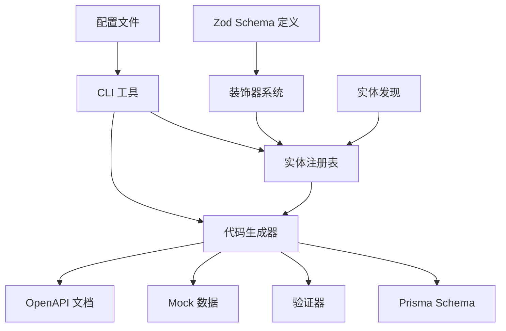

# Schema 系统架构设计

## 🎯 设计理念

Schema 系统是 Linch Kit 的核心，采用 **Zod-First** 的设计理念：
- **单一数据源**: 所有数据结构定义都来自 Zod Schema
- **自动生成**: 从 Schema 自动生成 Prisma、验证器、Mock 数据等
- **类型安全**: 端到端的 TypeScript 类型安全
- **开发体验**: 简化开发流程，减少重复工作

## 🏗️ 系统架构



## 📦 核心组件

### 1. 装饰器系统 (`src/core/decorators.ts`)

提供语义化的字段装饰器：

```typescript
// 基础装饰器
primary(schema)           // 主键
unique(schema)            // 唯一约束
defaultValue(schema, val) // 默认值

// 时间戳装饰器
createdAt(schema)         // 创建时间
updatedAt(schema)         // 更新时间
softDelete(schema)        // 软删除

// 数据库装饰器
dbField(schema, name)     // 字段映射
dbType(schema, type, opts) // 数据库类型

// 关系装饰器 (规划中)
relation(schema, target, type, opts) // 关系定义
```

### 2. 实体定义系统 (`src/core/entity.ts`)

```typescript
// 实体定义
const User = defineEntity('User', {
  id: primary(z.string().uuid()),
  email: unique(z.string().email()),
  name: z.string(),
  isActive: defaultValue(z.boolean(), true),
  createdAt: createdAt(z.date()),
  updatedAt: updatedAt(z.date()),
  deletedAt: softDelete(z.date().optional()),
}, {
  tableName: 'users',
  indexes: [
    { fields: ['email'], unique: true },
    { fields: ['deletedAt'] },
  ]
})

// 自动生成的验证器
User.createSchema    // 创建验证器
User.updateSchema    // 更新验证器
User.responseSchema  // 响应验证器
```

### 3. 代码生成器

#### Prisma 生成器 (`src/generators/prisma.ts`)
- 将 Zod Schema 转换为 Prisma Schema
- 处理字段类型映射
- 生成索引和约束
- 支持多种数据库

#### 验证器生成器 (`src/generators/validators.ts`)
- 生成 CRUD 验证器
- 自动排除系统字段
- 支持查询参数验证
- 生成分页响应验证器

#### Mock 生成器 (`src/generators/mock.ts`)
- 根据 Schema 生成真实数据
- 支持自定义生成器
- 处理关系数据
- 生成测试数据文件

#### OpenAPI 生成器 (`src/generators/openapi.ts`)
- 生成 OpenAPI 3.0 规范
- 自动生成 API 路径
- 支持复杂数据类型
- 生成完整的 API 文档

### 4. CLI 工具 (`src/cli/index.ts`)

```bash
# 初始化配置
linch-schema init

# 生成代码
linch-schema generate:prisma
linch-schema generate:validators
linch-schema generate:mocks
linch-schema generate:openapi
linch-schema generate:all

# 工具命令
linch-schema list           # 列出实体
linch-schema show User      # 显示实体详情
```

### 5. 配置系统 (`src/config/loader.ts`)

支持配置文件 `linch-schema.config.js`:

```javascript
export default {
  entities: ['src/entities/**/*.{ts,js}'],
  output: {
    prisma: './prisma/schema.prisma',
    validators: './src/validators/generated.ts',
    mocks: './src/mocks/factories.ts',
    openapi: './docs/api.json',
  },
  database: {
    provider: 'postgresql',
    url: process.env.DATABASE_URL,
  },
  api: {
    title: 'My API',
    version: '1.0.0',
  },
}
```

## 🔄 工作流程

### 开发流程
1. **定义实体**: 使用 Zod + 装饰器定义数据结构
2. **生成代码**: 运行 CLI 命令生成所有相关代码
3. **数据库迁移**: 使用 Prisma 进行数据库迁移
4. **业务开发**: 使用生成的验证器和类型进行业务开发

### 生成流程
1. **实体发现**: CLI 扫描项目中的实体文件
2. **实体注册**: 将实体注册到全局注册表
3. **代码生成**: 根据实体定义生成各种代码
4. **文件写入**: 将生成的代码写入指定位置

## 🎯 设计优势

### 1. 开发效率
- **一次定义，多处使用**: Schema 定义一次，自动生成所有相关代码
- **类型安全**: 端到端的类型检查，减少运行时错误
- **自动化**: 减少手动编写重复代码

### 2. 维护性
- **单一数据源**: 所有数据结构变更只需修改 Schema
- **自动同步**: 代码生成确保各部分保持同步
- **清晰结构**: 装饰器提供语义化的字段定义

### 3. 扩展性
- **插件化**: 生成器可以独立扩展
- **多数据库**: 支持多种数据库类型
- **自定义**: 支持自定义装饰器和生成器

## 🔮 未来规划

### 短期 (1-2 个月)
- [ ] 关系系统完善
- [ ] 性能优化
- [ ] 测试覆盖
- [ ] 错误处理改进

### 中期 (3-6 个月)
- [ ] 图形化 Schema 编辑器
- [ ] 数据库迁移工具
- [ ] 多语言支持
- [ ] 插件市场

### 长期 (6+ 个月)
- [ ] 可视化数据建模
- [ ] 实时 Schema 同步
- [ ] 云端 Schema 管理
- [ ] AI 辅助 Schema 设计

## 🚨 技术挑战

### 1. 类型复杂性
- **问题**: 随着功能增加，类型定义变得复杂
- **解决**: 简化类型接口，提供更好的类型推断

### 2. 性能问题
- **问题**: 大型 Schema 的生成可能较慢
- **解决**: 增量生成，缓存机制

### 3. 兼容性
- **问题**: 不同版本的 Zod/Prisma 兼容性
- **解决**: 明确版本依赖，提供迁移指南

## 📊 成功指标

- **开发效率**: 减少 70% 的重复代码编写
- **错误率**: 减少 50% 的类型相关错误
- **上手时间**: 新开发者 30 分钟内上手
- **社区采用**: 6 个月内 1000+ 下载量
