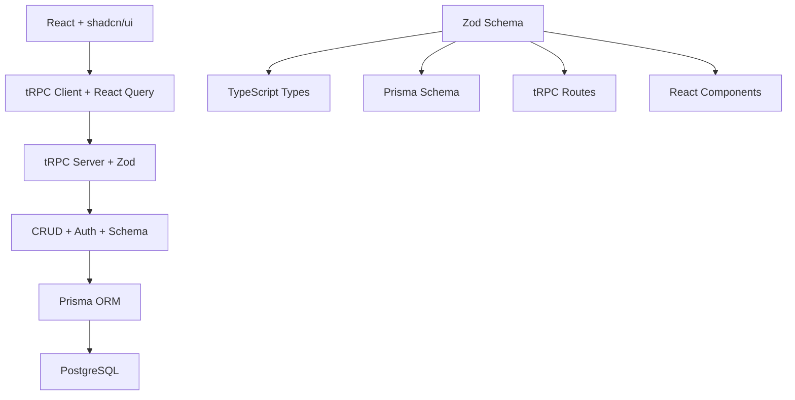
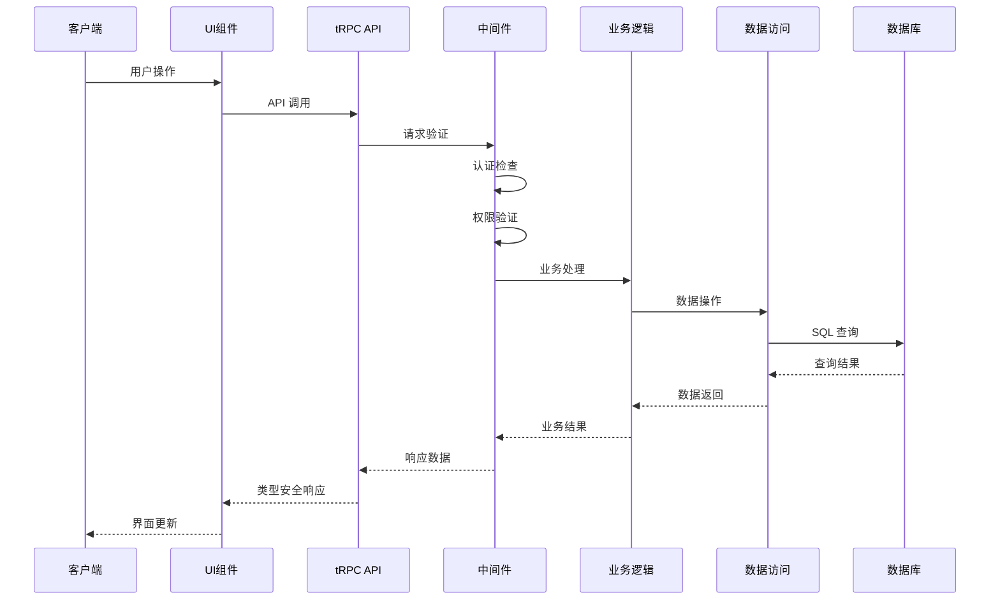
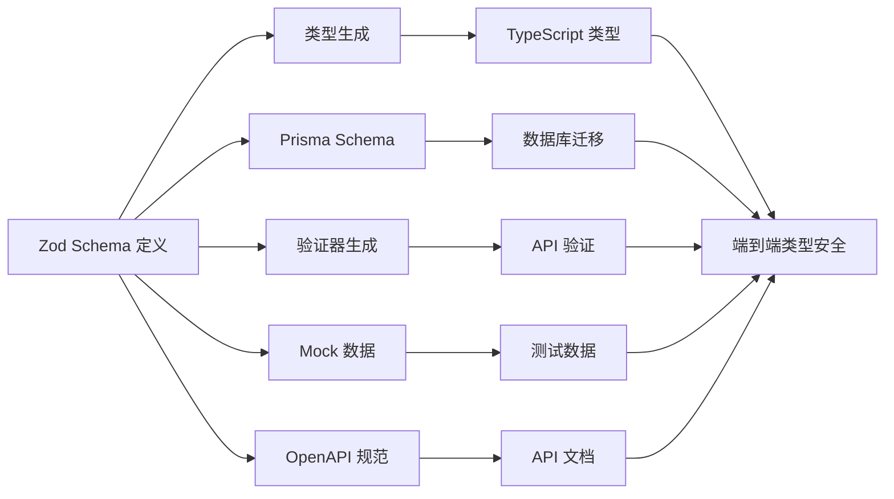
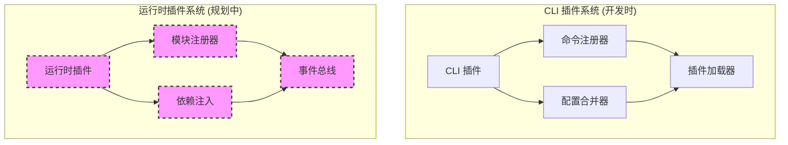
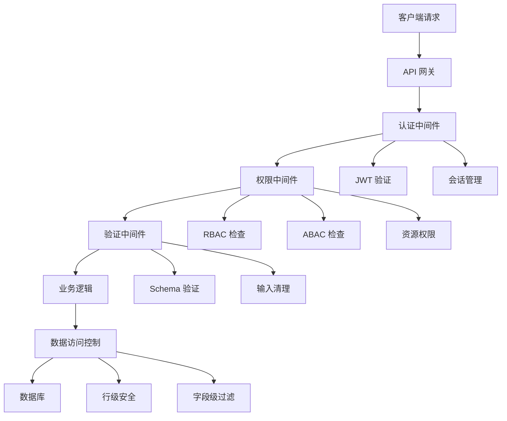
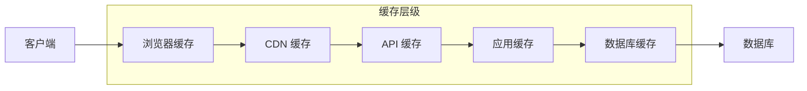
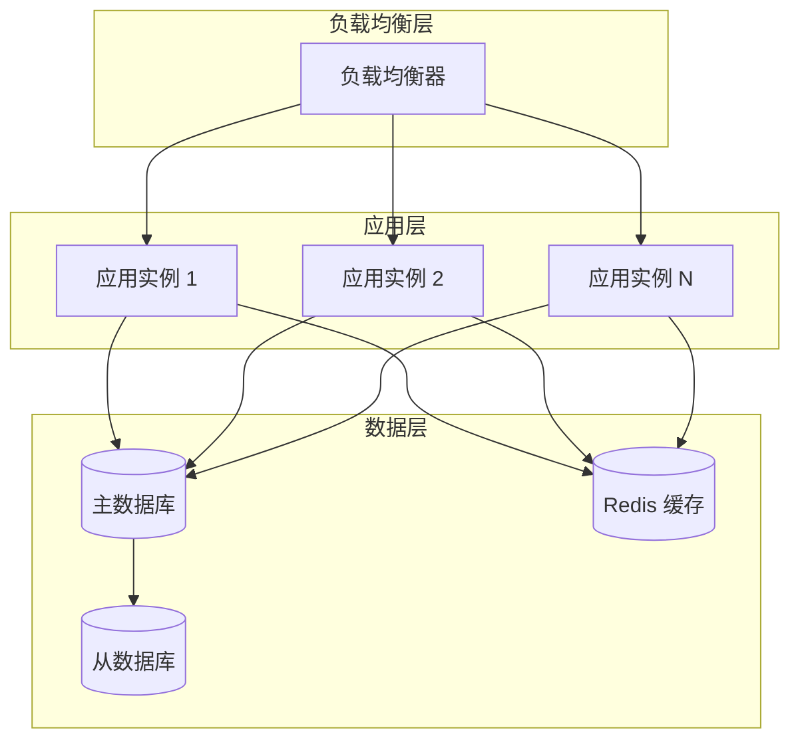
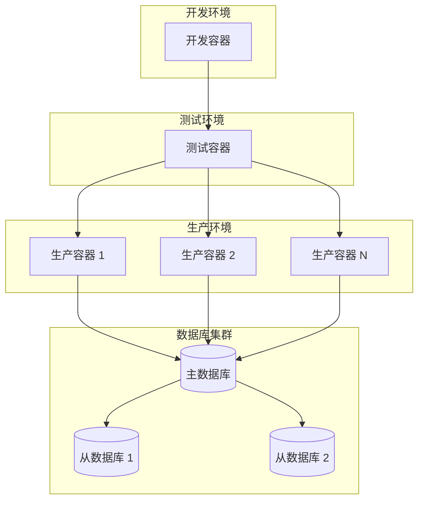
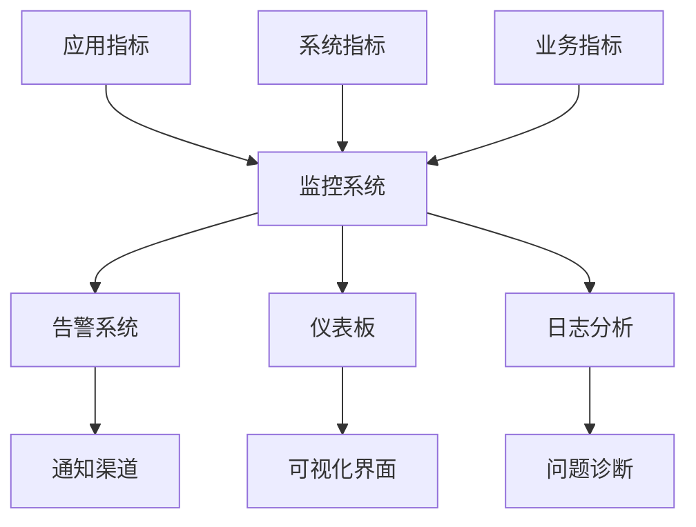

# LinchKit 整体架构设计

**文档版本**: v1.0.0  
**创建日期**: 2025-06-23  
**维护责任**: 架构团队  
**架构级别**: 系统级  

---

## 🎯 架构设计理念

### 核心原则
- **AI-First**: 所有设计都优先考虑 AI 理解和处理能力
- **Schema 驱动**: 以 Zod Schema 为单一数据源，驱动整个系统
- **类型安全**: 端到端 TypeScript 类型安全保障
- **模块化**: 高内聚、低耦合的包设计
- **可扩展**: 插件化架构支持功能扩展
- **渐进式**: 支持从简单到复杂的渐进式开发

### 设计哲学
- **不重复造轮子**: 优先使用成熟的现有解决方案
- **约定优于配置**: 提供合理的默认配置
- **开发体验优先**: 优化开发者的使用体验
- **生产就绪**: 企业级的性能和可靠性

---

## 🏗️ 系统分层架构

### 整体架构图
```mermaid
graph TB
    subgraph "应用层 (Application Layer)"
        STARTER[Starter 应用<br/>apps/starter]
        WEB[其他 Web 应用<br/>Next.js Apps]
    end

    subgraph "表现层 (Presentation Layer)"
        UI[UI 组件库<br/>@linch-kit/ui]
    end

    subgraph "API 层 (API Layer)"
        TRPC[tRPC 集成<br/>@linch-kit/trpc]
        MW[中间件<br/>Auth/Validation/Permissions]
    end

    subgraph "业务逻辑层 (Business Logic Layer)"
        CRUD[CRUD 操作<br/>@linch-kit/crud]
        AUTH[认证权限<br/>@linch-kit/auth]
    end

    subgraph "插件层 (Plugin Layer)"
        WORKFLOW[工作流插件<br/>@linch-kit/workflow]
        PLUGINS[其他插件<br/>Plugin Modules]
    end

    subgraph "数据访问层 (Data Access Layer)"
        SCHEMA[Schema 系统<br/>@linch-kit/schema]
        ORM[Prisma ORM]
        DB[(PostgreSQL)]
    end

    subgraph "基础设施层 (Infrastructure Layer)"
        CORE[核心系统<br/>@linch-kit/core]
        PLUGIN_SYS[插件系统]
        AI_SYS[AI 集成系统]
        CLI[CLI 工具]
    end

    STARTER --> UI
    WEB --> UI
    UI --> TRPC
    TRPC --> MW
    MW --> CRUD
    MW --> AUTH
    CRUD --> AUTH
    CRUD --> SCHEMA
    AUTH --> SCHEMA
    SCHEMA --> ORM
    ORM --> DB

    WORKFLOW --> CORE
    PLUGINS --> CORE
    CRUD --> CORE
    AUTH --> CORE
    SCHEMA --> CORE
    TRPC --> CORE
    UI --> CORE

    CORE --> PLUGIN_SYS
    CORE --> AI_SYS
    CORE --> CLI

    classDef application fill:#e8f5e8
    classDef presentation fill:#e3f2fd
    classDef api fill:#f3e5f5
    classDef business fill:#fff3e0
    classDef plugin fill:#f1f8e9
    classDef data fill:#fce4ec
    classDef infrastructure fill:#e1f5fe

    class STARTER,WEB application
    class UI presentation
    class TRPC,MW api
    class CRUD,AUTH business
    class WORKFLOW,PLUGINS plugin
    class SCHEMA,ORM,DB data
    class CORE,PLUGIN_SYS,AI_SYS,CLI infrastructure
```

### 分层职责

#### 应用层 (Application Layer)
- **职责**: 具体应用实现
- **组件**: Starter 应用、其他 Web 应用
- **特性**: 完整功能演示、最佳实践、快速启动模板

#### 表现层 (Presentation Layer)
- **职责**: 用户界面和交互
- **组件**: UI 组件库
- **特性**: 响应式设计、主题系统、国际化

#### API 层 (API Layer)
- **职责**: API 路由和中间件
- **组件**: tRPC 集成、认证中间件、验证中间件
- **特性**: 类型安全、自动生成、错误处理

#### 业务逻辑层 (Business Logic Layer)
- **职责**: 核心业务逻辑
- **组件**: CRUD 操作、认证权限
- **特性**: 权限控制、事务管理、业务规则

#### 插件层 (Plugin Layer)
- **职责**: 可扩展功能模块
- **组件**: 工作流插件、其他业务插件
- **特性**: 可插拔、独立部署、事件驱动

#### 数据访问层 (Data Access Layer)
- **职责**: 数据模式和持久化
- **组件**: Schema 系统、ORM、数据库
- **特性**: 类型安全、迁移管理、查询优化

#### 基础设施层 (Infrastructure Layer)
- **职责**: 基础工具和系统
- **组件**: 核心系统、插件系统、AI 集成、CLI
- **特性**: 零依赖、插件支持、AI 抽象、工具函数

---

## 🛠️ 技术栈架构

### 核心技术选型
| 层级 | 技术 | 版本 | 选择理由 |
|------|------|------|----------|
| **前端** | React | 19.1.0 | 最新稳定版，并发特性 |
| | Next.js | 15.3.4 | 全栈框架，App Router |
| | shadcn/ui | latest | 高质量组件库 |
| | Tailwind CSS | 4.1.10 | 原子化CSS，开发效率 |
| **API** | tRPC | 11.3.1 | 端到端类型安全 |
| | Zod | 3.25.67 | Schema验证，单一数据源 |
| **数据** | Prisma | 5.22.0 | 现代化TypeScript ORM |
| | PostgreSQL | ^14.0 | 功能丰富的关系型数据库 |
| **工具** | TypeScript | 5.8.3 | 静态类型检查 |
| | Turborepo | 2.5.4 | 高性能monorepo构建 |
| | pnpm | 10.12.1 | 高效包管理器 |
| | Vitest | ^2.0.0 | 快速单元测试 |

### 技术栈集成架构


---

## 🔄 数据流架构

### 请求处理流程


### Schema 驱动的代码生成流程


---

## 🔌 插件系统架构

### 双层插件架构


### 插件通信机制
- **CLI 插件**: 命令注册、配置合并、插件发现
- **运行时插件**: 模块注册、服务注入、事件总线

---

## 🛡️ 安全架构

### 多层安全防护


### 权限控制模型
- **操作级权限**: 控制用户可以执行的操作
- **字段级权限**: 控制用户可以访问的字段
- **行级权限**: 控制用户可以访问的数据行
- **多租户隔离**: 确保租户间数据隔离

---

## 🚀 性能架构

### 缓存策略


### 性能优化策略
- **代码分割**: 按路由和组件分割
- **懒加载**: 组件和数据的懒加载
- **预加载**: 关键资源预加载
- **压缩优化**: 代码和资源压缩
- **CDN 分发**: 静态资源 CDN 加速

---

## 🔧 扩展性设计

### 水平扩展架构


### 模块扩展机制
- **包级扩展**: 新增功能包
- **插件扩展**: 运行时插件加载
- **配置扩展**: 动态配置管理
- **API 扩展**: tRPC 路由扩展

---

## 🌐 部署架构

### 容器化部署


### 部署策略
- **蓝绿部署**: 零停机部署
- **滚动更新**: 渐进式更新
- **金丝雀发布**: 小流量验证
- **回滚机制**: 快速回滚支持

---

## 📊 监控和可观测性

### 监控架构


### 关键指标
- **性能指标**: 响应时间、吞吐量、错误率
- **业务指标**: 用户活跃度、功能使用率
- **系统指标**: CPU、内存、磁盘、网络
- **安全指标**: 认证失败、权限违规

---

## 🔮 架构演进路线

### 短期目标 (3-6个月)
- 完善监控和可观测性
- 优化性能和缓存策略
- 增强安全防护机制

### 中期目标 (6-12个月)
- 实现运行时插件系统
- 支持微服务架构
- 增加多数据库支持

### 长期目标 (12个月+)
- 云原生架构转型
- AI 辅助开发增强
- 跨平台支持扩展

---

**重要提醒**: 本架构设计是 LinchKit 项目的核心指导原则。所有开发活动都必须遵循这里定义的架构约束和设计理念，确保系统的一致性和可维护性。
