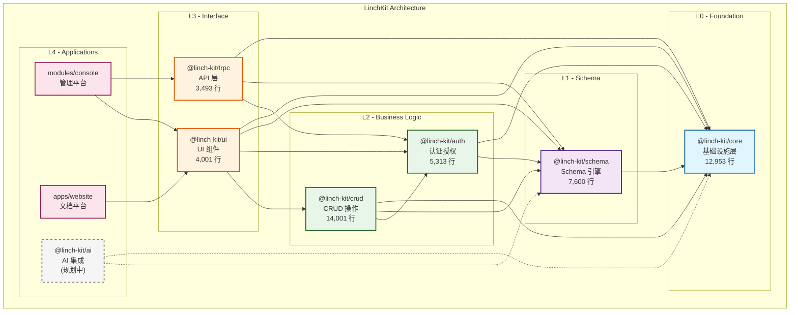
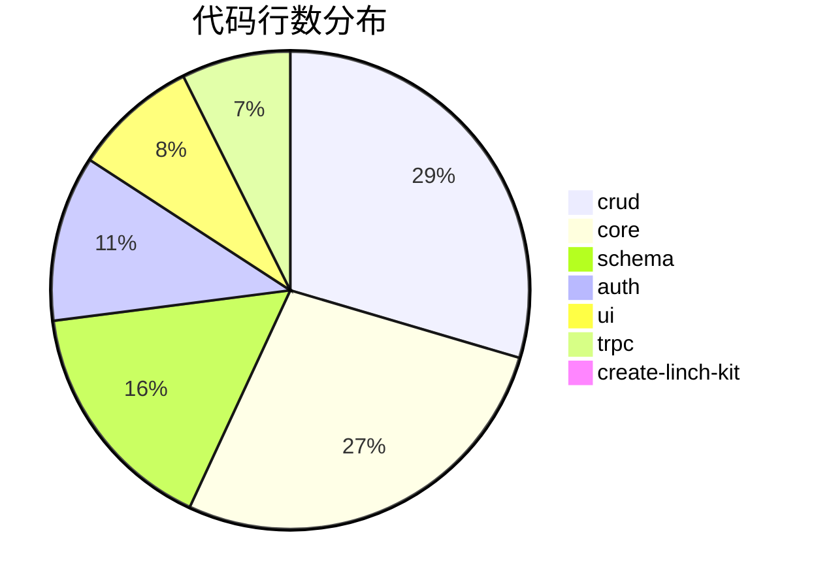

# LinchKit 架构可视化

生成时间: 7/6/2025, 3:11:44 PM

## 🏗️ 整体架构图



## 📊 架构特点

1. **分层架构**: 严格的 4 层架构设计，自下而上依赖
2. **无循环依赖**: ✅ 架构设计良好，没有循环依赖
3. **模块化设计**: 每个包职责单一，高内聚低耦合
4. **Schema 驱动**: 以 @linch-kit/schema 为核心的数据驱动架构

## 🔗 # 依赖矩阵

| 包 \ 依赖于 | core | schema | auth | crud | trpc | ui |
|-------------|------|--------|------|------|------|-----|
| core | - |   |   |   |   |   |
| schema | ✓ | - |   |   |   |   |
| auth | ✓ | ✓ | - |   |   |   |
| crud | ✓ | ✓ | ✓ | - |   |   |
| trpc | ✓ | ✓ | ✓ |   | - |   |
| ui | ✓ | ✓ | ✓ | ✓ |   | - |


## 📈 # 包规模统计



```mermaid
bar-chart
    title 各包文件数统计
    x-axis [crud, core, schema, auth, ui, trpc, create-linch-kit]
    y-axis "文件数" 0 --> 59
    bar [36, 59, 35, 28, 46, 10, 2]
```


## 🎯 架构洞察

### 优势
1. **清晰的层次结构**: L0→L1→L2→L3→L4 的依赖关系清晰
2. **核心稳定**: @linch-kit/core 作为基础设施层，被所有包依赖
3. **Schema 中心化**: 统一的数据模型定义和验证
4. **适度的包大小**: 最大的包（crud）也只有 14k 行，易于维护

### 改进建议
1. **测试覆盖率**: 当前 19.4% 偏低，建议提升到 80%+
2. **UI 包测试**: ui 包只有 1 个测试文件，需要加强
3. **文档完善**: 部分包缺少详细的 API 文档
4. **性能监控**: 建议添加性能基准测试

## 📋 下一步行动
1. 运行性能基准测试
2. 收集运行时指标
3. 准备与 Gemini 的深度技术讨论
