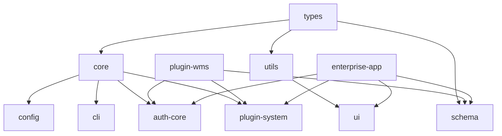

# 发布策略和流程

## 🎯 发布策略概览

### 仓库完全分离策略
```
linch-kit/                    # 基础包仓库 (当前)
├── packages/ → npm          # 核心基础包发布到 npm
└── apps/starter → template  # 项目脚手架模板

linch-kit-enterprise/        # 企业应用仓库 (完全独立)
├── 完整的企业级应用
├── 独立的版本管理
└── 引用 @linch-kit/* 基础包

linch-kit-plugins/           # 官方插件仓库 (完全独立)
├── packages/ → npm         # 官方插件发布到 npm
├── 独立的版本管理
└── 引用 @linch-kit/* 基础包

community-plugins/           # 社区插件 (多个独立仓库)
├── linch-kit-plugin-xxx/    # 独立仓库
├── linch-kit-plugin-yyy/    # 独立仓库
└── ...                      # 每个插件独立仓库
```

## 📦 基础包发布流程

### 1. 包版本管理
```json
// 使用 Changeset 管理版本
{
  "devDependencies": {
    "@changesets/cli": "^2.27.1"
  }
}
```

### 2. 发布脚本
```bash
# 根目录 package.json
{
  "scripts": {
    "changeset": "changeset",
    "version-packages": "changeset version",
    "release": "pnpm build && changeset publish",
    "release:canary": "pnpm build && changeset publish --tag canary"
  }
}
```

### 3. CI/CD 自动发布
```yaml
# .github/workflows/release.yml
name: Release
on:
  push:
    branches: [main]
jobs:
  release:
    runs-on: ubuntu-latest
    steps:
      - uses: actions/checkout@v4
      - uses: actions/setup-node@v4
        with:
          node-version: 18
          registry-url: 'https://registry.npmjs.org'
      
      - name: Install dependencies
        run: pnpm install
      
      - name: Build packages
        run: pnpm build
      
      - name: Create Release Pull Request or Publish
        uses: changesets/action@v1
        with:
          publish: pnpm release
        env:
          GITHUB_TOKEN: ${{ secrets.GITHUB_TOKEN }}
          NPM_TOKEN: ${{ secrets.NPM_TOKEN }}
```

## 🏗️ 包依赖关系

### 核心包依赖图


### 发布顺序
1. **基础层**: `types`, `utils`
2. **核心层**: `core`, `config`, `cli`
3. **功能层**: `schema`, `auth-core`, `plugin-system`
4. **UI层**: `ui`
5. **插件层**: 各种插件包
6. **应用层**: 企业级应用

## 🔄 版本策略

### 语义化版本
- **Major (x.0.0)**: 破坏性变更
- **Minor (0.x.0)**: 新功能，向后兼容
- **Patch (0.0.x)**: Bug 修复

### 版本同步策略
```typescript
// 核心包保持版本同步
@linch-kit/core@1.2.3
@linch-kit/schema@1.2.3
@linch-kit/auth-core@1.2.3

// 插件独立版本
@linch-kit/plugin-wms@2.1.0
@linch-kit/plugin-crm@1.5.2
```

## 🚀 发布检查清单

### 发布前检查
- [ ] 所有测试通过
- [ ] 文档更新完成
- [ ] CHANGELOG 更新
- [ ] 版本号正确
- [ ] 依赖版本兼容
- [ ] 构建成功
- [ ] 类型检查通过

### 发布后验证
- [ ] npm 包可正常安装
- [ ] 示例项目可正常运行
- [ ] 文档链接正确
- [ ] GitHub Release 创建
- [ ] 社区通知发布

## 🎯 具体实施计划

### Phase 1: 基础包发布 (当前)
```bash
# 已完成
✅ @linch-kit/schema@0.1.0

# 进行中
🔄 @linch-kit/auth-core@0.1.0
🔄 @linch-kit/cli@0.1.0
🔄 @linch-kit/config@0.1.0

# 待发布
📋 @linch-kit/core@0.1.0
📋 @linch-kit/ui@0.1.0
📋 @linch-kit/plugin-system@0.1.0
```

### Phase 2: 插件仓库建立
```bash
# 创建独立仓库
mkdir linch-kit-plugins
cd linch-kit-plugins

# 初始化 Turborepo
pnpm create turbo@latest

# 创建插件包
packages/
├── plugin-auth-providers/
├── plugin-wms/
└── plugin-workflow/
```

### Phase 3: 企业级应用仓库
```bash
# 创建独立仓库
mkdir linch-kit-enterprise
cd linch-kit-enterprise

# 使用基础包
pnpm add @linch-kit/core @linch-kit/schema @linch-kit/auth-core
```

## 🛠️ 开发工具集成

### 1. 统一 CLI 工具
```bash
# 全局安装
npm install -g @linch-kit/cli

# 创建新项目
linch-kit create my-app

# 创建插件
linch-kit create-plugin my-plugin

# 发布包
linch-kit publish
```

### 2. 配置文件统一
```javascript
// linch-kit.config.js (统一配置)
export default {
  // 项目配置
  project: {
    name: 'my-app',
    version: '1.0.0'
  },
  
  // 包配置
  packages: {
    schema: { /* schema 配置 */ },
    auth: { /* auth 配置 */ }
  },
  
  // 插件配置
  plugins: {
    '@linch-kit/plugin-wms': { enabled: true }
  }
}
```

## 📊 成功指标

### 技术指标
- 包发布成功率 > 99%
- 构建时间 < 5 分钟
- 测试覆盖率 > 80%
- 文档覆盖率 > 90%

### 业务指标
- 每月下载量增长 > 20%
- 社区贡献者数量增长
- 插件生态丰富度
- 企业采用案例

## 🔮 未来规划

### 短期 (1-3 个月)
- [ ] 完成所有基础包发布
- [ ] 建立插件仓库
- [ ] 完善发布流程

### 中期 (3-6 个月)
- [ ] 建立企业级应用仓库
- [ ] 发布官方插件
- [ ] 建立插件市场

### 长期 (6+ 个月)
- [ ] 社区插件生态
- [ ] 企业级支持服务
- [ ] 云端部署方案
