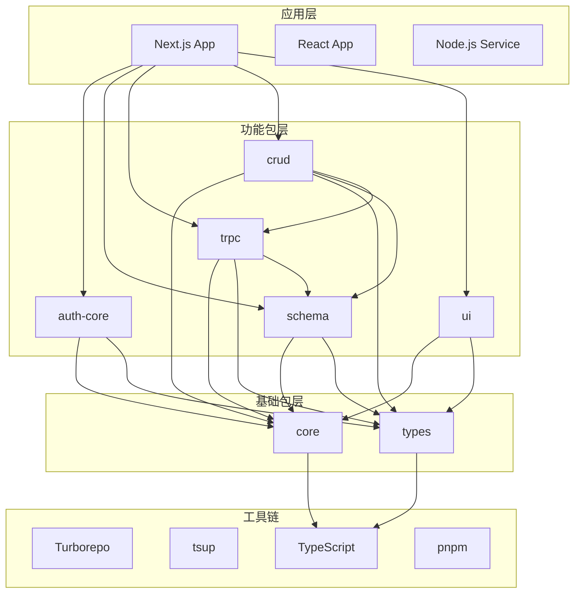

# 系统架构详解

## 概述

Linch Kit 是一个基于 TypeScript 的 monorepo 全栈开发工具包，采用分层架构设计，提供类型安全、可扩展的开发体验。

## 架构层次

### 1. 基础设施层 (Infrastructure Layer)

```typescript
// 工具链配置
interface BuildSystem {
  monorepo: 'turborepo'           // 构建编排
  packageManager: 'pnpm'          // 包管理
  bundler: 'tsup'                 // 打包工具
  typeChecker: 'typescript'       // 类型检查
  versionManager: 'changesets'    // 版本管理
}

// 项目结构
interface ProjectStructure {
  packages: Package[]              // 核心包
  apps: Application[]              // 应用
  configs: SharedConfig[]          // 共享配置
  scripts: BuildScript[]           // 构建脚本
  tools: DevTool[]                 // 开发工具
}
```

### 2. 基础包层 (Foundation Layer)

```typescript
// @linch-kit/core - 核心工具包
interface CorePackage {
  config: ConfigSystem             // 配置系统
  utils: UtilityFunctions         // 工具函数
  cli: CLITools                   // 命令行工具
  plugins: PluginSystem           // 插件系统
}

// @linch-kit/types - 类型定义
interface TypesPackage {
  globals: GlobalTypes            // 全局类型
  common: CommonInterfaces        // 通用接口
  utilities: TypeUtilities        // 类型工具
}
```

### 3. 功能包层 (Feature Layer)

```typescript
// 认证包
interface AuthCorePackage {
  providers: AuthProvider[]       // 认证提供商
  session: SessionManager        // 会话管理
  permissions: PermissionSystem   // 权限系统
  middleware: AuthMiddleware[]    // 认证中间件
}

// 数据模式包
interface SchemaPackage {
  definition: SchemaDefinition    // 模式定义
  validation: ValidationSystem   // 验证系统
  generation: CodeGeneration     // 代码生成
  database: DatabaseIntegration  // 数据库集成
}

// tRPC 集成包
interface TRPCPackage {
  router: RouterSystem           // 路由系统
  client: ClientGeneration       // 客户端生成
  middleware: TRPCMiddleware[]   // 中间件
  types: TypeGeneration          // 类型生成
}

// CRUD 操作包
interface CRUDPackage {
  operations: CRUDOperations     // CRUD 操作
  permissions: PermissionCheck   // 权限检查
  validation: DataValidation     // 数据验证
  hooks: LifecycleHooks         // 生命周期钩子
}

// UI 组件包
interface UIPackage {
  components: UIComponent[]      // UI 组件
  themes: ThemeSystem           // 主题系统
  forms: FormComponents         // 表单组件
  layouts: LayoutComponents     // 布局组件
}
```

### 4. 应用层 (Application Layer)

```typescript
// Next.js 应用
interface NextJSApp {
  pages: PageComponent[]         // 页面组件
  api: APIRoute[]               // API 路由
  middleware: AppMiddleware[]    // 应用中间件
  config: AppConfig             // 应用配置
}

// React 应用
interface ReactApp {
  components: ReactComponent[]   // React 组件
  hooks: CustomHooks[]          // 自定义钩子
  context: ContextProviders[]   // 上下文提供者
  routing: RouteConfig          // 路由配置
}
```

## 依赖关系图



## 数据流架构

### 1. 请求处理流程

```typescript
interface RequestFlow {
  client: 'React/Next.js'
  transport: 'tRPC'
  validation: 'Zod Schema'
  authorization: 'Auth Core'
  business: 'CRUD Layer'
  persistence: 'Database'
}

// 流程示例
const requestFlow = {
  1: 'Client → tRPC Client',
  2: 'tRPC Client → tRPC Server',
  3: 'tRPC Server → Schema Validation',
  4: 'Schema Validation → Auth Check',
  5: 'Auth Check → CRUD Operation',
  6: 'CRUD Operation → Database',
  7: 'Database → Response Chain'
}
```

### 2. 类型安全流程

```typescript
interface TypeSafetyFlow {
  definition: 'Schema Definition'
  generation: 'Type Generation'
  validation: 'Runtime Validation'
  transport: 'Type-safe Transport'
  consumption: 'Type-safe Consumption'
}

// 类型流示例
const typeSafetyChain = {
  schema: 'defineField().string().required()',
  types: 'Generated TypeScript interfaces',
  validation: 'Zod runtime validation',
  api: 'tRPC type-safe procedures',
  client: 'Type-safe client calls'
}
```

## 插件系统架构

```typescript
interface PluginArchitecture {
  core: PluginCore
  registry: PluginRegistry
  lifecycle: PluginLifecycle
  hooks: HookSystem
}

interface PluginCore {
  load(plugin: Plugin): void
  unload(pluginId: string): void
  execute(hookName: string, context: any): any
}

interface Plugin {
  id: string
  name: string
  version: string
  dependencies: string[]
  hooks: PluginHook[]
  install(context: PluginContext): void
  uninstall?(context: PluginContext): void
}
```

## 配置系统架构

```typescript
interface ConfigArchitecture {
  layers: ConfigLayer[]
  resolution: ConfigResolution
  validation: ConfigValidation
  hot_reload: HotReload
}

interface ConfigLayer {
  name: string
  priority: number
  source: 'file' | 'env' | 'cli' | 'runtime'
  schema: ConfigSchema
}

// 配置层次 (优先级从高到低)
const configLayers = [
  'Runtime Override',
  'CLI Arguments', 
  'Environment Variables',
  'Local Config File',
  'Package Config',
  'Default Config'
]
```

## 构建系统架构

```typescript
interface BuildArchitecture {
  orchestrator: 'Turborepo'
  tasks: BuildTask[]
  cache: CacheSystem
  parallelization: ParallelExecution
}

interface BuildTask {
  name: string
  dependsOn: string[]
  inputs: string[]
  outputs: string[]
  cache: boolean
}

// 构建任务依赖图
const buildTasks = {
  'build:packages': {
    dependsOn: ['^build:packages'],
    inputs: ['src/**', 'package.json', 'tsconfig.json'],
    outputs: ['dist/**']
  },
  'test': {
    dependsOn: ['^build:packages'],
    inputs: ['src/**', 'test/**', '__tests__/**'],
    outputs: ['coverage/**']
  }
}
```

## 安全架构

```typescript
interface SecurityArchitecture {
  authentication: AuthenticationLayer
  authorization: AuthorizationLayer
  validation: ValidationLayer
  transport: TransportSecurity
}

interface AuthenticationLayer {
  providers: AuthProvider[]
  session: SessionManagement
  tokens: TokenManagement
  mfa: MultiFactorAuth
}

interface AuthorizationLayer {
  rbac: RoleBasedAccess
  permissions: PermissionSystem
  policies: PolicyEngine
  audit: AuditLogging
}
```

## 性能架构

```typescript
interface PerformanceArchitecture {
  build: BuildOptimization
  runtime: RuntimeOptimization
  caching: CacheStrategy
  monitoring: PerformanceMonitoring
}

interface BuildOptimization {
  incremental: IncrementalBuild
  parallel: ParallelExecution
  cache: BuildCache
  tree_shaking: TreeShaking
}

interface RuntimeOptimization {
  code_splitting: CodeSplitting
  lazy_loading: LazyLoading
  memoization: Memoization
  bundling: BundleOptimization
}
```

## 扩展点

```typescript
interface ExtensionPoints {
  config: ConfigExtension[]
  middleware: MiddlewareExtension[]
  components: ComponentExtension[]
  commands: CommandExtension[]
  generators: GeneratorExtension[]
}

// 扩展示例
const extensions = {
  config: 'Custom configuration schemas',
  middleware: 'Request/response processing',
  components: 'Custom UI components',
  commands: 'CLI command extensions',
  generators: 'Code generation templates'
}
```

## 监控和调试

```typescript
interface MonitoringArchitecture {
  logging: LoggingSystem
  metrics: MetricsCollection
  tracing: DistributedTracing
  debugging: DebuggingTools
}

interface DebuggingTools {
  source_maps: SourceMapSupport
  hot_reload: HotReloadSystem
  type_checking: TypeCheckingTools
  profiling: PerformanceProfiling
}
```

这个架构设计确保了 Linch Kit 的可扩展性、可维护性和性能，为构建现代化全栈应用提供了坚实的技术基础。
