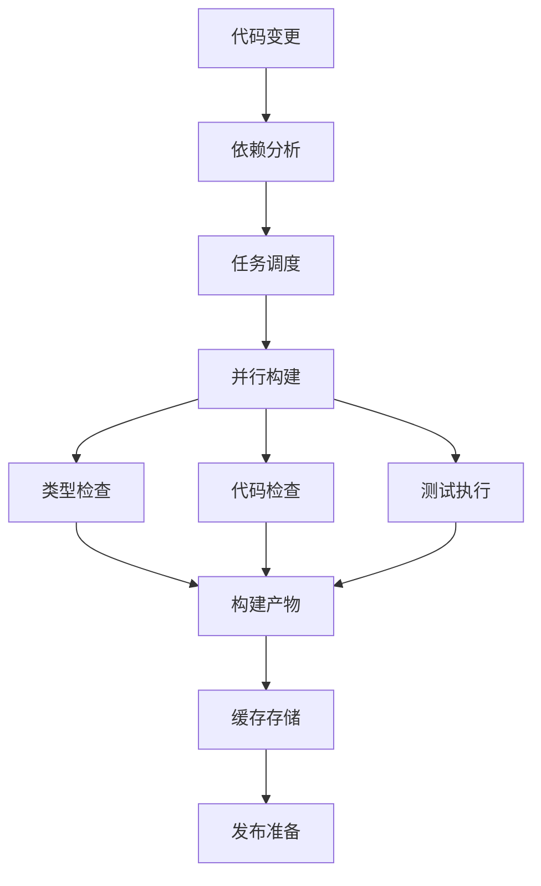

# 构建流水线 AI 上下文

## 概述

Linch Kit 使用 Turborepo + tsup + pnpm 构建现代化的 monorepo 构建流水线，支持增量构建、并行执行、智能缓存和类型安全。

## 构建架构

### 1. 工具链组合

```typescript
interface BuildToolchain {
  orchestrator: 'turborepo'       // 任务编排和缓存
  packageManager: 'pnpm'          // 包管理和 workspace
  bundler: 'tsup'                 // TypeScript 打包
  typeChecker: 'typescript'       // 类型检查
  linter: 'eslint'                // 代码检查
  formatter: 'prettier'           // 代码格式化
  tester: 'vitest' | 'jest'       // 测试框架
}
```

### 2. 构建流程



## Turborepo 配置

### 1. 核心配置 (turbo.json)

```json
{
  "$schema": "https://turborepo.com/schema.json",
  "ui": "tui",
  "globalDependencies": [
    "configs/**",
    "scripts/**",
    "package.json",
    "pnpm-lock.yaml"
  ],
  "globalEnv": [
    "NODE_ENV",
    "CI",
    "TURBO_TOKEN",
    "TURBO_TEAM"
  ],
  "tasks": {
    "build:packages": {
      "dependsOn": ["^build:packages"],
      "inputs": [
        "src/**",
        "tsconfig.json",
        "tsconfig.build.json",
        "tsup.config.ts",
        "package.json"
      ],
      "outputs": ["dist/**"]
    },
    "test": {
      "dependsOn": ["^build:packages"],
      "inputs": [
        "src/**",
        "test/**",
        "__tests__/**",
        "**/*.test.ts",
        "**/*.spec.ts"
      ],
      "outputs": ["coverage/**"]
    }
  }
}
```

### 2. 任务依赖图

```typescript
interface TaskDependencyGraph {
  'build:packages': {
    dependsOn: ['^build:packages']
    description: '按依赖顺序构建包'
  }
  'check-types': {
    dependsOn: ['^build:packages']
    description: '类型检查依赖构建产物'
  }
  'test': {
    dependsOn: ['^build:packages']
    description: '测试依赖构建产物'
  }
  'lint': {
    dependsOn: []
    description: '代码检查可并行执行'
  }
}
```

## tsup 构建配置

### 1. 基础配置系统

```typescript
// configs/tsup.base.ts
interface TsupBaseConfig {
  entry: string[]
  format: ('cjs' | 'esm')[]
  dts: boolean | DtsOptions
  clean: boolean
  sourcemap: boolean
  target: string
  external: string[]
  splitting: boolean
  treeshake: boolean
}

// 包类型特定配置
interface PackageTypeConfigs {
  library: LibraryConfig
  cli: CLIConfig
  react: ReactConfig
  multiEntry: MultiEntryConfig
}
```

### 2. 配置工厂函数

```typescript
// 标准库包配置
export function createLibraryConfig(options: TsupBaseOptions = {}) {
  return defineConfig(createTsupConfig(options))
}

// CLI 包配置
export function createCliConfig(options: Omit<TsupBaseOptions, 'isCli'> = {}) {
  return defineConfig(createTsupConfig({ ...options, isCli: true }))
}

// React 组件库配置
export function createReactConfig(options: Omit<TsupBaseOptions, 'isReact'> = {}) {
  return defineConfig(createTsupConfig({ ...options, isReact: true }))
}
```

### 3. 构建优化

```typescript
interface BuildOptimizations {
  treeshaking: {
    enabled: true
    sideEffects: false
  }
  minification: {
    enabled: process.env.NODE_ENV === 'production'
    target: 'es2022'
  }
  bundling: {
    splitting: false  // 避免复杂的 chunk 依赖
    external: string[] // 外部化依赖
  }
  sourcemaps: {
    enabled: true
    type: 'linked'
  }
}
```

## TypeScript 配置

### 1. 配置层次

```typescript
interface TypeScriptConfigHierarchy {
  base: 'configs/tsconfig.base.json'      // 基础配置
  build: 'configs/tsconfig.build.json'    // 构建配置
  package: 'packages/*/tsconfig.json'     // 包配置
  buildPackage: 'packages/*/tsconfig.build.json' // 包构建配置
}
```

### 2. 基础配置

```json
// configs/tsconfig.base.json
{
  "compilerOptions": {
    "target": "es2022",
    "lib": ["es2022"],
    "module": "esnext",
    "moduleResolution": "bundler",
    "strict": true,
    "declaration": true,
    "declarationMap": true,
    "sourceMap": true,
    "composite": true,
    "incremental": true
  }
}
```

### 3. 构建配置

```json
// configs/tsconfig.build.json
{
  "extends": "./tsconfig.base.json",
  "compilerOptions": {
    "composite": false,
    "incremental": false,
    "tsBuildInfoFile": null,
    "skipLibCheck": true
  }
}
```

## 缓存系统

### 1. 多层缓存

```typescript
interface CacheSystem {
  local: LocalCache
  remote: RemoteCache
  shared: SharedCache
}

interface LocalCache {
  location: '.turbo/cache'
  strategy: 'content-hash'
  cleanup: 'automatic'
}

interface RemoteCache {
  provider: 'vercel' | 'custom'
  endpoint: string
  authentication: 'token'
}
```

### 2. 缓存策略

```typescript
interface CacheStrategy {
  inputs: InputHashing
  outputs: OutputCaching
  invalidation: CacheInvalidation
}

interface InputHashing {
  files: 'content-hash'
  dependencies: 'lockfile-hash'
  environment: 'env-vars'
  configuration: 'config-hash'
}
```

## 并行执行

### 1. 任务调度

```typescript
interface TaskScheduling {
  dependency_resolution: DependencyGraph
  parallel_execution: ParallelStrategy
  resource_management: ResourceLimits
}

interface ParallelStrategy {
  max_concurrency: number
  cpu_utilization: 'auto' | number
  memory_limits: MemoryLimits
}
```

### 2. 依赖解析

```typescript
interface DependencyResolution {
  package_dependencies: PackageDependencies
  task_dependencies: TaskDependencies
  build_order: BuildOrder
}

// 构建顺序示例
const buildOrder = [
  'Level 0: types',
  'Level 1: core', 
  'Level 2: auth-core, schema',
  'Level 3: trpc, crud, ui'
]
```

## 增量构建

### 1. 变更检测

```typescript
interface ChangeDetection {
  file_watching: FileWatcher
  hash_comparison: HashComparison
  dependency_tracking: DependencyTracking
}

interface FileWatcher {
  patterns: string[]
  ignored: string[]
  debounce: number
}
```

### 2. 智能重建

```typescript
interface IncrementalBuild {
  affected_packages: AffectedAnalysis
  selective_rebuild: SelectiveRebuild
  cache_utilization: CacheUtilization
}

interface AffectedAnalysis {
  changed_files: string[]
  affected_packages: string[]
  rebuild_required: boolean
}
```

## 质量检查流水线

### 1. 代码质量

```typescript
interface QualityPipeline {
  type_checking: TypeChecking
  linting: Linting
  formatting: Formatting
  testing: Testing
}

interface TypeChecking {
  tool: 'typescript'
  mode: 'strict'
  incremental: true
  project_references: true
}
```

### 2. 测试策略

```typescript
interface TestingStrategy {
  unit_tests: UnitTesting
  integration_tests: IntegrationTesting
  e2e_tests: E2ETesting
  coverage: CoverageReporting
}

interface UnitTesting {
  framework: 'vitest' | 'jest'
  parallel: true
  watch_mode: true
  coverage_threshold: number
}
```

## 发布流水线

### 1. 版本管理

```typescript
interface VersionManagement {
  strategy: 'changesets'
  semantic_versioning: SemanticVersioning
  changelog_generation: ChangelogGeneration
  dependency_updates: DependencyUpdates
}

interface SemanticVersioning {
  major: 'breaking changes'
  minor: 'new features'
  patch: 'bug fixes'
}
```

### 2. 发布流程

```typescript
interface ReleaseFlow {
  pre_release: PreReleaseChecks
  build: ProductionBuild
  test: FullTestSuite
  publish: PackagePublishing
  post_release: PostReleaseActions
}

interface PreReleaseChecks {
  dependency_audit: SecurityAudit
  version_validation: VersionValidation
  changelog_review: ChangelogReview
}
```

## 性能监控

### 1. 构建性能

```typescript
interface BuildPerformance {
  timing: BuildTiming
  resource_usage: ResourceUsage
  cache_efficiency: CacheEfficiency
  bottleneck_analysis: BottleneckAnalysis
}

interface BuildTiming {
  total_time: Duration
  task_breakdown: TaskTiming[]
  parallel_efficiency: number
}
```

### 2. 优化策略

```typescript
interface OptimizationStrategies {
  cache_optimization: CacheOptimization
  dependency_optimization: DependencyOptimization
  build_optimization: BuildOptimization
  resource_optimization: ResourceOptimization
}
```

## 错误处理

### 1. 错误分类

```typescript
interface ErrorHandling {
  build_errors: BuildErrors
  type_errors: TypeErrors
  test_failures: TestFailures
  dependency_errors: DependencyErrors
}

interface BuildErrors {
  compilation_errors: CompilationError[]
  bundling_errors: BundlingError[]
  configuration_errors: ConfigError[]
}
```

### 2. 恢复策略

```typescript
interface RecoveryStrategies {
  automatic_retry: AutomaticRetry
  fallback_builds: FallbackBuilds
  error_reporting: ErrorReporting
  debugging_tools: DebuggingTools
}
```

这个构建流水线设计确保了 Linch Kit monorepo 的高效、可靠和可扩展的构建过程。
