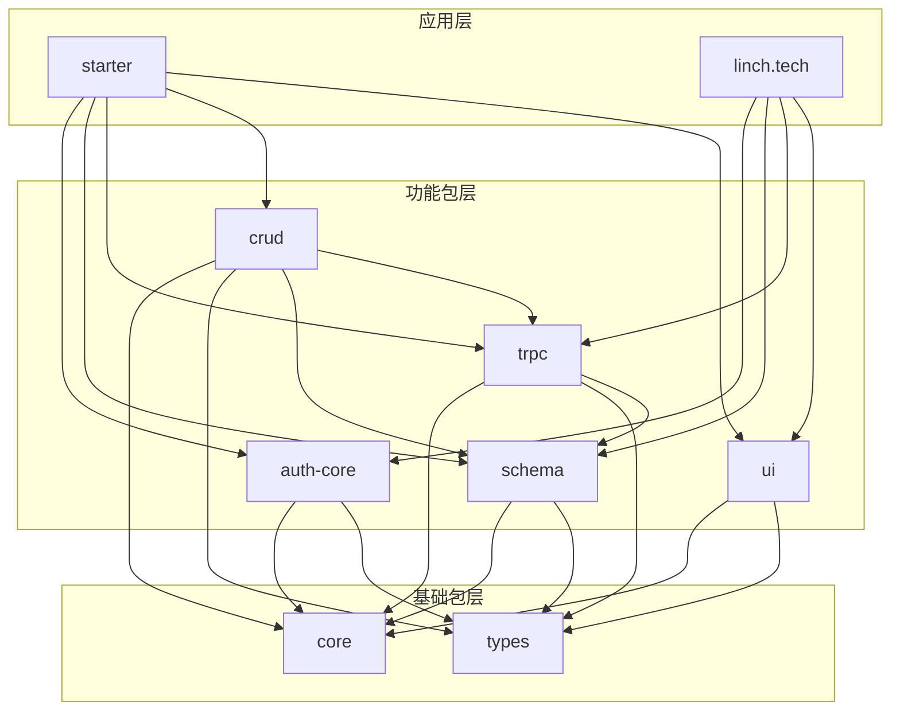

# 依赖关系图谱

## 概述

Linch Kit 项目的依赖关系图谱，包括包之间的依赖关系、外部依赖管理和版本控制策略。

## 包依赖关系

### 1. 依赖层次图



### 2. 包依赖详情

```typescript
interface PackageDependencies {
  '@linch-kit/types': {
    dependencies: []
    description: '基础类型定义，无依赖'
  }
  
  '@linch-kit/core': {
    dependencies: ['@linch-kit/types']
    description: '核心工具包，依赖类型定义'
  }
  
  '@linch-kit/auth-core': {
    dependencies: ['@linch-kit/core', '@linch-kit/types']
    description: '认证核心，依赖核心包和类型'
  }
  
  '@linch-kit/schema': {
    dependencies: ['@linch-kit/core', '@linch-kit/types']
    description: 'Schema 系统，依赖核心包和类型'
  }
  
  '@linch-kit/trpc': {
    dependencies: [
      '@linch-kit/core',
      '@linch-kit/types', 
      '@linch-kit/schema'
    ]
    description: 'tRPC 集成，依赖 Schema 系统'
  }
  
  '@linch-kit/crud': {
    dependencies: [
      '@linch-kit/core',
      '@linch-kit/types',
      '@linch-kit/schema',
      '@linch-kit/trpc'
    ]
    description: 'CRUD 操作，依赖完整技术栈'
  }
  
  '@linch-kit/ui': {
    dependencies: ['@linch-kit/core', '@linch-kit/types']
    description: 'UI 组件，依赖核心包和类型'
  }
}
```

## 外部依赖管理

### 1. 核心依赖

```typescript
interface CoreDependencies {
  typescript: '^5.8.3'
  zod: '^3.22.0'
  '@trpc/server': '^10.45.0'
  '@trpc/client': '^10.45.0'
  react: '^18.2.0'
  'next': '^14.0.0'
}
```

### 2. 开发依赖

```typescript
interface DevDependencies {
  turbo: '^2.5.4'
  tsup: '^8.5.0'
  vitest: '^1.2.0'
  eslint: '^9.29.0'
  prettier: '^3.5.3'
  '@changesets/cli': '^2.27.1'
}
```

### 3. 依赖版本策略

```typescript
interface VersionStrategy {
  internal: 'workspace:*'        // 内部包使用 workspace 协议
  peer: 'peerDependencies'       // React 等作为 peer 依赖
  exact: 'exact versions'        // 工具链使用精确版本
  range: 'compatible ranges'     // 库依赖使用兼容范围
}
```

## 构建依赖

### 1. 构建顺序

```typescript
interface BuildOrder {
  level0: ['@linch-kit/types']
  level1: ['@linch-kit/core']
  level2: ['@linch-kit/auth-core', '@linch-kit/schema']
  level3: ['@linch-kit/trpc', '@linch-kit/ui']
  level4: ['@linch-kit/crud']
  level5: ['starter', 'linch.tech']
}
```

### 2. 并行构建组

```typescript
interface ParallelBuildGroups {
  group1: {
    packages: ['@linch-kit/types']
    parallelizable: false
    reason: '基础依赖，必须先构建'
  }
  
  group2: {
    packages: ['@linch-kit/core']
    parallelizable: false
    reason: '核心包，其他包依赖'
  }
  
  group3: {
    packages: ['@linch-kit/auth-core', '@linch-kit/schema']
    parallelizable: true
    reason: '功能包，可并行构建'
  }
  
  group4: {
    packages: ['@linch-kit/trpc', '@linch-kit/ui']
    parallelizable: true
    reason: '集成包，可并行构建'
  }
}
```

## 运行时依赖

### 1. 客户端依赖

```typescript
interface ClientDependencies {
  react: 'UI 框架'
  '@trpc/client': 'API 客户端'
  '@linch-kit/ui': 'UI 组件'
  '@linch-kit/auth-core': '认证逻辑'
}
```

### 2. 服务端依赖

```typescript
interface ServerDependencies {
  '@trpc/server': 'API 服务器'
  '@linch-kit/schema': '数据验证'
  '@linch-kit/crud': 'CRUD 操作'
  '@linch-kit/auth-core': '认证中间件'
}
```

## 依赖优化

### 1. Bundle 分析

```typescript
interface BundleAnalysis {
  tree_shaking: 'ESM 模块支持摇树优化'
  code_splitting: '按需加载减少初始包大小'
  external_deps: '外部化大型依赖'
  peer_deps: '避免重复打包'
}
```

### 2. 性能优化

```typescript
interface PerformanceOptimization {
  lazy_loading: '延迟加载非关键模块'
  dynamic_imports: '动态导入减少启动时间'
  cache_strategy: '依赖缓存策略'
  version_pinning: '关键依赖版本锁定'
}
```

这个依赖关系图谱确保了 Linch Kit 项目的依赖管理清晰、构建高效和运行时性能优化。
