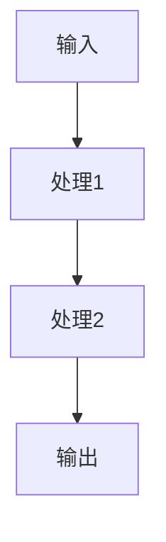

# [模块名称] 架构设计

**版本**: v1.0  
**创建**: [日期]  
**维护**: AI Assistant  
**状态**: 🚧 草稿 / 📋 审核 / ✅ 发布

## 🎯 模块概述

### 目标
- [ ] 主要功能目标1
- [ ] 主要功能目标2
- [ ] 主要功能目标3

### 范围
- **包含**: 
- **不包含**: 
- **依赖**: 

## 🏗️ 架构设计

### 组件层次
```
[模块名称]
├── [子模块1]
│   ├── [组件1]
│   └── [组件2]
├── [子模块2]
│   ├── [组件3]
│   └── [组件4]
└── [子模块3]
    ├── [组件5]
    └── [组件6]
```

### 数据流


### 状态管理
- **状态类型**: 
- **状态流转**: 
- **持久化**: 

## 📋 接口规范

### 核心接口
```typescript
interface [接口名称] {
  // 接口定义
}
```

### API 设计
```typescript
// API 类型定义
type [API类型] = {
  // API 定义
}
```

### 交互协议
- **输入协议**: 
- **输出协议**: 
- **错误处理**: 

## 🎨 用户体验设计

### 交互流程
1. **步骤1**: 用户操作描述
2. **步骤2**: 系统响应描述
3. **步骤3**: 结果展示描述

### 视觉设计
- **布局**: 
- **组件**: 
- **样式**: 

### 响应式设计
- **桌面端**: 
- **移动端**: 
- **平板端**: 

## 🔧 技术选型

### 核心技术
- **框架**: 
- **语言**: 
- **工具**: 

### 依赖库
- **必需依赖**: 
- **可选依赖**: 
- **开发依赖**: 

### 性能考量
- **性能目标**: 
- **优化策略**: 
- **监控指标**: 

### 扩展性设计
- **扩展点**: 
- **插件机制**: 
- **配置系统**: 

## 📈 实现计划

### 开发阶段
- [ ] **阶段1**: [阶段描述] (预计X天)
- [ ] **阶段2**: [阶段描述] (预计X天)
- [ ] **阶段3**: [阶段描述] (预计X天)

### 里程碑
- **里程碑1**: [日期] - [成果描述]
- **里程碑2**: [日期] - [成果描述]
- **里程碑3**: [日期] - [成果描述]

### 测试策略
- **单元测试**: 
- **集成测试**: 
- **端到端测试**: 

## 🚨 风险评估

### 技术风险
- **风险1**: [描述] - [应对方案]
- **风险2**: [描述] - [应对方案]

### 业务风险
- **风险1**: [描述] - [应对方案]
- **风险2**: [描述] - [应对方案]

### 缓解策略
- **策略1**: [描述]
- **策略2**: [描述]

## 📚 参考资料

### 相关文档
- [文档1 标题](./path/to/doc1.md)
- [文档2 标题](./path/to/doc2.md)

### 外部资源
- [资源1 标题](https://example.com)
- [资源2 标题](https://example.com)

## 📝 变更日志

### v1.0 ([日期])
- 初始版本创建
- 定义基础架构
- 确定技术选型

---

*此文档遵循 LinchKit 架构设计规范，由 AI Assistant 维护更新*