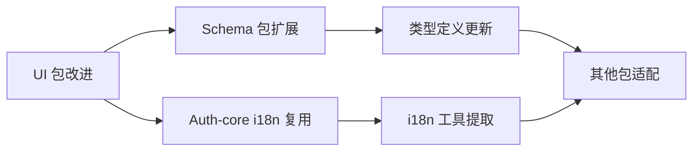

# LinchKit UI 组件架构设计

**最后更新**: 2025-06-21 15:30

## 🎯 架构概述

LinchKit UI 组件库采用统一包架构，将基础组件、CRUD 组件和 UI Blocks 集成在单一的 `@linch-kit/ui` 包中，通过子模块导出提供灵活的使用方式。

### 设计原则

1. **统一性**: 所有 UI 组件共享相同的设计系统和主题
2. **模块化**: 通过子模块导出支持按需使用
3. **扩展性**: 保留第三方组件的原生 API 访问能力
4. **Schema 驱动**: 深度集成 @linch-kit/schema 实现自动化配置
5. **国际化**: 全面支持多语言，与 auth-core 保持一致

## 📦 包结构设计

```
@linch-kit/ui/
├── src/
│   ├── components/
│   │   ├── ui/              # 基础 shadcn/ui 组件
│   │   ├── crud/            # CRUD 专用组件
│   │   ├── blocks/          # UI Blocks 组件
│   │   └── theme/           # 主题相关组件
│   ├── i18n/                # 国际化支持
│   ├── lib/                 # 工具函数
│   ├── providers/           # 上下文提供者
│   └── styles/              # 样式文件
├── crud.ts                  # CRUD 子模块导出
├── blocks.ts                # Blocks 子模块导出
└── package.json             # 包配置
```

### 导出结构

```typescript
// 基础组件
import { Button, Input, Card } from '@linch-kit/ui'

// CRUD 组件  
import { DataTable, FormBuilder } from '@linch-kit/ui/crud'

// UI Blocks
import { DashboardLayout, LoginForm } from '@linch-kit/ui/blocks'

// 主题组件
import { ThemeProvider, ThemeToggle } from '@linch-kit/ui/theme'
```

## 🧩 组件分层架构

### 第一层：基础组件 (ui/)
**职责**: 提供基础的 UI 构建块
- **来源**: shadcn/ui 官方组件
- **特点**: 无业务逻辑，高度可复用
- **示例**: Button, Input, Card, Dialog, Table

### 第二层：CRUD 组件 (crud/)
**职责**: 提供数据操作相关的高级组件
- **基础**: 基于第一层组件构建
- **特点**: 包含数据操作逻辑，支持 Schema 驱动
- **示例**: DataTable, FormBuilder, SearchableSelect

### 第三层：UI Blocks (blocks/)
**职责**: 提供页面级的预制组件
- **基础**: 基于前两层组件构建
- **特点**: 完整的功能模块，开箱即用
- **示例**: DashboardLayout, LoginForm, StatsCard

### 第四层：主题系统 (theme/)
**职责**: 提供主题和样式管理
- **基础**: 跨越所有层级
- **特点**: 统一的设计令牌和主题切换
- **示例**: ThemeProvider, ThemeToggle

## 🔧 核心改进要求

### 1. 国际化支持架构

#### 实现模式 (参考 auth-core)
```typescript
// i18n 基础设施
src/i18n/
├── index.ts          # 主入口，导出 useTranslation hook
├── types.ts          # i18n 类型定义
├── locales/
│   ├── zh.ts         # 中文语言包
│   └── en.ts         # 英文语言包
└── utils.ts          # i18n 工具函数
```

#### 组件集成模式
```typescript
// 组件中的使用方式
export function DataTable<TData>({ ... }: DataTableProps<TData>) {
  const { t } = useTranslation('ui')
  
  return (
    <div>
      <Input placeholder={t('table.searchPlaceholder')} />
      <span>{t('table.noResults')}</span>
    </div>
  )
}
```

#### 语言包结构
```typescript
// zh.ts
export const zh = {
  table: {
    searchPlaceholder: '搜索...',
    noResults: '暂无数据',
    rowsPerPage: '每页显示',
    // ...
  },
  form: {
    submit: '提交',
    cancel: '取消',
    required: '此字段为必填项',
    // ...
  }
}
```

### 2. 第三方组件封装策略

#### 封装层次设计
```typescript
// 基础层：简化 API
interface DataTableProps<TData> {
  data: TData[]
  columns: ColumnDef<TData>[]
  // 简化的常用配置
}

// 高级层：原生 API 透传
interface DataTableProps<TData> {
  // ... 基础配置
  tableProps?: Partial<TableOptions<TData>>  // TanStack Table 原生配置
  onTableReady?: (table: Table<TData>) => void  // 原生实例访问
}
```

#### 实现模式
```typescript
export function DataTable<TData>({
  data,
  columns,
  tableProps,
  onTableReady,
  ...props
}: DataTableProps<TData>) {
  const table = useReactTable({
    data,
    columns,
    // 合并用户的原生配置
    ...tableProps,
  })
  
  // 提供原生实例访问
  useEffect(() => {
    onTableReady?.(table)
  }, [table, onTableReady])
  
  return (
    <div {...props}>
      {/* 组件实现 */}
    </div>
  )
}
```

### 3. Schema 驱动的深度集成

#### Schema 扩展设计
```typescript
// 在 @linch-kit/schema 中扩展
interface FieldUIConfig {
  // 表格配置
  table?: {
    sortable?: boolean
    filterable?: boolean
    width?: number
    align?: 'left' | 'center' | 'right'
  }
  
  // 表单配置
  form?: {
    type?: FormFieldType
    placeholder?: string
    layout?: { colSpan?: number }
    validation?: ValidationConfig
  }
}

// 使用装饰器扩展
export const defineField = {
  string: () => ({
    // ... 现有实现
    ui: (config: FieldUIConfig) => ({ ... })
  })
}
```

#### 自动配置生成
```typescript
// DataTable 的 Schema 集成
interface DataTableSchemaProps<TData> {
  schema: ZodSchema<TData>
  data: TData[]
  // 自动从 schema 生成列配置
  autoColumns?: boolean
  // 覆盖自动生成的配置
  columnOverrides?: Partial<Record<keyof TData, ColumnDef<TData>>>
}

export function DataTableFromSchema<TData>({
  schema,
  data,
  autoColumns = true,
  columnOverrides = {},
}: DataTableSchemaProps<TData>) {
  const columns = useMemo(() => {
    if (!autoColumns) return []
    
    return generateColumnsFromSchema(schema, columnOverrides)
  }, [schema, autoColumns, columnOverrides])
  
  return <DataTable data={data} columns={columns} />
}
```

## 🔄 依赖关系管理

### 包间依赖影响


### 版本兼容性策略
1. **向后兼容**: 新 API 不破坏现有使用方式
2. **渐进式迁移**: 提供迁移指南和工具
3. **类型安全**: 确保所有包的类型定义兼容
4. **文档同步**: 同步更新所有相关文档

## 🧪 质量保证架构

### 测试策略
```
单元测试
├── 组件渲染测试
├── 交互行为测试
├── 国际化测试
└── Schema 集成测试

集成测试
├── 组件组合测试
├── 主题切换测试
├── 响应式测试
└── 无障碍访问测试

端到端测试
├── 完整用户流程
├── 跨浏览器兼容
└── 性能基准测试
```

### 性能监控
1. **包体积监控**: 确保 tree-shaking 有效
2. **渲染性能**: 监控组件渲染时间
3. **内存使用**: 防止内存泄漏
4. **加载时间**: 优化首次加载性能

## 📋 实施路线图

### 阶段 1: 国际化支持 (1-2 天)
- [ ] 研究 auth-core 的 i18n 实现
- [ ] 创建 UI 包的 i18n 基础设施
- [ ] 为所有组件添加 i18n 支持
- [ ] 创建完整的中英文语言包

### 阶段 2: 封装策略优化 (1-2 天)
- [ ] 重构 DataTable 组件封装
- [ ] 重构 FormBuilder 组件封装
- [ ] 重构 SearchableSelect 组件封装
- [ ] 添加原生 API 透传机制

### 阶段 3: Schema 深度集成 (2-3 天)
- [ ] 扩展 schema 包的 UI 配置类型
- [ ] 实现 DataTable 的 schema 集成
- [ ] 实现 FormBuilder 的 schema 集成
- [ ] 创建自动配置生成工具

### 阶段 4: 质量验证 (1 天)
- [ ] 完整的类型检查
- [ ] 功能测试验证
- [ ] 性能基准测试
- [ ] 文档更新完成

## 🚨 风险评估

### 技术风险
1. **类型兼容性**: Schema 扩展可能影响现有类型
2. **性能影响**: 深度集成可能影响组件性能
3. **包体积**: 功能增加可能导致包体积增大

### 缓解策略
1. **渐进式实施**: 分阶段实施，每阶段验证
2. **向后兼容**: 保持现有 API 不变
3. **性能监控**: 持续监控性能指标
4. **文档完善**: 提供详细的迁移指南

---

**相关文档**:
- [开发规范指南](../development-guidelines.md)
- [技术决策记录](./technical-decisions.md)
- [UI 组件最佳实践](../standards/ui-component-best-practices.md)
