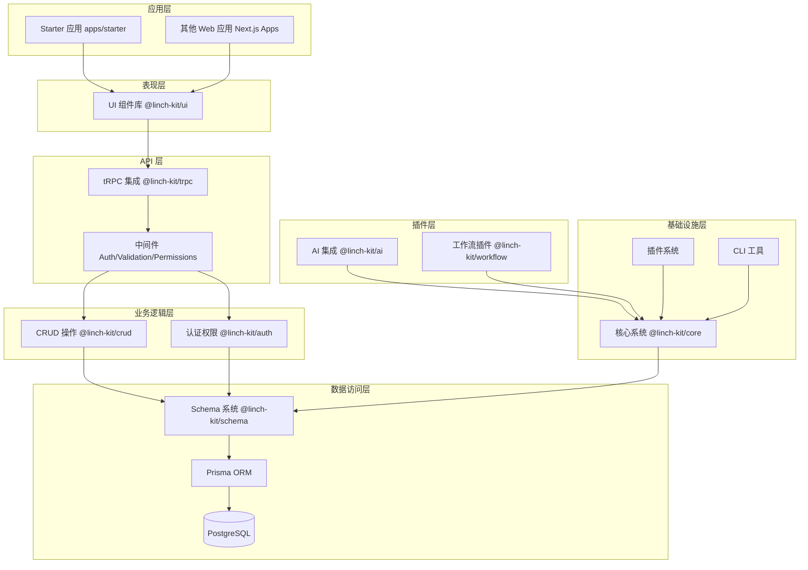
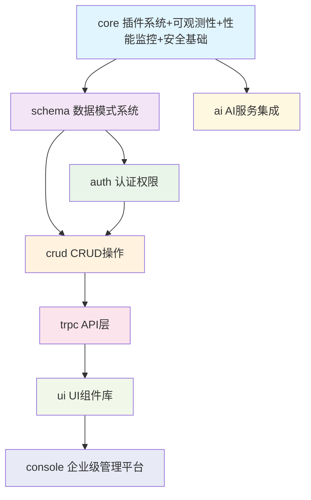
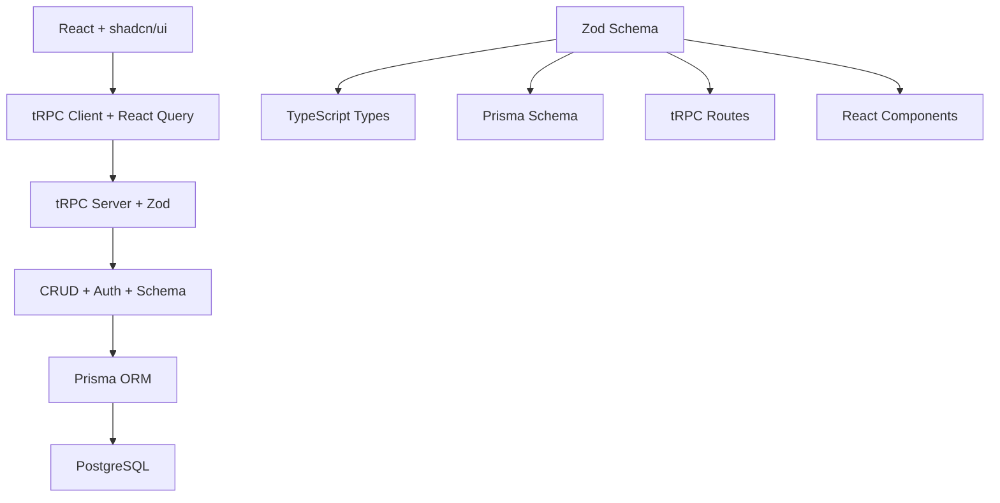
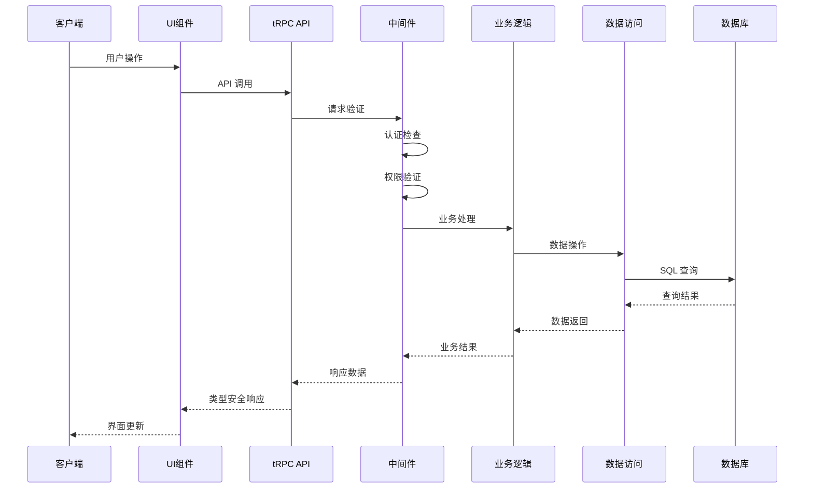
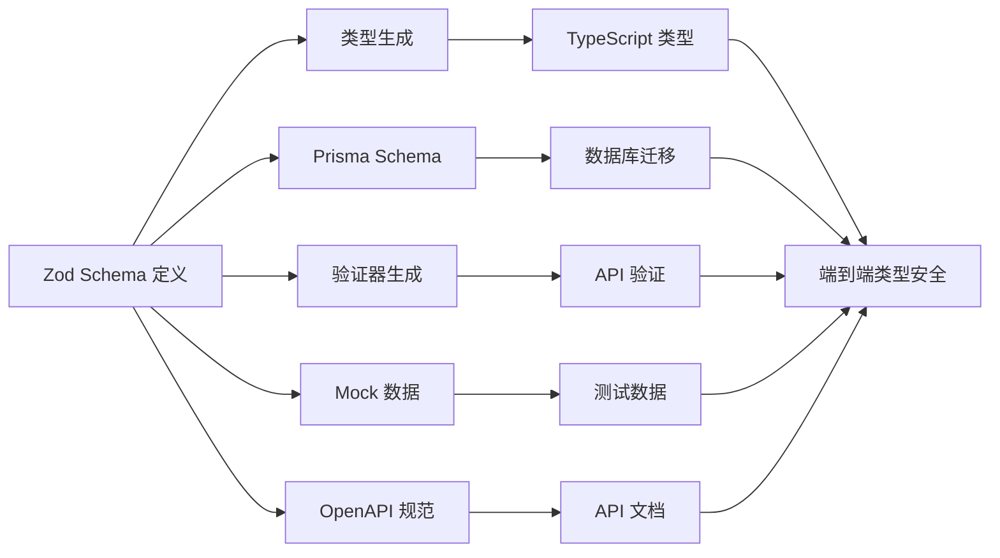
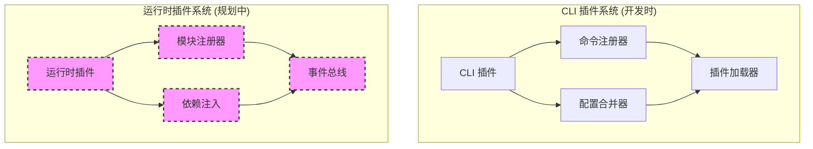
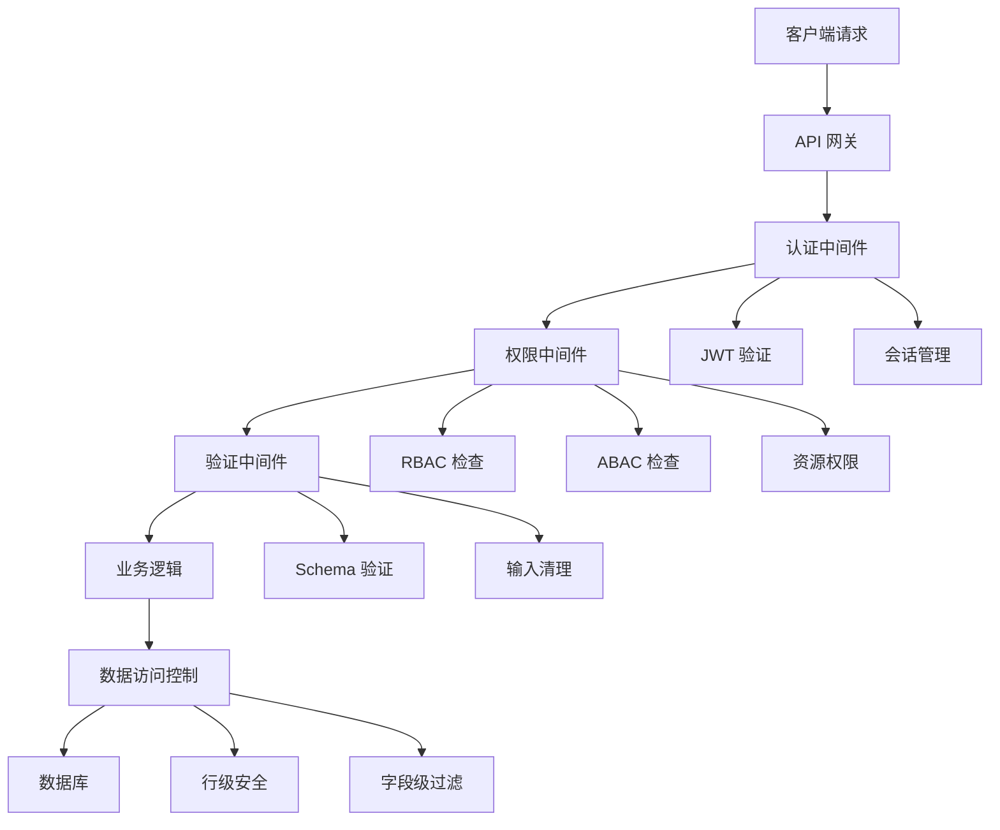

# LinchKit 系统架构设计

**文档版本**: v1.0.0
**创建日期**: 2025-06-23
**最后更新**: 2025-06-24
**维护责任**: 架构团队
**状态**: 🔒 设计冻结 - 禁止修改

---

## 🎯 架构设计理念

### 核心原则
- **AI-First**: 所有设计都优先考虑 AI 理解和处理能力
- **Schema 驱动**: 以 Zod Schema 为单一数据源，驱动整个系统
- **类型安全**: 端到端 TypeScript 类型安全保障
- **模块化**: 高内聚、低耦合的包设计
- **可扩展**: 插件化架构支持功能扩展
- **渐进式**: 支持从简单到复杂的渐进式开发

### 设计哲学
- **不重复造轮子**: 优先使用成熟的现有解决方案
- **约定优于配置**: 提供合理的默认配置
- **开发体验优先**: 优化开发者的使用体验
- **生产就绪**: 企业级的性能和可靠性

---

## 🏗️ 系统分层架构

### 整体架构图

---

## 📦 包依赖关系

### 主依赖链

### 构建顺序层级
| 层级 | 包名 | 依赖数量 | 构建时间 | 并行构建 |
|------|------|----------|----------|----------|
| Level 0 | core | 0 | ~45s | ✅ |
| Level 1 | schema, ai | 1 | ~45s | ✅ |
| Level 2 | auth | 2 | ~60s | ✅ |
| Level 3 | crud | 3 | ~60s | ✅ |
| Level 4 | trpc | 4 | ~40s | ✅ |
| Level 5 | ui | 1* | ~50s | ✅ |
| Level 6 | console | 5** | ~60s | ✅ |

*ui 包直接依赖 core，通过 core 获得所有通用类型和插件支持
*ai 包与其他业务包并行，独立提供 AI 服务能力
**console 包依赖 core、auth、crud、trpc、ui，提供企业级管理功能

---

## 🛠️ 技术栈架构

### 核心技术选型
| 层级 | 技术 | 版本 | 选择理由 |
|------|------|------|----------|
| **前端** | React | 19.1.0 | 最新稳定版，并发特性 |
| | Next.js | 15.3.4 | 全栈框架，App Router |
| | shadcn/ui | latest | 高质量组件库 |
| | Tailwind CSS | 4.1.10 | 原子化CSS，开发效率 |
| **API** | tRPC | 11.3.1 | 端到端类型安全 |
| | Zod | 3.25.67 | Schema验证，单一数据源 |
| **数据** | Prisma | 5.22.0 | 现代化TypeScript ORM |
| | PostgreSQL | ^14.0 | 功能丰富的关系型数据库 |
| **工具** | TypeScript | 5.8.3 | 静态类型检查 |
| | Turborepo | 2.5.4 | 高性能monorepo构建 |
| | pnpm | 10.12.1 | 高效包管理器 |
| | Vitest | ^2.0.0 | 快速单元测试 |

### 技术栈集成架构

---

## 📊 包功能概览

### 核心包设计
| 包名 | 功能定位 | 核心特性 | 开发优先级 |
|------|----------|----------|------------|
| **@linch-kit/core** | 基础设施 | 插件系统、可观测性、性能监控、安全基础、配置系统 | P0 - 最高 |
| **@linch-kit/schema** | 数据模式 | Schema定义、代码生成、类型推导、验证引擎 | P0 - 最高 |
| **@linch-kit/auth** | 认证权限 | 多提供者认证、RBAC/ABAC、多租户、MFA | P1 - 高 |
| **@linch-kit/crud** | 数据操作 | 类型安全CRUD、查询构建、事务管理、缓存 | P1 - 高 |
| **@linch-kit/trpc** | API层 | 类型安全API、中间件、错误处理、文档生成 | P1 - 高 |
| **@linch-kit/ui** | UI组件 | 组件库、主题系统、国际化、响应式设计 | P1 - 高 |

### 插件包设计
| 包名 | 功能定位 | 核心特性 | 开发优先级 |
|------|----------|----------|------------|
| **@linch-kit/ai** | AI集成 | 多提供商支持、智能缓存、成本控制、安全检查 | P2 - 中 |
| **@linch-kit/workflow** | 工作流 | 流程定义、状态管理、事件驱动、可视化编辑 | P2 - 中 |

### 企业级包设计
| 包名 | 功能定位 | 核心特性 | 开发优先级 |
|------|----------|----------|------------|
| **@linch-kit/console** | 企业管理 | 多租户管理、插件市场、高级监控、企业安全 | P1 - 高 |

### 应用示例
| 应用 | 功能定位 | 核心特性 | 开发优先级 |
|------|----------|----------|------------|
| **apps/starter** | 示例应用 | 完整功能演示、最佳实践、快速启动模板 | P2 - 中 |

---

## 🔄 数据流架构

### 请求处理流程

### Schema 驱动的代码生成流程

---

## 🔌 插件系统架构

### 双层插件架构

### 插件通信机制
- **CLI 插件**: 命令注册、配置合并、插件发现
- **运行时插件**: 模块注册、服务注入、事件总线

---

## 🛡️ 安全架构

### 多层安全防护

### 权限控制模型
- **操作级权限**: 控制用户可以执行的操作
- **字段级权限**: 控制用户可以访问的字段
- **行级权限**: 控制用户可以访问的数据行
- **多租户隔离**: 确保租户间数据隔离

---

## ⚠️ 循环依赖检查

### 当前状态: ✅ 无循环依赖

**检查结果**:
- ✅ 所有包依赖关系形成有向无环图 (DAG)
- ✅ 构建顺序明确，支持并行构建
- ✅ 类型推导链路清晰

### 潜在风险点
1. **core 包与 schema 包**
   - 风险: core 包包含基础类型定义，可能与 schema 包形成循环依赖
   - 解决方案: 严格限制 core 包只包含基础类型，复杂 schema 定义移至 schema 包

2. **console 包的企业级特性**
   - 风险: console 包可能重复实现 core 包的基础设施功能
   - 解决方案: console 包依赖 core 包的基础设施，专注于企业级管理功能

3. **ui 包与 trpc 包**
   - 风险: ui 可能需要直接使用 trpc 类型
   - 解决方案: 通过 core 包传递通用类型

4. **auth 包与 crud 包**
   - 风险: 双向依赖的可能性
   - 解决方案: auth 不依赖 crud，crud 依赖 auth 获取权限接口

5. **schema 包的中心化风险**
   - 风险: 过度依赖可能导致构建瓶颈
   - 解决方案: 保持 schema 包的轻量化

---

## 🎯 架构决策记录

### 已确定决策
- ✅ 废弃 @linch-kit/types 包，合并到 core
- ✅ auth 包不依赖 crud 包，避免循环依赖
- ✅ workflow 作为插件实现，不作为核心包
- ✅ AI 集成独立为 @linch-kit/ai 插件包
- ✅ 插件系统保持在 @linch-kit/core 内
- ✅ 企业级基础设施功能从 console 迁移到 core 包
- ✅ console 包重新定位为纯企业级管理平台
- ✅ 建立分层的企业级特性架构：基础设施(core) + 管理平台(console)

---

**重要提醒**: 本文档是 LinchKit 架构的核心设计，所有包的开发都必须严格遵循这里定义的架构原则、依赖关系和技术约束。
