# @linch-kit/crud 包技术文档

**包版本**: v1.0.0
**创建日期**: 2025-06-23
**开发优先级**: P1 - 高优先级
**依赖关系**: core → schema → auth → crud
**维护状态**: 🔄 开发中

---

## 📖 目录

1. [模块概览](#1-模块概览)
2. [API 设计](#2-api-设计)
3. [实现细节](#3-实现细节)
4. [集成接口](#4-集成接口)
5. [最佳实践](#5-最佳实践)
6. [性能考量](#6-性能考量)
7. [测试策略](#7-测试策略)
8. [AI 集成支持](#8-ai-集成支持)

---

## 1. 模块概览

### 1.1 功能定位

@linch-kit/crud 是 LinchKit 数据操作层的核心包，提供类型安全的 CRUD 操作抽象。它位于数据访问层和业务逻辑层之间，为上层应用提供统一的数据操作接口，同时与底层 ORM 解耦。

```mermaid
graph TB
    A[业务逻辑层] --> B[@linch-kit/crud]
    B --> C[ORM 适配器层]
    C --> D[Prisma]
    C --> E[Drizzle]
    C --> F[TypeORM]

    G[@linch-kit/auth] --> B
    H[@linch-kit/schema] --> B
    I[@linch-kit/core] --> B
```

### 1.2 核心价值

- **🔒 权限集成**: 与 @linch-kit/auth 深度集成，提供操作级、字段级、行级权限控制
- **📝 Schema 驱动**: 基于 @linch-kit/schema 定义自动生成 CRUD 接口和验证
- **🔄 事务支持**: 支持数据库事务和分布式事务，确保数据一致性
- **⚡ 性能优化**: 内置查询优化、缓存策略和批量操作支持
- **🔌 适配器模式**: 支持多种 ORM，便于迁移和扩展

### 1.3 技术架构

```typescript
// 核心架构概览
interface CRUDArchitecture {
  // 管理层：统一的 CRUD 操作管理
  manager: CRUDManager<T>

  // 操作层：具体的数据操作实现
  operations: {
    create: CreateOperation<T>
    read: ReadOperation<T>
    update: UpdateOperation<T>
    delete: DeleteOperation<T>
  }

  // 适配器层：ORM 抽象
  adapter: DataAdapter<T>

  // 权限层：权限控制集成
  permissions: PermissionManager

  // 事件层：操作事件发布订阅
  events: EventEmitter

  // 缓存层：查询结果缓存
  cache: CacheManager
}
```

### 1.4 职责边界

| 职责范围 | 包含功能 | 不包含功能 |
|---------|---------|-----------|
| **数据操作** | CRUD 操作、批量操作、事务管理 | 具体的数据存储实现 |
| **权限控制** | 操作级、字段级、行级权限检查 | 权限策略定义和管理 |
| **查询构建** | 类型安全的查询构建器、关联查询 | SQL 优化和执行计划 |
| **事件系统** | CRUD 操作事件发布订阅 | 业务事件处理逻辑 |
| **缓存管理** | 查询结果缓存和失效策略 | 分布式缓存协调 |

---

## 2. API 设计

### 2.1 核心接口设计

#### CRUDManager - 主要管理接口

```typescript
export interface CRUDManager<T extends BaseEntity> {
  // 基础 CRUD 操作
  create(data: CreateInput<T>): CreateOperation<T>
  read(): ReadOperation<T>
  update(id: string): UpdateOperation<T>
  delete(id: string): DeleteOperation<T>

  // 批量操作
  createMany(data: CreateInput<T>[]): BatchCreateOperation<T>
  updateMany(filter: FilterInput<T>): BatchUpdateOperation<T>
  deleteMany(filter: FilterInput<T>): BatchDeleteOperation<T>

  // 事务操作
  transaction<R>(fn: (tx: Transaction) => Promise<R>): Promise<R>

  // 权限控制
  withUser(user: User): this
  withPermissions(permissions: PermissionContext): this

  // 事件监听
  on<K extends keyof CRUDEvents<T>>(
    event: K,
    listener: (data: CRUDEvents<T>[K]) => void
  ): this
}
```

#### 链式操作接口

```typescript
// 创建操作
export interface CreateOperation<T> {
  withUser(user: User): this
  withValidation(schema: ZodSchema): this
  withHooks(hooks: CreateHooks<T>): this
  execute(): Promise<T>
}

// 读取操作
export interface ReadOperation<T> {
  where(filter: FilterInput<T>): this
  select(fields: SelectInput<T>): this
  include(relations: IncludeInput<T>): this
  orderBy(sort: SortInput<T>): this
  limit(count: number): this
  offset(skip: number): this
  withUser(user: User): this

  // 执行方法
  findMany(): Promise<T[]>
  findFirst(): Promise<T | null>
  findUnique(where: UniqueInput<T>): Promise<T | null>
  count(): Promise<number>
  paginate(params: PaginationParams): Promise<PaginatedResult<T>>
}
```

### 2.2 类型系统设计

#### 实体类型约束

```typescript
// 基础实体接口
export interface BaseEntity {
  id: string
  createdAt: Date
  updatedAt: Date
  deletedAt?: Date | null
}

// 输入类型生成
export type CreateInput<T extends BaseEntity> = Omit<T, 'id' | 'createdAt' | 'updatedAt'>
export type UpdateInput<T extends BaseEntity> = Partial<CreateInput<T>>
export type FilterInput<T extends BaseEntity> = Partial<T> & {
  AND?: FilterInput<T>[]
  OR?: FilterInput<T>[]
  NOT?: FilterInput<T>
}
```

#### 权限类型定义

```typescript
export interface PermissionContext {
  user: User
  roles: Role[]
  permissions: Permission[]
  context?: Record<string, any>
}

export interface PermissionCheck {
  resource: string
  action: 'create' | 'read' | 'update' | 'delete'
  field?: string
  condition?: (data: any) => boolean
}
```

### 2.3 配置接口设计

#### CRUD 配置

```typescript
export interface CRUDConfig<T extends BaseEntity> {
  // 实体配置
  entity: {
    name: string
    schema: EntitySchema<T>
    table?: string
  }

  // 适配器配置
  adapter: DataAdapter<T>

  // 权限配置
  permissions?: {
    enabled: boolean
    defaultPolicy: 'allow' | 'deny'
    fieldLevelControl: boolean
    rowLevelControl: boolean
  }

  // 缓存配置
  cache?: {
    enabled: boolean
    ttl: number
    strategy: 'memory' | 'redis' | 'hybrid'
    keyPrefix?: string
  }

  // 事件配置
  events?: {
    enabled: boolean
    async: boolean
    maxListeners: number
  }

  // 验证配置
  validation?: {
    enabled: boolean
    strict: boolean
    customValidators?: Record<string, ZodSchema>
  }
}
```

#### 适配器接口

```typescript
export interface DataAdapter<T extends BaseEntity> {
  // 基础操作
  create(data: CreateInput<T>): Promise<T>
  findMany(query: QueryInput<T>): Promise<T[]>
  findUnique(where: UniqueInput<T>): Promise<T | null>
  update(id: string, data: UpdateInput<T>): Promise<T>
  delete(id: string): Promise<T>

  // 批量操作
  createMany(data: CreateInput<T>[]): Promise<T[]>
  updateMany(filter: FilterInput<T>, data: UpdateInput<T>): Promise<number>
  deleteMany(filter: FilterInput<T>): Promise<number>

  // 事务支持
  transaction<R>(fn: (tx: TransactionContext) => Promise<R>): Promise<R>

  // 查询优化
  count(filter?: FilterInput<T>): Promise<number>
  exists(where: UniqueInput<T>): Promise<boolean>

  // 连接管理
  connect(): Promise<void>
  disconnect(): Promise<void>
  isConnected(): boolean
}
```

### 2.4 事件系统设计

#### 事件类型定义

```typescript
export interface CRUDEvents<T extends BaseEntity> {
  // 创建事件
  'before:create': { data: CreateInput<T>; user?: User; context?: any }
  'after:create': { data: T; user?: User; context?: any }
  'create:error': { error: Error; data: CreateInput<T>; user?: User }

  // 读取事件
  'before:read': { filter?: FilterInput<T>; user?: User; context?: any }
  'after:read': { data: T[]; user?: User; context?: any }
  'read:error': { error: Error; filter?: FilterInput<T>; user?: User }

  // 更新事件
  'before:update': { id: string; data: UpdateInput<T>; user?: User; context?: any }
  'after:update': { data: T; user?: User; context?: any }
  'update:error': { error: Error; id: string; data: UpdateInput<T>; user?: User }

  // 删除事件
  'before:delete': { id: string; user?: User; context?: any }
  'after:delete': { id: string; user?: User; context?: any }
  'delete:error': { error: Error; id: string; user?: User }
}
```

---

## 3. 实现细节

### 3.1 核心类实现

#### CRUDManager 实现

```typescript
export class CRUDManager<T extends BaseEntity> {
  private adapter: DataAdapter<T>
  private permissionManager: PermissionManager
  private eventEmitter: EventEmitter
  private cacheManager: CacheManager
  private config: CRUDConfig<T>

  constructor(config: CRUDConfig<T>) {
    this.config = config
    this.adapter = config.adapter
    this.permissionManager = new PermissionManager(config.permissions)
    this.eventEmitter = new EventEmitter()
    this.cacheManager = new CacheManager(config.cache)
  }

  create(data: CreateInput<T>): CreateOperation<T> {
    return new CreateOperation(this, data)
  }

  read(): ReadOperation<T> {
    return new ReadOperation(this)
  }

  update(id: string): UpdateOperation<T> {
    return new UpdateOperation(this, id)
  }

  delete(id: string): DeleteOperation<T> {
    return new DeleteOperation(this, id)
  }

  async transaction<R>(fn: (tx: Transaction) => Promise<R>): Promise<R> {
    return await this.adapter.transaction(async (txAdapter) => {
      const txManager = new CRUDManager({
        ...this.config,
        adapter: txAdapter
      })
      return await fn(txManager)
    })
  }
}
```

#### 查询构建器实现

```typescript
export class QueryBuilder<T extends BaseEntity> {
  private query: QueryState<T> = {}
  private permissionContext?: PermissionContext
  private manager: CRUDManager<T>

  constructor(manager: CRUDManager<T>) {
    this.manager = manager
  }

  where(filter: FilterInput<T>): this {
    this.query.where = { ...this.query.where, ...filter }
    return this
  }

  select(fields: SelectInput<T>): this {
    this.query.select = fields
    return this
  }

  include(relations: IncludeInput<T>): this {
    this.query.include = relations
    return this
  }

  withUser(user: User): this {
    this.permissionContext = { user, roles: user.roles, permissions: user.permissions }
    return this
  }

  async findMany(): Promise<T[]> {
    await this.applyPermissionFilters()
    const results = await this.manager.adapter.findMany(this.query)
    return await this.filterFieldsByPermissions(results)
  }

  private async applyPermissionFilters(): Promise<void> {
    if (!this.permissionContext) return

    const rowFilter = await this.manager.permissionManager.getRowFilter(
      this.permissionContext,
      this.manager.config.entity.name,
      'read'
    )

    if (rowFilter) {
      this.query.where = { ...this.query.where, ...rowFilter }
    }
  }
}
```

### 3.2 权限集成实现

#### 权限管理器

```typescript
export class PermissionManager {
  private authManager: AuthManager
  private config: PermissionConfig

  constructor(config: PermissionConfig) {
    this.config = config
    this.authManager = new AuthManager()
  }

  async checkOperationPermission(
    context: PermissionContext,
    entity: string,
    action: CRUDAction,
    data?: any
  ): Promise<boolean> {
    // 检查基础权限
    const hasBasicPermission = await this.authManager.checkPermission(
      context.user,
      `${entity}:${action}`
    )

    if (!hasBasicPermission) return false

    // 检查条件权限
    if (this.config.rowLevelControl && data) {
      return await this.checkRowLevelPermission(context, entity, action, data)
    }

    return true
  }

  async getRowFilter(
    context: PermissionContext,
    entity: string,
    action: CRUDAction
  ): Promise<FilterInput<any> | null> {
    const permissions = await this.authManager.getUserPermissions(context.user)
    const entityPermissions = permissions.filter(p => p.resource === entity && p.action === action)

    if (entityPermissions.length === 0) return null

    // 构建行级过滤条件
    const filters = entityPermissions
      .filter(p => p.condition)
      .map(p => p.condition)

    return filters.length > 0 ? { OR: filters } : null
  }

  async filterFields<T>(
    context: PermissionContext,
    entity: string,
    data: T[],
    action: 'read' | 'write'
  ): Promise<Partial<T>[]> {
    const allowedFields = await this.getAllowedFields(context, entity, action)

    return data.map(item =>
      this.pickFields(item, allowedFields)
    )
  }

  private async getAllowedFields(
    context: PermissionContext,
    entity: string,
    action: string
  ): Promise<string[]> {
    const permissions = await this.authManager.getUserPermissions(context.user)
    const fieldPermissions = permissions.filter(p =>
      p.resource === entity &&
      p.action === action &&
      p.field
    )

    return fieldPermissions.map(p => p.field!).filter(Boolean)
  }

  private pickFields<T>(obj: T, allowedFields: string[]): Partial<T> {
    const result: Partial<T> = {}
    for (const field of allowedFields) {
      if (field in obj) {
        (result as any)[field] = (obj as any)[field]
      }
    }
    return result
  }
}
```

### 3.3 适配器实现

#### Prisma 适配器

```typescript
export class PrismaAdapter<T extends BaseEntity> implements DataAdapter<T> {
  constructor(
    private prisma: PrismaClient,
    private modelName: string
  ) {}

  async create(data: CreateInput<T>): Promise<T> {
    return await this.prisma[this.modelName].create({
      data: this.transformInput(data)
    })
  }

  async findMany(query: QueryInput<T>): Promise<T[]> {
    return await this.prisma[this.modelName].findMany(
      this.transformQuery(query)
    )
  }

  async findUnique(where: UniqueInput<T>): Promise<T | null> {
    return await this.prisma[this.modelName].findUnique({
      where: this.transformWhere(where)
    })
  }

  async update(id: string, data: UpdateInput<T>): Promise<T> {
    return await this.prisma[this.modelName].update({
      where: { id },
      data: this.transformInput(data)
    })
  }

  async delete(id: string): Promise<T> {
    return await this.prisma[this.modelName].delete({
      where: { id }
    })
  }

  async transaction<R>(fn: (tx: TransactionContext) => Promise<R>): Promise<R> {
    return await this.prisma.$transaction(async (tx) => {
      const txAdapter = new PrismaAdapter(tx, this.modelName)
      return await fn(txAdapter)
    })
  }

  private transformInput(data: any): any {
    // 转换输入数据格式
    return data
  }

  private transformQuery(query: QueryInput<T>): any {
    // 转换查询格式
    return query
  }

  private transformWhere(where: UniqueInput<T>): any {
    // 转换条件格式
    return where
  }
}
```

#### 缓存策略实现

```typescript
export class CacheStrategy {
  private cache: Map<string, CacheEntry> = new Map()
  private lruOrder: string[] = []
  private maxSize: number = 1000
  private defaultTTL: number = 5 * 60 * 1000 // 5分钟

  async get<T>(key: string): Promise<T | null> {
    const entry = this.cache.get(key)

    if (!entry) {
      return null
    }

    // 检查过期
    if (Date.now() > entry.expiresAt) {
      this.cache.delete(key)
      this.removeFromLRU(key)
      return null
    }

    // 更新 LRU 顺序
    this.updateLRU(key)
    return entry.value as T
  }

  async set<T>(key: string, value: T, ttl?: number): Promise<void> {
    const expiresAt = Date.now() + (ttl || this.defaultTTL)

    // 如果缓存已满，移除最久未使用的项
    if (this.cache.size >= this.maxSize && !this.cache.has(key)) {
      this.evictLRU()
    }

    this.cache.set(key, { value, expiresAt })
    this.updateLRU(key)
  }

  private updateLRU(key: string): void {
    this.removeFromLRU(key)
    this.lruOrder.push(key)
  }

  private removeFromLRU(key: string): void {
    const index = this.lruOrder.indexOf(key)
    if (index > -1) {
      this.lruOrder.splice(index, 1)
    }
  }

  private evictLRU(): void {
    if (this.lruOrder.length > 0) {
      const oldestKey = this.lruOrder.shift()!
      this.cache.delete(oldestKey)
    }
  }

  getStats(): CacheStats {
    return {
      size: this.cache.size,
      maxSize: this.maxSize,
      hitRate: this.calculateHitRate(),
      memoryUsage: this.estimateMemoryUsage()
    }
  }

  private calculateHitRate(): number {
    // 实现命中率计算逻辑
    return 0.85 // 示例值
  }

  private estimateMemoryUsage(): number {
    // 估算内存使用量
    return this.cache.size * 1024 // 示例值
  }
}
```

#### 批处理优化实现

```typescript
export class BatchProcessor<T extends BaseEntity> {
  private batchSize: number = 100
  private maxWaitTime: number = 100 // 100ms
  private pendingOperations: BatchOperation<T>[] = []
  private batchTimer?: NodeJS.Timeout

  constructor(
    private adapter: DataAdapter<T>,
    private config: BatchConfig = {}
  ) {
    this.batchSize = config.batchSize || 100
    this.maxWaitTime = config.maxWaitTime || 100
  }

  async batchCreate(data: CreateInput<T>[]): Promise<T[]> {
    if (data.length <= this.batchSize) {
      return await this.adapter.createMany(data)
    }

    // 分批处理大量数据
    const results: T[] = []
    for (let i = 0; i < data.length; i += this.batchSize) {
      const batch = data.slice(i, i + this.batchSize)
      const batchResults = await this.adapter.createMany(batch)
      results.push(...batchResults)
    }

    return results
  }

  async batchUpdate(
    updates: Array<{ id: string; data: UpdateInput<T> }>
  ): Promise<T[]> {
    const results: T[] = []

    // 分批处理更新操作
    for (let i = 0; i < updates.length; i += this.batchSize) {
      const batch = updates.slice(i, i + this.batchSize)
      const batchPromises = batch.map(({ id, data }) =>
        this.adapter.update(id, data)
      )

      const batchResults = await Promise.all(batchPromises)
      results.push(...batchResults)
    }

    return results
  }

  async batchDelete(ids: string[]): Promise<number> {
    let deletedCount = 0

    // 分批删除
    for (let i = 0; i < ids.length; i += this.batchSize) {
      const batch = ids.slice(i, i + this.batchSize)
      const count = await this.adapter.deleteMany({
        id: { in: batch }
      } as FilterInput<T>)
      deletedCount += count
    }

    return deletedCount
  }

  // 智能批处理：自动收集操作并批量执行
  async queueOperation(operation: BatchOperation<T>): Promise<void> {
    this.pendingOperations.push(operation)

    // 如果达到批处理大小，立即执行
    if (this.pendingOperations.length >= this.batchSize) {
      await this.flushBatch()
      return
    }

    // 设置定时器，确保操作不会等待太久
    if (!this.batchTimer) {
      this.batchTimer = setTimeout(() => {
        this.flushBatch()
      }, this.maxWaitTime)
    }
  }

  private async flushBatch(): Promise<void> {
    if (this.pendingOperations.length === 0) return

    const operations = [...this.pendingOperations]
    this.pendingOperations = []

    if (this.batchTimer) {
      clearTimeout(this.batchTimer)
      this.batchTimer = undefined
    }

    // 按操作类型分组
    const grouped = this.groupOperationsByType(operations)

    // 并行执行不同类型的操作
    await Promise.all([
      this.executeBatchCreates(grouped.creates),
      this.executeBatchUpdates(grouped.updates),
      this.executeBatchDeletes(grouped.deletes)
    ])
  }

  private groupOperationsByType(operations: BatchOperation<T>[]) {
    return operations.reduce(
      (acc, op) => {
        acc[op.type + 's'].push(op)
        return acc
      },
      { creates: [], updates: [], deletes: [] } as any
    )
  }

  private async executeBatchCreates(operations: BatchOperation<T>[]): Promise<void> {
    if (operations.length === 0) return

    const data = operations.map(op => op.data)
    const results = await this.adapter.createMany(data)

    // 通知每个操作的完成
    operations.forEach((op, index) => {
      op.resolve(results[index])
    })
  }

  private async executeBatchUpdates(operations: BatchOperation<T>[]): Promise<void> {
    if (operations.length === 0) return

    const promises = operations.map(op =>
      this.adapter.update(op.id!, op.data)
    )

    const results = await Promise.all(promises)

    operations.forEach((op, index) => {
      op.resolve(results[index])
    })
  }

  private async executeBatchDeletes(operations: BatchOperation<T>[]): Promise<void> {
    if (operations.length === 0) return

    const ids = operations.map(op => op.id!)
    await this.adapter.deleteMany({
      id: { in: ids }
    } as FilterInput<T>)

    operations.forEach(op => {
      op.resolve(true)
    })
  }
}

interface BatchOperation<T> {
  type: 'create' | 'update' | 'delete'
  id?: string
  data?: CreateInput<T> | UpdateInput<T>
  resolve: (result: any) => void
  reject: (error: Error) => void
}

interface BatchConfig {
  batchSize?: number
  maxWaitTime?: number
}
```
```

#### 数据库连接池管理

```typescript
export class ConnectionPoolManager {
  private pool: Pool
  private config: PoolConfig
  private metrics: PoolMetrics
  private healthChecker: HealthChecker

  constructor(config: PoolConfig) {
    this.config = config
    this.metrics = new PoolMetrics()
    this.healthChecker = new HealthChecker(this)
    this.pool = this.createPool()
  }

  private createPool(): Pool {
    return new Pool({
      min: this.config.minConnections,
      max: this.config.maxConnections,
      idleTimeoutMillis: this.config.idleTimeout,
      acquireTimeoutMillis: this.config.acquireTimeout,
      evictionRunIntervalMillis: this.config.evictionInterval,

      // 连接创建函数
      create: async () => {
        const connection = await this.createConnection()
        this.metrics.incrementCreated()
        return connection
      },

      // 连接销毁函数
      destroy: async (connection) => {
        await this.destroyConnection(connection)
        this.metrics.incrementDestroyed()
      },

      // 连接验证函数
      validate: async (connection) => {
        return await this.validateConnection(connection)
      }
    })
  }

  async getConnection(): Promise<DatabaseConnection> {
    const startTime = Date.now()

    try {
      const connection = await this.pool.acquire()
      const waitTime = Date.now() - startTime

      this.metrics.recordAcquisition(waitTime)
      return connection
    } catch (error) {
      this.metrics.incrementAcquisitionErrors()
      throw new ConnectionPoolError('Failed to acquire connection', error)
    }
  }

  async releaseConnection(connection: DatabaseConnection): Promise<void> {
    try {
      await this.pool.release(connection)
      this.metrics.incrementReleased()
    } catch (error) {
      this.metrics.incrementReleaseErrors()
      throw new ConnectionPoolError('Failed to release connection', error)
    }
  }

  async executeWithConnection<T>(
    operation: (connection: DatabaseConnection) => Promise<T>
  ): Promise<T> {
    const connection = await this.getConnection()

    try {
      return await operation(connection)
    } finally {
      await this.releaseConnection(connection)
    }
  }

  getMetrics(): PoolMetrics {
    return {
      ...this.metrics.getSnapshot(),
      activeConnections: this.pool.size,
      idleConnections: this.pool.available,
      pendingRequests: this.pool.pending
    }
  }

  async healthCheck(): Promise<PoolHealthStatus> {
    return await this.healthChecker.check()
  }

  async drain(): Promise<void> {
    await this.pool.drain()
    await this.pool.clear()
  }
}

class PoolMetrics {
  private created = 0
  private destroyed = 0
  private acquisitions = 0
  private releases = 0
  private acquisitionErrors = 0
  private releaseErrors = 0
  private acquisitionTimes: number[] = []

  incrementCreated(): void { this.created++ }
  incrementDestroyed(): void { this.destroyed++ }
  incrementReleased(): void { this.releases++ }
  incrementAcquisitionErrors(): void { this.acquisitionErrors++ }
  incrementReleaseErrors(): void { this.releaseErrors++ }

  recordAcquisition(waitTime: number): void {
    this.acquisitions++
    this.acquisitionTimes.push(waitTime)

    // 保持最近1000次记录
    if (this.acquisitionTimes.length > 1000) {
      this.acquisitionTimes.shift()
    }
  }

  getSnapshot(): PoolMetricsSnapshot {
    return {
      created: this.created,
      destroyed: this.destroyed,
      acquisitions: this.acquisitions,
      releases: this.releases,
      acquisitionErrors: this.acquisitionErrors,
      releaseErrors: this.releaseErrors,
      avgAcquisitionTime: this.calculateAvgAcquisitionTime(),
      errorRate: this.calculateErrorRate()
    }
  }

  private calculateAvgAcquisitionTime(): number {
    if (this.acquisitionTimes.length === 0) return 0
    return this.acquisitionTimes.reduce((a, b) => a + b, 0) / this.acquisitionTimes.length
  }

  private calculateErrorRate(): number {
    const totalOperations = this.acquisitions + this.acquisitionErrors
    return totalOperations > 0 ? this.acquisitionErrors / totalOperations : 0
  }
}
```

#### 事务处理机制

```typescript
export class TransactionManager {
  private activeTransactions: Map<string, Transaction> = new Map()
  private transactionTimeout: number = 30000 // 30秒

  async executeTransaction<T>(
    operations: (tx: Transaction) => Promise<T>,
    options: TransactionOptions = {}
  ): Promise<T> {
    const txId = this.generateTransactionId()
    const tx = await this.beginTransaction(txId, options)

    try {
      // 设置事务超时
      const timeoutPromise = this.createTimeoutPromise(txId)
      const operationPromise = operations(tx)

      const result = await Promise.race([operationPromise, timeoutPromise])

      await this.commitTransaction(txId)
      return result
    } catch (error) {
      await this.rollbackTransaction(txId)
      throw error
    } finally {
      this.cleanupTransaction(txId)
    }
  }

  private async beginTransaction(
    txId: string,
    options: TransactionOptions
  ): Promise<Transaction> {
    const connection = await this.connectionPool.getConnection()

    const tx = new Transaction(txId, connection, {
      isolationLevel: options.isolationLevel || 'READ_COMMITTED',
      readOnly: options.readOnly || false,
      timeout: options.timeout || this.transactionTimeout
    })

    await tx.begin()
    this.activeTransactions.set(txId, tx)

    return tx
  }

  private async commitTransaction(txId: string): Promise<void> {
    const tx = this.activeTransactions.get(txId)
    if (!tx) throw new Error(`Transaction ${txId} not found`)

    await tx.commit()
  }

  private async rollbackTransaction(txId: string): Promise<void> {
    const tx = this.activeTransactions.get(txId)
    if (!tx) return // 事务可能已经清理

    try {
      await tx.rollback()
    } catch (error) {
      // 记录回滚错误，但不抛出
      console.error(`Failed to rollback transaction ${txId}:`, error)
    }
  }

  private cleanupTransaction(txId: string): void {
    const tx = this.activeTransactions.get(txId)
    if (tx) {
      this.connectionPool.releaseConnection(tx.connection)
      this.activeTransactions.delete(txId)
    }
  }

  private createTimeoutPromise(txId: string): Promise<never> {
    return new Promise((_, reject) => {
      setTimeout(() => {
        reject(new TransactionTimeoutError(`Transaction ${txId} timed out`))
      }, this.transactionTimeout)
    })
  }

  private generateTransactionId(): string {
    return `tx_${Date.now()}_${Math.random().toString(36).substr(2, 9)}`
  }

  // 分布式事务支持（Saga 模式）
  async executeSaga<T>(
    steps: SagaStep[],
    options: SagaOptions = {}
  ): Promise<T> {
    const sagaId = this.generateSagaId()
    const executedSteps: SagaStep[] = []

    try {
      for (const step of steps) {
        await this.executeStep(step)
        executedSteps.push(step)
      }

      return await this.completeSaga(sagaId)
    } catch (error) {
      // 执行补偿操作
      await this.compensateSaga(executedSteps.reverse())
      throw error
    }
  }

  private async executeStep(step: SagaStep): Promise<void> {
    try {
      await step.execute()
    } catch (error) {
      throw new SagaStepError(`Step ${step.name} failed`, error)
    }
  }

  private async compensateSaga(steps: SagaStep[]): Promise<void> {
    for (const step of steps) {
      if (step.compensate) {
        try {
          await step.compensate()
        } catch (error) {
          // 记录补偿失败，但继续执行其他补偿
          console.error(`Compensation for step ${step.name} failed:`, error)
        }
      }
    }
  }
}

export class Transaction {
  constructor(
    public readonly id: string,
    public readonly connection: DatabaseConnection,
    private options: TransactionConfig
  ) {}

  async begin(): Promise<void> {
    await this.connection.query('BEGIN')

    if (this.options.isolationLevel) {
      await this.connection.query(
        `SET TRANSACTION ISOLATION LEVEL ${this.options.isolationLevel}`
      )
    }

    if (this.options.readOnly) {
      await this.connection.query('SET TRANSACTION READ ONLY')
    }
  }

  async commit(): Promise<void> {
    await this.connection.query('COMMIT')
  }

  async rollback(): Promise<void> {
    await this.connection.query('ROLLBACK')
  }

  async savepoint(name: string): Promise<void> {
    await this.connection.query(`SAVEPOINT ${name}`)
  }

  async rollbackToSavepoint(name: string): Promise<void> {
    await this.connection.query(`ROLLBACK TO SAVEPOINT ${name}`)
  }

  async releaseSavepoint(name: string): Promise<void> {
    await this.connection.query(`RELEASE SAVEPOINT ${name}`)
  }
}

interface SagaStep {
  name: string
  execute: () => Promise<void>
  compensate?: () => Promise<void>
}

interface TransactionOptions {
  isolationLevel?: 'READ_UNCOMMITTED' | 'READ_COMMITTED' | 'REPEATABLE_READ' | 'SERIALIZABLE'
  readOnly?: boolean
  timeout?: number
}

interface SagaOptions {
  timeout?: number
  retryPolicy?: RetryPolicy
}
```

---

## 4. 集成接口

### 4.1 与 @linch-kit/schema 集成

#### Schema 驱动的 CRUD 生成

```typescript
import { EntitySchema } from '@linch-kit/schema'
import { CRUDManager } from '@linch-kit/crud'

// 基于 Schema 自动生成 CRUD 管理器
export function createCRUDFromSchema<T extends BaseEntity>(
  schema: EntitySchema<T>,
  adapter: DataAdapter<T>
): CRUDManager<T> {
  return new CRUDManager({
    entity: {
      name: schema.name,
      schema: schema,
      table: schema.table
    },
    adapter,
    validation: {
      enabled: true,
      strict: true,
      customValidators: {
        create: schema.createValidator,
        update: schema.updateValidator,
        filter: schema.filterValidator
      }
    }
  })
}

// 使用示例
const userSchema = defineEntity('User', {
  name: z.string(),
  email: z.string().email(),
  age: z.number().optional()
})

const userCRUD = createCRUDFromSchema(userSchema, prismaAdapter)
```

#### 验证集成

```typescript
export class ValidationManager {
  constructor(private schemas: Record<string, ZodSchema>) {}

  async validateCreate<T>(
    entityName: string,
    data: CreateInput<T>
  ): Promise<CreateInput<T>> {
    const schema = this.schemas[`${entityName}:create`]
    if (!schema) throw new Error(`No create schema for ${entityName}`)

    return await schema.parseAsync(data)
  }

  async validateUpdate<T>(
    entityName: string,
    data: UpdateInput<T>
  ): Promise<UpdateInput<T>> {
    const schema = this.schemas[`${entityName}:update`]
    if (!schema) throw new Error(`No update schema for ${entityName}`)

    return await schema.parseAsync(data)
  }

  async validateFilter<T>(
    entityName: string,
    filter: FilterInput<T>
  ): Promise<FilterInput<T>> {
    const schema = this.schemas[`${entityName}:filter`]
    if (!schema) return filter

    return await schema.parseAsync(filter)
  }
}
```

### 4.2 与 @linch-kit/auth 集成

#### 权限中间件集成

```typescript
import { AuthManager, PermissionChecker } from '@linch-kit/auth'

export class CRUDAuthIntegration {
  constructor(
    private authManager: AuthManager,
    private permissionChecker: PermissionChecker
  ) {}

  createAuthenticatedCRUD<T extends BaseEntity>(
    config: CRUDConfig<T>
  ): CRUDManager<T> {
    return new CRUDManager({
      ...config,
      permissions: {
        enabled: true,
        defaultPolicy: 'deny',
        fieldLevelControl: true,
        rowLevelControl: true,
        checker: this.permissionChecker
      }
    })
  }

  async withUserContext<T extends BaseEntity>(
    crud: CRUDManager<T>,
    token: string
  ): Promise<CRUDManager<T>> {
    const session = await this.authManager.validateSession(token)
    if (!session) throw new Error('Invalid session')

    const user = await this.authManager.getUser(session.userId)
    return crud.withUser(user)
  }
}
```

### 4.3 与 @linch-kit/core 集成

#### 插件系统集成

```typescript
import { Plugin, PluginManager } from '@linch-kit/core'

export class CRUDPlugin implements Plugin {
  id = 'crud'
  name = 'CRUD Operations Plugin'
  version = '1.0.0'
  description = 'Provides CRUD operations with permission control and caching'

  async setup(context: PluginContext): Promise<void> {
    // 插件设置阶段
    console.log('CRUD plugin setup')
  }

  async activate(context: PluginContext): Promise<void> {
    // 注册 CRUD 相关的钩子
    context.hooks.register('crud:before-create', this.beforeCreate)
    context.hooks.register('crud:after-create', this.afterCreate)
    context.hooks.register('crud:before-read', this.beforeRead)
    context.hooks.register('crud:after-read', this.afterRead)
  }

  async deactivate(context: PluginContext): Promise<void> {
    // 清理钩子注册
    context.hooks.unregister('crud:before-create', this.beforeCreate)
    context.hooks.unregister('crud:after-create', this.afterCreate)
    context.hooks.unregister('crud:before-read', this.beforeRead)
    context.hooks.unregister('crud:after-read', this.afterRead)
  }

  private async beforeCreate(context: any): Promise<void> {
    // 创建前的钩子逻辑
  }

  private async afterCreate(context: any): Promise<void> {
    // 创建后的钩子逻辑
  }
}

// 使用插件
const pluginManager = new PluginManager()
await pluginManager.install(new CRUDPlugin())
```

---

## 5. 最佳实践

### 5.1 CRUD 操作最佳实践

#### 1. 使用链式 API 进行复杂查询

```typescript
// ✅ 推荐：使用链式 API
const users = await userCRUD
  .read()
  .where({ status: 'active' })
  .include({ posts: true })
  .orderBy({ createdAt: 'desc' })
  .limit(10)
  .withUser(currentUser)
  .findMany()

// ❌ 避免：直接传递复杂对象
const users = await userCRUD.findMany({
  where: { status: 'active' },
  include: { posts: true },
  orderBy: { createdAt: 'desc' },
  take: 10
})
```

#### 2. 合理使用批量操作

```typescript
// ✅ 推荐：使用批量操作
await userCRUD.createMany([
  { name: 'User 1', email: 'user1@example.com' },
  { name: 'User 2', email: 'user2@example.com' },
  { name: 'User 3', email: 'user3@example.com' }
])

// ❌ 避免：循环单个操作
for (const userData of usersData) {
  await userCRUD.create(userData).execute()
}
```

#### 3. 正确使用事务

```typescript
// ✅ 推荐：使用事务确保数据一致性
await userCRUD.transaction(async (tx) => {
  const user = await tx.create(userData).execute()
  await tx.update(user.id).set({ status: 'verified' }).execute()
  await profileCRUD.create({ userId: user.id, ...profileData }).execute()
})

// ❌ 避免：不使用事务的相关操作
const user = await userCRUD.create(userData).execute()
await userCRUD.update(user.id).set({ status: 'verified' }).execute()
await profileCRUD.create({ userId: user.id, ...profileData }).execute()
```

### 5.2 权限控制最佳实践

#### 1. 分层权限检查

```typescript
// ✅ 推荐：分层权限检查
class UserService {
  async createUser(userData: CreateUserInput, currentUser: User) {
    // 1. 操作级权限检查
    await this.checkCreatePermission(currentUser)

    // 2. 字段级权限检查
    const filteredData = await this.filterCreateFields(userData, currentUser)

    // 3. 执行创建
    return await userCRUD
      .create(filteredData)
      .withUser(currentUser)
      .execute()
  }

  private async checkCreatePermission(user: User): Promise<void> {
    const hasPermission = await authManager.checkPermission(user, 'user:create')
    if (!hasPermission) {
      throw new ForbiddenError('No permission to create users')
    }
  }
}
```

#### 2. 行级权限过滤

```typescript
// ✅ 推荐：自动应用行级过滤
const userPosts = await postCRUD
  .read()
  .where({ status: 'published' })
  .withUser(currentUser) // 自动应用行级过滤
  .findMany()

// 系统会自动添加类似这样的过滤条件：
// WHERE (status = 'published') AND (authorId = currentUser.id OR visibility = 'public')
```

### 5.3 性能优化最佳实践

#### 1. 查询优化

```typescript
// ✅ 推荐：使用 select 减少数据传输
const users = await userCRUD
  .read()
  .select(['id', 'name', 'email']) // 只选择需要的字段
  .where({ status: 'active' })
  .findMany()

// ✅ 推荐：使用分页避免大量数据
const result = await userCRUD
  .read()
  .where({ status: 'active' })
  .paginate({ page: 1, limit: 20 })
```

#### 2. 缓存策略

```typescript
// ✅ 推荐：配置合适的缓存策略
const userCRUD = new CRUDManager({
  entity: userEntity,
  adapter: prismaAdapter,
  cache: {
    enabled: true,
    ttl: 5 * 60 * 1000, // 5分钟
    strategy: 'redis',
    keyPrefix: 'user:'
  }
})

// ✅ 推荐：手动缓存失效
await userCRUD.update(userId).set(updateData).execute()
await cacheManager.invalidate(`user:${userId}`)
```

### 5.4 复杂查询优化最佳实践

#### 1. 查询计划优化

```typescript
// ✅ 推荐：使用查询计划分析
export class QueryOptimizer {
  async optimizeQuery<T>(
    query: QueryInput<T>,
    entityName: string
  ): Promise<OptimizedQuery<T>> {
    // 分析查询复杂度
    const complexity = this.analyzeComplexity(query)

    if (complexity.score > 100) {
      // 复杂查询优化
      return await this.optimizeComplexQuery(query, entityName)
    }

    return { query, optimizations: [] }
  }

  private analyzeComplexity<T>(query: QueryInput<T>): QueryComplexity {
    let score = 0

    // 分析 WHERE 条件复杂度
    if (query.where) {
      score += this.analyzeWhereComplexity(query.where)
    }

    // 分析 JOIN 复杂度
    if (query.include) {
      score += this.analyzeJoinComplexity(query.include)
    }

    // 分析排序复杂度
    if (query.orderBy) {
      score += this.analyzeSortComplexity(query.orderBy)
    }

    return { score, factors: this.getComplexityFactors(query) }
  }

  private async optimizeComplexQuery<T>(
    query: QueryInput<T>,
    entityName: string
  ): Promise<OptimizedQuery<T>> {
    const optimizations: QueryOptimization[] = []
    let optimizedQuery = { ...query }

    // 1. 索引建议
    const indexSuggestions = await this.suggestIndexes(query, entityName)
    if (indexSuggestions.length > 0) {
      optimizations.push({
        type: 'INDEX_SUGGESTION',
        description: 'Consider adding indexes for better performance',
        suggestions: indexSuggestions
      })
    }

    // 2. 查询重写
    const rewrittenQuery = this.rewriteQuery(optimizedQuery)
    if (rewrittenQuery !== optimizedQuery) {
      optimizations.push({
        type: 'QUERY_REWRITE',
        description: 'Query rewritten for better performance',
        before: optimizedQuery,
        after: rewrittenQuery
      })
      optimizedQuery = rewrittenQuery
    }

    // 3. 分页建议
    if (!query.limit && !query.offset) {
      optimizations.push({
        type: 'PAGINATION_SUGGESTION',
        description: 'Consider adding pagination for large result sets',
        suggestion: { limit: 100, offset: 0 }
      })
    }

    return { query: optimizedQuery, optimizations }
  }
}

// ✅ 推荐：使用查询缓存
export class QueryCache {
  private cache = new Map<string, CachedQuery>()
  private maxSize = 1000
  private defaultTTL = 5 * 60 * 1000 // 5分钟

  async getCachedQuery<T>(
    queryKey: string,
    queryFn: () => Promise<T[]>
  ): Promise<T[]> {
    const cached = this.cache.get(queryKey)

    if (cached && Date.now() < cached.expiresAt) {
      return cached.result
    }

    const result = await queryFn()
    this.setCachedQuery(queryKey, result)

    return result
  }

  private setCachedQuery<T>(queryKey: string, result: T[]): void {
    if (this.cache.size >= this.maxSize) {
      // 移除最旧的缓存项
      const oldestKey = this.cache.keys().next().value
      this.cache.delete(oldestKey)
    }

    this.cache.set(queryKey, {
      result,
      expiresAt: Date.now() + this.defaultTTL,
      createdAt: Date.now()
    })
  }

  invalidatePattern(pattern: string): void {
    for (const key of this.cache.keys()) {
      if (key.includes(pattern)) {
        this.cache.delete(key)
      }
    }
  }
}
```

#### 2. 大数据量处理策略

```typescript
// ✅ 推荐：流式处理大数据集
export class StreamProcessor<T extends BaseEntity> {
  constructor(
    private crudManager: CRUDManager<T>,
    private batchSize: number = 1000
  ) {}

  async *processLargeDataset(
    filter: FilterInput<T>,
    processor: (batch: T[]) => Promise<void>
  ): AsyncGenerator<ProcessingResult, void, unknown> {
    let offset = 0
    let totalProcessed = 0
    let hasMore = true

    while (hasMore) {
      const batch = await this.crudManager
        .read()
        .where(filter)
        .limit(this.batchSize)
        .offset(offset)
        .findMany()

      if (batch.length === 0) {
        hasMore = false
        break
      }

      try {
        await processor(batch)
        totalProcessed += batch.length

        yield {
          processed: batch.length,
          totalProcessed,
          offset,
          success: true
        }
      } catch (error) {
        yield {
          processed: 0,
          totalProcessed,
          offset,
          success: false,
          error: error.message
        }
      }

      offset += this.batchSize
      hasMore = batch.length === this.batchSize
    }
  }

  async bulkUpdate(
    filter: FilterInput<T>,
    updateData: UpdateInput<T>,
    options: BulkUpdateOptions = {}
  ): Promise<BulkUpdateResult> {
    const { batchSize = 1000, parallel = false } = options
    let totalUpdated = 0
    let errors: BulkUpdateError[] = []

    const processor = async (batch: T[]) => {
      const ids = batch.map(item => item.id)

      if (parallel) {
        // 并行更新
        const promises = ids.map(id =>
          this.crudManager.update(id).set(updateData).execute()
            .catch(error => ({ id, error }))
        )

        const results = await Promise.all(promises)
        const failed = results.filter(r => 'error' in r) as any[]

        totalUpdated += results.length - failed.length
        errors.push(...failed.map(f => ({ id: f.id, error: f.error.message })))
      } else {
        // 批量更新
        try {
          const count = await this.crudManager.updateMany(
            { id: { in: ids } } as FilterInput<T>
          ).set(updateData).execute()

          totalUpdated += count
        } catch (error) {
          errors.push({ batch: ids, error: error.message })
        }
      }
    }

    for await (const result of this.processLargeDataset(filter, processor)) {
      if (!result.success) {
        console.error(`Batch processing failed at offset ${result.offset}`)
      }
    }

    return { totalUpdated, errors }
  }
}

// ✅ 推荐：内存优化的数据导出
export class DataExporter<T extends BaseEntity> {
  async exportToCSV(
    query: QueryInput<T>,
    outputPath: string,
    options: ExportOptions = {}
  ): Promise<ExportResult> {
    const { batchSize = 1000, includeHeaders = true } = options
    const writeStream = fs.createWriteStream(outputPath)

    let totalExported = 0
    let offset = 0

    try {
      if (includeHeaders) {
        const headers = await this.getEntityHeaders()
        writeStream.write(headers.join(',') + '\n')
      }

      while (true) {
        const batch = await this.crudManager
          .read()
          .where(query.where)
          .select(query.select)
          .limit(batchSize)
          .offset(offset)
          .findMany()

        if (batch.length === 0) break

        for (const item of batch) {
          const csvRow = this.convertToCSVRow(item)
          writeStream.write(csvRow + '\n')
        }

        totalExported += batch.length
        offset += batchSize

        // 内存压力检查
        if (process.memoryUsage().heapUsed > 500 * 1024 * 1024) { // 500MB
          await this.waitForMemoryRelease()
        }
      }

      return { totalExported, success: true }
    } catch (error) {
      return { totalExported, success: false, error: error.message }
    } finally {
      writeStream.end()
    }
  }

  private async waitForMemoryRelease(): Promise<void> {
    return new Promise(resolve => {
      global.gc?.() // 强制垃圾回收（如果可用）
      setTimeout(resolve, 100)
    })
  }
}
```

#### 3. 并发控制策略

```typescript
// ✅ 推荐：乐观锁实现
export class OptimisticLockManager<T extends BaseEntity & { version: number }> {
  async updateWithOptimisticLock(
    id: string,
    updateData: UpdateInput<T>,
    expectedVersion: number
  ): Promise<T> {
    const current = await this.crudManager
      .read()
      .where({ id } as FilterInput<T>)
      .findUnique()

    if (!current) {
      throw new NotFoundError(`Entity with id ${id} not found`)
    }

    if (current.version !== expectedVersion) {
      throw new OptimisticLockError(
        `Entity has been modified. Expected version ${expectedVersion}, got ${current.version}`
      )
    }

    return await this.crudManager
      .update(id)
      .set({
        ...updateData,
        version: current.version + 1
      } as UpdateInput<T>)
      .execute()
  }
}

// ✅ 推荐：分布式锁实现
export class DistributedLockManager {
  constructor(private redisClient: Redis) {}

  async withLock<T>(
    lockKey: string,
    operation: () => Promise<T>,
    options: LockOptions = {}
  ): Promise<T> {
    const { timeout = 30000, retryDelay = 100, maxRetries = 300 } = options
    const lockValue = this.generateLockValue()

    let acquired = false
    let retries = 0

    while (!acquired && retries < maxRetries) {
      acquired = await this.acquireLock(lockKey, lockValue, timeout)

      if (!acquired) {
        await this.delay(retryDelay)
        retries++
      }
    }

    if (!acquired) {
      throw new LockAcquisitionError(`Failed to acquire lock ${lockKey}`)
    }

    try {
      return await operation()
    } finally {
      await this.releaseLock(lockKey, lockValue)
    }
  }

  private async acquireLock(
    key: string,
    value: string,
    timeout: number
  ): Promise<boolean> {
    const result = await this.redisClient.set(
      key,
      value,
      'PX',
      timeout,
      'NX'
    )
    return result === 'OK'
  }

  private async releaseLock(key: string, value: string): Promise<void> {
    const script = `
      if redis.call("get", KEYS[1]) == ARGV[1] then
        return redis.call("del", KEYS[1])
      else
        return 0
      end
    `
    await this.redisClient.eval(script, 1, key, value)
  }

  private generateLockValue(): string {
    return `${process.pid}_${Date.now()}_${Math.random()}`
  }

  private delay(ms: number): Promise<void> {
    return new Promise(resolve => setTimeout(resolve, ms))
  }
}
```

### 5.5 错误处理最佳实践

#### 1. 统一错误处理

```typescript
// ✅ 推荐：使用统一的 LinchKit 错误类型
import {
  LinchKitError,
  ValidationError,
  AuthorizationError,
  NotFoundError,
  ConflictError,
  DatabaseError,
  ErrorContext,
  ErrorCategory
} from '@linch-kit/core'

export class CRUDError extends LinchKitError {
  readonly category = ErrorCategory.BUSINESS_LOGIC
}

export class CRUDEntityNotFoundError extends NotFoundError {
  readonly code = 'CRUD_ENTITY_NOT_FOUND'

  constructor(entityType: string, id: string, context?: ErrorContext) {
    super(`${entityType} with id ${id} not found`, entityType, id, context)
  }
}

export class CRUDDuplicateEntityError extends ConflictError {
  readonly code = 'CRUD_DUPLICATE_ENTITY'

  constructor(entityType: string, field: string, value: any, context?: ErrorContext) {
    super(`${entityType} with ${field} '${value}' already exists`, {
      ...context,
      metadata: { entityType, field, value, ...context?.metadata }
    })
  }
}

export class CRUDValidationError extends ValidationError {
  readonly code = 'CRUD_VALIDATION_ERROR'

  constructor(message: string, field: string, value: any, context?: ErrorContext) {
    super(message, field, value, context)
  }
}

export class CRUDPermissionError extends AuthorizationError {
  readonly code = 'CRUD_PERMISSION_ERROR'

  constructor(message: string, resource: string, action: string, context?: ErrorContext) {
    super(message, {
      ...context,
      metadata: { resource, action, ...context?.metadata }
    })
  }
}

export class OptimisticLockError extends CRUDError {
  constructor(message: string) {
    super(message, 'OPTIMISTIC_LOCK_ERROR')
  }
}

export class ConnectionPoolError extends CRUDError {
  constructor(message: string, cause?: Error) {
    super(message, 'CONNECTION_POOL_ERROR', { cause })
  }
}
```

#### 2. 错误恢复策略

```typescript
// ✅ 推荐：实现重试机制
export class RetryManager {
  async executeWithRetry<T>(
    operation: () => Promise<T>,
    options: RetryOptions = {}
  ): Promise<T> {
    const {
      maxRetries = 3,
      baseDelay = 1000,
      maxDelay = 10000,
      backoffFactor = 2,
      retryableErrors = ['TIMEOUT', 'CONNECTION_ERROR', 'TEMPORARY_FAILURE']
    } = options

    let lastError: Error

    for (let attempt = 0; attempt <= maxRetries; attempt++) {
      try {
        return await operation()
      } catch (error) {
        lastError = error

        if (attempt === maxRetries) {
          break
        }

        if (!this.isRetryableError(error, retryableErrors)) {
          throw error
        }

        const delay = Math.min(
          baseDelay * Math.pow(backoffFactor, attempt),
          maxDelay
        )

        await this.delay(delay)
      }
    }

    throw lastError!
  }

  private isRetryableError(error: Error, retryableErrors: string[]): boolean {
    if (error instanceof CRUDError) {
      return retryableErrors.includes(error.code)
    }
    return false
  }

  private delay(ms: number): Promise<void> {
    return new Promise(resolve => setTimeout(resolve, ms))
  }
}

// ✅ 推荐：断路器模式
export class CircuitBreaker {
  private failures = 0
  private lastFailureTime = 0
  private state: 'CLOSED' | 'OPEN' | 'HALF_OPEN' = 'CLOSED'

  constructor(
    private threshold: number = 5,
    private timeout: number = 60000,
    private resetTimeout: number = 30000
  ) {}

  async execute<T>(operation: () => Promise<T>): Promise<T> {
    if (this.state === 'OPEN') {
      if (Date.now() - this.lastFailureTime > this.resetTimeout) {
        this.state = 'HALF_OPEN'
      } else {
        throw new CircuitBreakerOpenError('Circuit breaker is open')
      }
    }

    try {
      const result = await operation()
      this.onSuccess()
      return result
    } catch (error) {
      this.onFailure()
      throw error
    }
  }

  private onSuccess(): void {
    this.failures = 0
    this.state = 'CLOSED'
  }

  private onFailure(): void {
    this.failures++
    this.lastFailureTime = Date.now()

    if (this.failures >= this.threshold) {
      this.state = 'OPEN'
    }
  }
}
```

---

## 6. 性能考量

### 6.1 构建性能指标

| 指标 | 目标值 | 当前值 | 优化策略 |
|------|--------|--------|----------|
| **DTS 构建时间** | < 12秒 | 8秒 | 类型简化、增量构建 |
| **包大小** | < 800KB | 650KB | Tree-shaking、代码分割 |
| **类型推导深度** | < 3层 | 2层 | 类型别名、条件类型 |
| **内存使用** | < 200MB | 150MB | 对象池、弱引用 |

### 6.2 运行时性能指标

#### 查询性能

```typescript
// 性能监控装饰器
export function measurePerformance(target: any, propertyName: string, descriptor: PropertyDescriptor) {
  const method = descriptor.value

  descriptor.value = async function (...args: any[]) {
    const start = performance.now()
    try {
      const result = await method.apply(this, args)
      const duration = performance.now() - start

      // 记录性能指标
      performanceLogger.log({
        operation: `${target.constructor.name}.${propertyName}`,
        duration,
        args: args.length,
        success: true
      })

      return result
    } catch (error) {
      const duration = performance.now() - start
      performanceLogger.log({
        operation: `${target.constructor.name}.${propertyName}`,
        duration,
        args: args.length,
        success: false,
        error: error.message
      })
      throw error
    }
  }
}

// 使用示例
export class CRUDManager<T extends BaseEntity> {
  @measurePerformance
  async create(data: CreateInput<T>): Promise<T> {
    // 实现逻辑
  }
}
```

#### 缓存性能优化

```typescript
export class CacheManager {
  private cache: Map<string, CacheEntry> = new Map()
  private stats = {
    hits: 0,
    misses: 0,
    evictions: 0
  }

  async get<T>(key: string): Promise<T | null> {
    const entry = this.cache.get(key)

    if (!entry || this.isExpired(entry)) {
      this.stats.misses++
      return null
    }

    this.stats.hits++
    return entry.value
  }

  async set<T>(key: string, value: T, ttl?: number): Promise<void> {
    const entry: CacheEntry = {
      value,
      createdAt: Date.now(),
      ttl: ttl || this.defaultTTL
    }

    // LRU 淘汰策略
    if (this.cache.size >= this.maxSize) {
      this.evictLRU()
    }

    this.cache.set(key, entry)
  }

  getStats() {
    const total = this.stats.hits + this.stats.misses
    return {
      ...this.stats,
      hitRate: total > 0 ? this.stats.hits / total : 0
    }
  }
}
```

### 6.3 数据库索引优化

#### 智能索引分析器

```typescript
export class IndexAnalyzer {
  constructor(private databaseAdapter: DatabaseAdapter) {}

  async analyzeQueryPerformance(
    queries: QueryLog[],
    timeWindow: TimeWindow
  ): Promise<IndexAnalysisResult> {
    const slowQueries = queries.filter(q => q.executionTime > 1000) // >1秒
    const frequentQueries = this.groupByPattern(queries)

    const recommendations: IndexRecommendation[] = []

    // 分析慢查询
    for (const query of slowQueries) {
      const analysis = await this.analyzeSlowQuery(query)
      if (analysis.indexSuggestion) {
        recommendations.push(analysis.indexSuggestion)
      }
    }

    // 分析频繁查询
    for (const [pattern, queryGroup] of frequentQueries) {
      if (queryGroup.length > 100) { // 频繁查询阈值
        const analysis = await this.analyzeFrequentQuery(pattern, queryGroup)
        recommendations.push(...analysis.indexSuggestions)
      }
    }

    return {
      totalQueries: queries.length,
      slowQueries: slowQueries.length,
      recommendations: this.deduplicateRecommendations(recommendations),
      estimatedImprovement: this.calculateEstimatedImprovement(recommendations)
    }
  }

  private async analyzeSlowQuery(query: QueryLog): Promise<QueryAnalysis> {
    const explainPlan = await this.databaseAdapter.explain(query.sql)
    const bottlenecks = this.identifyBottlenecks(explainPlan)

    const indexSuggestion = this.generateIndexSuggestion(query, bottlenecks)

    return {
      query,
      bottlenecks,
      indexSuggestion,
      estimatedImprovement: this.estimateImprovement(query, indexSuggestion)
    }
  }

  private generateIndexSuggestion(
    query: QueryLog,
    bottlenecks: QueryBottleneck[]
  ): IndexRecommendation | null {
    const seqScans = bottlenecks.filter(b => b.type === 'SEQUENTIAL_SCAN')

    if (seqScans.length === 0) return null

    const fields = this.extractIndexableFields(query, seqScans)

    if (fields.length === 0) return null

    return {
      table: query.table,
      fields,
      type: this.determineIndexType(fields, query),
      priority: this.calculatePriority(query, bottlenecks),
      estimatedCost: this.estimateIndexCost(query.table, fields),
      estimatedBenefit: this.estimateIndexBenefit(query, fields)
    }
  }

  async createOptimalIndexes(
    recommendations: IndexRecommendation[],
    budget: IndexBudget
  ): Promise<IndexCreationResult> {
    // 按优先级和成本效益比排序
    const sortedRecommendations = recommendations.sort((a, b) => {
      const ratioA = a.estimatedBenefit / a.estimatedCost
      const ratioB = b.estimatedBenefit / b.estimatedCost
      return ratioB - ratioA
    })

    const createdIndexes: CreatedIndex[] = []
    let totalCost = 0

    for (const recommendation of sortedRecommendations) {
      if (totalCost + recommendation.estimatedCost > budget.maxCost) {
        break
      }

      try {
        const index = await this.createIndex(recommendation)
        createdIndexes.push(index)
        totalCost += recommendation.estimatedCost
      } catch (error) {
        console.error(`Failed to create index:`, error)
      }
    }

    return {
      createdIndexes,
      totalCost,
      estimatedImprovement: createdIndexes.reduce(
        (sum, idx) => sum + idx.estimatedBenefit,
        0
      )
    }
  }

  private async createIndex(recommendation: IndexRecommendation): Promise<CreatedIndex> {
    const indexName = this.generateIndexName(recommendation)
    const sql = this.generateCreateIndexSQL(indexName, recommendation)

    const startTime = Date.now()
    await this.databaseAdapter.execute(sql)
    const creationTime = Date.now() - startTime

    return {
      name: indexName,
      table: recommendation.table,
      fields: recommendation.fields,
      type: recommendation.type,
      creationTime,
      estimatedBenefit: recommendation.estimatedBenefit
    }
  }
}
```

#### 内存使用优化

```typescript
export class MemoryOptimizer {
  private memoryThresholds = {
    warning: 0.8,  // 80%
    critical: 0.9  // 90%
  }

  async optimizeMemoryUsage(crudManager: CRUDManager<any>): Promise<MemoryOptimization> {
    const currentUsage = process.memoryUsage()
    const heapUsageRatio = currentUsage.heapUsed / currentUsage.heapTotal

    const optimizations: MemoryOptimizationAction[] = []

    if (heapUsageRatio > this.memoryThresholds.critical) {
      // 紧急内存清理
      optimizations.push(...await this.emergencyCleanup(crudManager))
    } else if (heapUsageRatio > this.memoryThresholds.warning) {
      // 预防性优化
      optimizations.push(...await this.preventiveOptimization(crudManager))
    }

    return {
      beforeOptimization: currentUsage,
      afterOptimization: process.memoryUsage(),
      optimizations,
      memoryFreed: this.calculateMemoryFreed(currentUsage, process.memoryUsage())
    }
  }

  private async emergencyCleanup(crudManager: CRUDManager<any>): Promise<MemoryOptimizationAction[]> {
    const actions: MemoryOptimizationAction[] = []

    // 1. 清理缓存
    await crudManager.cache.clear()
    actions.push({
      type: 'CACHE_CLEAR',
      description: 'Cleared all cache entries',
      memoryFreed: await this.estimateCacheMemory(crudManager.cache)
    })

    // 2. 强制垃圾回收
    if (global.gc) {
      global.gc()
      actions.push({
        type: 'GARBAGE_COLLECTION',
        description: 'Forced garbage collection',
        memoryFreed: 0 // 难以准确估算
      })
    }

    // 3. 关闭空闲连接
    const closedConnections = await this.closeIdleConnections()
    actions.push({
      type: 'CONNECTION_CLEANUP',
      description: `Closed ${closedConnections} idle connections`,
      memoryFreed: closedConnections * 1024 * 1024 // 估算每连接1MB
    })

    return actions
  }

  private async preventiveOptimization(crudManager: CRUDManager<any>): Promise<MemoryOptimizationAction[]> {
    const actions: MemoryOptimizationAction[] = []

    // 1. 清理过期缓存
    const expiredEntries = await crudManager.cache.cleanupExpired()
    actions.push({
      type: 'CACHE_CLEANUP',
      description: `Removed ${expiredEntries} expired cache entries`,
      memoryFreed: expiredEntries * 1024 // 估算每条目1KB
    })

    // 2. 优化查询结果集大小
    const queryOptimizations = await this.optimizeActiveQueries()
    actions.push(...queryOptimizations)

    return actions
  }

  // 对象池模式减少内存分配
  createObjectPool<T>(
    factory: () => T,
    reset: (obj: T) => void,
    maxSize: number = 100
  ): ObjectPool<T> {
    return new ObjectPool(factory, reset, maxSize)
  }
}

export class ObjectPool<T> {
  private pool: T[] = []
  private inUse = new Set<T>()

  constructor(
    private factory: () => T,
    private reset: (obj: T) => void,
    private maxSize: number
  ) {}

  acquire(): T {
    let obj = this.pool.pop()

    if (!obj) {
      obj = this.factory()
    }

    this.inUse.add(obj)
    return obj
  }

  release(obj: T): void {
    if (!this.inUse.has(obj)) return

    this.inUse.delete(obj)
    this.reset(obj)

    if (this.pool.length < this.maxSize) {
      this.pool.push(obj)
    }
  }

  getStats(): PoolStats {
    return {
      poolSize: this.pool.length,
      inUse: this.inUse.size,
      maxSize: this.maxSize
    }
  }
}

// 弱引用缓存减少内存泄漏
export class WeakReferenceCache<K, V extends object> {
  private cache = new Map<K, WeakRef<V>>()
  private registry = new FinalizationRegistry((key: K) => {
    this.cache.delete(key)
  })

  set(key: K, value: V): void {
    const ref = new WeakRef(value)
    this.cache.set(key, ref)
    this.registry.register(value, key)
  }

  get(key: K): V | undefined {
    const ref = this.cache.get(key)
    if (!ref) return undefined

    const value = ref.deref()
    if (!value) {
      this.cache.delete(key)
      return undefined
    }

    return value
  }

  has(key: K): boolean {
    const ref = this.cache.get(key)
    if (!ref) return false

    const value = ref.deref()
    if (!value) {
      this.cache.delete(key)
      return false
    }

    return true
  }

  delete(key: K): boolean {
    return this.cache.delete(key)
  }

  clear(): void {
    this.cache.clear()
  }

  size(): number {
    // 清理无效引用
    for (const [key, ref] of this.cache.entries()) {
      if (!ref.deref()) {
        this.cache.delete(key)
      }
    }
    return this.cache.size
  }
}
```

#### 查询性能监控

```typescript
export class QueryPerformanceMonitor {
  private metrics = new Map<string, QueryMetrics>()
  private alertThresholds = {
    slowQuery: 1000,      // 1秒
    highFrequency: 100,   // 每分钟100次
    errorRate: 0.05       // 5%错误率
  }

  async recordQuery(
    queryId: string,
    sql: string,
    executionTime: number,
    success: boolean,
    metadata?: QueryMetadata
  ): Promise<void> {
    const existing = this.metrics.get(queryId) || this.createEmptyMetrics()

    existing.totalExecutions++
    existing.totalExecutionTime += executionTime
    existing.avgExecutionTime = existing.totalExecutionTime / existing.totalExecutions

    if (executionTime > existing.maxExecutionTime) {
      existing.maxExecutionTime = executionTime
    }

    if (executionTime < existing.minExecutionTime || existing.minExecutionTime === 0) {
      existing.minExecutionTime = executionTime
    }

    if (!success) {
      existing.errorCount++
    }

    existing.errorRate = existing.errorCount / existing.totalExecutions
    existing.lastExecuted = new Date()

    this.metrics.set(queryId, existing)

    // 检查告警条件
    await this.checkAlerts(queryId, existing, executionTime, success)
  }

  private async checkAlerts(
    queryId: string,
    metrics: QueryMetrics,
    executionTime: number,
    success: boolean
  ): Promise<void> {
    const alerts: PerformanceAlert[] = []

    // 慢查询告警
    if (executionTime > this.alertThresholds.slowQuery) {
      alerts.push({
        type: 'SLOW_QUERY',
        queryId,
        severity: executionTime > 5000 ? 'CRITICAL' : 'WARNING',
        message: `Query execution time: ${executionTime}ms`,
        metadata: { executionTime, threshold: this.alertThresholds.slowQuery }
      })
    }

    // 高频查询告警
    const recentExecutions = this.getRecentExecutions(queryId, 60000) // 1分钟
    if (recentExecutions > this.alertThresholds.highFrequency) {
      alerts.push({
        type: 'HIGH_FREQUENCY',
        queryId,
        severity: 'WARNING',
        message: `High query frequency: ${recentExecutions} executions/min`,
        metadata: { frequency: recentExecutions, threshold: this.alertThresholds.highFrequency }
      })
    }

    // 错误率告警
    if (metrics.errorRate > this.alertThresholds.errorRate && metrics.totalExecutions > 10) {
      alerts.push({
        type: 'HIGH_ERROR_RATE',
        queryId,
        severity: 'CRITICAL',
        message: `High error rate: ${(metrics.errorRate * 100).toFixed(2)}%`,
        metadata: { errorRate: metrics.errorRate, threshold: this.alertThresholds.errorRate }
      })
    }

    // 发送告警
    for (const alert of alerts) {
      await this.sendAlert(alert)
    }
  }

  async generatePerformanceReport(timeRange: TimeRange): Promise<PerformanceReport> {
    const queries = Array.from(this.metrics.entries())
      .filter(([_, metrics]) => this.isInTimeRange(metrics.lastExecuted, timeRange))

    const slowQueries = queries
      .filter(([_, metrics]) => metrics.avgExecutionTime > this.alertThresholds.slowQuery)
      .sort(([_, a], [__, b]) => b.avgExecutionTime - a.avgExecutionTime)
      .slice(0, 10)

    const frequentQueries = queries
      .sort(([_, a], [__, b]) => b.totalExecutions - a.totalExecutions)
      .slice(0, 10)

    const errorProneQueries = queries
      .filter(([_, metrics]) => metrics.errorRate > 0)
      .sort(([_, a], [__, b]) => b.errorRate - a.errorRate)
      .slice(0, 10)

    return {
      timeRange,
      totalQueries: queries.length,
      totalExecutions: queries.reduce((sum, [_, m]) => sum + m.totalExecutions, 0),
      avgExecutionTime: this.calculateOverallAvgTime(queries),
      slowQueries: slowQueries.map(([id, metrics]) => ({ queryId: id, ...metrics })),
      frequentQueries: frequentQueries.map(([id, metrics]) => ({ queryId: id, ...metrics })),
      errorProneQueries: errorProneQueries.map(([id, metrics]) => ({ queryId: id, ...metrics })),
      recommendations: await this.generateRecommendations(queries)
    }
  }

  private async generateRecommendations(
    queries: Array<[string, QueryMetrics]>
  ): Promise<PerformanceRecommendation[]> {
    const recommendations: PerformanceRecommendation[] = []

    // 分析慢查询
    const slowQueries = queries.filter(([_, m]) => m.avgExecutionTime > 1000)
    if (slowQueries.length > 0) {
      recommendations.push({
        type: 'INDEX_OPTIMIZATION',
        priority: 'HIGH',
        description: `${slowQueries.length} queries are running slowly. Consider adding indexes.`,
        affectedQueries: slowQueries.map(([id]) => id),
        estimatedImprovement: '50-80% performance improvement'
      })
    }

    // 分析频繁查询
    const frequentQueries = queries.filter(([_, m]) => m.totalExecutions > 1000)
    if (frequentQueries.length > 0) {
      recommendations.push({
        type: 'CACHING',
        priority: 'MEDIUM',
        description: `${frequentQueries.length} queries are executed frequently. Consider caching.`,
        affectedQueries: frequentQueries.map(([id]) => id),
        estimatedImprovement: '30-60% response time improvement'
      })
    }

    return recommendations
  }
}
```

#### 缓存命中率优化

```typescript
export class CacheOptimizer {
  private hitRateThreshold = 0.8 // 80%命中率目标
  private cacheMetrics = new Map<string, CacheMetrics>()

  async optimizeCacheStrategy(
    cacheManager: CacheManager,
    accessPatterns: AccessPattern[]
  ): Promise<CacheOptimizationResult> {
    const currentMetrics = await this.analyzeCacheMetrics(cacheManager)
    const optimizations: CacheOptimization[] = []

    // 1. TTL 优化
    const ttlOptimization = await this.optimizeTTL(accessPatterns)
    if (ttlOptimization) {
      optimizations.push(ttlOptimization)
    }

    // 2. 缓存键策略优化
    const keyOptimization = await this.optimizeCacheKeys(accessPatterns)
    if (keyOptimization) {
      optimizations.push(keyOptimization)
    }

    // 3. 预加载策略优化
    const preloadOptimization = await this.optimizePreloading(accessPatterns)
    if (preloadOptimization) {
      optimizations.push(preloadOptimization)
    }

    // 4. 淘汰策略优化
    const evictionOptimization = await this.optimizeEvictionPolicy(currentMetrics)
    if (evictionOptimization) {
      optimizations.push(evictionOptimization)
    }

    return {
      currentHitRate: currentMetrics.hitRate,
      targetHitRate: this.hitRateThreshold,
      optimizations,
      estimatedImprovement: this.calculateEstimatedImprovement(optimizations)
    }
  }

  private async optimizeTTL(accessPatterns: AccessPattern[]): Promise<CacheOptimization | null> {
    const patternAnalysis = this.analyzeAccessPatterns(accessPatterns)

    const recommendations: TTLRecommendation[] = []

    for (const [pattern, stats] of patternAnalysis) {
      const currentTTL = stats.averageTTL
      const accessFrequency = stats.accessesPerHour
      const dataVolatility = stats.updateFrequency

      let recommendedTTL: number

      if (accessFrequency > 100 && dataVolatility < 0.1) {
        // 高频访问，低变化率 -> 长TTL
        recommendedTTL = Math.max(currentTTL * 2, 3600000) // 至少1小时
      } else if (accessFrequency < 10 || dataVolatility > 0.5) {
        // 低频访问或高变化率 -> 短TTL
        recommendedTTL = Math.min(currentTTL * 0.5, 300000) // 最多5分钟
      } else {
        continue // 当前TTL合适
      }

      recommendations.push({
        pattern,
        currentTTL,
        recommendedTTL,
        reason: this.getTTLRecommendationReason(accessFrequency, dataVolatility)
      })
    }

    if (recommendations.length === 0) return null

    return {
      type: 'TTL_OPTIMIZATION',
      description: `Optimize TTL for ${recommendations.length} cache patterns`,
      recommendations,
      estimatedImprovement: 0.1 // 10% 命中率提升
    }
  }

  private async optimizePreloading(accessPatterns: AccessPattern[]): Promise<CacheOptimization | null> {
    // 分析访问模式，识别可预测的访问序列
    const sequences = this.identifyAccessSequences(accessPatterns)
    const preloadCandidates: PreloadCandidate[] = []

    for (const sequence of sequences) {
      if (sequence.confidence > 0.8 && sequence.frequency > 10) {
        preloadCandidates.push({
          trigger: sequence.trigger,
          preloadKeys: sequence.followingKeys,
          confidence: sequence.confidence,
          estimatedBenefit: sequence.frequency * 0.1 // 估算收益
        })
      }
    }

    if (preloadCandidates.length === 0) return null

    return {
      type: 'PRELOAD_OPTIMIZATION',
      description: `Add preloading for ${preloadCandidates.length} access patterns`,
      candidates: preloadCandidates,
      estimatedImprovement: 0.15 // 15% 命中率提升
    }
  }

  async implementOptimizations(
    cacheManager: CacheManager,
    optimizations: CacheOptimization[]
  ): Promise<OptimizationResult> {
    const results: OptimizationResult[] = []

    for (const optimization of optimizations) {
      try {
        const result = await this.implementOptimization(cacheManager, optimization)
        results.push(result)
      } catch (error) {
        results.push({
          type: optimization.type,
          success: false,
          error: error.message
        })
      }
    }

    return {
      totalOptimizations: optimizations.length,
      successfulOptimizations: results.filter(r => r.success).length,
      results,
      overallImprovement: await this.measureImprovement(cacheManager)
    }
  }

  private async implementOptimization(
    cacheManager: CacheManager,
    optimization: CacheOptimization
  ): Promise<OptimizationResult> {
    switch (optimization.type) {
      case 'TTL_OPTIMIZATION':
        return await this.implementTTLOptimization(cacheManager, optimization)

      case 'PRELOAD_OPTIMIZATION':
        return await this.implementPreloadOptimization(cacheManager, optimization)

      case 'EVICTION_OPTIMIZATION':
        return await this.implementEvictionOptimization(cacheManager, optimization)

      default:
        throw new Error(`Unknown optimization type: ${optimization.type}`)
    }
  }

  // 智能缓存预热
  async warmupCache(
    crudManager: CRUDManager<any>,
    warmupStrategy: WarmupStrategy
  ): Promise<WarmupResult> {
    const startTime = Date.now()
    let warmedEntries = 0
    let errors = 0

    try {
      switch (warmupStrategy.type) {
        case 'POPULAR_QUERIES':
          const popularQueries = await this.getPopularQueries(warmupStrategy.timeRange)
          for (const query of popularQueries) {
            try {
              await crudManager.read().where(query.filter).findMany()
              warmedEntries++
            } catch (error) {
              errors++
            }
          }
          break

        case 'RECENT_DATA':
          const recentData = await this.getRecentlyAccessedData(warmupStrategy.timeRange)
          for (const data of recentData) {
            try {
              await crudManager.read().where({ id: data.id }).findUnique()
              warmedEntries++
            } catch (error) {
              errors++
            }
          }
          break

        case 'PREDICTIVE':
          const predictions = await this.predictAccessPatterns()
          for (const prediction of predictions) {
            if (prediction.confidence > 0.7) {
              try {
                await crudManager.read().where(prediction.filter).findMany()
                warmedEntries++
              } catch (error) {
                errors++
              }
            }
          }
          break
      }

      return {
        success: true,
        warmedEntries,
        errors,
        duration: Date.now() - startTime,
        hitRateImprovement: await this.measureHitRateImprovement()
      }
    } catch (error) {
      return {
        success: false,
        warmedEntries,
        errors: errors + 1,
        duration: Date.now() - startTime,
        error: error.message
      }
    }
  }
}
```

---

## 7. 测试策略

### 7.1 测试架构

```mermaid
graph TB
    A[单元测试] --> B[集成测试]
    B --> C[端到端测试]
    C --> D[性能测试]

    A1[CRUD操作测试] --> A
    A2[权限检查测试] --> A
    A3[查询构建测试] --> A

    B1[数据库集成测试] --> B
    B2[权限集成测试] --> B
    B3[事件系统测试] --> B

    C1[完整流程测试] --> C
    C2[错误处理测试] --> C

    D1[查询性能测试] --> D
    D2[并发测试] --> D
    D3[内存泄漏测试] --> D
```



### 7.2 单元测试

#### CRUD 操作测试

```typescript
describe('CRUDManager', () => {
  let crudManager: CRUDManager<User>
  let mockAdapter: jest.Mocked<DataAdapter<User>>

  beforeEach(() => {
    mockAdapter = createMockAdapter()
    crudManager = new CRUDManager({
      entity: userEntity,
      adapter: mockAdapter
    })
  })

  describe('create', () => {
    it('should create entity successfully', async () => {
      const userData = { name: 'John', email: 'john@example.com' }
      const expectedUser = { id: '1', ...userData, createdAt: new Date(), updatedAt: new Date() }

      mockAdapter.create.mockResolvedValue(expectedUser)

      const result = await crudManager.create(userData).execute()

      expect(result).toEqual(expectedUser)
      expect(mockAdapter.create).toHaveBeenCalledWith(userData)
    })

    it('should validate input data', async () => {
      const invalidData = { name: '', email: 'invalid-email' }

      await expect(
        crudManager.create(invalidData).execute()
      ).rejects.toThrow(ValidationError)
    })

    it('should emit events', async () => {
      const userData = { name: 'John', email: 'john@example.com' }
      const eventSpy = jest.fn()

      crudManager.on('after:create', eventSpy)

      await crudManager.create(userData).execute()

      expect(eventSpy).toHaveBeenCalledWith({
        data: expect.objectContaining(userData),
        user: undefined,
        context: undefined
      })
    })
  })

  describe('read', () => {
    it('should apply filters correctly', async () => {
      const filter = { status: 'active' }
      const expectedUsers = [
        { id: '1', name: 'John', status: 'active' },
        { id: '2', name: 'Jane', status: 'active' }
      ]

      mockAdapter.findMany.mockResolvedValue(expectedUsers)

      const result = await crudManager
        .read()
        .where(filter)
        .findMany()

      expect(result).toEqual(expectedUsers)
      expect(mockAdapter.findMany).toHaveBeenCalledWith(
        expect.objectContaining({ where: filter })
      )
    })

    it('should support pagination', async () => {
      const paginationParams = { page: 1, limit: 10 }
      const expectedResult = {
        data: [],
        pagination: {
          page: 1,
          limit: 10,
          total: 0,
          totalPages: 0
        }
      }

      mockAdapter.findMany.mockResolvedValue([])
      mockAdapter.count.mockResolvedValue(0)

      const result = await crudManager
        .read()
        .paginate(paginationParams)

      expect(result).toEqual(expectedResult)
    })
  })
})
```

### 7.3 集成测试

#### 权限集成测试

```typescript
describe('CRUD Permission Integration', () => {
  let crudManager: CRUDManager<User>
  let authManager: AuthManager
  let testUser: User
  let adminUser: User

  beforeEach(async () => {
    // 设置测试数据库
    await setupTestDatabase()

    authManager = new AuthManager()
    testUser = await createTestUser({ role: 'user' })
    adminUser = await createTestUser({ role: 'admin' })

    crudManager = new CRUDManager({
      entity: userEntity,
      adapter: new PrismaAdapter(prisma, 'user'),
      permissions: {
        enabled: true,
        defaultPolicy: 'deny',
        fieldLevelControl: true,
        rowLevelControl: true
      }
    })
  })

  afterEach(async () => {
    await cleanupTestDatabase()
  })

  it('should allow admin to create users', async () => {
    const userData = { name: 'New User', email: 'new@example.com' }

    const result = await crudManager
      .create(userData)
      .withUser(adminUser)
      .execute()

    expect(result).toBeDefined()
    expect(result.name).toBe(userData.name)
  })

  it('should deny regular user from creating users', async () => {
    const userData = { name: 'New User', email: 'new@example.com' }

    await expect(
      crudManager
        .create(userData)
        .withUser(testUser)
        .execute()
    ).rejects.toThrow(PermissionError)
  })

  it('should filter sensitive fields for regular users', async () => {
    // 创建测试数据
    await crudManager
      .create({
        name: 'Test User',
        email: 'test@example.com',
        ssn: '123-45-6789' // 敏感字段
      })
      .withUser(adminUser)
      .execute()

    // 普通用户查询
    const result = await crudManager
      .read()
      .withUser(testUser)
      .findMany()

    expect(result[0]).not.toHaveProperty('ssn')
    expect(result[0]).toHaveProperty('name')
    expect(result[0]).toHaveProperty('email')
  })
})
```

### 7.4 压力测试

#### 并发操作压力测试

```typescript
describe('CRUD Stress Tests', () => {
  let crudManager: CRUDManager<User>

  beforeEach(async () => {
    await setupStressTestData() // 创建100000条测试数据
    crudManager = new CRUDManager({
      entity: userEntity,
      adapter: new PrismaAdapter(prisma, 'user'),
      cache: {
        enabled: true,
        ttl: 5 * 60 * 1000,
        strategy: 'redis'
      }
    })
  })

  it('should handle high concurrent read operations', async () => {
    const concurrentReads = 100
    const promises = Array.from({ length: concurrentReads }, () =>
      crudManager
        .read()
        .where({ status: 'active' })
        .limit(10)
        .findMany()
    )

    const start = performance.now()
    const results = await Promise.all(promises)
    const duration = performance.now() - start

    expect(results).toHaveLength(concurrentReads)
    expect(duration).toBeLessThan(5000) // 5秒内完成100个并发查询
    expect(results.every(r => Array.isArray(r))).toBe(true)
  })

  it('should handle mixed concurrent operations', async () => {
    const operations = [
      // 读操作
      ...Array.from({ length: 50 }, () => () =>
        crudManager.read().where({ status: 'active' }).findMany()
      ),
      // 写操作
      ...Array.from({ length: 20 }, (_, i) => () =>
        crudManager.create({
          name: `Concurrent User ${i}`,
          email: `concurrent${i}@example.com`,
          status: 'active'
        }).execute()
      ),
      // 更新操作
      ...Array.from({ length: 15 }, (_, i) => async () => {
        const users = await crudManager.read().limit(1).findMany()
        if (users.length > 0) {
          return crudManager.update(users[0].id).set({
            name: `Updated ${i}`
          }).execute()
        }
      }),
      // 删除操作
      ...Array.from({ length: 10 }, () => async () => {
        const users = await crudManager.read().where({ status: 'inactive' }).limit(1).findMany()
        if (users.length > 0) {
          return crudManager.delete(users[0].id).execute()
        }
      })
    ]

    // 随机打乱操作顺序
    const shuffledOperations = operations.sort(() => Math.random() - 0.5)

    const start = performance.now()
    const results = await Promise.allSettled(
      shuffledOperations.map(op => op())
    )
    const duration = performance.now() - start

    const successful = results.filter(r => r.status === 'fulfilled').length
    const failed = results.filter(r => r.status === 'rejected').length

    expect(successful).toBeGreaterThan(80) // 至少80%成功
    expect(failed).toBeLessThan(15) // 失败率小于15%
    expect(duration).toBeLessThan(10000) // 10秒内完成
  })

  it('should maintain performance under memory pressure', async () => {
    // 创建内存压力
    const memoryPressure = Array.from({ length: 1000 }, () =>
      new Array(10000).fill('memory pressure data')
    )

    const start = performance.now()

    // 在内存压力下执行操作
    const results = await Promise.all([
      crudManager.read().limit(100).findMany(),
      crudManager.createMany(Array.from({ length: 50 }, (_, i) => ({
        name: `Pressure User ${i}`,
        email: `pressure${i}@example.com`
      }))),
      crudManager.read().where({ status: 'active' }).count()
    ])

    const duration = performance.now() - start

    expect(results[0]).toHaveLength(100)
    expect(results[1]).toHaveLength(50)
    expect(typeof results[2]).toBe('number')
    expect(duration).toBeLessThan(3000) // 3秒内完成

    // 清理内存压力
    memoryPressure.length = 0
  })

  it('should handle connection pool exhaustion gracefully', async () => {
    // 创建超过连接池大小的并发操作
    const maxConnections = 20
    const excessiveOperations = maxConnections * 2

    const operations = Array.from({ length: excessiveOperations }, (_, i) =>
      crudManager.read().where({ id: `user-${i}` }).findUnique()
    )

    const start = performance.now()
    const results = await Promise.allSettled(operations)
    const duration = performance.now() - start

    const successful = results.filter(r => r.status === 'fulfilled').length
    const timeoutErrors = results
      .filter(r => r.status === 'rejected')
      .filter(r => (r as any).reason.code === 'CONNECTION_TIMEOUT').length

    expect(successful).toBeGreaterThan(0)
    expect(duration).toBeLessThan(30000) // 30秒超时

    // 应该有一些连接超时，但不应该全部失败
    if (timeoutErrors > 0) {
      expect(timeoutErrors).toBeLessThan(excessiveOperations)
    }
  })
})
```

#### 边界条件测试

```typescript
describe('CRUD Boundary Tests', () => {
  let crudManager: CRUDManager<User>

  beforeEach(async () => {
    crudManager = new CRUDManager({
      entity: userEntity,
      adapter: new PrismaAdapter(prisma, 'user')
    })
  })

  describe('Data Size Boundaries', () => {
    it('should handle maximum field length', async () => {
      const maxNameLength = 255
      const longName = 'a'.repeat(maxNameLength)

      const user = await crudManager.create({
        name: longName,
        email: 'long@example.com'
      }).execute()

      expect(user.name).toBe(longName)
      expect(user.name.length).toBe(maxNameLength)
    })

    it('should reject oversized data', async () => {
      const oversizedName = 'a'.repeat(256) // 超过最大长度

      await expect(
        crudManager.create({
          name: oversizedName,
          email: 'oversized@example.com'
        }).execute()
      ).rejects.toThrow(ValidationError)
    })

    it('should handle empty and null values correctly', async () => {
      // 测试空字符串
      const userWithEmpty = await crudManager.create({
        name: '',
        email: 'empty@example.com',
        bio: ''
      }).execute()

      expect(userWithEmpty.name).toBe('')
      expect(userWithEmpty.bio).toBe('')

      // 测试 null 值
      const userWithNull = await crudManager.create({
        name: 'Null User',
        email: 'null@example.com',
        bio: null
      }).execute()

      expect(userWithNull.bio).toBeNull()
    })

    it('should handle unicode and special characters', async () => {
      const unicodeName = '测试用户 🚀 émojis & spéciàl chars'

      const user = await crudManager.create({
        name: unicodeName,
        email: 'unicode@example.com'
      }).execute()

      expect(user.name).toBe(unicodeName)
    })
  })

  describe('Numeric Boundaries', () => {
    it('should handle maximum integer values', async () => {
      const maxAge = 2147483647 // 32位整数最大值

      const user = await crudManager.create({
        name: 'Max Age User',
        email: 'maxage@example.com',
        age: maxAge
      }).execute()

      expect(user.age).toBe(maxAge)
    })

    it('should handle minimum values', async () => {
      const user = await crudManager.create({
        name: 'Min User',
        email: 'min@example.com',
        age: 0,
        score: -999999
      }).execute()

      expect(user.age).toBe(0)
      expect(user.score).toBe(-999999)
    })

    it('should handle floating point precision', async () => {
      const preciseValue = 123.456789012345

      const user = await crudManager.create({
        name: 'Precise User',
        email: 'precise@example.com',
        balance: preciseValue
      }).execute()

      expect(user.balance).toBeCloseTo(preciseValue, 10)
    })
  })

  describe('Query Boundaries', () => {
    it('should handle very large result sets', async () => {
      // 创建大量测试数据
      const largeDataSet = Array.from({ length: 10000 }, (_, i) => ({
        name: `User ${i}`,
        email: `user${i}@example.com`
      }))

      await crudManager.createMany(largeDataSet)

      // 查询所有数据
      const allUsers = await crudManager.read().findMany()
      expect(allUsers.length).toBeGreaterThanOrEqual(10000)
    })

    it('should handle complex nested queries', async () => {
      const complexFilter = {
        OR: [
          {
            AND: [
              { age: { gte: 18 } },
              { age: { lte: 65 } },
              { status: 'active' }
            ]
          },
          {
            AND: [
              { role: 'admin' },
              { lastLogin: { gte: new Date('2024-01-01') } }
            ]
          }
        ],
        NOT: {
          email: { endsWith: '@spam.com' }
        }
      }

      const result = await crudManager
        .read()
        .where(complexFilter)
        .findMany()

      expect(Array.isArray(result)).toBe(true)
    })

    it('should handle pagination at boundaries', async () => {
      // 测试第一页
      const firstPage = await crudManager
        .read()
        .paginate({ page: 1, limit: 10 })

      expect(firstPage.pagination.page).toBe(1)
      expect(firstPage.data.length).toBeLessThanOrEqual(10)

      // 测试超出范围的页码
      const beyondLastPage = await crudManager
        .read()
        .paginate({ page: 99999, limit: 10 })

      expect(beyondLastPage.data).toHaveLength(0)
      expect(beyondLastPage.pagination.page).toBe(99999)
    })
  })
})
```

#### 数据一致性测试

```typescript
describe('CRUD Data Consistency Tests', () => {
  let crudManager: CRUDManager<User>
  let orderCrudManager: CRUDManager<Order>

  beforeEach(async () => {
    await setupConsistencyTestData()

    crudManager = new CRUDManager({
      entity: userEntity,
      adapter: new PrismaAdapter(prisma, 'user')
    })

    orderCrudManager = new CRUDManager({
      entity: orderEntity,
      adapter: new PrismaAdapter(prisma, 'order')
    })
  })

  describe('Transaction Consistency', () => {
    it('should maintain consistency in successful transactions', async () => {
      const initialUserCount = await crudManager.read().count()
      const initialOrderCount = await orderCrudManager.read().count()

      await crudManager.transaction(async (tx) => {
        // 创建用户
        const user = await tx.create({
          name: 'Transaction User',
          email: 'transaction@example.com'
        }).execute()

        // 创建订单
        await orderCrudManager.create({
          userId: user.id,
          amount: 100,
          status: 'pending'
        }).execute()
      })

      const finalUserCount = await crudManager.read().count()
      const finalOrderCount = await orderCrudManager.read().count()

      expect(finalUserCount).toBe(initialUserCount + 1)
      expect(finalOrderCount).toBe(initialOrderCount + 1)
    })

    it('should rollback on transaction failure', async () => {
      const initialUserCount = await crudManager.read().count()
      const initialOrderCount = await orderCrudManager.read().count()

      await expect(
        crudManager.transaction(async (tx) => {
          // 创建用户
          const user = await tx.create({
            name: 'Rollback User',
            email: 'rollback@example.com'
          }).execute()

          // 创建订单
          await orderCrudManager.create({
            userId: user.id,
            amount: 100,
            status: 'pending'
          }).execute()

          // 故意抛出错误
          throw new Error('Transaction should rollback')
        })
      ).rejects.toThrow('Transaction should rollback')

      const finalUserCount = await crudManager.read().count()
      const finalOrderCount = await orderCrudManager.read().count()

      // 数据应该回滚到初始状态
      expect(finalUserCount).toBe(initialUserCount)
      expect(finalOrderCount).toBe(initialOrderCount)
    })

    it('should handle nested transactions correctly', async () => {
      const initialCount = await crudManager.read().count()

      await crudManager.transaction(async (outerTx) => {
        // 外层事务创建用户
        const user1 = await outerTx.create({
          name: 'Outer User',
          email: 'outer@example.com'
        }).execute()

        await outerTx.transaction(async (innerTx) => {
          // 内层事务创建用户
          const user2 = await innerTx.create({
            name: 'Inner User',
            email: 'inner@example.com'
          }).execute()

          // 验证内层事务中可以看到外层的更改
          const users = await innerTx.read().findMany()
          expect(users.some(u => u.id === user1.id)).toBe(true)
          expect(users.some(u => u.id === user2.id)).toBe(true)
        })
      })

      const finalCount = await crudManager.read().count()
      expect(finalCount).toBe(initialCount + 2)
    })
  })

  describe('Concurrent Modification Consistency', () => {
    it('should handle concurrent updates with optimistic locking', async () => {
      // 创建测试用户
      const user = await crudManager.create({
        name: 'Concurrent User',
        email: 'concurrent@example.com',
        version: 1
      }).execute()

      // 模拟两个并发更新
      const update1 = crudManager
        .update(user.id)
        .set({ name: 'Updated by Process 1' })
        .where({ version: 1 })
        .execute()

      const update2 = crudManager
        .update(user.id)
        .set({ name: 'Updated by Process 2' })
        .where({ version: 1 })
        .execute()

      const results = await Promise.allSettled([update1, update2])

      // 只有一个更新应该成功
      const successful = results.filter(r => r.status === 'fulfilled')
      const failed = results.filter(r => r.status === 'rejected')

      expect(successful).toHaveLength(1)
      expect(failed).toHaveLength(1)

      // 验证版本号已更新
      const updatedUser = await crudManager.read().where({ id: user.id }).findUnique()
      expect(updatedUser?.version).toBe(2)
    })

    it('should maintain referential integrity', async () => {
      // 创建用户和订单
      const user = await crudManager.create({
        name: 'Ref User',
        email: 'ref@example.com'
      }).execute()

      const order = await orderCrudManager.create({
        userId: user.id,
        amount: 100,
        status: 'pending'
      }).execute()

      // 尝试删除有关联订单的用户应该失败
      await expect(
        crudManager.delete(user.id).execute()
      ).rejects.toThrow() // 外键约束错误

      // 先删除订单，再删除用户应该成功
      await orderCrudManager.delete(order.id).execute()
      await expect(
        crudManager.delete(user.id).execute()
      ).resolves.toBeDefined()
    })
  })

  describe('Cache Consistency', () => {
    it('should invalidate cache on data changes', async () => {
      const cacheManager = new CRUDManager({
        entity: userEntity,
        adapter: new PrismaAdapter(prisma, 'user'),
        cache: {
          enabled: true,
          ttl: 60000,
          strategy: 'memory'
        }
      })

      // 第一次查询，填充缓存
      const users1 = await cacheManager.read().where({ status: 'active' }).findMany()
      const cacheKey = 'users:status:active'

      // 验证缓存中有数据
      const cachedData = await cacheManager.cache.get(cacheKey)
      expect(cachedData).toBeDefined()

      // 更新数据
      await cacheManager.create({
        name: 'Cache Test User',
        email: 'cache@example.com',
        status: 'active'
      }).execute()

      // 缓存应该被失效
      const cachedDataAfterUpdate = await cacheManager.cache.get(cacheKey)
      expect(cachedDataAfterUpdate).toBeNull()

      // 再次查询应该返回更新后的数据
      const users2 = await cacheManager.read().where({ status: 'active' }).findMany()
      expect(users2.length).toBe(users1.length + 1)
    })

    it('should handle cache consistency across multiple instances', async () => {
      // 模拟多个应用实例
      const instance1 = new CRUDManager({
        entity: userEntity,
        adapter: new PrismaAdapter(prisma, 'user'),
        cache: { enabled: true, strategy: 'redis' }
      })

      const instance2 = new CRUDManager({
        entity: userEntity,
        adapter: new PrismaAdapter(prisma, 'user'),
        cache: { enabled: true, strategy: 'redis' }
      })

      // 实例1查询数据
      const users1 = await instance1.read().where({ status: 'active' }).findMany()

      // 实例2更新数据
      await instance2.create({
        name: 'Multi Instance User',
        email: 'multi@example.com',
        status: 'active'
      }).execute()

      // 实例1再次查询应该看到更新后的数据
      const users2 = await instance1.read().where({ status: 'active' }).findMany()
      expect(users2.length).toBe(users1.length + 1)
    })
  })

  describe('Event Consistency', () => {
    it('should emit events in correct order', async () => {
      const events: string[] = []

      crudManager.on('before:create', () => events.push('before:create'))
      crudManager.on('after:create', () => events.push('after:create'))
      crudManager.on('before:update', () => events.push('before:update'))
      crudManager.on('after:update', () => events.push('after:update'))

      // 创建用户
      const user = await crudManager.create({
        name: 'Event User',
        email: 'event@example.com'
      }).execute()

      // 更新用户
      await crudManager.update(user.id).set({ name: 'Updated Event User' }).execute()

      expect(events).toEqual([
        'before:create',
        'after:create',
        'before:update',
        'after:update'
      ])
    })

    it('should not emit after events on failure', async () => {
      const events: string[] = []

      crudManager.on('before:create', () => events.push('before:create'))
      crudManager.on('after:create', () => events.push('after:create'))
      crudManager.on('create:error', () => events.push('create:error'))

      // 尝试创建无效用户
      await expect(
        crudManager.create({
          name: '',
          email: 'invalid-email'
        }).execute()
      ).rejects.toThrow()

      expect(events).toEqual([
        'before:create',
        'create:error'
      ])
      expect(events).not.toContain('after:create')
    })
  })
})
```

---

## 8. AI 集成支持

### 8.1 智能查询优化

#### AI 驱动的查询分析

```typescript
export class AIQueryOptimizer {
  constructor(private aiService: AIService) {}

  async optimizeQuery<T>(
    query: QueryInput<T>,
    context: QueryContext
  ): Promise<OptimizedQuery<T>> {
    const analysis = await this.aiService.analyzeQuery({
      query,
      schema: context.schema,
      statistics: context.statistics,
      indexInfo: context.indexInfo
    })

    return {
      originalQuery: query,
      optimizedQuery: analysis.optimizedQuery,
      recommendations: analysis.recommendations,
      estimatedImprovement: analysis.estimatedImprovement
    }
  }

  async suggestIndexes<T>(
    entityName: string,
    queryPatterns: QueryPattern[]
  ): Promise<IndexSuggestion[]> {
    const suggestions = await this.aiService.suggestIndexes({
      entity: entityName,
      patterns: queryPatterns,
      currentIndexes: await this.getCurrentIndexes(entityName)
    })

    return suggestions.map(s => ({
      fields: s.fields,
      type: s.type,
      estimatedImprovement: s.estimatedImprovement,
      cost: s.cost
    }))
  }
}
```

### 8.2 智能数据分析

#### 异常检测

```typescript
export class CRUDAnomalyDetector {
  constructor(private aiService: AIService) {}

  async detectAnomalies(
    operations: CRUDOperation[],
    timeWindow: TimeWindow
  ): Promise<Anomaly[]> {
    const patterns = await this.aiService.analyzePatterns({
      operations,
      timeWindow,
      features: [
        'operation_frequency',
        'data_volume',
        'user_behavior',
        'error_rate'
      ]
    })

    return patterns.anomalies.map(a => ({
      type: a.type,
      severity: a.severity,
      description: a.description,
      affectedOperations: a.affectedOperations,
      suggestedActions: a.suggestedActions
    }))
  }

  async predictPerformanceIssues(
    currentMetrics: PerformanceMetrics
  ): Promise<PerformancePrediction> {
    return await this.aiService.predictPerformance({
      metrics: currentMetrics,
      historicalData: await this.getHistoricalMetrics(),
      predictionHorizon: '1h'
    })
  }
}
```

### 8.3 自然语言查询

#### 查询生成器

```typescript
export class NaturalLanguageQueryBuilder {
  constructor(
    private aiService: AIService,
    private schemaRegistry: SchemaRegistry
  ) {}

  async buildQueryFromNaturalLanguage<T>(
    naturalQuery: string,
    entityName: string,
    context?: QueryContext
  ): Promise<QueryInput<T>> {
    const schema = this.schemaRegistry.getSchema(entityName)

    const queryPlan = await this.aiService.parseNaturalQuery({
      query: naturalQuery,
      schema: schema.definition,
      context: context?.userContext,
      examples: await this.getQueryExamples(entityName)
    })

    return this.translateToQueryInput(queryPlan, schema)
  }

  async explainQuery<T>(
    query: QueryInput<T>,
    entityName: string
  ): Promise<QueryExplanation> {
    const explanation = await this.aiService.explainQuery({
      query,
      schema: this.schemaRegistry.getSchema(entityName).definition
    })

    return {
      summary: explanation.summary,
      steps: explanation.steps,
      performance: explanation.performanceAnalysis,
      alternatives: explanation.alternatives
    }
  }
}

// 使用示例
const nlQueryBuilder = new NaturalLanguageQueryBuilder(aiService, schemaRegistry)

// 自然语言查询
const query = await nlQueryBuilder.buildQueryFromNaturalLanguage(
  "Find all active users who registered in the last 30 days and have more than 5 posts",
  "User"
)

// 执行查询
const results = await userCRUD.read().where(query.where).findMany()
```

### 8.4 智能数据验证

#### AI 增强的数据验证

```typescript
export class AIDataValidator {
  constructor(private aiService: AIService) {}

  async validateData<T>(
    data: CreateInput<T> | UpdateInput<T>,
    entityName: string,
    operation: 'create' | 'update'
  ): Promise<ValidationResult> {
    // 基础 Schema 验证
    const schemaValidation = await this.validateSchema(data, entityName)

    // AI 增强验证
    const aiValidation = await this.aiService.validateData({
      data,
      entityName,
      operation,
      context: {
        similarRecords: await this.getSimilarRecords(data, entityName),
        businessRules: await this.getBusinessRules(entityName),
        historicalPatterns: await this.getHistoricalPatterns(entityName)
      }
    })

    return {
      isValid: schemaValidation.isValid && aiValidation.isValid,
      errors: [...schemaValidation.errors, ...aiValidation.errors],
      warnings: aiValidation.warnings,
      suggestions: aiValidation.suggestions,
      confidence: aiValidation.confidence
    }
  }

  async suggestDataCorrections<T>(
    invalidData: T,
    validationErrors: ValidationError[]
  ): Promise<DataCorrection<T>[]> {
    return await this.aiService.suggestCorrections({
      data: invalidData,
      errors: validationErrors,
      context: {
        fieldDefinitions: await this.getFieldDefinitions(),
        validExamples: await this.getValidExamples()
      }
    })
  }
}
```

### 8.5 智能缓存管理

#### AI 驱动的缓存策略

```typescript
export class AICacheManager {
  constructor(
    private aiService: AIService,
    private cacheStore: CacheStore
  ) {}

  async optimizeCacheStrategy(
    accessPatterns: AccessPattern[],
    resourceConstraints: ResourceConstraints
  ): Promise<CacheStrategy> {
    const strategy = await this.aiService.optimizeCaching({
      patterns: accessPatterns,
      constraints: resourceConstraints,
      currentStrategy: this.getCurrentStrategy()
    })

    return {
      ttlByEntity: strategy.ttlRecommendations,
      evictionPolicy: strategy.evictionPolicy,
      prefetchRules: strategy.prefetchRules,
      compressionSettings: strategy.compressionSettings
    }
  }

  async predictCacheHits(
    query: QueryInput<any>,
    timeHorizon: string = '1h'
  ): Promise<CachePrediction> {
    return await this.aiService.predictCacheHits({
      query,
      timeHorizon,
      historicalData: await this.getCacheMetrics()
    })
  }

  async autoTuneCacheParameters(): Promise<void> {
    const metrics = await this.getCacheMetrics()
    const tuning = await this.aiService.tuneCacheParameters({
      metrics,
      objectives: ['hit_rate', 'memory_efficiency', 'response_time']
    })

    await this.applyCacheConfiguration(tuning.configuration)
  }
}
```

---

## 📚 参考资料

### 相关文档
- [@linch-kit/schema 包文档](./schema.md)
- [@linch-kit/auth 包文档](./auth.md)
- [@linch-kit/core 包文档](./core.md)
- [LinchKit 架构概览](../system-architecture.md)

### 外部依赖
- [Prisma ORM](https://www.prisma.io/)
- [Drizzle ORM](https://orm.drizzle.team/)
- [Zod 验证库](https://zod.dev/)
- [TypeScript](https://www.typescriptlang.org/)

### 开发工具
- [Jest 测试框架](https://jestjs.io/)
- [TypeDoc 文档生成](https://typedoc.org/)
- [ESLint 代码检查](https://eslint.org/)
- [Prettier 代码格式化](https://prettier.io/)

---

**最后更新**: 2025-06-23
**文档版本**: v1.0.0
**维护者**: LinchKit 开发团队
