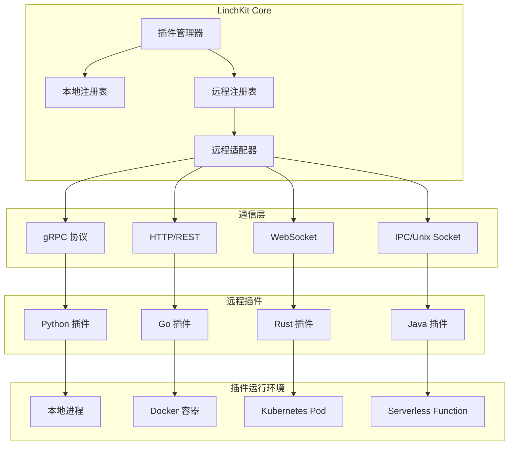

# LinchKit 远程插件系统设计

**文档版本**: v1.0.0
**创建日期**: 2025-06-26
**维护责任**: 架构团队
**状态**: 🎯 设计阶段

---

## 🎯 设计目标

### 核心需求
1. **多语言支持**: 支持 Python、Go、Rust、Java 等语言编写插件
2. **性能隔离**: CPU密集型任务不阻塞主进程
3. **安全隔离**: 插件运行在独立进程/容器中
4. **分布式支持**: 支持远程部署的插件
5. **向后兼容**: 不破坏现有本地插件系统

### 使用场景
- **AI/ML 任务**: Python 插件处理机器学习模型
- **高性能计算**: Go/Rust 插件处理计算密集任务
- **企业集成**: Java 插件连接企业系统
- **微服务架构**: 插件作为独立服务运行

---

## 🏗️ 系统架构

### 整体架构图


### 组件职责
1. **插件管理器**: 统一管理本地和远程插件
2. **远程适配器**: 将远程插件适配为本地插件接口
3. **通信层**: 处理不同协议的通信
4. **插件运行时**: 管理插件的生命周期

---

## 📋 实现方案

### Phase 1: 基础架构 (优先级: 高)
**目标**: 建立远程插件的基础支持

1. **扩展类型定义**
   - 定义 `RemotePlugin` 接口
   - 定义通信协议类型
   - 定义远程配置结构

2. **实现远程适配器**
   - 创建 `RemotePluginAdapter` 类
   - 实现生命周期代理
   - 处理远程调用

3. **基础通信实现**
   - HTTP/REST 协议支持
   - 简单的请求响应模式
   - 基础错误处理

### Phase 2: 通信协议 (优先级: 中)
**目标**: 支持多种通信协议

1. **gRPC 支持**
   - Proto 文件定义
   - 客户端/服务端实现
   - 流式通信支持

2. **WebSocket 支持**
   - 双向实时通信
   - 事件推送机制
   - 断线重连

3. **IPC/Unix Socket**
   - 本地高性能通信
   - 共享内存优化
   - 进程间事件

### Phase 3: 插件发现与管理 (优先级: 中)
**目标**: 自动发现和管理远程插件

1. **服务发现**
   - 基于 DNS 的发现
   - 注册中心集成
   - 健康检查机制

2. **负载均衡**
   - 多实例支持
   - 请求路由
   - 故障转移

3. **插件市场**
   - 插件注册
   - 版本管理
   - 自动更新

### Phase 4: 高级特性 (优先级: 低)
**目标**: 企业级特性支持

1. **安全增强**
   - mTLS 认证
   - 权限控制
   - 审计日志

2. **性能优化**
   - 连接池
   - 请求缓存
   - 批量调用

3. **可观测性**
   - 分布式追踪
   - 性能监控
   - 错误追踪

---

## 🔌 插件开发规范

### 远程插件接口标准
```typescript
// 所有远程插件必须实现的标准接口
interface RemotePluginService {
  // 生命周期方法
  init(config: Config): Promise<void>
  start(config: Config): Promise<void>
  stop(config: Config): Promise<void>
  destroy(config: Config): Promise<void>
  
  // 健康检查
  healthCheck(): Promise<HealthStatus>
  
  // 方法调用
  call(method: string, params: any): Promise<any>
  
  // 事件处理
  on(event: string, handler: Function): void
  emit(event: string, data: any): void
}
```

### 通信协议规范
```proto
// plugin.proto - gRPC 协议定义
syntax = "proto3";

service PluginService {
  // 生命周期
  rpc Init(Config) returns (Result);
  rpc Start(Config) returns (Result);
  rpc Stop(Config) returns (Result);
  
  // 方法调用
  rpc Call(CallRequest) returns (CallResponse);
  
  // 双向流
  rpc Stream(stream Message) returns (stream Message);
}
```

### 配置示例
```typescript
// 远程插件配置示例
const pythonMLPlugin: RemotePlugin = {
  metadata: {
    id: 'ml-processor',
    name: 'ML Processing Plugin',
    version: '1.0.0',
    runtime: 'python',
    runtimeVersion: '3.10',
    dockerImage: 'linchkit/ml-plugin:latest'
  },
  remoteConfig: {
    connection: {
      protocol: 'grpc',
      host: 'localhost',
      port: 50051,
      timeout: 30000
    },
    auth: {
      type: 'bearer',
      credentials: {
        token: process.env.PLUGIN_TOKEN
      }
    },
    healthCheck: {
      enabled: true,
      interval: 10000,
      timeout: 5000
    }
  }
}
```

---

## 🛡️ 安全考虑

### 认证与授权
1. **插件认证**: API Key、JWT Token、mTLS
2. **权限控制**: 基于角色的访问控制
3. **资源隔离**: 容器化、沙箱环境

### 数据安全
1. **传输加密**: TLS/SSL
2. **数据验证**: 输入验证、输出过滤
3. **敏感信息**: 加密存储、安全传输

### 运行时安全
1. **资源限制**: CPU、内存、磁盘配额
2. **网络隔离**: 防火墙规则、网络策略
3. **审计日志**: 操作记录、异常监控

---

## 📊 性能设计

### 通信优化
1. **连接复用**: 长连接、连接池
2. **批量请求**: 减少网络往返
3. **压缩传输**: gzip、protobuf

### 缓存策略
1. **结果缓存**: LRU 缓存
2. **连接缓存**: 保持活跃连接
3. **元数据缓存**: 插件信息缓存

### 并发控制
1. **限流**: 请求速率限制
2. **熔断**: 故障快速失败
3. **超时**: 合理的超时设置

---

## 🚀 实施计划

### 第一阶段：基础实现 (2周)
- [ ] 完成类型定义
- [ ] 实现远程适配器
- [ ] HTTP 协议支持
- [ ] 基础测试用例

### 第二阶段：协议扩展 (2周)
- [ ] gRPC 协议实现
- [ ] WebSocket 支持
- [ ] 协议适配器模式

### 第三阶段：管理功能 (1周)
- [ ] 健康检查机制
- [ ] 自动重连
- [ ] 错误处理

### 第四阶段：生产就绪 (1周)
- [ ] 性能优化
- [ ] 安全加固
- [ ] 文档完善

---

## ❓ 开放问题

1. **是否支持插件热更新？**
   - 优点：无需重启应用
   - 缺点：状态管理复杂

2. **如何处理插件版本兼容性？**
   - 语义化版本
   - API 版本协商
   - 向后兼容策略

3. **是否需要插件沙箱？**
   - WebAssembly 运行时
   - Docker 容器隔离
   - 系统调用限制

---

## 📚 参考实现

1. **VS Code Extension Host**: 进程隔离的插件系统
2. **Kubernetes Operator**: 远程控制器模式
3. **HashiCorp Plugin System**: Go 的插件系统
4. **Chrome Extensions**: 安全的插件模型

---

**下一步行动**: 
1. 评审设计方案
2. 确定实施优先级
3. 开始 Phase 1 实现