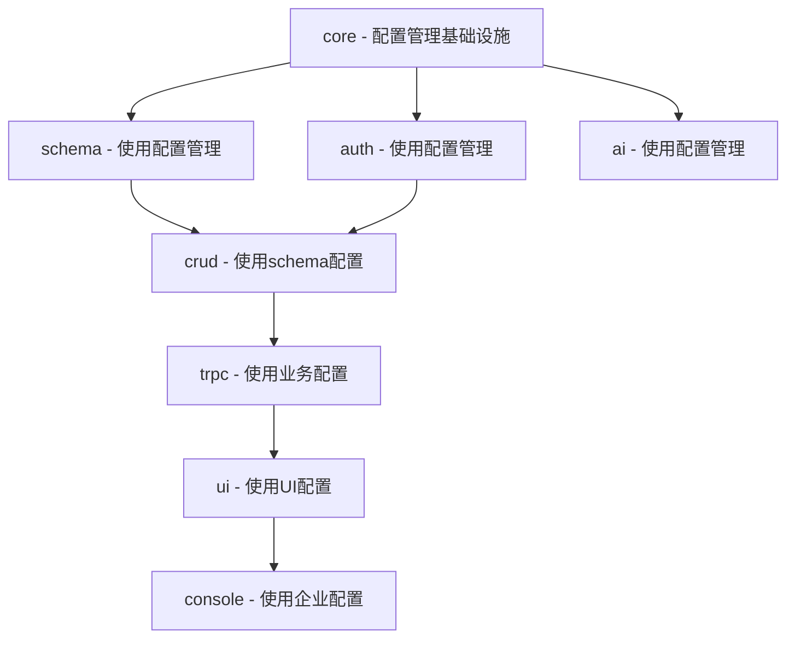
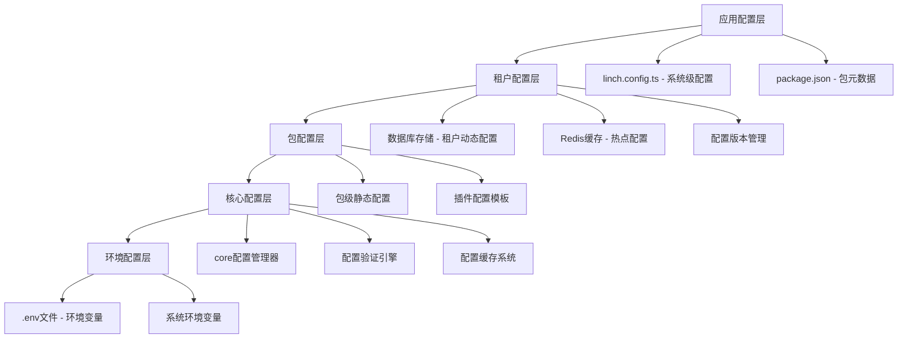
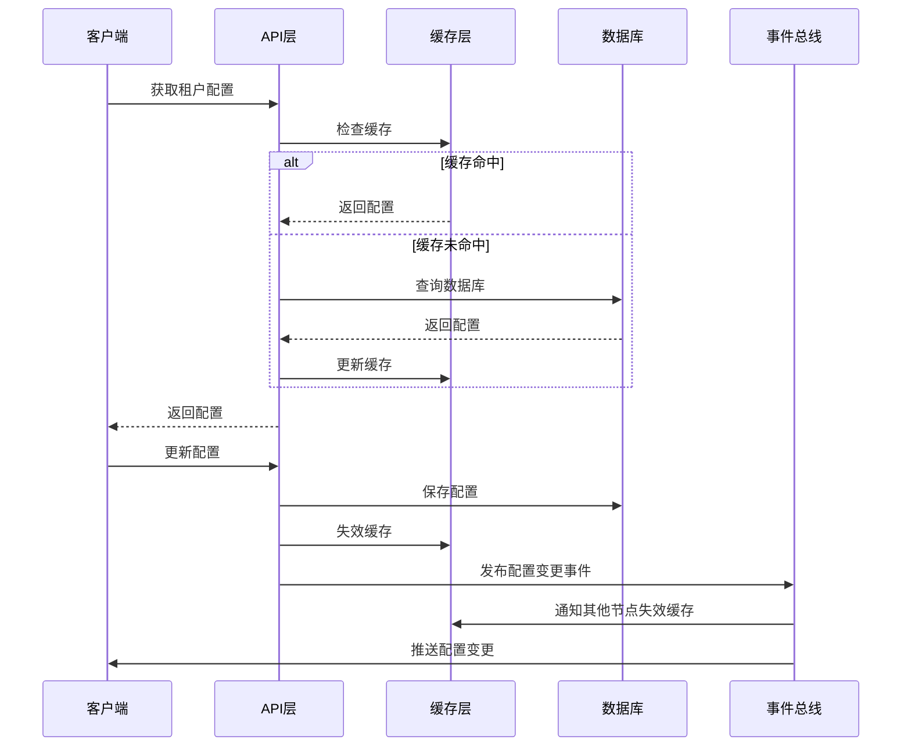

# LinchKit 多租户动态配置管理架构

**文档版本**: v2.0.0
**创建日期**: 2025-06-24
**最后更新**: 2025-06-24
**维护责任**: 架构团队
**用途**: 支持多租户动态配置的分层配置架构设计

---

## 🎯 架构决策分析

### 配置管理包归属决策

#### 方案A: 独立 @linch-kit/config 包
**优势**:
- 职责单一，专注配置管理
- 可以被其他包独立依赖
- 便于版本控制和独立升级

**劣势**:
- 增加包数量和维护复杂度
- 可能与 @linch-kit/schema 产生循环依赖
- 基础设施功能分散

#### 方案B: 集成到 @linch-kit/core 包 ✅ **推荐方案**
**优势**:
- 符合 core 包作为基础设施的定位
- 避免循环依赖问题
- 减少包数量，简化依赖关系
- 配置管理作为核心基础设施功能

**劣势**:
- core 包功能增加，但仍在合理范围内

#### 依赖关系分析


**结论**: 配置管理功能集成到 @linch-kit/core 包，确保依赖链的单向性。

### 多租户配置管理挑战
1. **配置隔离**: 不同租户的配置需要完全隔离
2. **动态更新**: 运行时配置变更需要实时生效
3. **性能优化**: 大量租户配置的读取性能
4. **版本管理**: 配置变更的版本控制和回滚
5. **权限控制**: 配置修改的权限管理和审计

---

## 🏗️ 多租户配置存储分层设计

### 配置存储架构


### 配置存储策略

#### 1. 静态配置层 (文件存储)
- **适用场景**: 系统级配置、包级默认配置、开发环境配置
- **存储位置**: 文件系统 (linch.config.ts, .env, package.json)
- **特点**: 部署时确定，重启生效，版本控制友好
- **性能**: 启动时加载，内存缓存

#### 2. 动态配置层 (持久化存储)
- **适用场景**: 租户配置、用户偏好、运行时配置
- **存储位置**: 数据库 (PostgreSQL/MySQL) + Redis缓存
- **特点**: 运行时可变，实时生效，支持版本管理
- **性能**: 多级缓存，异步更新

#### 3. 缓存配置层 (内存存储)
- **适用场景**: 热点配置、频繁访问配置
- **存储位置**: 内存 (Map/LRU) + Redis分布式缓存
- **特点**: 毫秒级访问，自动失效，容量限制
- **性能**: 极高读取性能，支持预热

## 🏢 多租户配置管理设计

### 租户配置隔离机制

#### 配置命名空间设计
```typescript
/**
 * 配置键命名空间
 * @description 确保租户配置完全隔离
 */
export interface ConfigNamespace {
  // 系统级配置 (全局)
  system: 'system'
  // 租户级配置 (按租户隔离)
  tenant: `tenant:${string}`
  // 用户级配置 (按用户隔离)
  user: `user:${string}`
  // 插件级配置 (按插件+租户隔离)
  plugin: `plugin:${string}:tenant:${string}`
}

/**
 * 配置键格式
 * 格式: {namespace}:{package}:{feature}:{key}
 * 示例: tenant:abc123:auth:providers:github:clientId
 */
export type ConfigKey =
  | `system:${string}:${string}:${string}`
  | `tenant:${string}:${string}:${string}:${string}`
  | `user:${string}:${string}:${string}:${string}`
  | `plugin:${string}:tenant:${string}:${string}:${string}`
```

### 多租户配置管理器

#### 核心配置管理器 (Level 0: @linch-kit/core)
```typescript
/**
 * 多租户配置管理器
 * @description 支持多租户动态配置的核心管理器
 */
export interface MultiTenantConfigManager {
  // 静态配置操作 (文件存储)
  loadStaticConfig<T>(path: string, schema?: ZodSchema<T>): Promise<T>
  saveStaticConfig<T>(path: string, config: T): Promise<void>
  watchStaticConfig<T>(path: string, callback: (config: T) => void): void

  // 动态配置操作 (数据库存储)
  getDynamicConfig<T>(
    namespace: ConfigNamespace,
    key: string,
    schema?: ZodSchema<T>
  ): Promise<T | undefined>

  setDynamicConfig<T>(
    namespace: ConfigNamespace,
    key: string,
    value: T,
    options?: SetConfigOptions
  ): Promise<void>

  deleteDynamicConfig(
    namespace: ConfigNamespace,
    key: string
  ): Promise<void>

  // 租户配置操作
  getTenantConfig<T>(
    tenantId: string,
    package: string,
    feature: string,
    key: string,
    schema?: ZodSchema<T>
  ): Promise<T | undefined>

  setTenantConfig<T>(
    tenantId: string,
    package: string,
    feature: string,
    key: string,
    value: T,
    options?: SetTenantConfigOptions
  ): Promise<void>

  // 配置继承和合并
  getEffectiveConfig<T>(
    tenantId: string,
    package: string,
    feature: string,
    schema?: ZodSchema<T>
  ): Promise<T>

  // 配置热更新
  subscribeConfigChanges(
    namespace: ConfigNamespace,
    callback: (key: string, value: any, oldValue: any) => void
  ): () => void

  // 配置版本管理
  getConfigHistory(
    namespace: ConfigNamespace,
    key: string,
    limit?: number
  ): Promise<ConfigHistoryEntry[]>

  rollbackConfig(
    namespace: ConfigNamespace,
    key: string,
    version: string
  ): Promise<void>

  // 配置权限控制
  checkConfigPermission(
    userId: string,
    namespace: ConfigNamespace,
    key: string,
    action: 'read' | 'write' | 'delete'
  ): Promise<boolean>

  // 配置审计
  auditConfigChange(
    userId: string,
    namespace: ConfigNamespace,
    key: string,
    action: string,
    oldValue?: any,
    newValue?: any
  ): Promise<void>
}
```

### 配置热更新和版本管理

#### 配置热更新机制
```typescript
/**
 * 配置热更新系统
 * @description 支持运行时配置变更的实时生效
 */
export interface ConfigHotReloadSystem {
  // 配置变更监听
  watchConfigChanges(
    pattern: string,
    callback: ConfigChangeCallback
  ): ConfigWatcher

  // 配置变更通知
  notifyConfigChange(
    namespace: ConfigNamespace,
    key: string,
    newValue: any,
    oldValue: any
  ): Promise<void>

  // 配置预热
  preloadConfigs(patterns: string[]): Promise<void>

  // 配置失效
  invalidateConfig(namespace: ConfigNamespace, key: string): Promise<void>
}

/**
 * 配置变更回调
 */
export type ConfigChangeCallback = (event: ConfigChangeEvent) => void | Promise<void>

export interface ConfigChangeEvent {
  namespace: ConfigNamespace
  key: string
  newValue: any
  oldValue: any
  timestamp: Date
  userId?: string
  reason: 'user_update' | 'system_update' | 'rollback' | 'migration'
}
```

#### 配置版本管理
```typescript
/**
 * 配置版本管理系统
 * @description 支持配置变更的版本控制和回滚
 */
export interface ConfigVersionManager {
  // 创建配置版本
  createVersion(
    namespace: ConfigNamespace,
    key: string,
    value: any,
    metadata?: ConfigVersionMetadata
  ): Promise<string>

  // 获取版本历史
  getVersionHistory(
    namespace: ConfigNamespace,
    key: string,
    options?: VersionHistoryOptions
  ): Promise<ConfigVersion[]>

  // 回滚到指定版本
  rollbackToVersion(
    namespace: ConfigNamespace,
    key: string,
    versionId: string,
    userId: string
  ): Promise<void>

  // 比较版本差异
  compareVersions(
    namespace: ConfigNamespace,
    key: string,
    fromVersion: string,
    toVersion: string
  ): Promise<ConfigDiff>

  // 清理旧版本
  cleanupOldVersions(
    retentionPolicy: VersionRetentionPolicy
  ): Promise<CleanupResult>
}

export interface ConfigVersion {
  id: string
  namespace: ConfigNamespace
  key: string
  value: any
  createdAt: Date
  createdBy: string
  metadata?: ConfigVersionMetadata
  checksum: string
}

export interface ConfigVersionMetadata {
  reason?: string
  description?: string
  tags?: string[]
  rollbackSafe?: boolean
}
```

#### 包级配置管理器 (Level 1)
```typescript
/**
 * 多租户包级配置管理器
 * @description 基于 core 配置管理器的包级扩展，支持多租户
 */
export abstract class MultiTenantPackageConfigManager<T> {
  constructor(
    protected readonly coreConfig: MultiTenantConfigManager,
    protected readonly packageName: string,
    protected readonly schema: ZodSchema<T>
  ) {}

  // 获取租户包配置
  async getTenantPackageConfig(tenantId: string): Promise<T> {
    const effectiveConfig = await this.coreConfig.getEffectiveConfig<T>(
      tenantId,
      this.packageName,
      'main',
      this.schema
    )
    return this.processConfig(effectiveConfig, tenantId)
  }

  // 设置租户包配置
  async setTenantPackageConfig(
    tenantId: string,
    config: Partial<T>,
    userId: string
  ): Promise<void> {
    const processedConfig = await this.validateConfig(config, tenantId)

    for (const [key, value] of Object.entries(processedConfig)) {
      await this.coreConfig.setTenantConfig(
        tenantId,
        this.packageName,
        'main',
        key,
        value,
        { userId, reason: 'user_update' }
      )
    }
  }

  // 包级配置处理（子类实现）
  protected abstract processConfig(config: T, tenantId: string): T | Promise<T>

  // 配置验证（子类实现）
  protected abstract validateConfig(config: Partial<T>, tenantId: string): Promise<Partial<T>>

  // 包级环境变量前缀
  protected getEnvPrefix(): string {
    return `LINCH_${this.packageName.toUpperCase()}_`
  }
}
```

## 📊 配置数据流和存储策略

### 配置数据流图


### 存储策略详细设计

#### 数据库存储结构
```sql
-- 配置存储表
CREATE TABLE config_entries (
    id UUID PRIMARY KEY DEFAULT gen_random_uuid(),
    namespace VARCHAR(100) NOT NULL,
    key VARCHAR(500) NOT NULL,
    value JSONB NOT NULL,
    schema_version VARCHAR(20) NOT NULL DEFAULT '1.0',
    created_at TIMESTAMP WITH TIME ZONE DEFAULT NOW(),
    updated_at TIMESTAMP WITH TIME ZONE DEFAULT NOW(),
    created_by VARCHAR(100),
    updated_by VARCHAR(100),
    metadata JSONB DEFAULT '{}',
    checksum VARCHAR(64) NOT NULL,

    UNIQUE(namespace, key)
);

-- 配置版本历史表
CREATE TABLE config_versions (
    id UUID PRIMARY KEY DEFAULT gen_random_uuid(),
    config_id UUID NOT NULL REFERENCES config_entries(id),
    version_number INTEGER NOT NULL,
    value JSONB NOT NULL,
    created_at TIMESTAMP WITH TIME ZONE DEFAULT NOW(),
    created_by VARCHAR(100),
    reason VARCHAR(200),
    metadata JSONB DEFAULT '{}',
    checksum VARCHAR(64) NOT NULL
);

-- 配置权限表
CREATE TABLE config_permissions (
    id UUID PRIMARY KEY DEFAULT gen_random_uuid(),
    namespace_pattern VARCHAR(200) NOT NULL,
    key_pattern VARCHAR(500) NOT NULL,
    user_id VARCHAR(100),
    role VARCHAR(50),
    permissions VARCHAR(20)[] NOT NULL, -- ['read', 'write', 'delete']
    created_at TIMESTAMP WITH TIME ZONE DEFAULT NOW()
);

-- 索引优化
CREATE INDEX idx_config_namespace_key ON config_entries(namespace, key);
CREATE INDEX idx_config_updated_at ON config_entries(updated_at);
CREATE INDEX idx_config_versions_config_id ON config_versions(config_id);
CREATE INDEX idx_config_permissions_patterns ON config_permissions(namespace_pattern, key_pattern);
```

#### Redis 缓存策略
```typescript
/**
 * Redis 缓存配置
 * @description 多级缓存策略，优化配置读取性能
 */
export interface ConfigCacheStrategy {
  // L1 缓存：本地内存 (最快访问)
  l1Cache: {
    maxSize: 1000        // 最大条目数
    ttl: 300            // 5分钟 TTL
    algorithm: 'LRU'    // LRU 淘汰算法
  }

  // L2 缓存：Redis 分布式缓存
  l2Cache: {
    keyPrefix: 'linch:config:'
    ttl: 3600           // 1小时 TTL
    compression: true   // 启用压缩
    serialization: 'json'
  }

  // 缓存预热策略
  preload: {
    patterns: [
      'system:*',       // 系统配置
      'tenant:*:auth:*', // 认证配置
      'tenant:*:ui:theme' // UI主题配置
    ]
    schedule: '0 */6 * * *' // 每6小时预热一次
  }

  // 缓存失效策略
  invalidation: {
    strategy: 'write-through' // 写入时立即失效
    batchSize: 100           // 批量失效大小
    delay: 1000             // 延迟失效时间(ms)
  }
}
```

#### 应用配置管理器 (Level 2)
```typescript
/**
 * 多租户应用配置管理器
 * @description 整合所有包的配置，提供统一的多租户应用配置
 */
export interface MultiTenantAppConfigManager {
  // 租户应用配置加载
  loadTenantAppConfig(tenantId: string): Promise<TenantLinchKitConfig>

  // 系统应用配置加载
  loadSystemAppConfig(): Promise<SystemLinchKitConfig>

  // 包配置获取
  getTenantPackageConfig<T>(
    tenantId: string,
    packageName: string,
    schema?: ZodSchema<T>
  ): Promise<T>

  // 配置热重载
  enableHotReload(tenantId?: string): ConfigWatcher

  // 配置导出
  exportTenantConfig(tenantId: string): Promise<string>

  // 配置导入
  importTenantConfig(
    tenantId: string,
    configData: string,
    options?: ImportOptions
  ): Promise<ImportResult>

  // 配置模板管理
  createConfigTemplate(
    templateName: string,
    config: Partial<TenantLinchKitConfig>
  ): Promise<void>

  applyConfigTemplate(
    tenantId: string,
    templateName: string
  ): Promise<void>
}
```

---

## 📋 具体实现方案

### 1. Core 包配置管理增强

#### 基础配置管理器实现
```typescript
// packages/core/src/config/core-config-manager.ts
export class CoreConfigManager implements CoreConfigManager {
  private configCache = new Map<string, any>()
  private watchers = new Map<string, FileWatcher>()

  async load<T>(path: string, schema?: ZodSchema<T>): Promise<T> {
    // 检查缓存
    if (this.configCache.has(path)) {
      return this.configCache.get(path)
    }

    // 加载配置文件
    const config = await this.loadConfigFile(path)
    
    // 验证配置
    const validatedConfig = schema ? schema.parse(config) : config
    
    // 缓存配置
    this.configCache.set(path, validatedConfig)
    
    return validatedConfig
  }

  loadEnv(envPath = '.env'): Record<string, string> {
    return dotenv.config({ path: envPath }).parsed || {}
  }

  getEnv<T>(key: string, defaultValue?: T): T {
    const value = process.env[key]
    if (value === undefined) {
      if (defaultValue !== undefined) {
        return defaultValue
      }
      throw new Error(`Environment variable ${key} is required`)
    }
    return value as unknown as T
  }

  validate<T>(config: unknown, schema: ZodSchema<T>): T {
    return schema.parse(config)
  }

  merge(...configs: unknown[]): unknown {
    return configs.reduce((merged, config) => ({
      ...merged,
      ...config
    }), {})
  }
}
```

### 2. 包级配置管理器

#### Schema 包配置管理器
```typescript
// packages/schema/src/config/schema-config-manager.ts
export class SchemaConfigManager extends PackageConfigManager<SchemaConfig> {
  constructor(coreConfig: CoreConfigManager) {
    super(coreConfig, 'schema', SchemaConfigSchema)
  }

  protected processConfig(config: SchemaConfig): SchemaConfig {
    // 处理数据库连接字符串
    if (!config.database.url) {
      config.database.url = this.coreConfig.getEnv('DATABASE_URL')
    }

    // 处理生成器配置
    config.generators = {
      ...this.getDefaultGenerators(),
      ...config.generators
    }

    return config
  }

  private getDefaultGenerators(): GeneratorConfig {
    return {
      prisma: { enabled: true, output: './prisma/schema.prisma' },
      types: { enabled: true, output: './src/types/generated.ts' },
      validators: { enabled: true, output: './src/validators/generated.ts' }
    }
  }
}
```

#### AI 包配置管理器
```typescript
// packages/ai/src/config/ai-config-manager.ts
export class AIConfigManager extends PackageConfigManager<AIConfig> {
  constructor(coreConfig: CoreConfigManager) {
    super(coreConfig, 'ai', AIConfigSchema)
  }

  protected processConfig(config: AIConfig): AIConfig {
    // 处理提供商配置
    for (const [name, providerConfig] of Object.entries(config.providers)) {
      if (!providerConfig.apiKey) {
        const envKey = `${this.getEnvPrefix()}${name.toUpperCase()}_API_KEY`
        providerConfig.apiKey = this.coreConfig.getEnv(envKey)
      }
    }

    // 设置默认缓存配置
    if (!config.cache) {
      config.cache = {
        enabled: true,
        ttl: 3600,
        maxSize: 1000,
        strategy: 'memory'
      }
    }

    return config
  }
}
```

### 3. 统一配置文件格式

#### 应用级配置文件 (linch.config.ts)
```typescript
// linch.config.ts
import { defineConfig } from '@linch-kit/core'

export default defineConfig({
  // 核心配置
  core: {
    plugins: {
      enabled: true,
      autoload: true,
      directory: './plugins'
    },
    logging: {
      level: 'info',
      format: 'json'
    }
  },

  // Schema 配置
  schema: {
    database: {
      provider: 'postgresql',
      url: process.env.DATABASE_URL
    },
    generators: {
      prisma: { enabled: true },
      types: { enabled: true }
    }
  },

  // AI 配置
  ai: {
    defaultProvider: 'openai',
    providers: {
      openai: {
        apiKey: process.env.OPENAI_API_KEY,
        model: 'gpt-4'
      },
      anthropic: {
        apiKey: process.env.ANTHROPIC_API_KEY,
        model: 'claude-3-sonnet'
      }
    }
  },

  // 认证配置
  auth: {
    providers: {
      github: {
        clientId: process.env.GITHUB_CLIENT_ID,
        clientSecret: process.env.GITHUB_CLIENT_SECRET
      }
    },
    session: {
      secret: process.env.SESSION_SECRET,
      maxAge: 7 * 24 * 60 * 60 * 1000 // 7 days
    }
  }
})
```

---

## 🔧 配置管理最佳实践

### 1. 配置验证策略
- 使用 Zod Schema 进行严格类型验证
- 提供详细的验证错误信息
- 支持配置的渐进式验证

### 2. 环境变量管理
- 使用 dotenv-safe 确保必需环境变量存在
- 建立环境变量命名规范：`LINCH_{PACKAGE}_{CONFIG}_KEY`
- 提供环境变量模板文件

### 3. 配置热重载
- 开发环境支持配置文件热重载
- 生产环境禁用热重载以确保稳定性
- 提供配置变更通知机制

### 4. 配置安全
- 敏感配置项自动脱敏
- 配置文件权限检查
- 配置审计日志记录

---

## 📊 迁移计划

### Phase 1: Core 配置管理增强
1. 实现 CoreConfigManager
2. 建立配置验证框架
3. 添加环境变量管理

### Phase 2: 包级配置迁移
1. 重构 Schema 包配置管理
2. 重构 AI 包配置管理
3. 重构 Auth 包配置管理

### Phase 3: 应用级配置整合
1. 实现 AppConfigManager
2. 建立统一配置文件格式
3. 提供配置迁移工具

---

**实施原则**: 向后兼容、渐进式迁移、零停机时间
