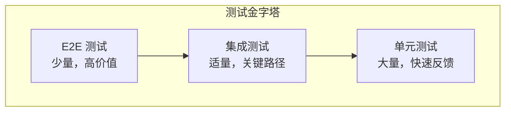

# 测试工作流程

## 概述

Linch Kit 采用多层次测试策略，确保代码质量、功能正确性和系统稳定性。

## 测试策略

### 1. 测试金字塔



### 2. 测试类型

```typescript
interface TestingTypes {
  unit: {
    purpose: '测试单个函数/类的行为'
    framework: 'vitest'
    coverage: '80%+'
    speed: 'fast'
  }

  integration: {
    purpose: '测试模块间交互'
    framework: 'vitest'
    coverage: '关键路径'
    speed: 'medium'
  }

  e2e: {
    purpose: '测试完整用户流程'
    framework: 'playwright'
    coverage: '核心功能'
    speed: 'slow'
  }

  performance: {
    purpose: '测试性能指标'
    framework: 'vitest + benchmark'
    coverage: '关键算法'
    speed: 'variable'
  }
}
```

## 单元测试

### 1. 测试结构

```typescript
// 测试文件命名: *.test.ts 或 *.spec.ts
interface TestStructure {
  describe: '测试套件描述'
  beforeEach: '每个测试前的设置'
  afterEach: '每个测试后的清理'
  it: '具体测试用例'
  expect: '断言'
}

// 示例
describe('UserService', () => {
  let userService: UserService

  beforeEach(() => {
    userService = new UserService()
  })

  describe('createUser', () => {
    it('should create user with valid data', () => {
      const userData = { name: 'John', email: 'john@example.com' }
      const result = userService.createUser(userData)

      expect(result).toBeDefined()
      expect(result.id).toBeTruthy()
      expect(result.name).toBe(userData.name)
    })

    it('should throw error with invalid email', () => {
      const userData = { name: 'John', email: 'invalid-email' }

      expect(() => userService.createUser(userData)).toThrow('Invalid email format')
    })
  })
})
```

### 2. 测试覆盖率

```typescript
interface CoverageRequirements {
  statements: 80
  branches: 75
  functions: 80
  lines: 80
}

// vitest.config.ts
export default defineConfig({
  test: {
    coverage: {
      provider: 'v8',
      reporter: ['text', 'html', 'lcov'],
      thresholds: {
        statements: 80,
        branches: 75,
        functions: 80,
        lines: 80,
      },
    },
  },
})
```

### 3. Mock 策略

```typescript
interface MockStrategy {
  external_apis: 'Mock 外部 API 调用'
  database: 'Mock 数据库操作'
  file_system: 'Mock 文件系统操作'
  time: 'Mock 时间相关函数'
}

// 示例
import { vi } from 'vitest'

describe('ApiService', () => {
  it('should handle API errors', async () => {
    // Mock fetch
    global.fetch = vi.fn().mockRejectedValue(new Error('Network error'))

    const apiService = new ApiService()

    await expect(apiService.getData()).rejects.toThrow('Network error')
  })
})
```

## 集成测试

### 1. 测试范围

```typescript
interface IntegrationTestScope {
  api_endpoints: 'tRPC 路由测试'
  database_operations: '数据库集成测试'
  auth_flow: '认证流程测试'
  schema_validation: 'Schema 验证测试'
}
```

### 2. 测试环境

```typescript
interface TestEnvironment {
  database: 'SQLite in-memory'
  auth: 'Mock auth provider'
  external_services: 'Mock services'
  configuration: 'Test-specific config'
}

// 测试设置
beforeAll(async () => {
  // 设置测试数据库
  await setupTestDatabase()

  // 初始化测试数据
  await seedTestData()

  // 配置 mock 服务
  setupMockServices()
})

afterAll(async () => {
  // 清理测试环境
  await cleanupTestDatabase()
})
```

### 3. API 测试

```typescript
// tRPC 路由测试示例
describe('User API', () => {
  let caller: ReturnType<typeof createCaller>

  beforeEach(() => {
    caller = createCaller({
      session: mockSession,
      db: testDb,
    })
  })

  it('should create user', async () => {
    const input = {
      name: 'John Doe',
      email: 'john@example.com',
    }

    const result = await caller.user.create(input)

    expect(result).toMatchObject({
      id: expect.any(String),
      name: input.name,
      email: input.email,
    })
  })
})
```

## E2E 测试

### 1. 测试工具

```typescript
interface E2ETools {
  framework: 'Playwright'
  browsers: ['chromium', 'firefox', 'webkit']
  modes: ['headless', 'headed']
  devices: ['desktop', 'mobile', 'tablet']
}
```

### 2. 页面对象模式

```typescript
// Page Object 示例
class LoginPage {
  constructor(private page: Page) {}

  async goto() {
    await this.page.goto('/login')
  }

  async login(email: string, password: string) {
    await this.page.fill('[data-testid=email]', email)
    await this.page.fill('[data-testid=password]', password)
    await this.page.click('[data-testid=login-button]')
  }

  async expectLoginSuccess() {
    await expect(this.page).toHaveURL('/dashboard')
  }
}

// 测试用例
test('user can login', async ({ page }) => {
  const loginPage = new LoginPage(page)

  await loginPage.goto()
  await loginPage.login('user@example.com', 'password')
  await loginPage.expectLoginSuccess()
})
```

### 3. 测试数据管理

```typescript
interface TestDataManagement {
  fixtures: 'Static test data'
  factories: 'Dynamic test data generation'
  cleanup: 'Test data cleanup'
  isolation: 'Test isolation strategy'
}

// 测试数据工厂
class UserFactory {
  static create(overrides: Partial<User> = {}): User {
    return {
      id: faker.string.uuid(),
      name: faker.person.fullName(),
      email: faker.internet.email(),
      createdAt: new Date(),
      ...overrides,
    }
  }
}
```

## 性能测试

### 1. 基准测试

```typescript
import { bench, describe } from 'vitest'

describe('Performance Tests', () => {
  bench('schema validation', () => {
    const schema = z.object({
      name: z.string(),
      email: z.string().email(),
    })

    schema.parse({
      name: 'John Doe',
      email: 'john@example.com',
    })
  })

  bench('user creation', async () => {
    await userService.createUser({
      name: 'John Doe',
      email: 'john@example.com',
    })
  })
})
```

### 2. 负载测试

```typescript
interface LoadTesting {
  tool: 'k6' | 'artillery'
  scenarios: LoadTestScenarios
  metrics: PerformanceMetrics
}

interface LoadTestScenarios {
  smoke: 'Basic functionality'
  load: 'Expected traffic'
  stress: 'Breaking point'
  spike: 'Traffic spikes'
}
```

## 测试自动化

### 1. CI/CD 集成

```yaml
# GitHub Actions 示例
name: Tests
on: [push, pull_request]

jobs:
  test:
    runs-on: ubuntu-latest
    steps:
      - uses: actions/checkout@v4
      - uses: actions/setup-node@v4
        with:
          node-version: 18
          cache: 'pnpm'

      - run: pnpm install
      - run: pnpm test
      - run: pnpm test:e2e

      - name: Upload coverage
        uses: codecov/codecov-action@v3
```

### 2. 测试报告

```typescript
interface TestReporting {
  coverage: 'Coverage reports'
  results: 'Test results'
  performance: 'Performance metrics'
  trends: 'Historical trends'
}
```

## 测试最佳实践

### 1. 编写原则

```typescript
interface TestingPrinciples {
  AAA: 'Arrange, Act, Assert'
  DRY: "Don't Repeat Yourself"
  FIRST: 'Fast, Independent, Repeatable, Self-validating, Timely'
  isolation: 'Tests should be independent'
  clarity: 'Tests should be clear and readable'
}
```

### 2. 命名规范

```typescript
interface TestNaming {
  describe: 'Component/Function being tested'
  it: 'should [expected behavior] when [condition]'

  examples: [
    'should return user when valid ID provided',
    'should throw error when user not found',
    'should validate email format when creating user',
  ]
}
```

---

**相关文档**:

- [开发流程](./development.md)
- [发布流程](./release.md)
- [维护指南](./maintenance.md)
