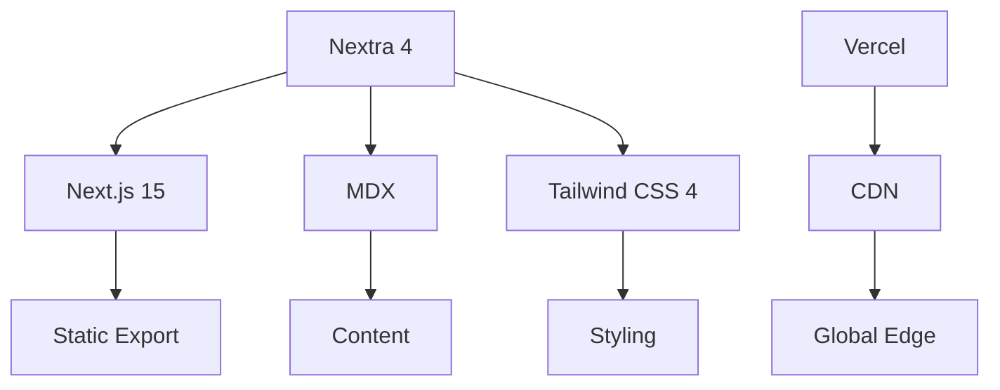

# LinchKit Official Website

> LinchKit 官方文档网站 - 基于 Nextra 4 的现代化文档平台

[](https://kit.linch.tech)
[](https://opensource.org/licenses/MIT)
[](https://nextra.site/)

## 📋 概述

LinchKit 官方网站是基于 Nextra 4 构建的现代化文档平台，提供完整的框架文档、API 参考、教程指南和最佳实践。网站采用响应式设计，支持深色/浅色主题切换，并提供中英双语版本。

### 🎯 网站特性

- 📚 **完整文档体系** - 从快速开始到高级主题的全面文档
- 🌍 **国际化支持** - 中英双语完整覆盖
- 🎨 **现代化设计** - 基于 Tailwind CSS 的响应式设计
- ⚡ **高性能** - 静态生成 + 智能预取的极致性能
- 🔍 **全文搜索** - 基于 Flexsearch 的快速搜索功能
- 📱 **移动优化** - 完美适配移动设备的阅读体验
- ♿ **无障碍访问** - 符合 WCAG 2.1 AA 标准

### 🏗️ 技术架构



## 🚀 快速开始

### 环境要求

- Node.js >= 18
- bun >= 1.0
- Git

### 本地开发

```bash
# 克隆项目
git clone https://github.com/laofahai/linch-kit.git

# 进入网站目录
cd linch-kit/apps/website

# 安装依赖
bun install

# 启动开发服务器
bun dev
```

访问 [http://localhost:3000](http://localhost:3000) 查看网站。

### 构建和部署

```bash
# 构建静态网站
bun build

# 本地预览构建结果
bun preview

# 导出静态文件
bun export
```

## 📁 项目结构

```
apps/website/
├── app/                       # Next.js App Router
│   ├── docs/                  # 文档页面
│   │   ├── _meta.json        # 导航元数据
│   │   ├── api/              # API 文档
│   │   ├── concepts/         # 核心概念
│   │   ├── getting-started.mdx  # 快速开始
│   │   ├── guides/           # 使用指南
│   │   └── index.mdx         # 文档首页
│   ├── globals.css           # 全局样式
│   ├── layout.tsx            # 根布局
│   ├── manifest.ts           # PWA 配置
│   ├── not-found.tsx         # 404 页面
│   ├── page.en.mdx           # 英文首页
│   ├── page.mdx              # 中文首页
│   ├── robots.ts             # SEO 配置
│   └── sitemap.ts            # 站点地图
├── components/               # 自定义组件
│   ├── client-button.tsx     # 客户端按钮
│   ├── performance/          # 性能组件
│   │   ├── LazyImage.tsx     # 懒加载图片
│   │   ├── LazySection.tsx   # 懒加载区块
│   │   ├── WebVitals.tsx     # 性能监控
│   │   └── index.ts
│   └── ui/                   # UI 组件
│       ├── BackToTop.tsx     # 返回顶部
│       ├── ErrorBoundary.tsx # 错误边界
│       ├── Loading.tsx       # 加载组件
│       ├── ResponsiveNav.tsx # 响应式导航
│       ├── Toast.tsx         # 消息提示
│       └── index.ts
├── public/                   # 静态资源
├── mdx-components.tsx        # MDX 组件配置
├── next.config.ts            # Next.js 配置
├── theme.config.tsx          # Nextra 主题配置
├── tailwind.config.ts        # Tailwind 配置
├── package.json
└── README.md
```

## 📝 内容管理

### 添加新文档

1. **创建 MDX 文件**:
```mdx
---
title: "新功能指南"
description: "详细介绍新功能的使用方法"
---

# 新功能指南

这里是文档内容...

## 快速开始

### 安装

\```bash
bun add @linch-kit/new-feature
\```

### 使用

\```typescript
import { newFeature } from '@linch-kit/new-feature'

const result = newFeature()
\```
```

2. **更新导航**:
```json
// app/docs/_meta.json
{
  "getting-started": "快速开始",
  "concepts": "核心概念",
  "guides": "使用指南",
  "new-feature": "新功能指南",
  "api": "API 参考"
}
```

### 文档规范

#### 文件命名

- 使用 kebab-case: `user-management.mdx`
- 文件夹使用复数形式: `guides/`, `concepts/`
- 索引文件使用 `index.mdx`

#### 内容结构

```mdx
---
title: "页面标题"
description: "页面描述，用于 SEO"
---

# 页面标题

简短的介绍段落。

## 主要章节

### 子章节

内容详情...

## 代码示例

\```typescript
// 代码示例
const example = "Hello World"
\```

## 相关链接

- [相关文档](./related-doc)
- [API 参考](../api/reference)
```

### 国际化文档

#### 中文文档
```mdx
---
title: "用户管理"
description: "LinchKit 用户管理系统完整指南"
---

# 用户管理

LinchKit 提供完整的用户管理功能...
```

#### 英文文档
```mdx
---
title: "User Management"
description: "Complete guide to LinchKit user management system"
---

# User Management

LinchKit provides comprehensive user management features...
```

## 🎨 主题配置

### Nextra 主题配置

```tsx
// theme.config.tsx
const config: DocsThemeConfig = {
  logo: (
    <div className="flex items-center gap-2">
      <Image src="/logo.svg" width={32} height={32} alt="LinchKit" />
      <span className="font-bold">LinchKit</span>
    </div>
  ),
  project: {
    link: 'https://github.com/laofahai/linch-kit'
  },
  docsRepositoryBase: 'https://github.com/laofahai/linch-kit/tree/main/apps/website',
  footer: {
    text: '© 2024 LinchKit Team. All rights reserved.'
  },
  useNextSeoProps() {
    return {
      titleTemplate: '%s – LinchKit'
    }
  },
  head: (
    <>
      <meta name="viewport" content="width=device-width, initial-scale=1.0" />
      <meta property="og:title" content="LinchKit" />
      <meta property="og:description" content="AI-First 全栈开发框架" />
    </>
  )
}

export default config
```

### 自定义样式

```css
/* app/globals.css */
@tailwind base;
@tailwind components;
@tailwind utilities;

/* 自定义主题变量 */
:root {
  --nextra-primary-hue: 212;
  --nextra-primary-saturation: 100%;
  --nextra-navbar-height: 4rem;
}

/* 深色主题 */
.dark {
  --nextra-primary-hue: 212;
  --nextra-primary-saturation: 100%;
}

/* 自定义组件样式 */
.nextra-callout {
  @apply my-6 rounded-lg border border-gray-200 bg-gray-50 p-4 dark:border-gray-800 dark:bg-gray-900;
}
```

## ⚡ 性能优化

### Core Web Vitals 优化

网站实现了全面的 Core Web Vitals 优化：

#### LCP (Largest Contentful Paint) < 2.5s
- 静态生成减少 TTFB
- 图片懒加载和 WebP 格式
- 字体预加载和 font-display: swap

#### FID (First Input Delay) < 100ms
- 代码分割和懒加载
- 减少主线程阻塞
- 优化 JavaScript 执行

#### CLS (Cumulative Layout Shift) < 0.1
- 固定尺寸的图片和媒体
- 无布局偏移的字体加载
- 稳定的导航和页脚高度

### 性能监控

```tsx
// components/performance/WebVitals.tsx
'use client'

import { onCLS, onFID, onFCP, onLCP, onTTFB } from 'web-vitals'

export function WebVitals() {
  useEffect(() => {
    onCLS(console.log)
    onFID(console.log)
    onFCP(console.log)
    onLCP(console.log)
    onTTFB(console.log)
  }, [])

  return null
}
```

### 图片优化

```tsx
// components/performance/LazyImage.tsx
import Image from 'next/image'

interface LazyImageProps {
  src: string
  alt: string
  width: number
  height: number
  priority?: boolean
}

export function LazyImage({ src, alt, width, height, priority = false }: LazyImageProps) {
  return (
    <Image
      src={src}
      alt={alt}
      width={width}
      height={height}
      priority={priority}
      loading={priority ? 'eager' : 'lazy'}
      placeholder="blur"
      blurDataURL="data:image/jpeg;base64,..."
      className="rounded-lg shadow-md"
    />
  )
}
```

## 🔍 SEO 优化

### 元数据配置

```tsx
// app/layout.tsx
export const metadata: Metadata = {
  title: {
    default: 'LinchKit - AI-First 全栈开发框架',
    template: '%s | LinchKit'
  },
  description: 'LinchKit 是一个现代化的 AI-First 全栈开发框架，提供 Schema 驱动的端到端类型安全解决方案。',
  keywords: ['LinchKit', 'TypeScript', 'Next.js', 'Full Stack', 'AI-First'],
  authors: [{ name: 'LinchKit Team' }],
  creator: 'LinchKit Team',
  publisher: 'LinchKit Team',
  metadataBase: new URL('https://kit.linch.tech'),
  openGraph: {
    type: 'website',
    locale: 'zh_CN',
    url: 'https://kit.linch.tech',
    siteName: 'LinchKit',
    title: 'LinchKit - AI-First 全栈开发框架',
    description: 'LinchKit 是一个现代化的 AI-First 全栈开发框架',
    images: [
      {
        url: '/og-image.png',
        width: 1200,
        height: 630,
        alt: 'LinchKit'
      }
    ]
  },
  twitter: {
    card: 'summary_large_image',
    site: '@LinchKit',
    creator: '@LinchKit'
  },
  robots: {
    index: true,
    follow: true,
    googleBot: {
      index: true,
      follow: true,
      'max-video-preview': -1,
      'max-image-preview': 'large',
      'max-snippet': -1
    }
  }
}
```

### 结构化数据

```tsx
// app/page.tsx
export default function HomePage() {
  const jsonLd = {
    '@context': 'https://schema.org',
    '@type': 'SoftwareApplication',
    name: 'LinchKit',
    applicationCategory: 'DeveloperApplication',
    operatingSystem: 'Cross-platform',
    description: 'AI-First 全栈开发框架',
    url: 'https://kit.linch.tech',
    author: {
      '@type': 'Organization',
      name: 'LinchKit Team'
    }
  }

  return (
    <>
      <script
        type="application/ld+json"
        dangerouslySetInnerHTML={{ __html: JSON.stringify(jsonLd) }}
      />
      {/* 页面内容 */}
    </>
  )
}
```

## 📊 分析和监控

### Google Analytics

```tsx
// components/Analytics.tsx
'use client'

import { usePathname, useSearchParams } from 'next/navigation'
import { useEffect } from 'react'

export function Analytics() {
  const pathname = usePathname()
  const searchParams = useSearchParams()

  useEffect(() => {
    if (typeof window !== 'undefined' && window.gtag) {
      window.gtag('config', 'GA_MEASUREMENT_ID', {
        page_path: pathname + searchParams.toString()
      })
    }
  }, [pathname, searchParams])

  return null
}
```

### 错误监控

```tsx
// app/error.tsx
'use client'

import { useEffect } from 'react'

export default function Error({
  error,
  reset
}: {
  error: Error & { digest?: string }
  reset: () => void
}) {
  useEffect(() => {
    // 发送错误到监控服务
    console.error('Website error:', error)
  }, [error])

  return (
    <div className="flex min-h-screen flex-col items-center justify-center">
      <h2 className="text-2xl font-bold">出现了一些问题</h2>
      <button
        onClick={() => reset()}
        className="mt-4 rounded bg-blue-500 px-4 py-2 text-white hover:bg-blue-600"
      >
        重试
      </button>
    </div>
  )
}
```

## 🚀 部署

### Vercel 部署 (推荐)

1. **连接 GitHub 仓库**:
   - 访问 [Vercel Dashboard](https://vercel.com/dashboard)
   - 选择 "Import Project"
   - 连接 GitHub 仓库

2. **配置构建设置**:
```bash
# Build Command
bun build

# Output Directory
out

# Install Command
bun install
```

3. **环境变量**:
```bash
NEXT_PUBLIC_GA_ID=G-XXXXXXXXXX
NEXT_PUBLIC_SITE_URL=https://kit.linch.tech
```

### 自定义服务器部署

```dockerfile
# Dockerfile
FROM node:18-alpine AS base

# 安装 bun
RUN npm install -g bun

FROM base AS deps
WORKDIR /app
COPY package.json bun.lockb ./
RUN bun install --frozen-lockfile

FROM base AS builder
WORKDIR /app
COPY --from=deps /app/node_modules ./node_modules
COPY . .
RUN bun build

FROM nginx:alpine AS runner
COPY --from=builder /app/out /usr/share/nginx/html
COPY nginx.conf /etc/nginx/nginx.conf
EXPOSE 80
CMD ["nginx", "-g", "daemon off;"]
```

## 🧪 测试

### 运行测试

```bash
# 运行所有测试
bun test

# 运行 E2E 测试
bun test:e2e

# 性能测试
bun test:lighthouse

# 可访问性测试
bun test:a11y
```

### 测试配置

```typescript
// jest.config.js
module.exports = {
  testEnvironment: 'jsdom',
  setupFilesAfterEnv: ['<rootDir>/jest.setup.js'],
  testPathIgnorePatterns: ['<rootDir>/.next/', '<rootDir>/node_modules/'],
  moduleNameMapping: {
    '^@/(.*)$': '<rootDir>/$1'
  }
}
```

## 🤝 贡献

### 贡献文档

1. Fork 项目
2. 创建分支: `git checkout -b docs/new-feature`
3. 编写文档
4. 提交更改: `git commit -m 'docs: add new feature guide'`
5. 推送分支: `git push origin docs/new-feature`
6. 创建 Pull Request

### 文档写作指南

- 使用清晰、简洁的语言
- 提供完整的代码示例
- 包含实际的使用场景
- 遵循现有的文档结构和风格
- 确保中英文版本的一致性

## 📄 许可证

MIT License - 查看 [LICENSE](../../LICENSE) 文件了解详情。

## 🔗 相关链接

- 🏠 [LinchKit 官网](https://kit.linch.tech)
- 📚 [在线文档](https://kit.linch.tech/docs)
- 🐛 [问题反馈](https://github.com/laofahai/linch-kit/issues)
- 💬 [讨论社区](https://github.com/laofahai/linch-kit/discussions)
- 🚀 [Starter 应用](../starter/README.md)
- 🧪 [Demo 应用](../demo-app/README.md)

---

**LinchKit 官方网站** 致力于为开发者提供最好的文档体验，帮助您快速上手和深入掌握 LinchKit 框架。
