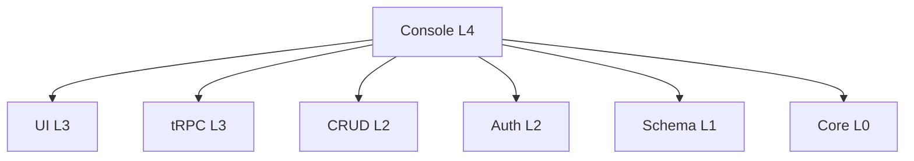

# @linch-kit/console

> LinchKit 企业级管理控制台 - 多租户管理、权限控制、插件市场、系统监控的完整解决方案

[](https://www.npmjs.com/package/@linch-kit/console)
[](https://github.com/laofahai/linch-kit/blob/main/LICENSE)
[](https://www.typescriptlang.org/)

## 📋 概述

`@linch-kit/console` 是 LinchKit 框架的企业级管理控制台模块，提供完整的多租户管理、用户权限控制、插件市场和系统监控功能。作为 L4 层应用级模块，它设计为功能库形式，可以被任何 LinchKit 应用集成使用。

### 🎯 核心特性

- 🏢 **多租户管理** - 完整的租户生命周期管理和资源配额控制
- 👥 **用户管理** - 基于角色的权限控制（RBAC）和用户生命周期管理
- 🔐 **权限系统** - 细粒度权限控制，支持组件级权限保护
- 🧩 **插件市场** - 插件发布、安装、配置和生命周期管理
- 📊 **系统监控** - 实时性能监控、告警管理和审计日志
- 🌐 **国际化** - 内置中英文双语支持，可扩展多语言
- 🎨 **现代化 UI** - 基于 @linch-kit/ui 的企业级界面设计

### 🏗️ 架构定位



Console 模块依赖 LinchKit 生态的所有核心包，是框架能力的集中展示。

## 🚀 快速开始

### 安装

```bash
# 使用 bun (推荐)
bun add @linch-kit/console

# 使用 npm
npm install @linch-kit/console

# 使用 yarn
yarn add @linch-kit/console
```

### 基础使用

#### 1. 配置 Provider

```tsx
import { ConsoleProvider } from '@linch-kit/console'

function App() {
  return (
    <ConsoleProvider
      tenantId={currentTenant?.id}
      permissions={userPermissions}
      config={{
        basePath: '/admin',
        features: ['dashboard', 'tenants', 'users', 'plugins', 'monitoring'],
        theme: { primary: '#3b82f6' }
      }}
    >
      <YourApp />
    </ConsoleProvider>
  )
}
```

#### 2. 使用 Dashboard

```tsx
import { Dashboard } from '@linch-kit/console'

export default function AdminPage() {
  return (
    <div className="min-h-screen bg-background">
      <Dashboard />
    </div>
  )
}
```

#### 3. 集成路由

```tsx
import { createConsoleRoutes, ConsoleRouter } from '@linch-kit/console'

const consoleRoutes = createConsoleRoutes({
  basePath: '/admin',
  features: ['dashboard', 'tenants', 'users', 'plugins']
})

export default function AdminLayout() {
  return <ConsoleRouter routes={consoleRoutes} />
}
```

## 📚 API 文档

### 核心组件

#### ConsoleProvider

Console 模块的根 Provider，提供全局状态管理和配置。

```tsx
interface ConsoleProviderProps {
  children: ReactNode
  config?: ConsoleConfig
  tenantId?: string
  permissions?: string[]
  apiUrl?: string
  language?: string
  devtools?: boolean
}

<ConsoleProvider
  config={{
    basePath: '/admin',
    features: ['dashboard', 'tenants', 'users'],
    theme: { primary: '#3b82f6', darkMode: false },
    permissions: {
      access: ['console:access'],
      admin: ['console:admin']
    }
  }}
  tenantId="tenant-123"
  permissions={['console:access', 'tenant:read', 'user:manage']}
  language="zh-CN"
>
  {children}
</ConsoleProvider>
```

#### Dashboard

企业级仪表板组件，展示系统概览和关键指标。

```tsx
import { Dashboard } from '@linch-kit/console'

// 基础使用
<Dashboard />

// 功能特性
- 系统健康状态监控
- 关键指标统计（租户数、用户数、系统负载）
- 快速操作入口
- 最近活动展示
- 系统资源监控
- 告警信息展示
```

#### 权限控制组件

```tsx
import { PermissionGuard, FeatureGuard } from '@linch-kit/console'

// 权限保护
<PermissionGuard permission="tenant:create">
  <CreateTenantButton />
</PermissionGuard>

// 多权限检查
<PermissionGuard 
  permissions={['user:read', 'user:write']} 
  requireAll={true}
>
  <UserManagement />
</PermissionGuard>

// 功能保护
<FeatureGuard feature="plugins">
  <PluginMarketplace />
</FeatureGuard>
```

### 租户管理

#### TenantList

租户列表管理组件，支持分页、搜索、过滤。

```tsx
import { TenantList } from '@linch-kit/console'

<TenantList
  pageSize={10}
  searchable={true}
  filters={['status', 'plan']}
  actions={['view', 'edit', 'suspend', 'delete']}
  onTenantClick={(tenant) => router.push(`/admin/tenants/${tenant.id}`)}
/>
```

#### TenantCreate

租户创建表单组件。

```tsx
import { TenantCreate } from '@linch-kit/console'

<TenantCreate
  onSuccess={(tenant) => {
    toast.success('租户创建成功')
    router.push(`/admin/tenants/${tenant.id}`)
  }}
  onError={(error) => {
    toast.error('创建失败：' + error.message)
  }}
/>
```

### React Hooks

#### 数据获取 Hooks

```tsx
import { 
  useDashboard,
  useSystemStats,
  useSystemHealth,
  useTenants,
  useCreateTenant
} from '@linch-kit/console'

// 仪表板数据
const { data: dashboard, isLoading } = useDashboard()

// 系统统计
const { data: stats } = useSystemStats()

// 系统健康检查
const { data: health } = useSystemHealth()

// 租户列表
const { data: tenants } = useTenants({
  page: 1,
  pageSize: 10,
  search: 'example',
  status: 'active'
})

// 创建租户
const createTenant = useCreateTenant()
const handleCreate = async (data) => {
  await createTenant.mutateAsync(data)
}
```

#### 权限 Hooks

```tsx
import { 
  useConsolePermission,
  useConsolePermissions,
  useConsoleContext
} from '@linch-kit/console'

// 单个权限检查
const canCreateTenant = useConsolePermission('tenant:create')

// 多权限检查
const canManageUsers = useConsolePermissions(['user:read', 'user:write'], true)

// Console 上下文
const { 
  config, 
  tenantId, 
  permissions, 
  isAdmin 
} = useConsoleContext()
```

### 服务层 API

#### 租户服务

```tsx
import { tenantService } from '@linch-kit/console/services'

// 注入数据库客户端
tenantService.setDatabase(db)

// 创建租户
const tenant = await tenantService.create({
  name: '示例公司',
  slug: 'example-company',
  domain: 'example.com',
  plan: 'professional',
  maxUsers: 100
})

// 查询租户列表
const result = await tenantService.list({
  page: 1,
  pageSize: 10,
  search: 'example',
  status: 'active'
})

// 更新租户
const updated = await tenantService.update('tenant-id', {
  maxUsers: 200,
  plan: 'enterprise'
})
```

### 实体定义

Console 模块提供完整的企业级数据模型：

```tsx
import { 
  TenantEntity,
  TenantQuotasEntity,
  PluginEntity,
  SystemMetricEntity,
  AuditLogEntity,
  ConsoleEntities
} from '@linch-kit/console/entities'

// 获取所有实体
const entities = ConsoleEntities

// 使用单个实体
const tenantSchema = TenantEntity.zodSchema
const tenantType = TenantEntity.createSchema
```

## 🔧 配置选项

### ConsoleConfig

```typescript
interface ConsoleConfig {
  /** 基础路径 */
  basePath?: string
  
  /** 启用的功能模块 */
  features?: ConsoleFeature[]
  
  /** 权限配置 */
  permissions?: {
    access: string[]
    admin: string[]
  }
  
  /** 主题配置 */
  theme?: {
    primary: string
    darkMode: boolean
  }
  
  /** 自定义路由 */
  customRoutes?: ConsoleRoute[]
  
  /** 禁用的路由 */
  disabledRoutes?: string[]
}
```

### 功能模块

```typescript
type ConsoleFeature = 
  | 'dashboard'    // 仪表板
  | 'tenants'      // 租户管理
  | 'users'        // 用户管理
  | 'permissions'  // 权限管理
  | 'plugins'      // 插件管理
  | 'monitoring'   // 系统监控
  | 'schemas'      // Schema 管理
  | 'settings'     // 系统设置
```

## 🌐 国际化

Console 模块内置完整的国际化支持：

```tsx
import { useConsoleTranslation } from '@linch-kit/console'

function MyComponent() {
  const t = useConsoleTranslation()
  
  return (
    <div>
      <h1>{t('dashboard.title')}</h1>
      <p>{t('dashboard.description')}</p>
    </div>
  )
}
```

### 支持的语言

- 🇨🇳 中文 (zh-CN) - 默认
- 🇺🇸 英文 (en)
- 🔧 可扩展其他语言

### 自定义翻译

```tsx
const customMessages = {
  'zh-CN': {
    'custom.message': '自定义消息'
  },
  'en': {
    'custom.message': 'Custom Message'
  }
}

<ConsoleProvider
  config={{
    i18n: {
      messages: customMessages
    }
  }}
>
  {children}
</ConsoleProvider>
```

## 🔌 集成指南

### 与 Next.js 集成

#### 1. 页面集成

```tsx
// app/admin/page.tsx
import { Dashboard } from '@linch-kit/console'

export default function AdminPage() {
  return <Dashboard />
}
```

#### 2. 动态路由集成

```tsx
// app/admin/[[...slug]]/page.tsx
import { createConsoleRoutes } from '@linch-kit/console'

const routes = createConsoleRoutes({
  basePath: '/admin',
  features: ['dashboard', 'tenants', 'users']
})

export default function ConsolePage({ params }: { params: { slug?: string[] } }) {
  return <ConsoleRouter routes={routes} params={params} />
}
```

#### 3. API 路由集成

```tsx
// app/api/trpc/[trpc]/route.ts
import { createConsoleRouter } from '@linch-kit/console/api'
import { createTRPCRouter } from '@linch-kit/trpc'

const appRouter = createTRPCRouter({
  console: createConsoleRouter({ db })
})

export { appRouter }
```

### 与 tRPC 集成

```tsx
// 客户端设置
import { createTRPCNext } from '@trpc/next'

export const api = createTRPCNext<AppRouter>({
  config() {
    return {
      links: [
        httpBatchLink({
          url: '/api/trpc',
          headers() {
            return {
              'x-tenant-id': getCurrentTenantId()
            }
          }
        })
      ]
    }
  }
})

// 在 Console 中使用
<ConsoleProvider apiClient={api}>
  {children}
</ConsoleProvider>
```

### 权限集成

```tsx
// 与 @linch-kit/auth 集成
import { useSession } from '@linch-kit/auth'
import { ConsoleProvider } from '@linch-kit/console'

function App() {
  const { user, permissions } = useSession()
  
  return (
    <ConsoleProvider
      tenantId={user?.tenantId}
      permissions={permissions}
    >
      {children}
    </ConsoleProvider>
  )
}
```

## 📊 性能优化

### 代码分割

Console 模块支持按需加载：

```tsx
import { lazy } from 'react'

// 懒加载页面组件
const Dashboard = lazy(() => import('@linch-kit/console').then(m => ({ default: m.Dashboard })))
const TenantList = lazy(() => import('@linch-kit/console').then(m => ({ default: m.TenantList })))

// 使用 Suspense
<Suspense fallback={<Loading />}>
  <Dashboard />
</Suspense>
```

### 状态管理优化

```tsx
// 使用 React Query 优化
import { QueryClient, QueryClientProvider } from '@tanstack/react-query'

const queryClient = new QueryClient({
  defaultOptions: {
    queries: {
      staleTime: 5 * 60 * 1000, // 5分钟
      cacheTime: 10 * 60 * 1000, // 10分钟
    }
  }
})

<QueryClientProvider client={queryClient}>
  <ConsoleProvider>
    {children}
  </ConsoleProvider>
</QueryClientProvider>
```

## 🧪 测试

### 组件测试

```tsx
import { render, screen } from '@testing-library/react'
import { ConsoleProvider, Dashboard } from '@linch-kit/console'

test('renders dashboard', () => {
  render(
    <ConsoleProvider
      permissions={['console:access']}
    >
      <Dashboard />
    </ConsoleProvider>
  )
  
  expect(screen.getByText('仪表板')).toBeInTheDocument()
})
```

### 权限测试

```tsx
import { renderHook } from '@testing-library/react'
import { useConsolePermission, ConsoleProvider } from '@linch-kit/console'

test('permission check works', () => {
  const wrapper = ({ children }) => (
    <ConsoleProvider permissions={['tenant:create']}>
      {children}
    </ConsoleProvider>
  )
  
  const { result } = renderHook(() => useConsolePermission('tenant:create'), { wrapper })
  
  expect(result.current).toBe(true)
})
```

## 🚨 故障排除

### 常见问题

#### 1. tRPC 集成错误
```
Error: Cannot resolve tRPC client
```

**解决方案**：确保正确配置 tRPC 客户端
```tsx
<ConsoleProvider apiClient={trpcClient}>
  {children}
</ConsoleProvider>
```

#### 2. 权限检查失败
```
Error: Permission denied
```

**解决方案**：检查权限配置
```tsx
<ConsoleProvider 
  permissions={['console:access', 'tenant:read']}
>
  {children}
</ConsoleProvider>
```

#### 3. 样式问题
```
Error: Tailwind classes not working
```

**解决方案**：确保 Tailwind CSS 配置正确
```js
// tailwind.config.js
module.exports = {
  content: [
    './node_modules/@linch-kit/console/dist/**/*.{js,ts,jsx,tsx}',
    // ... other paths
  ]
}
```

### 调试模式

```tsx
<ConsoleProvider devtools={true}>
  {children}
</ConsoleProvider>
```

## 🤝 贡献

我们欢迎社区贡献！请查看 [贡献指南](../../CONTRIBUTING.md) 了解如何参与。

### 开发设置

```bash
# 克隆仓库
git clone https://github.com/laofahai/linch-kit.git

# 安装依赖
cd linch-kit
bun install

# 开发 Console 模块
cd modules/console
bun dev

# 运行测试
bun test

# 构建
bun build
```

## 📄 许可证

MIT License - 查看 [LICENSE](../../LICENSE) 文件了解详情。

## 🔗 相关链接

- 📚 [LinchKit 文档](https://docs.linch-kit.com)
- 🐛 [问题反馈](https://github.com/laofahai/linch-kit/issues)
- 💬 [讨论社区](https://github.com/laofahai/linch-kit/discussions)
- 🚀 [更新日志](./CHANGELOG.md)

---

**@linch-kit/console** 是 LinchKit 框架企业级管理能力的核心体现，为构建现代化企业应用提供强大的管理控制台基础。