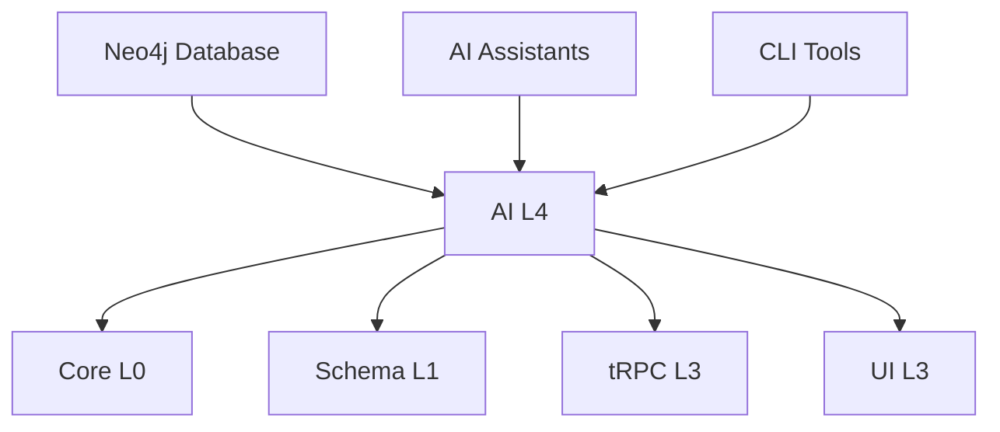

# @linch-kit/ai

> LinchKit AI 集成层 - Graph RAG 知识图谱和 AI 工具

[](https://www.npmjs.com/package/@linch-kit/ai)
[](https://github.com/laofahai/linch-kit/blob/main/LICENSE)
[](https://www.typescriptlang.org/)

## 📋 概述

`@linch-kit/ai` 是 LinchKit 框架的 AI 集成层，提供基于 Graph RAG（Retrieval-Augmented Generation）的知识图谱构建、智能查询和上下文增强功能。作为 L4 层包，它为 AI 助手提供了深度理解和操作 LinchKit 项目的能力。

### 🎯 核心特性

- 🧠 **Graph RAG 架构** - 基于 Neo4j 的知识图谱存储和查询
- 🔍 **智能代码提取** - 自动提取项目结构、依赖关系、Schema 定义等
- 📊 **多维度数据提取器** - 包、Schema、文档、函数、导入关系提取
- 🚀 **CLI 工具集成** - 完整的命令行工具和 LinchKit CLI 插件
- 🔗 **上下文查询引擎** - 为 AI 助手提供精确的项目上下文信息
- ⚡ **实时数据同步** - 支持增量更新和实时图谱同步

### 🏗️ 架构定位



AI 包作为 LinchKit 生态系统的智能层，连接了数据存储、AI 助手和开发工具。

## 🚀 快速开始

### 安装

```bash
# 使用 bun (推荐)
bun add @linch-kit/ai

# 使用 npm (不推荐，建议使用 bun)
npm install @linch-kit/ai

# 使用 yarn (不推荐，建议使用 bun)
yarn add @linch-kit/ai
```

### 环境配置

创建 `.env` 文件配置 Neo4j 连接：

```bash
# Neo4j 配置
NEO4J_URI=bolt://localhost:7687
NEO4J_USERNAME=neo4j
NEO4J_PASSWORD=your-password
NEO4J_DATABASE=neo4j

# 可选：日志级别
LOG_LEVEL=info
```

### 基础使用

#### 1. 数据提取

```typescript
import { PackageExtractor, Neo4jService, loadNeo4jConfig } from '@linch-kit/ai'

// 初始化 Neo4j 服务
const config = await loadNeo4jConfig()
const neo4jService = new Neo4jService(config)

// 提取项目包信息
const packageExtractor = new PackageExtractor()
const result = await packageExtractor.extract()

// 保存到图数据库
await neo4jService.saveNodes(result.nodes)
await neo4jService.saveRelationships(result.relationships)
```

#### 2. 智能查询

```typescript
import { IntelligentQueryEngine } from '@linch-kit/ai'

const queryEngine = new IntelligentQueryEngine(config)

// 查询实体信息
const entityInfo = await queryEngine.findEntity('UserSchema')

// 查询依赖关系
const dependencies = await queryEngine.findDependencies('auth', { depth: 2 })

// 查询实现模式
const patterns = await queryEngine.findPatterns('authentication')
```

#### 3. 上下文增强

```typescript
import { EnhancedContextTool } from '@linch-kit/ai'

const contextTool = new EnhancedContextTool(config)

// 获取增强上下文
const context = await contextTool.getEnhancedContext('user management')

console.log(context.detectedAction) // 'create', 'update', 'query' 等
console.log(context.suggestedFields) // 推荐的字段配置
console.log(context.implementationSteps) // 实现步骤建议
```

## 🛠️ CLI 工具

### 安装 CLI

```bash
# 全局安装 (推荐使用 bun)
bun add -g @linch-kit/ai
# 或使用 npm (不推荐)
npm install -g @linch-kit/ai

# 或使用 LinchKit CLI 插件
bun run linch-kit plugin install ai
```

### 数据提取命令

```bash
# 提取所有数据类型
linch-kit-ai extract --type all --output neo4j

# 提取特定类型数据
linch-kit-ai extract --type package,schema --output json --file output.json

# 清空现有数据并重新提取
linch-kit-ai extract --type all --clear --output neo4j
```

### 图查询命令

```bash
# 查询节点信息
linch-kit-ai query --type node --search "UserSchema" --format table

# 查询关系路径
linch-kit-ai query --type path --search "auth->crud" --depth 3

# 查询图统计信息
linch-kit-ai query --type stats --format json
```

### 上下文生成命令

```bash
# 生成 AI 上下文
linch-kit-ai context --query "user authentication" --format ai-context

# 生成代码建议
linch-kit-ai generate --intent "create user schema" --output suggestions.md
```

## 📚 API 文档

### 数据提取器

#### PackageExtractor

提取项目包结构和依赖关系。

```typescript
import { PackageExtractor } from '@linch-kit/ai'

const extractor = new PackageExtractor({
  rootPath: './projects/my-app',
  includeDevDependencies: true,
  extractVersions: true
})

const result = await extractor.extract()
// result.nodes: 包节点信息
// result.relationships: 依赖关系
```

#### SchemaExtractor

提取 LinchKit Schema 定义和字段关系。

```typescript
import { SchemaExtractor } from '@linch-kit/ai'

const extractor = new SchemaExtractor({
  schemaPath: './src/schemas',
  includeValidation: true,
  extractRelations: true
})

const result = await extractor.extract()
// result.nodes: Schema 节点、字段节点
// result.relationships: Schema 关系、字段关系
```

#### DocumentExtractor

提取项目文档和 Markdown 内容。

```typescript
import { DocumentExtractor } from '@linch-kit/ai'

const extractor = new DocumentExtractor({
  docPaths: ['./docs', './README.md'],
  extractHeaders: true,
  extractCodeBlocks: true
})

const result = await extractor.extract()
```

#### FunctionExtractor

提取函数定义、参数和调用关系。

```typescript
import { FunctionExtractor } from '@linch-kit/ai'

const extractor = new FunctionExtractor({
  sourcePaths: ['./src'],
  includePrivate: false,
  extractCalls: true
})

const result = await extractor.extract()
```

#### ImportExtractor

提取模块导入和导出关系。

```typescript
import { ImportExtractor } from '@linch-kit/ai'

const extractor = new ImportExtractor({
  sourcePaths: ['./src'],
  resolveModules: true,
  includeExternal: false
})

const result = await extractor.extract()
```

### Graph 服务

#### Neo4jService

Neo4j 图数据库操作服务。

```typescript
import { Neo4jService, type Neo4jConfig } from '@linch-kit/ai'

const config: Neo4jConfig = {
  uri: 'bolt://localhost:7687',
  username: 'neo4j',
  password: 'password',
  database: 'neo4j'
}

const service = new Neo4jService(config)

// 连接测试
await service.testConnection()

// 保存节点
await service.saveNodes([
  {
    id: 'user-schema',
    type: 'Schema',
    properties: { name: 'User', fields: ['id', 'email', 'name'] }
  }
])

// 保存关系
await service.saveRelationships([
  {
    id: 'user-profile-relation',
    type: 'HAS_ONE',
    source: 'user-schema',
    target: 'profile-schema',
    properties: { optional: false }
  }
])

// 查询节点
const nodes = await service.findNodesByType('Schema')

// 查询关系
const relations = await service.findRelationships('user-schema', 'HAS_ONE')

// 图统计
const stats = await service.getGraphStats()
```

### 查询引擎

#### IntelligentQueryEngine

智能图查询引擎，提供高级查询功能。

```typescript
import { IntelligentQueryEngine } from '@linch-kit/ai'

const engine = new IntelligentQueryEngine(config)

// 查找实体
const entity = await engine.findEntity('UserSchema')
// 返回: EntityInfo 包含节点信息、关系、相关文档等

// 查找依赖
const deps = await engine.findDependencies('auth', {
  direction: 'out',
  depth: 2,
  types: ['DEPENDS_ON', 'USES']
})

// 查找路径
const path = await engine.findPath('auth', 'ui', {
  maxDepth: 5,
  relationTypes: ['DEPENDS_ON']
})

// 查找模式
const patterns = await engine.findPatterns('authentication', {
  includeExamples: true,
  includeBestPractices: true
})
```

### 上下文工具

#### ContextQueryTool

基础上下文查询工具。

```typescript
import { ContextQueryTool } from '@linch-kit/ai'

const tool = new ContextQueryTool(config)

// 获取实体上下文
const context = await tool.getEntityContext('UserSchema')

// 获取关系上下文
const relationContext = await tool.getRelationshipContext('auth', 'crud')

// 搜索相关内容
const results = await tool.searchRelevantContent('user authentication')
```

#### EnhancedContextTool

增强上下文工具，提供 AI 优化的上下文信息。

```typescript
import { EnhancedContextTool } from '@linch-kit/ai'

const tool = new EnhancedContextTool(config)

// 获取增强上下文
const context = await tool.getEnhancedContext('create user profile form')

console.log(context.detectedAction) // 'create'
console.log(context.suggestedEntity) // 'UserProfile'
console.log(context.recommendedFields) // 字段建议
console.log(context.implementationSteps) // 实现步骤
console.log(context.relatedPatterns) // 相关模式
console.log(context.bestPractices) // 最佳实践
```

## 🔧 配置选项

### Neo4jConfig

```typescript
interface Neo4jConfig {
  /** Neo4j 连接 URI */
  uri: string
  
  /** 用户名 */
  username: string
  
  /** 密码 */
  password: string
  
  /** 数据库名 */
  database?: string
  
  /** 连接池配置 */
  maxConnectionPoolSize?: number
  
  /** 连接超时时间 (ms) */
  connectionTimeout?: number
  
  /** 加密配置 */
  encrypted?: boolean
}
```

### ExtractorConfig

```typescript
interface ExtractorConfig {
  /** 根路径 */
  rootPath?: string
  
  /** 包含的文件模式 */
  include?: string[]
  
  /** 排除的文件模式 */
  exclude?: string[]
  
  /** 是否并行处理 */
  parallel?: boolean
  
  /** 批处理大小 */
  batchSize?: number
  
  /** 详细日志 */
  verbose?: boolean
}
```

## 🌐 集成指南

### 与 LinchKit CLI 集成

```typescript
// linch-kit.config.ts
import { defineConfig } from '@linch-kit/core'
import { aiPlugin } from '@linch-kit/ai/cli'

export default defineConfig({
  plugins: [
    aiPlugin({
      neo4j: {
        uri: process.env.NEO4J_URI,
        username: process.env.NEO4J_USERNAME,
        password: process.env.NEO4J_PASSWORD
      },
      extractors: ['package', 'schema', 'document'],
      autoSync: true
    })
  ]
})
```

### 与 AI 助手集成

```typescript
// AI 助手使用示例
import { EnhancedContextTool, IntelligentQueryEngine } from '@linch-kit/ai'

class AIAssistant {
  private contextTool: EnhancedContextTool
  private queryEngine: IntelligentQueryEngine
  
  constructor(config: Neo4jConfig) {
    this.contextTool = new EnhancedContextTool(config)
    this.queryEngine = new IntelligentQueryEngine(config)
  }
  
  async analyzeUserRequest(request: string) {
    // 获取增强上下文
    const context = await this.contextTool.getEnhancedContext(request)
    
    // 查询相关实体
    const entities = await this.queryEngine.findRelevantEntities(request)
    
    // 生成响应
    return {
      action: context.detectedAction,
      suggestedImplementation: context.implementationSteps,
      relatedCode: entities,
      bestPractices: context.bestPractices
    }
  }
}
```

### 与 Next.js 集成

```typescript
// pages/api/ai/context.ts
import { NextApiRequest, NextApiResponse } from 'next'
import { ContextQueryTool } from '@linch-kit/ai'

export default async function handler(req: NextApiRequest, res: NextApiResponse) {
  const { query } = req.body
  
  const contextTool = new ContextQueryTool({
    uri: process.env.NEO4J_URI!,
    username: process.env.NEO4J_USERNAME!,
    password: process.env.NEO4J_PASSWORD!
  })
  
  const context = await contextTool.getEntityContext(query)
  
  res.json(context)
}
```

## 📊 性能优化

### 批量处理

```typescript
import { Neo4jService } from '@linch-kit/ai'

const service = new Neo4jService(config)

// 批量保存节点（推荐批次大小：100-1000）
await service.saveNodesBatch(nodes, { batchSize: 500 })

// 批量保存关系
await service.saveRelationshipsBatch(relationships, { batchSize: 500 })
```

### 增量更新

```typescript
import { PackageExtractor } from '@linch-kit/ai'

const extractor = new PackageExtractor({
  incrementalMode: true,
  lastUpdateTime: lastSyncTime,
  trackChanges: true
})

const result = await extractor.extract()
// 只提取变更的内容
```

### 查询优化

```typescript
import { IntelligentQueryEngine } from '@linch-kit/ai'

const engine = new IntelligentQueryEngine(config, {
  enableCache: true,
  cacheTimeout: 300000, // 5分钟
  indexHints: ['Schema:name', 'Package:name']
})
```

## 🧪 测试

### 单元测试

```typescript
import { PackageExtractor } from '@linch-kit/ai'
import { describe, test, expect } from 'bun:test'

describe('PackageExtractor', () => {
  test('should extract package.json dependencies', async () => {
    const extractor = new PackageExtractor({
      rootPath: './test-fixtures/simple-package'
    })
    
    const result = await extractor.extract()
    
    expect(result.nodes).toHaveLength(3)
    expect(result.relationships).toHaveLength(2)
    expect(result.nodes[0].type).toBe('Package')
  })
})
```

### 集成测试

```typescript
import { Neo4jService } from '@linch-kit/ai'

describe('Neo4j Integration', () => {
  test('should connect to Neo4j and save data', async () => {
    const service = new Neo4jService({
      uri: 'bolt://localhost:7687',
      username: 'neo4j',
      password: 'test'
    })
    
    await expect(service.testConnection()).resolves.toBe(true)
    
    const result = await service.saveNodes([
      { id: 'test-node', type: 'Test', properties: { name: 'test' } }
    ])
    
    expect(result.success).toBe(true)
  })
})
```

## 🚨 故障排除

### 常见问题

#### 1. Neo4j 连接失败

```
Error: Failed to connect to Neo4j
```

**解决方案**：
1. 检查 Neo4j 服务是否运行
2. 验证连接配置
3. 检查网络连接和防火墙设置

```bash
# 启动 Neo4j 服务
neo4j start

# 测试连接
bun run linch-kit-ai query --type stats
```

#### 2. 数据提取失败

```
Error: Extraction failed with code analysis error
```

**解决方案**：
1. 确保项目结构符合 LinchKit 规范
2. 检查 TypeScript 编译配置
3. 验证文件访问权限

```bash
# 重新生成 TypeScript 声明
bun run build

# 使用详细日志模式
bun run linch-kit-ai extract --type all --verbose
```

#### 3. 查询性能问题

```
Warning: Query took longer than expected
```

**解决方案**：
1. 创建适当的索引
2. 优化查询条件
3. 使用批量查询

```cypher
-- 在 Neo4j 中创建索引
CREATE INDEX ON :Schema(name);
CREATE INDEX ON :Package(name);
```

### 调试模式

```bash
# 启用详细日志
export LOG_LEVEL=debug
export NEO4J_DEBUG=true

# 运行命令
bun run linch-kit-ai extract --type all --verbose
```

## 🤝 贡献

我们欢迎社区贡献！请查看 [贡献指南](../../CONTRIBUTING.md) 了解如何参与。

### 开发设置

```bash
# 克隆仓库
git clone https://github.com/laofahai/linch-kit.git

# 安装依赖
cd linch-kit
bun install

# 开发 AI 包
cd packages/ai
bun dev

# 运行测试
bun test

# 构建
bun build
```

### 添加新的数据提取器

```typescript
// src/extractors/my-extractor.ts
import { BaseExtractor } from './base-extractor.js'
import type { ExtractionResult } from '../types/index.js'

export class MyExtractor extends BaseExtractor {
  async extract(): Promise<ExtractionResult> {
    // 实现提取逻辑
    return {
      nodes: [],
      relationships: []
    }
  }
}
```

## 📄 许可证

MIT License - 查看 [LICENSE](../../LICENSE) 文件了解详情。

## 🔗 相关链接

- 📚 [LinchKit 文档](https://kit.linch.tech)
- 🐛 [问题反馈](https://github.com/laofahai/linch-kit/issues)
- 💬 [讨论社区](https://github.com/laofahai/linch-kit/discussions)
- 🚀 [更新日志](./CHANGELOG.md)
- 📊 [Neo4j 文档](https://neo4j.com/docs/)

---

**@linch-kit/ai** 为 LinchKit 生态系统提供了强大的 AI 集成能力，让 AI 助手能够深度理解和操作您的项目。通过 Graph RAG 技术，实现了前所未有的智能开发体验。