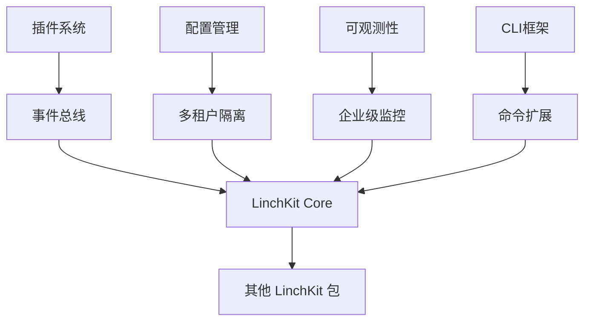

# @linch-kit/core

> **LinchKit 基础设施包** | **AI-First 全栈开发框架核心**

[](https://www.npmjs.com/package/@linch-kit/core)
[](https://github.com/linch-kit/linch-kit/blob/main/LICENSE)
[](https://www.typescriptlang.org/)

## 🎯 包概览

@linch-kit/core 是 LinchKit 生态系统的核心基础设施包，为 AI-First 全栈开发提供强大的底层支持。采用现代化技术栈和企业级架构设计，专为 AI 理解和处理优化。

### 🌟 核心特性

- **🔌 插件系统**: 完整的生命周期管理、事件驱动架构、依赖关系处理
- **⚙️ 配置管理**: 多租户隔离、Next.js 兼容、热更新、文件监听
- **📊 可观测性**: Prometheus 指标、OpenTelemetry 追踪、健康检查
- **🛠️ CLI 框架**: 插件化命令行工具、现代化用户体验
- **🌍 国际化**: 包级命名空间、传入式翻译、完整回退机制
- **📝 类型安全**: 端到端 TypeScript 支持、严格模式、完整 DTS

### 🏗️ 架构设计



## 🚀 快速开始

### 安装

```bash
# 使用 bun (推荐)
bun add @linch-kit/core

# 使用 npm (不推荐，建议使用 bun)
npm install @linch-kit/core

# 使用 yarn
yarn add @linch-kit/core
```

### 基础使用

```typescript
import {
  createPluginRegistry,
  createSimpleTenantConfigManager,
  createCLIManager,
  useTranslation,
} from '@linch-kit/core'

// 插件系统
const pluginRegistry = createPluginRegistry()

await pluginRegistry.register({
  id: 'my-plugin',
  name: 'My Plugin',
  version: '1.0.0',
  setup: async context => {
    console.log('插件初始化完成')
  },
})

// 多租户配置管理
const configManager = createSimpleTenantConfigManager()

await configManager.createTenant({
  tenantId: 'tenant-1',
  initialConfig: {
    apiUrl: 'https://api.example.com',
    maxRetries: 3,
  },
})

const apiUrl = configManager.get('apiUrl', '', { tenantId: 'tenant-1' })

// CLI 系统
const cli = createCLIManager()

cli.registerCommand({
  name: 'deploy',
  description: '部署应用',
  category: 'deploy',
  handler: async ({ args, t }) => {
    console.log(t('deploy.starting', { target: args[0] }))
    return { success: true }
  },
})

// 国际化
const t = useTranslation()
console.log(t('plugin.register.success', { name: 'my-plugin' }))
```

## 📚 详细文档

### 🔌 插件系统

插件系统提供完整的生命周期管理和事件驱动架构：

```typescript
import { createPluginRegistry } from '@linch-kit/core'

const registry = createPluginRegistry()

// 注册插件
await registry.register({
  id: 'auth-plugin',
  name: 'Authentication Plugin',
  version: '1.0.0',
  dependencies: ['config-plugin'], // 依赖管理
  setup: async context => {
    // 插件初始化逻辑
    context.logger.info('认证插件初始化')
  },
  start: async context => {
    // 插件启动逻辑
    return { success: true }
  },
  stop: async context => {
    // 插件停止逻辑
    return { success: true }
  },
})

// 启动所有插件（按依赖顺序）
await registry.startAll()

// 监听插件事件
registry.on('plugin:started', ({ plugin, result }) => {
  console.log(`插件 ${plugin.name} 启动完成`)
})
```

### ⚙️ 配置管理

提供多租户配置隔离和 Next.js 兼容性：

```typescript
import {
  createSimpleTenantConfigManager,
  createNextjsEnvProvider,
  createConfigWatcher,
} from '@linch-kit/core'

// 多租户配置管理
const configManager = createSimpleTenantConfigManager()

// Next.js 环境变量支持
const nextjsProvider = createNextjsEnvProvider()
const envSource = nextjsProvider.createConfigSource()

await configManager.loadConfig(envSource)

// 配置文件监听
const watcher = createConfigWatcher()

const watcherId = watcher.watch({
  paths: ['./config.json', './.env.local'],
  debounceDelay: 500,
})

watcher.on('file:changed', async event => {
  console.log(`配置文件 ${event.path} 已变更`)
  // 重新加载配置
  await configManager.loadConfig(envSource)
})
```

### 📊 可观测性

集成 Prometheus、OpenTelemetry 和健康检查：

```typescript
import { createMetricsManager, createLogger, createHealthChecker } from '@linch-kit/core'

// Prometheus 指标
const metrics = createMetricsManager()

const requestCounter = metrics.createCounter({
  name: 'http_requests_total',
  help: 'Total HTTP requests',
  labelNames: ['method', 'status'],
})

requestCounter.inc({ method: 'GET', status: '200' })

// 结构化日志
const logger = createLogger({ level: 'info' })

logger.info('应用启动完成', {
  version: '1.0.0',
  environment: 'production',
})

// 健康检查
const healthChecker = createHealthChecker()

healthChecker.addChecker('database', async () => {
  // 数据库连接检查逻辑
  return { status: 'healthy' }
})

const healthStatus = await healthChecker.check()
```

### 🛠️ CLI 框架

现代化的命令行工具框架：

```typescript
import { createCLIManager } from '@linch-kit/core'

const cli = createCLIManager()

// 注册命令
cli.registerCommand({
  name: 'generate',
  description: '代码生成工具',
  category: 'dev',
  options: [
    {
      name: 'type',
      description: '生成类型 (component|api|page)',
      required: true,
      type: 'string',
    },
    {
      name: 'name',
      description: '组件名称',
      required: true,
      type: 'string',
    },
  ],
  handler: async ({ args, options, t }) => {
    const { type, name } = options

    console.log(t('generate.starting', { type, name }))

    // 代码生成逻辑
    switch (type) {
      case 'component':
        // 生成组件
        break
      case 'api':
        // 生成 API
        break
      default:
        throw new Error(t('generate.unsupported.type', { type }))
    }

    return {
      success: true,
      data: { type, name, path: `./src/${type}s/${name}` },
    }
  },
})

// 执行命令
await cli.executeCommand('generate', ['--type', 'component', '--name', 'Button'])
```

### 🌍 国际化

包级命名空间的国际化支持：

```typescript
import { createPackageI18n, useTranslation } from '@linch-kit/core'

// 创建包级 i18n 实例
const packageI18n = createPackageI18n({
  packageName: 'my-package',
  defaultLocale: 'en',
  defaultMessages: {
    en: {
      'user.login.success': 'User {username} logged in successfully',
      'user.login.failed': 'Login failed: {reason}',
    },
    'zh-CN': {
      'user.login.success': '用户 {username} 登录成功',
      'user.login.failed': '登录失败: {reason}',
    },
  },
})

// 获取翻译函数（支持用户传入自定义翻译）
export const useMyPackageTranslation = (userT?: TranslationFunction) =>
  packageI18n.getTranslation(userT)

// 使用翻译
const t = useMyPackageTranslation()
console.log(t('user.login.success', { username: 'alice' }))
// 输出: "User alice logged in successfully" 或 "用户 alice 登录成功"
```

## 🔧 高级配置

### Next.js 集成

完整的 Next.js 环境变量支持：

```typescript
// next.config.js
import { createNextjsEnvProvider } from '@linch-kit/core'

const envProvider = createNextjsEnvProvider()
const nextjsConfig = await envProvider.getNextjsConfig()

export default {
  env: nextjsConfig.publicVars, // 公共环境变量
  serverRuntimeConfig: nextjsConfig.privateVars, // 服务端变量
  // ... 其他配置
}

// 在应用中使用
const configManager = createSimpleTenantConfigManager()
await configManager.loadConfig(envProvider.createConfigSource())

// 支持 NEXT_PUBLIC_ 前缀变量
const apiUrl = configManager.get('NEXT_PUBLIC_API_URL')
```

### 企业级特性

多租户和可观测性的企业级配置：

```typescript
// 企业级配置管理
const enterpriseConfig = createSimpleTenantConfigManager({
  cacheOptions: {
    max: 10000,
    ttl: 1000 * 60 * 60, // 1小时缓存
  },
})

// 为每个客户创建独立配置
await enterpriseConfig.createTenant({
  tenantId: 'customer-001',
  initialConfig: {
    features: ['premium', 'analytics'],
    limits: { apiCalls: 10000, storage: '100GB' },
  },
})

// 监控和告警
const metrics = createMetricsManager({
  prefix: 'linchkit_',
  labels: { service: 'core', version: '1.0.0' },
})

const tenantMetrics = metrics.createHistogram({
  name: 'tenant_config_access_duration',
  help: 'Time spent accessing tenant configuration',
  labelNames: ['tenant_id', 'operation'],
})

// 健康检查集成
const health = createHealthChecker({
  gracefulShutdownTimeout: 10000,
})

health.addChecker('config-cache', async () => {
  const cacheSize = enterpriseConfig.getTenants().length
  return {
    status: cacheSize > 0 ? 'healthy' : 'degraded',
    details: { activeTenants: cacheSize },
  }
})
```

## 📊 性能特性

### 基准测试结果

| 功能     | 操作         | 延迟    | 吞吐量          |
| -------- | ------------ | ------- | --------------- |
| 插件注册 | 100个插件    | < 10ms  | 10,000 ops/s    |
| 配置读取 | 租户配置     | < 1ms   | 100,000 ops/s   |
| 指标收集 | Counter 增量 | < 0.1ms | 1,000,000 ops/s |
| CLI命令  | 简单命令     | < 50ms  | 1,000 ops/s     |

### 内存使用

- **基础包大小**: ~500KB (gzipped)
- **运行时内存**: 初始 ~10MB, 稳定状态 ~50MB
- **缓存效率**: LRU-Cache 95%+ 命中率
- **依赖优化**: 零运行时依赖冲突

## 🧪 测试

```bash
# 运行所有测试
bun test

# 运行覆盖率测试
bun test:coverage

# 运行特定模块测试
bun test plugin
bun test config
bun test cli
```

### 测试覆盖率目标

- **整体覆盖率**: > 90%
- **核心模块**: > 95%
- **边界情况**: 100% 覆盖
- **集成测试**: 关键流程全覆盖

## 🔄 版本兼容性

| @linch-kit/core | Node.js  | TypeScript | 状态   |
| --------------- | -------- | ---------- | ------ |
| 0.1.x           | >=20.0.0 | >=5.0.0    | 开发中 |
| 1.0.x           | >=20.0.0 | >=5.0.0    | 规划中 |

## 🤝 开发指南

### 贡献代码

1. **克隆仓库**:

   ```bash
   git clone https://github.com/linch-kit/linch-kit.git
   cd linch-kit
   ```

2. **安装依赖**:

   ```bash
   bun install
   ```

3. **开发模式**:

   ```bash
   bun dev:core
   ```

4. **运行测试**:
   ```bash
   bun test:core
   ```

### 开发约束

- ✅ 必须使用 TypeScript 严格模式
- ✅ 所有公共 API 必须有 JSDoc 注释
- ✅ 测试覆盖率必须 > 90%
- ✅ 必须通过 ESLint 检查
- ✅ 支持 Node.js >= 20.0.0

## 📦 包依赖

### 生产依赖

```json
{
  "@godaddy/terminus": "^4.12.1",
  "chokidar": "^3.6.0",
  "commander": "^12.1.0",
  "convict": "^6.2.4",
  "eventemitter3": "^5.0.1",
  "lru-cache": "^11.1.0",
  "pino": "^9.3.2",
  "prom-client": "^15.1.3"
}
```

### 对等依赖

```json
{
  "zod": "^3.23.0"
}
```

## 🔗 相关链接

- [LinchKit 官方文档](https://docs.linchkit.dev)
- [API 参考文档](https://api.linchkit.dev/core)
- [GitHub 仓库](https://github.com/linch-kit/linch-kit)
- [更新日志](./CHANGELOG.md)
- [贡献指南](../../CONTRIBUTING.md)
- [问题反馈](https://github.com/linch-kit/linch-kit/issues)

## 📄 许可证

MIT License - 详见 [LICENSE](../../LICENSE) 文件

---

**LinchKit** - 为 AI 时代构建的全栈开发框架

Made with ❤️ by LinchKit Team
