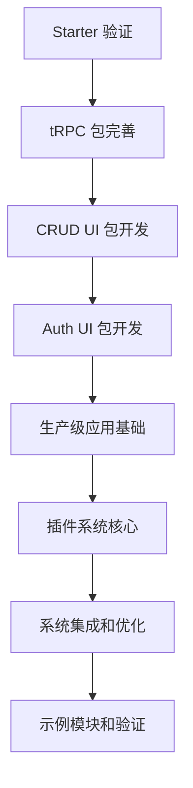

# Linch Kit 任务管理提示词

## 目的

指导 AI 助手进行 Linch Kit 项目的任务管理，包括任务优先级判断、进度跟踪、工作交接等，确保项目按计划推进。

## 上下文

**参考文档**:
- `ai-context/zh/management/task-priorities.md`
- `ai-context/zh/management/current-progress.md`
- `ai-context/zh/management/roadmap.md`
- `ai-context/zh/management/handover-guide.md`

Linch Kit 项目采用任务驱动的开发模式，严格按照优先级和依赖关系执行任务。

## 任务优先级管理

### 1. 当前任务状态 (2025-06-20)

#### 🔥 最高优先级 (立即执行)
**任务**: Starter 应用功能验证
- **状态**: 🔄 进行中
- **阻塞**: 所有后续开发任务
- **预计完成**: 完成 CLI 问题修复后 1-2 天

**具体子任务**:
- [ ] 修复 CLI 命令格式问题 (`linch plugin-list` 显示 "Unknown command")
- [ ] 统一配置文件加载 (Schema CLI 插件从 `linch.config.ts` 读取配置)
- [ ] 验证 Schema 命令功能 (`linch schema-list`, `linch schema-generate-prisma`)
- [ ] 实现完整的用户注册/登录流程
- [ ] 验证数据库操作和 Prisma 集成

#### 🔴 高优先级 (完成当前任务后立即开始)
**任务**: tRPC 包完善
- **依赖**: 完成 Starter 验证
- **预计完成**: Starter 验证完成后 2-3 天

**任务**: CRUD UI 包开发
- **依赖**: 完成 tRPC 包
- **预计完成**: tRPC 包完成后 3-4 天

#### 🟡 中优先级 (按顺序执行)
- Auth UI 包开发
- 生产级应用基础

#### 🟢 低优先级 (长期规划)
- 插件系统核心
- 系统集成和优化
- 示例模块和验证

### 2. 任务依赖关系



## 任务执行流程

### 1. 任务开始前

#### 检查清单
- [ ] 阅读 `ai-context/zh/management/task-priorities.md`
- [ ] 确认当前最高优先级任务
- [ ] 检查任务依赖关系
- [ ] 了解任务的具体要求和成功标准

#### 环境准备
```bash
# 1. 确认工作目录
cd /home/laofahai/workspace/linch-kit

# 2. 检查项目状态
git status
pnpm install

# 3. 验证基础功能
pnpm build
pnpm test
```

### 2. 任务执行中

#### 进度跟踪
- 定期更新任务状态
- 记录遇到的问题和解决方案
- 及时沟通阻塞问题
- 保持文档同步更新

#### 质量控制
- 遵循 AI-First 开发原则
- 确保代码质量和测试覆盖
- 及时更新相关文档
- 进行代码审查

### 3. 任务完成后

#### 完成标准检查
**参考**: `prompts/zh/continue-development.md#任务完成标准`

- [ ] 代码实现完成并通过测试
- [ ] 文档更新完成
- [ ] AI 上下文更新完成
- [ ] 提示词维护完成
- [ ] 进度同步完成

#### 状态更新
- 更新 `ai-context/zh/management/current-progress.md`
- 标记任务为完成状态
- 确定下一个优先任务
- 更新项目里程碑

## 工作交接管理

### 1. 交接准备

**参考**: `ai-context/zh/management/handover-guide.md`

#### 当前状态记录
- 正在进行的任务
- 遇到的问题和解决进度
- 下一步计划
- 重要的上下文信息

#### 环境状态
- 工作目录状态
- 代码变更情况
- 配置文件状态
- 依赖安装情况

### 2. 交接内容

#### 立即需要解决的问题
1. **CLI 命令格式问题** (最高优先级)
   - 问题: `linch plugin-list` 命令显示 "Unknown command"
   - 需要: 调试插件加载和命令注册流程
   - 测试: `cd apps/starter && pnpm linch plugin-list`

2. **配置文件统一** (高优先级)
   - 问题: Schema CLI 插件需要从 `linch.config.ts` 读取配置
   - 当前: `apps/starter/linch.config.ts` 已包含 schema 配置
   - 需要: 修改 `packages/schema/src/plugins/cli-plugin.ts` 中的配置加载逻辑

#### 关键文件位置
- CLI 系统: `packages/core/src/cli/`
- Schema 插件: `packages/schema/src/plugins/cli-plugin.ts`
- 配置文件: `apps/starter/linch.config.ts`
- 用户实体: `apps/starter/app/_lib/schemas/user.ts`

### 3. 交接验证

#### 基础功能检查
```bash
# 1. 检查 CLI 基础功能
pnpm linch --help

# 2. 检查插件加载
pnpm linch plugin-list

# 3. 检查配置系统
pnpm linch config-list

# 4. 检查 Schema 功能
pnpm linch schema-list
```

## 进度报告管理

### 1. 日常进度更新

#### 更新内容
- 完成的任务
- 遇到的问题
- 解决方案
- 下一步计划

#### 更新频率
- 重要进展: 立即更新
- 日常进度: 每日结束时更新
- 里程碑: 完成时更新

### 2. 里程碑管理

#### 当前里程碑
- **里程碑 1**: 基础设施完成 ✅ 已完成
- **里程碑 2**: 功能验证完成 🔄 进行中
- **里程碑 3**: 插件系统核心完成 📋 待开始

#### 里程碑评估
- 完成度评估
- 质量评估
- 时间评估
- 风险评估

## 风险管理

### 1. 技术风险

#### 高风险项
- CLI 系统稳定性问题
- 包依赖冲突
- 构建系统问题

#### 缓解措施
- 及时备份重要配置
- 定期运行完整测试
- 保持文档同步更新

### 2. 进度风险

#### 风险识别
- 任务依赖阻塞
- 技术难题耗时过长
- 外部依赖变更

#### 应对策略
- 提前识别阻塞点
- 准备备选方案
- 及时调整优先级

## 沟通协作

### 1. 状态同步

#### 同步内容
- 任务进度
- 遇到的问题
- 需要的支持
- 重要决策

#### 同步方式
- 文档更新
- 进度报告
- 问题记录
- 决策记录

### 2. 知识管理

#### 知识记录
- 问题解决方案
- 最佳实践
- 经验教训
- 技术决策

#### 知识共享
- 更新 AI 上下文文档
- 更新提示词库
- 更新故障排除指南
- 更新最佳实践文档

---

**使用说明**:
1. 每次开始工作前检查任务优先级
2. 严格按照依赖关系执行任务
3. 及时更新进度和状态
4. 遵循完成标准进行质量控制

**相关文档**:
- [任务优先级](../../ai-context/zh/management/task-priorities.md)
- [当前进度](../../ai-context/zh/management/current-progress.md)
- [工作交接指南](../../ai-context/zh/management/handover-guide.md)
