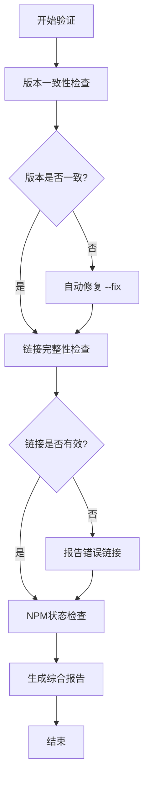

# LinchKit 文档验证工具

**项目版本**: v2.0.3  
**工具版本**: v1.0.0  
**创建日期**: 2025-07-14

## 📋 概述

LinchKit 文档验证工具集，用于确保项目文档的一致性、完整性和质量。包含版本检查、链接验证、NPM状态检查等功能。

## 🛠️ 可用工具

### 1. 版本一致性检查 (`version-check.ts`)

检查所有文档中的版本号是否与主包版本一致。

```bash
# 检查版本一致性
bun run docs:version-check

# 自动修复版本不一致问题
bun run docs:version-check --fix
```

**功能特性:**
- ✅ 自动检测目标版本 (基于@linch-kit/ui包版本)
- ✅ 智能过滤 (跳过CHANGELOG和node_modules)
- ✅ 只检查文档标题中的版本号 (前10行)
- ✅ 自动修复功能
- ✅ 详细报告和统计

### 2. 链接完整性检查 (`link-check.ts`)

验证文档中内部和外部链接的有效性。

```bash
# 检查内部链接 (默认，跳过外部链接)
bun run docs:link-check

# 检查所有链接 (包括外部链接)
bun run docs:link-check --external
```

**功能特性:**
- ✅ 内部链接完整性验证
- ✅ 外部链接可访问性检查
- ✅ 支持Markdown和HTML链接格式
- ✅ 智能路径解析 (相对路径、绝对路径)
- ✅ 跳过node_modules文件
- ✅ 缓存机制避免重复检查

### 3. NPM包状态检查 (`npm-status-check.ts`)

检查@linch-kit/*包在NPM registry的发布状态。

```bash
# 检查NPM包发布状态
bun run docs:npm-check
```

**功能特性:**
- ✅ 自动发现所有@linch-kit包
- ✅ 检查NPM发布状态
- ✅ 版本比较和更新提醒
- ✅ README.md更新建议
- ✅ 验证通过的NPM链接列表

### 4. 综合验证工具 (`validate.ts`)

整合所有验证工具的综合验证脚本。

```bash
# 基本验证 (版本检查 + 内部链接)
bun run docs:validate

# 自动修复版本问题
bun run docs:validate --fix

# 完整验证 (包括外部链接和NPM状态)
bun run docs:validate --fix --external --npm

# 详细输出模式
bun run docs:validate --verbose
```

**功能特性:**
- ✅ 三步验证流程 (版本 → 链接 → NPM)
- ✅ 可配置验证选项
- ✅ 综合报告和建议
- ✅ 执行时间统计
- ✅ 失败项明确指导

## 📊 验证流程

### 基本工作流程



### 集成到开发流程

1. **提交前验证**
```bash
bun run docs:validate --fix
```

2. **发布前完整验证**
```bash
bun run docs:validate --fix --external --npm
```

3. **CI/CD集成**
```bash
# 在package.json scripts中
"validate": "bun run docs:validate && bun run validate:light"
```

## 🎯 最佳实践

### 1. 定期验证
- **日常开发**: 使用基本验证 `docs:validate`
- **重要提交**: 使用完整验证 `docs:validate --fix --external --npm`
- **版本发布**: 确保所有验证项都通过

### 2. 版本管理
- 所有文档版本号应与主包版本保持一致
- 使用`**项目版本**: v2.0.3`格式
- 避免在CHANGELOG中修改历史版本号

### 3. 链接维护
- 内部链接使用相对路径
- 外部链接定期验证可访问性
- 文件移动后及时更新所有引用

### 4. NPM包管理
- 未发布的包在README中标记为"开发中"
- 定期检查包的发布状态
- 保持本地版本与NPM版本同步

## 🔧 配置选项

### 文件过滤规则

**包含的文件模式:**
- `README.md`, `DESIGN.md`, `CLAUDE.md`, `CONTRIBUTING.md`
- `ai-context/**/*.md`
- `packages/**/*.md`
- `apps/**/*.md`
- `extensions/**/*.md`
- `tools/**/*.md`

**排除的文件模式:**
- `**/node_modules/**`
- `**/dist/**`
- `**/.git/**`
- `**/CHANGELOG.md` (版本检查时排除)

### 版本检查规则

只检查文档前10行中的以下模式:
- `**版本**: v2.0.3`
- `**项目版本**: v2.0.3`
- `**Project Version**: v2.0.3`
- `# Document Name v2.0.3` (标题末尾)

## 📈 统计信息

当前项目文档状态:
- **总文档数**: 175个文件
- **版本一致性**: ✅ 100% (43/43 已检查)
- **已发布NPM包**: 5个 (@linch-kit/core, @linch-kit/ui, @linch-kit/auth, @linch-kit/console, @linch-kit/schema)
- **未发布包**: 3个 (platform, example-counter, ai-platform)

## 🚨 故障排除

### 常见问题

1. **版本检查失败**
   - 检查目标版本是否正确 (基于@linch-kit/ui包)
   - 确认版本号格式是否标准

2. **链接检查超时**
   - 使用`--external`选项时网络问题
   - 考虑跳过外部链接检查

3. **NPM检查失败**
   - 网络连接问题
   - NPM registry访问限制

4. **权限错误**
   - 确保脚本有执行权限: `chmod +x tools/docs/*.ts`

### 性能优化

- 版本检查: ~1-2秒 (175个文件)
- 内部链接检查: ~30-60秒 (跳过node_modules)
- 外部链接检查: ~2-5分钟 (取决于网络)
- NPM状态检查: ~10-30秒 (8个包)

## 📚 相关文档

- [Essential_Rules.md](../../ai-context/00_Getting_Started/03_Essential_Rules.md) - 核心开发约束
- [Development_Workflow.md](../../ai-context/02_Guides/01_Development_Workflow.md) - 详细开发流程
- [package.json](../../package.json) - NPM脚本配置

---

**维护者**: Claude Code  
**最后更新**: 2025-07-14